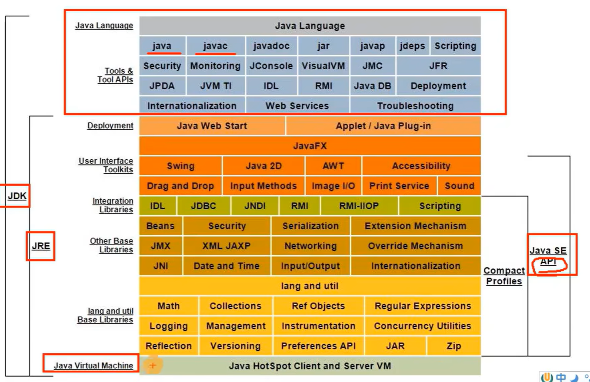
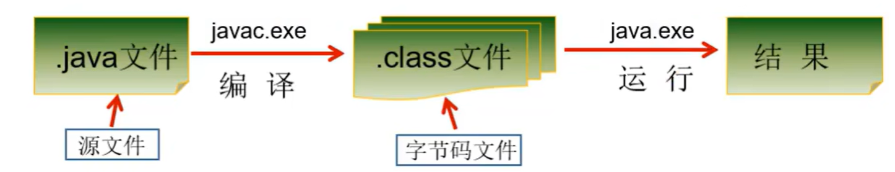
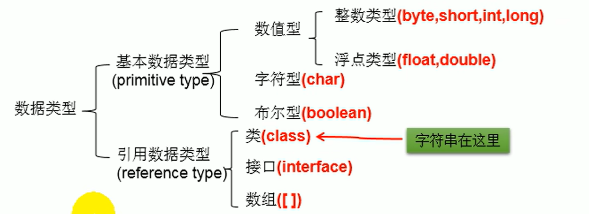

JAVA学习

# 第一章_Java语言概述

## 1.1 认识操作命令

开发时分为图形交互和命令行交互

如果使用命令行交互需要记住一些终端操作命令：

windows：

```cmd
dir: 列出当前目录下的文件以及文件夹
md: 创建目录
rd: 删除目录
cd: 进入指定目录
cd..: 退回到上一级目录
cd \: 返回到根目录
D或d: 进入d盘所在的目录
del: 删除文件
del *.xx: 删除后缀为xx的所有文件
exit: 退出dos命令行
notepad 文件名: 打开文件
√补充: echo javase > 1.doc

常用快捷键：
1、<- ->: 移动光标
2、上下键: 查看历史操作命令
3、delete: 删除字符

其他操作:
cls: 清屏
 
```

## 1.2 认识Java结构构造



JDK包含JVM JRE

Java language部分就是开发人员所涉及到的  Java命令操作啥的

jre运行时环境，包括jvm

javase api就是Java提供的接口代码

>小结：
>
>1、JDK = JRE + 开发工具集（比如Javac编译工具等）
>
>2、JRE = JVM + Java SE标准类库


## 1.3 Java安装

略。。。。

## 1.4 认识java编译过程

>Java程序开发三步骤:编写、编译、运行。
>
>将Java代码编写到扩展名为.java的源文件中
>
>通过javac.exe命令对该java文件进行编译，生成一个或多个字节码文件
>
>通过java.exe命令对生成的class文件进行

关系图如下：



## 1.5 命令行运行Java代码（不重要）

略。。。。

## 1.6 注释

```java
//单行

/*
多行
*/

/**
	 * 文档注释
	 * @param filename
	 * @param dataList
	 * @throws Exception
	 */
javadoc -d mydoc -author -version HelloWorld.java
```

## 1.7 了解JVM

前面学习了怎么书写代码，注释，运行Java程序等等。这里需要明白这些过程是由谁来实现相关的内存分配的，

**引入JVM**

了解jvm

1、jvm能实现Java的跨平台性，

2、jvm能自动管理内存（内存分配以及内存回收）

注意：java程序虽然有jvm实现了内存的管理，但是还是会存在内存泄漏和内存溢出的情况

# 第二章 基本语法

## 2.1 认识关键字和保留字

### 2.1.1 关键字

定义：特殊含义的、具有专门用途的字符串

特点：所有关键字都是小写

不需要去记忆，后续熟练使用后就掌握了

### 2.1.2 保留字

定义：现有Java版本尚未使用，但以后版本可能会作为关键字使用。自己命名标识符时要避免使用这些保留字

比如：goto、const

## 2.2 标识符

标识符：自己定义的Java变量名、类名、方法名和接口名称等使用的字符

但是对于自定义的标识符有规则需要去遵守：

1、由26个英文字母大小写，0-9 ，_或 $ 组成

2、数字不可以开头。

3、不可以使用关键字和保留字，但能包含关键字和保留字。

4、Java中严格区分大小写，长度无限制。

5、标识符不能包含空格。

Java中相关的名称命名规范：

包名：多单词组成时所有字母都小写：xxxyyyzzz

类名、接口名：多单词组成时，所有单词的首字母大写：XxxYyyZzz（大驼峰）

变量名、方法名：多单词组成时，第一个单词首字母小写，第二个单词开始每个

单词首字母大写：xxxYyyZzz（小驼峰）

常量名：所有字母都大写。多单词时每个单词用下划线连接：XXX_YYY_ZZZ

## 2.3 变量

基本数据类型

基本数据类型变量间转换

基本数据类型与String间转换

进制与进制间的转换

### 2.3.1 变量概念：

内存中的一个存储区域

该区域的数据可以在同一类型范围内不断变化

变量是程序中最基本的存储单元。包含变量类型、变量名和存储的值

### 2.3.2 变量作用：

用于在内存中保存数据

### 2.3.3 使用变量需要注意的：

Java中每个变量必须先声明，后使用

使用变量名来访问这块区域的数据

变量的作用域：其定义所在的一对{ }内

变量只有在其作用域内才有效

同一个作用域内，不能定义重名的变量


```java
//定义变量
/*数据类型 变量名 = 变量值;

变量必须先声明，后使用
变量都定义在其作用域内。在作用域内，它是有效的。换句话说，出了作用域，就失效了同一个作用域内,不可以声明两个同名的变量
*/
```

### 2.3.4 变量类型分类：




```java
整数类型：byte、short、int、long;
浮点类型：float、double;
字符型: char; //char是可以参与运算的
布尔型：boolean;//true,false;

```

### 2.3.5 字符集

目前为了支持中文多半使用utf-8（uft8相当于unicode的落地实现）

### 2.3.6 基本类型掌握

#### 2.3.6.1 自动类型转换

```java
//结论:当容量小的数据类型的变量与容量大的数据类型的变量做运算时，结果自动提升为容量大的数据类型。
//此时的容量大小指的是，表示数的范围的大和小。比如:float容量要大于long的容量    
byte,short,char,int -> long -> float -> double
//short、byte 与 char类型三者之间做运算，哪怕是同种类型之间做运算结果都是int型

```

#### 2.3.6.2 强制类型转换

```java
//强转操作损失精度，比如double转int为截断操作，只保留整数部分，小数部分不会管四舍五入直接剔除
/*
1.需要使用强转符:()
2.注意点:强制类型转换,可能导致精度损失。
*/
```


#### 2.3.6.3 关于类型转换的小总结

```java
//1.编码情况1:
long 1 = 123213;//（没有加l/L）编译通过，原因是没有加标识符(l/L)时，默认认为是为int型（这是小转大不会报错，当然如果长度超过int型本身，就要报错，这时需要加上对于的类型标识符）
System.out.println(l);
// long l1 = 21332423235234123;//编译失败:过大的整数
long l1 = 21332423235234123L;

//float f1 = 12.3;//编译失败 (原因是默认为double类型，不加f/F就是大转小，所以报错)
//整型常量，默认类型为int型
//浮点型常量，默认类型为double型
byte b = 12;
//byte b1 = b + 1;//编译失败，（原因是加1时，1这个常量时默认为int型，结果就是byte型加int型，但是又用byte型接收，所以报错）
//同理: float f1 = b+12.3;//编译失败，就是因为，12.3常量时默认double的，结果转为float失败

//int除以int型时，如果想获得double型。必须做一次强转
int a = 7;
int b = 3
double c = a /(b*1.0);
double c = double(a/b);
double c = a/3d或D;


```

### 2.3.7 引用类型掌握

#### 2.3.7.1 String类型使用

```java
/*
1. String属于引用数据类型,翻译为:字符串
2. 声明string类型变量时，使用一对""
3. String类型可以和8种基本数据类型变量做运算,且运算只能是连接运算: +(注意+连接符的运算是从左到右)
4. 运算结果依然是String类型

需要注意的是，char c = '';编译不通过。因为为null必须放东西进入，哪怕是char c = ' '（里面放入的是空格字符）必须要有字符在里面。而String s = "";可以编译通过。这就是引用类型的差别 
*/
/*
String类型转为基本类型使用包装类才可以进行转换

*/

```


### 2.3.8 认识二进制

#### 2.3.8.1 关于进制

```
对于整数，有四种表示方式：
二进制(binary)：0,1 ，满2进1.以0b或0B开头。
十进制(decimal)：0-9 ，满10进1。
八进制(octal)：0-7 ，满8进1. 以数字0开头表示。
十六进制(hex)：0-9及A-F，满16进1. 以0x或0X开头表示。此处的A-F不区分大小写。
如：0x21AF +1= 0X21B0
```


```
计算机底层都是补码形式存储
正数，三码合一
负数注意，原码，反码，补码

```

进制转换

```java
//Java提供了一些进制转换的方法，所以实际开发中并不会太恼火
String -> toBinaryString()//转二进制
String -> toHexString()//转16进制
......
```

## 2.4 运算符


```
//算术运算符
+ - * / % 前后++ 前后--
//赋值运算符
= -= += /= %= *=
有个好处就是不会改变数据类型
比如: short s = 10
s = s + 10//会转int而编译失败
s+=10//不会报错，且基本数据类型就是short
//比较运算符
== != < > >= <= instanceof
//逻辑运算符
& && | || ! ^
注意下^异或（两个bool为同类型为假，不同为真）
相同点1:&与&&的运算结果相同
相同点2:当符号左边是true时，二者都会执行符号右边的运算
不同点:当符号左边是false时，&继续执行符号右边的运算。8&不再执行符号右边的运算。

相同点1:|与||的运算结果相同
相同点2:当符号左边是false时，二者都会执行符号右边的运算
不同点:当符号左边是true时，&继续执行符号右边的运算。8&不再执行符号右边的运算。
//位运算
用的比较少，暂时先不用

//三元运算符
1.结构:(条件表达式)?表达式1︰表达式2
2．说明
1、条件表达式的结果为boolean类型
2、根据条件表达式真或假，决定执行表达式1，还是表达式2.
如果表达式为true，则执行表达式1。
如果表达式为false，则执行表达式2。
表达式1和表达式2要求是一致的。
4．如果程序既可以使用三元运算符，又可以使用if-else结构，那么优先选择三元运算符。原因:简洁、执行效率高。
比如：
int m = 12;
int n = 5;

int max = (m>n)?m:n;
sout(max);
double num = (m>n)?2:0.1;//能编译通过
//(m>n)?2:"某某";//编译失败，两种类型不能接收


```

主要是针对异或的补充

| a     | b     | a^b   |
| ----- | ----- | ----- |
| true  | true  | false |
| true  | false | true  |
| false | true  | true  |
| false | false | false |


运算符优先级

1、如下表，上一行运算符总优先于下一行。

2、只有单目运算符、三元运算符、赋值运算符是从右向左运算的。

|        | . {} () ; ,          |
| ------ | -------------------- |
| R -> L | ++ -- ~ !(data type) |
| L -> R | * / %                |
| L -> R | + -                  |
| L -> R | << >> >>>            |
| L -> R | < > <= >= instanceof |
| L -> R | == !=                |
| L -> R | &                    |
| L -> R | ^                    |
| L -> R | \|                   |
| L -> R | &&                   |
| L -> R | \|\|                 |
| R -> L | ?:                   |
| R -> L | = *= /= %=           |
|        | += -= <<= >>=        |
|        | >>>= &= \|= ^=       |


## 2.5 流程控制

```java
/*
顺序结构
1、程序从上到下逐行地执行，中间没有任何判断和跳转。

分支结构
1、根据条件，选择性地执行某段代码。
2、有if…else和switch-case两种分支语句。

if(){}
else if(){}
else{}

switch(表达式){
case 常量1:
语句1;
// break;
case 常量2:
语句2;
// break;
… …
case 常量N:
语句N;
// break;
default:
语句;
// break;
}

2.说明:
1、根据switch表达式中的值，依次匹配各个case中的常量。一旦匹配成功，则进入相应case结构中，调用其执行语句。当调用完执行语句以后，则仍然继续向下执行其他case结构中的执行语句,直到遇到break关键字或此switch-case结构末尾结束为止。

2、break,可以使用在switch-case结构中，表示一旦执行到此关键字，就跳出switch-case结构
3、switch结构中的表达式，只能是如下的6种数据类型之一: byte、 short、char、int、枚举类型(JDK5.0新增)、string类型(JDK7.0新增)
4、switch结构中不允许放bool结构
5、case之后只能声明常量。不能声明范围。
6、对于break关键字是选择的
7、default: 相当于if...else中的else

例题:对学生成绩大于60分的，输出"合格"。低于60分的，输出"不合格"
说明:如桌switch-case结构中的多个case的执行语句相同，则可以考虑进行合并

int score = 120;
        switch (score/10){
            case 0:
            case 1:
            case 2:
            case 3:
            case 4:
            case 5:
                System.out.println("不及格");
                break;
            case 6:
            case 7:
            case 8:
            case 9:
            case 10:
                System.out.println("及格");
                break;
            default:
                System.out.println("输入数据有问题");
        }

例题练习，从键盘分别输入年、月、日，判断这一天是当年的第几天
注：判断一年是否是闰年的标准：
1）可以被4整除，但不可被100整除
或
2）可以被400整除

Scanner scanner = new Scanner(System.in);
        System.out.println("请输入年：");
        int year = scanner.nextInt();
        System.out.println("请输入月：");
        int month = scanner.nextInt();
        System.out.println("请输入day：");
        int day = scanner.nextInt();
        int sumDays = 0;
        switch (month) {
            case 12:
                sumDays += 30;
            case 11:
                sumDays += 31;
            case 10:
                sumDays += 30;
            case 9:
                sumDays += 31;
            case 8:
                sumDays += 31;
            case 7:
                sumDays += 30;
            case 6:
                sumDays += 31;
            case 5:
                sumDays += 30;
            case 4:
                sumDays += 31;
            case 3:
                if ((year % 4 ==0 && year %100 !=0 )||year%400 == 0){
                    sumDays += 29;
                }else {
                    sumDays += 28;
                }
            case 2:
                sumDays += 31;
            case 1:
                sumDays += day;
        }
        System.out.println(year + "年" + month + "月" + day + "日是当年第" + sumDays + "天");
 
说明:
1．凡是可以使用switch-case的结构，都可以转换为if-else。反之，不成立。
2．我们写分支结构时，当发现既可以使用switch-case,(同时，switch中表达式的取值情况不太多)，又可以使用if-else时，我们优先选择使用switch-case。原因: switch-case执行效率稍高。


循环结构
1、根据循环条件，重复性的执行某段代码。
2、有while、do…while、for三种循环语句。
3、注：JDK1.5提供了foreach循环，方便的遍历集合、数组元素。
*/

```


### 2.5.1 Scanner学习


```java
/*如何从键盘获取不同类型的变量:需要使用Scanner类具体实现步骤:
1.导包:import java.util.Scanner;
2.Scanner的实例化
3.调用Scanner类的相关方法，来获取指定类型的变量 
*/
Scanner scan = new Scanner(System.in);
//获取整型
int num = scan.nextInt();
//获取浮点型
int num = scan.nextDouble();
//其余的方法看Scanner类的相关方法即可
/*
需要注意的是：需要根据相应的方法，来输入指定类型的值。如果输入的数据类型与要求的类型不匹配时，会报InputMisMatchException异常 
*/
```


```java
//if...else判断练习比如成绩排名
//代码比较简单不写了
int x = 4;
int y = 1;
if(x>2)
    if(y>2)
        sout(x+y);
	else
        sout("x is"+x);
//如果不标注大括号，那么结果就是输出下面语句sout("x is"+x);

//获取随机数10 - 99
//double val = Math.random()*100;//默认返回double
int val = (int)(Math.random()*90+10);
//可以总结生成随机数公式
int val = (int)(Math.random()*(b - a + 1) + a);
```


## 2.6 循环结构

```java
//循环结构在某些特定的情况下，反复执行特定的代码

/*
循环语句分类


for循环

while循环
do - while循环 
*/

```

对于循环结构的四个组成部分

1、初始化部分

2、循环条件部分

3、循环体部分

4、迭代部分


认识for循环

>for (①初始化部分; ②循环条件部分; ④迭代部分)｛
>
>③循环体部分**;**
>
>｝
>
>①-②-③-④-②-③-④-②-③-④-.....-②


认识while循环

>1、初始化条件
>
>2、循环条件 -->是boolean类型
>
>3、循环体
>
>4、迭代条件


语法格式

①初始化部分

while(②循环条件部分)**｛**

③循环体部分**;**

④迭代部分**;**

}

执行过程：

①-②-③-④-②-③-④-②-③-④-...-②


说明:

1.写while循环千万小心不要丢了迭代条件。一旦丢了，就可能导致死循环!

2.我们写程序，要避免出现死循环。

3.for循环和while循环是可以相互转换的!

区别:for循环和while循环的初始化条件部分的作用范围不同。


认识do..while

语法格式

①初始化部分**;**

do{

③循环体部分

④迭代部分

}while(②循环条件部分**);**

执行过程：

①-③-④-②-③-④-②-③-④-...②

说明：

<font color='red'>do-while循环至少执行一次循环体。</font>


### 2.6.1 思考

如何实现键入一直输入东西一直到碰到0终止

使用while(true) 或for(;;)

说明:
1．不在循环条件部分限制次数的结构: for(;;）或while(true)

2．结束循环有几种方式?

方式一:循环条件部分返回false

方式二:在循环体中，执行break


嵌套for循环

记住外出控制行数，内嵌循环控制列数


### 2.6.2 双重循环练习

```java
//双重循环输出1~100以内的质数
//最开始的设计
long startTime = System.currentTimeMillis();
        int count = 0;
        for (int i = 2; i <= 100000; i++) {
            for (int j = 2; j < i; j++) {
                if (i%j == 0){
                    isFlag = false;
                    //break;
                }
            }
            if (isFlag == true){
                //System.out.println(i);
                count++;
            }
            isFlag = true;
        }
        
        long endTime = System.currentTimeMillis();
        System.out.println(count);
        System.out.println(endTime - startTime);

//关于算法改进
//一、
long startTime = System.currentTimeMillis();
        int count = 0;
        for (int i = 2; i <= 100000; i++) {
            for (int j = 2; j < i; j++) {
                if (i%j == 0){
                    isFlag = false;
                    break;
                }
            }
            if (isFlag == true){
                //System.out.println(i);
                count++;
            }
            isFlag = true;
        }
        
        long endTime = System.currentTimeMillis();
        System.out.println(count);
        System.out.println(endTime - startTime);
//二、
long startTime = System.currentTimeMillis();
        int count = 0;
        for (int i = 2; i <= 100000; i++) {
            for (int j = 2; j <= Math.sqrt(i); j++) {
                if (i%j == 0){
                    isFlag = false;
                    break;
                }
            }
            if (isFlag == true){
                //System.out.println(i);
                count++;
            }
            isFlag = true;
        }
        
        long endTime = System.currentTimeMillis();
        System.out.println(count);
        System.out.println(endTime - startTime); 

//方法三：
long startTime = System.currentTimeMillis();
        int count = 0;
        lable:for (int i = 2; i <= 100000; i++) {
            for (int j = 2; j <= Math.sqrt(i); j++) {
                if (i%j == 0){
                    continue lable;
                }
            }
            count++;
        }
        long endTime = System.currentTimeMillis();
        System.out.println(count);
        System.out.println(endTime - startTime);
```


### 2.6.3 特殊关键字break、continue

使用范围：

break：switch-case、循环结构

continue：循环结构

不同：

break：结束当前循环

continue: 结束当次循环

相同:

1、两者后面不能申明执行语句

2、两者默认都是结束最近的循环（就近原则）

```java
for (int i = 1; i <= 4; i++) {
		for (int j = 1; j <= 10; j++) {
			if (j % 4 == 0){
                //break;
                continue;
		}
		System.out.print(j);
	}
	System.out.println();
}
```


3、指定结束某个循环

```java
label:for (int i = 1; i <= 4; i++) {
            for (int j = 1; j <= 10; j++) {
                if (j % 4 == 0){
                    //break label;
                    continue label;
                }
                System.out.print(j);
            } 
            System.out.println();
        }
```


## 2.7 项目一：家庭记账软件

```java
/*变量的定义
基本数据类型的使用
循环语句
分支语句
方法声明、调用和返回值的接收
简单的屏幕输出格式控制*/


```


## 总结

1、无限循环结构：while(true)或for(;;)


# 第三章 数组

## 3.1 数组的基本概念

**一、数组定义**：数组(Array)，是多个相同类型数据按一定顺序排列的集合，并使用一个名字命名，并通过编号的方式对这些数据进行统一管理。

**二、数组相关的概念：**

1、数组名

2、下标(或索引)

3、元素

4、数组的长度

**三、数组特点：**

1、数组是有序排列的

2、数组属于引用类型的变量。数组的元素可以是基本类型也可以是引用类型

3、数组的长度一旦确定就不能进行修改

4、创建数组的对象会在内存种开辟一整块的连续空间

**四、数组分类**

1、按照维数：一维数组、二维数组

2、按照数组元素的类型：基本数据类型元素的数组，引用数据类型元素的数组


## 3.2 一维数组的使用

关于一维数组的使用可以分为以下几个步骤

1、一维数组的声明和初始化

2、如何调用数组的指定位置的元素

3、如何获取数组的长度

4、如何遍历数组

5、数组元素的默认初始化值

6、数组的内存解析

```java
//1 一维数组的声明和初始化
int num;//声明
num = 10;//初始化
int id = 1001;//声明+初始化
int[] ids;//声明
//静态初始哈：数组的初始化和数组元素的赋值操作同时进行
ids = new int[]{1001,1002,1003,1004};
//或者
ids = {1001,1002,1003,1004};
//动态初始化：数组的初始化和数组元素的赋值操作分开进行
String[] names = new String[5];
//容易写错的地方
/*
int[] arr1  = new int[];
int[5] arr2  = new int[5];
int[] arr3  = new int[]{1,2,3};
*/
//总结: 数组一旦初始化完成，其长度就确定了

//2 如何调用数组的指定位置的元素：通过角标（索引、下标）的方式调用
//角标（索引、下标）从0开始，到数组的长度-1结束
names[0] = "周杰伦";
names[1] = "Taylor Swift";
names[2] = "yorushika";
names[3] = "八爷";
names[4] = "陈奕迅";
//names[5] = "邓紫棋";//数组越界

//3 获取到数组的长度：使用数字自带属性length
System.out.println(names.length);
System.out.println(ids.length);

//4 遍历，打印数组元素
//最low的遍历方式
/*System.out.println(names[0]);
System.out.println(names[1]);
System.out.println(names[2]);
System.out.println(names[3]);
System.out.println(names[4]);*/
//搭配循环
for (int i = 0; i < names.length; i++) {
    System.out.println(names[i]);
}
//5 数组元素的默认初始化值
/*
    1. 数组元素为整型: 0
    2. 数组元素为浮点型: 0.0
    3. 数组元素是char型: 0或'\u0000'，不是'0'
    4. 数组元素是boolean型: false
    5. 数组元素为引用数据类型: null
 */ 
```

一维数组的内存模型

我觉得是引用类型数据放在堆中，然后分配地址给栈，访问的时候也是访问栈的地址之后访问到堆，变量指向的引用类型应该是会随着堆数据的更改而更改

详细内存分析看文档

## 3.3 多维数组使用

二维数组

数组的元素可以是引用类型，那么数组本身属于引用类型，所以在一维数组中元素是嵌入一维数组，就组合成了二维数组

所以：从底层上看根本没有所谓的多为数组

对于二维数组的理解，我们可以看成是一维数组array1又作为另一个一维数组array2的元素而存在。其实，从数组底层的运行机制来看，其实没有多维数组。


**二维数组的使用:**

二维数组的声明和初始化

如何调用数组的指定位置的元素

如何获取数组的长度

如何遍历数组

数组元素的默认初始化值

数组的内存解析


```java
 /**
 * 二维数组的声明和初始化
 * 如何调用数组的指定位置的元素
 * 如何获取数组的长度
 * 如何遍历数组
 * 数组元素的默认初始化值
 * 数组的内存解析
 */
//1 二维数组的声明和初始化
int[] arr = new int[]{1,2,3};
//静态二维数组初始化
int[][] arr1 = new int[][]{{1,2,3},{4,5},{6,7,8}};
//或者
int[][] arrx = {{1,2,3},{4,5},{6,7,8}};
//动态二维数组初始化
//动态初始化1
String[][] arr2 = new String[3][2];
//动态初始化2
String[][] arr3 = new String[3][];//这个是因为只初始化了第一个一维数组，第二个数组关系没有初始化
//错误情况
/*String[][] arr4 = new String[][3];
  String[4][2] arr5 = new String[][];
  String[][] arr6 = new String[3][]{{1,2},{2,3,4}};
*/
//2 如何正确调用数组的指定位置的元素
System.out.println(arr1[0][1]);
System.out.println(arr2[1][1]);

//对arr3进行赋值
arr3[1] = new String[4]; //对arr3初始化的地方对应新开辟第二个一维数组
System.out.println(arr3[1][0]);//没有赋值的话会出现空指针异常


//3 获取二维数组的长度
System.out.println(arr1.length);
System.out.println(arr1[0].length);
System.out.println(arr1[1].length);
//4 如何遍历二维数组
for (int i = 0; i < arr1.length; i++) {
    for (int j = 0; j < arr1[i].length; j++) {
        System.out.print(arr1[i][j] + "   ");
    }
    System.out.println();
}
//5
/** 5 二维数组默认初始化值
 * 
 * 针对于初始化方式一: 比如: int[][] arr= new int[4][3];
 * 外层元素的初始化值为:地址值
 * 内层元素的初始化值为:与一维数组初始化情况相同
 * 
 * 针对于初始化方式二:比如: int[][] arr = new int[4][];
 * 外层元素的初始化值为:nul1
 * 内层元素的初始化值为:不能调用，否则报错。
 */

int[][] arr = new int[4][3];
int[][] arr1 = new int[4][];
System.out.println(arr[0]);//1b6d3586 
System.out.println(arr);//4554617c
System.out.println(arr[1][1]);
System.out.println(arr1[0]);//null
System.out.println(arr1[0][1]);//报错
```

内存分析看文档

## 3.4 数组的算法考察练习

关于数据结构

1.数据与数据之间的逻辑关系:集合、一对一、一对多、多对多

2.数据的存储结构:

线性表:顺序表（比如:数组）、链表、栈、队列

树形结构:二叉树

图形结构

算法：

主要分为：

排序算法

搜索算法

### 3.4.1 二维数组练习—杨辉三角

```java
int[][] yanghui = new int[10][];
for (int i = 0; i < yanghui.length; i++) {
    yanghui[i] = new int[i+1];
    //首末尾赋值
    yanghui[i][0] = yanghui[i][i] = 1;
    if (i>1){
        for (int j = 1; j < yanghui[i].length - 1; j++) {
            yanghui[i][j] = yanghui[i-1][j-1] + yanghui[i-1][j];
        }
    }
}

for (int i = 0; i < yanghui.length; i++) {
    for (int j = 0; j < yanghui[i].length; j++) {
        System.out.print(yanghui[i][j]+"\t");
    }
    System.out.println();
}
```

### 3.4.2 笔试题—创建一个数组要求赋值的随机数不能重复

创建一个长度为6的int型数组，要求数组元素的值都在1-30之间，且是随机赋值。同时，要求元素的值各不相同。


### 3.4.3 回型数

### 3.4.4 求数组中元素的最大值、最小值、平均数、求总和等

```java
/**
 * 算法考察：求数值型数组中元素的最大值、最小值、平均数、总和等
 * 定义一个int型的一维数组，包含10个元素，分别赋一些随机整数，
 * 然后求出所有元素的最大值，最小值，和值，平均值，并输出出来。
 * 要求：所有随机数都是两位数。
 * 
 * [10,99]
 * 公式: (int)(Math.random()*(99-10+1)+10)
 */
//初始化创建数组
int[] arr = new int[10];
for (int i = 0; i < arr.length; i++) {
    arr[i] = (int)(Math.random()*(99-10+1)+10);
}

//打印生成的数组
for (int i = 0; i < arr.length; i++) {
    System.out.print(arr[i]+"\t");
}
//求出数组元素的最大值
int maxValue = arr[0];
for (int i = 0; i < arr.length; i++) {
    if (maxValue<arr[i]) maxValue = arr[i];
}
System.out.println();
System.out.println("最大值为："+maxValue);

//求出数组元素的最小值
int minValue = arr[0];
for (int i = 0; i < arr.length; i++) {
    if (minValue>arr[i]) minValue = arr[i];
}
System.out.println("最小值为："+minValue);

//求出数组元素总和
int sum = 0;
for (int i = 0; i < arr.length; i++) {
    sum+= arr[i];
}
System.out.println("总和: "+sum);
//求平均数
double avgValue = 0;
//avgValue = sum/ (arr.length * 1.0);
avgValue = sum/ 10d;
System.out.println("平均数为"+avgValue); 
```

### 3.4.5 数组的复制

```java
/**
 * 使用简单数组
 * (1)创建一个名为ArrayTest的类，在main()方法中声明array1和array2两个变量，
 * 他们是int[]类型的数组。
 * (2)使用大括号{}，把array1初始化为8个素数：2,3,5,7,11,13,17,19。
 * (3)显示array1的内容。
 * (4)赋值array2变量等于array1，修改array2中的偶索引元素，使其等于索引值
 * (如array[0]=0,array[2]=2)。打印出array1
 */
int[] array1,array2;
array1 = new int[]{2,3,5,7,11,13,17,19};

//显示arary1的内容
for (int i = 0; i < array1.length; i++) {
    System.out.print(array1[i]+"\t");
}

//数组的复制
array2 = new int[array1.length];
for (int i = 0; i < array1.length; i++) {
    array2[i] = array1[i];
}
//打印复制后的数组
System.out.println();
for (int i = 0; i < array2.length; i++) {
    System.out.print(array2[i] + "\t");
}

//将array1的地址赋值给array2
//这里不是数组的复制
//理解，类似与window桌面上创建一个快捷方式
array2 =array1; //这里，重中之重：表明是两个变量去操作同一个地址。只要其中一个被修改都会被修改
//修改array2，array1也会受到影响
for (int i = 0; i < array2.length; i++) {
    if (i%2==0){
        array2[i] = i;
    }
}
System.out.println();
System.out.println("打印array2:");
//打印array2
for (int i = 0; i < array2.length; i++) {
    System.out.print(array2[i]+"\t");
}
System.out.println();
System.out.println("打印array1");
//再次打印array1
for (int i = 0; i < array1.length; i++) {
    System.out.print(array1[i]+"\t");
}

//修改array1，array2也会受到影响
//比如修改array1最后一个元素为20
System.out.println();
System.out.println("修改array1");
array1[7] = 20;

System.out.println("打印array1");
for (int i = 0; i < array1.length; i++) {
    System.out.print(array1[i]+"\t");
}
System.out.println();
System.out.println("打印array2");
for (int i = 0; i < array2.length; i++) {
    System.out.print(array2[i] + "\t");
}

//总结
/*
array1和array2是什么关系? array1和array2地址值相同，都指向了堆空间的唯一的一个数组实体。
详情请看PPT上的内存分析图
*/
```

### 3.4.6 数组的反转

```java
String[] arr = new String[]{"JJ","DD","MM","BB","GG","AA"};
//数组的反转
//方法一
/*for (int i = 0; i < arr.length/2; i++) {
    String temp = arr[i];
    arr[i] = arr[arr.length-i-1];
    arr[arr.length-i-1] = temp;
}*/
//方法二
for (int i = 0,j= arr.length-1;i < j; i++,j--) {
    String temp = arr[i];
    arr[i] = arr[j];
    arr[j] = temp;
}
for (int i = 0; i < arr.length; i++) {
    System.out.print(arr[i]+"\t");
}
```

### 3.4.7 数组的查找

```java
//数组的查找
//通过线性搜索
/*String temp = "MM";
boolean isFlag = true;
for (int i = 0; i < arr.length; i++) {
    if (arr[i].equals(temp)){
        System.out.println("数组索引位置为"+i);
        isFlag = false;
        break;
    }
}
if (isFlag) System.out.println("很遗憾，没有找到");*/

//二分法查找
//前提条件: 对于二分法必须要有序
int[] arr2 = new int[]{1,2,3,4,5,6,7,8,9,10};
int dest = 6;
int head = 0;
int rear = arr2.length - 1;
boolean isFlag = true;
while (head<=rear){
    int middle = (head+rear)/2;
    if (dest == arr2[middle]){
        isFlag = false;
        System.out.println("数组索引位置为: "+middle);
        break;
    }else if (arr2[middle] > dest){
        rear = middle - 1;
    }else {
        head = middle +1;
    }
}
if (isFlag) System.out.println("很遗憾，没有找到！");
//针对二分法可以优化，差值查找，比如1-500
```

### 3.4.8 数组的排序算法

详情看数据结构复习下就行

```java
//入门排序算法—冒泡排序
int[] arr = new int[]{34,785,-34,-63,23,98,1,2,5,67,-52};
//冒泡排序
for (int i = 0; i < arr.length -1; i++) {
    for (int j = 0; j < arr.length - i - 1; j++) {
        if (arr[j]>arr[j+1]){
            int temp = arr[j];
            arr[j] = arr[j+1];
            arr[j+1] = temp;
        }
    }
}
for (int i = 0; i < arr.length; i++) {
    System.out.print(arr[i]+"\t");
}

//快速排序
```

## 3.5 Arrays工具类的使用

可以参考文档进行学习，有需求可以去百度查看java文档

```java
/**
 * java.util.Arrays: 操作数组工具类
 */
//boolean equals(int[] a,int[] b)判断两个数组是否相等。
int[] arr1 = new int[]{1,2,3,4,5};
int[] arr2 = new int[]{1,6,9,4,5};
boolean flag = Arrays.equals(arr1, arr2);
System.out.println(flag);

//String toString(int[] a)输出数组信息。
String stringArr1 = Arrays.toString(arr1);
System.out.println(stringArr1);
//void fill(int[] a,int val)将指定值填充到数组之中。
int a = 9;
Arrays.fill(arr1,a);
String stringArr1Fill = Arrays.toString(arr1);
System.out.println(stringArr1Fill);
//void sort(int[] a)对数组进行排序。
Arrays.sort(arr2);
String stringArr2 = Arrays.toString(arr2);
System.out.println(stringArr2);

//int binarySearch(int[] a,int key)对排序后的数组进行二分法检索指定的值。
int i = Arrays.binarySearch(arr2, 10);//负数表示未找到
System.out.println(i);
```

## 3.6 数组中的常见异常

```java
/**
数组中的常见异常:
1．数组角标越界的异常:ArrayIndexOutOfBoundsExcetion
2.空指针异常:Nu1lPointerException
*/
//最简单的数组越界
int[] arr = new int[]{1,2,3,4,5};
for (int i = 0; i <= arr.length; i++) {
    System.out.println(arr[i]);
}
//空指针异常
//情形一
arr = null;
System.out.println(arr[0]);
//情形二
int[][] arr2 = new int[3][];
System.out.println(arr2[1][0]);
//情况三
String[] arr3 = new String[]{"AA","BB","CC"};
arr3[0] = null;
System.out.println(arr3[0].toString());
```


# 第四章 面向对象（上）


## 4.1 关于面向对象的学习主线

1、Java类以及类的成员: 属性、方法、构造器、代码块、内部类

2、面向对象的三大特征: 封装、继承、多态、（抽象（可选））

3、其他关键字: this、super、static、final、abstract、interface、package、import等

## 4.2 认识面向过程与面向对象 

例子：“人把大象装进冰箱” 

面向过程根据具体操作的步骤

程序员面向对象则是面向过程的执行者转化成了面向对象的指挥者


**面向对象**

类的格式：

```java
/**
修饰符 class 类名 {
	属性声明;
	方法声明;
}

说明：修饰符public：类可以被任意访问
类的正文要用{ }括起来
*/
```


```java
//面向对象练习
public class OOPTest {
    /**
     * 一、设计类，设计类的成员
     * 属性 = 成员变量 = field = 域、字段
     * 方法 = 成员方法 = 函数 = method
     * 
     * 属性：由什么构成的
     * 行为：能做什么
     * 
     * 创建类的对象 = 类的实例化 = 实例化类
     * 二、类和对象的使用（面向对象思想的落地实现）
     * 1.创建类，设计类的成员
     * 2.创建类的对象
     * 3.通过“对象.属性”或“对象.方法”调用对象的结构
     * 
     * 三、如果创建了一个类的对象，则每个对象都独立的拥有一套类的属性。（非static）
     *    意味着：如果我们修改了一个对象的属性a，则不会影响另一个对象属性a的值
     * 四、对象的内存解析
     */
    public static void main(String[] args) {
        //2.创建类的对象
        Person person1 = new Person();
        Person person2 = new Person();
        Person person3 = new Person();
        //调用对象的结构，属性、方法
        //3.通过“对象.属性”或“对象.方法”调用对象的结构
        person1.name = "Tom";
        person1.isMale = true;
        System.out.println(person1.name);
        //调用方法
        person1.eat();
        person1.sleep();
        person1.talk("中文");

        System.out.println(person2.name );//null
        System.out.println(person2.isMale);//false
        //意味着将person1变量保存的地址值赋值给了p3，导致person1和p3指向了堆空间中的同一个对象实体
        Person p3 = person1;
        System.out.println(p3.name);//Tom
        
        p3.age = 10;
        System.out.println(person1.age);//10
    }
}
/**
 * 1.创建类，设计类的成员
 */
class Person{
    //属性
    String name;
    int age = 1;
    boolean isMale;
    //方法
    public void eat(){
        System.out.println("吃饭");
    }
    public void sleep(){
        System.out.println("睡觉");
    }
    public void talk(String language){
        System.out.println("说话，使用的语言是"+language);
    }
}
```


## 4.3 关于类属性的使用和理解

```java
/**
 * 类中属性的使用
 * 属性（成员变量） vs 局部变量
 * 1.相同点：
 * 1.1 定义变量的格式：数据类型 变量名 = 变量值
 * 1.2 先声明，后使用
 * 1.3 变量都有其对应的作用域
 * 
 * 2.不同点：
 * 2.1 在类中声明的位置的不同
 *     属性：直接定义在类的一对{}内
 *     局部变量：声明在方法内、方法形参、代码块内、构造器形参、构造器的内部的变量
 * 2.2 关于权限修饰符的不同
 *     属性：可以在声明属性时，指明其权限，使用权限修饰符
 *     常用的权限修饰符：private、public、protected、默认
 * 2.3 默认初始化值的情况
 *         属性：类的属性，根据其类型，都有默认初始化的值
 *         整型：(short、byte、int、long)，默认：0
 *         浮点型：(float、double)：0.0
 *         字符型：(char)：0或('\u0000')
 *         布尔型：(boolean)：false
 *         引用数据类型(数组、类、接口)：null
 *     局部变量：没有默认初始化值
 *         意味着，我们在调用局部变量之前，一定要显式赋值
 *         特别的：形参在调用时，我们赋值即可
 *2.4 在内存中加载的位置          
 *    属性：加载到堆空间中(目前讲的都是非static)
 *    局部变量：加载到栈空间中
 *     
 */
public class UserTest {
    public static void main(String[] args) {
        User user = new User();
        System.out.println(user.name);
        System.out.println(user.age);
        System.out.println(user.isMale);
        
        user.talk("英语");
        user.eat();
    }
}
class User{
    //属性（或成员变量）
    public String name;
    public int age;
    boolean isMale;
    
    public void talk(String language){//language: 形参，也是局部变量
        System.out.println("我们使用"+language+"进行交流");
    }
    
    public void eat(){
        String food = "烙饼";//局部变量
        System.out.println("北方人喜欢吃："+food);
    }
}
```

## 4.4 关于类的使用实战

```java
package com.dl.demooop;

/**
 * 类中方法的声明和使用
 * 方法：描述类应该具有的功能
 * 比如：Math类：sqrt()\random()\next()......
 *      Scanner类：nextXxx() ...
 *      Arrays类：sort() \ binarySearch() \ toString() \ equals() \ ...
 * 1.举例：
 * public void eat(){}
 * public void sleep(int hour){}
 * public String getName(){}
 * public String getNation(String nation){}
 * 2. 方法声明：权限修饰符 返回值类型 方法名(形参列表){方法体 }
 *    注意：static、final、abstract 来修饰的方法、
 * 3. 说明：
 *    3.1 关于修饰符：
 *        Java规定的4种权限修饰符：private、public、省略、protected
 *    3.2 返回值类型：有返回值 VS 没有返回值：
 *        3.2.1 如果方法有返回值，则必须在方法声明时，指定返回值的类型。同时方法中，需要使用return关键字来返回指定类型的变量或常量
 *              return关键字来返回指定类型的变量或常量
 *              如果方法没有返回值，则方法声明时，使用void来表示。通常，没有返回值的方法中，就不需要使用return。但是如果非要使用的话，只能"return;"表示此方法的结束
 *              return的下一句不能再有语句
 *        3.2.2 定义方法时候，该不该有返回值？
 *              1、题目要求
 *              2、凭经验：具体问题具体分析
 *    3.3 方法名：属于标识符，遵循标识符的规则和规范，"见名知意"          
 *    3.4 形参列表：方法可以声明0个、1个或多个形参
 *        3.4.1 格式：数据类型1 形参1,数据类型2 形参2,数据类型3 形参3,...
 *        3.4.2 定义方法时，需不需要形参？
 *              1、题目要求
 *              2、凭经验：具体问题具体分析
 *    3.5 方法体：方法功能的体现
 * 4. return关键字使用：
 *    1、使用范围在方法体中
 *    2、作用: 2.1 结束方法；
 *            2.2 针对于有返回值类型的方法，使用"return 数据"方法返回所要的数据
 *    3、注意点：return 关键字后面不可以声明执行语句
 * 5. 方法的使用中，可以调用当前类的属性或方法
 *    特殊的：方法A中又调用了方法A：递归方法
 *    方法中，不可以定义方法。
 */
public class CustomerTest {
    public static void main(String[] args) {
        Customer customer = new Customer();
        customer.eat();
        customer.sleep(10);
    }
}
//客户类
class Customer{
    //属性
    String name;
    int age;
    boolean isMale;
    
    //方法
    public void eat() {
        System.out.println("客户吃饭");
    }
    
    public void sleep(int hour){
        eat();
        System.out.println("休息了" + hour + "个小时");
        //sleep(10);
    }

    public String getName() {
        return name;
    }
    
    public String getNation(String nation){
        String info = "我的国籍是：" + nation;
        return info;
    }
}
```

### 4.4.1 关于基础面向对象练习1

```java
public class OPPExer {

    public static void main(String[] args) {
        Person person = new Person();    
        person.name = "TOM";
        person.age = 10;
        person.sex =1;
        
        person.study();
        person.showAge();
        int newAge = person.addAge(2);
        //形参或局部变量放在栈。类、属性放在堆
        //这个时候，因为调用了addAge方法，在改方法中因为实现了age += i；i是形参存放在栈中，但是呢又由于是通过person栈变量执行这个方法执行后，完成了age属性的修改，所以整体上所在堆改变了，必然其他的都会改变
        //说白了都是指向一个堆空间进行了操作，所以无论是返回值还是直接调属性都是一样的
        //实在不懂看看内存解析
        System.out.println(person.name + "年龄" + person.age);//12
        System.out.println(person.name + "年龄" + newAge);//12
        //新开辟的堆不会受到影响
        Person personX = new Person();
        System.out.println(personX.age);//0
    }
}
```


### 4.4.1 关于基础面向对象练习2

```java
/**
 * 利用面向对象的方法，设计类Circle计算圆的面积
 */
public class CircleTest {
    public static void main(String[] args) {
        Circle circle = new Circle();
        double area = circle.findArea(4);
        System.out.println("圆的面积为："+ area);

        Circle circle1 = new Circle();
        circle1.radius = 2;
        double area1 = circle1.area();
        System.out.println(area1);
        circle1.areaX();
    }
}

class Circle{
    //属性半径
    double radius;
    
    //圆面积方法

    public double findArea(double r) {
         
        return 3.14 * r * r;
    }
    
    public double area(){
        return 3.14 * radius * radius;
    }
    public void areaX(){
        double area = Math.PI * radius * radius;
        System.out.println(area);
    } 
}

```

### 4.4.1 关于基础面向对象练习3

```java
package com.dl.demooop;

import com.sun.xml.internal.bind.v2.runtime.output.FastInfosetStreamWriterOutput;

/**
 * 3.1 编写程序，声明一个method方法，在方法中打印一个10*8 的*型矩形，
 * 在main方法中调用该方法。
 * 3.2 修改上一个程序，在method方法中，除打印一个10*8的*型矩形外，再
 * 计算该矩形的面积，并将其作为方法返回值。在main方法中调用该方法，
 * 接收返回的面积值并打印。
 * 3.3 修改上一个程序，在method方法提供m和n两个参数，方法中打印一个
 * m*n的*型矩形，并计算该矩形的面积， 将其作为方法返回值。在main方法
 * 中调用该方法，接收返回的面积值并打印。
 */
public class Exer3Test {
    public static void main(String[] args) {
        Exer3Test exer3Test = new Exer3Test();
        //3.1
        //exer3Test.method();
        //3.2
        //方式一
        //int method = exer3Test.method();
        //System.out.println("矩阵面积："+method);
        //方式二
        //System.out.println(exer3Test.method());
        //3.3
        exer3Test.method(10,8);
        System.out.println();
        System.out.println(exer3Test.method(10, 8));
    }
    /* 3.1
    public void method(){
        for (int i = 0; i < 10; i++) {
            for (int j = 0; j < 8; j++) {
                System.out.print("*"+"\t");
            }
            System.out.println();
        }
    }*/
    
    //3.2
    /*public int method(){
        for (int i = 0; i < 10; i++) {
            for (int j = 0; j < 8; j++) {
                System.out.print("*"+"\t");
            }
            System.out.println();
        }
        return 10*8;
    }*/
    
    //3.3
    public int method(int m,int n){
        for (int i = 0; i < m; i++) {
            for (int j = 0; j < n; j++) {
                System.out.print("*"+"\t");
            }
            System.out.println();
        }
        return m*n;
    }
}

```


### 4.4.1 关于基础面向对象练习4—对象数组

```java
package com.dl.demooop;

/**
 * 4. 对象数组题目：
 * 定义类Student，包含三个属性：学号number(int)，年级state(int)，成绩
 * score(int)。 创建20个学生对象，学号为1到20，年级和成绩都由随机数确定。
 * 问题一：打印出3年级(state值为3）的学生信息。
 * 问题二：使用冒泡排序按学生成绩排序，并遍历所有学生信息
 * 提示：
 * 1) 生成随机数：Math.random()，返回值类型double; 
 * 2) 四舍五入取整：Math.round(double d)，返回值类型long。
 */
public class StudentTest {
    public static void main(String[] args) {
        //原始的初始化方式
        /*Student stu1 = new Student(); ....*/
        //声明Student数组
        Student1[] stus = new Student1[20]; //类似与String[] strs = new String[10];
        for (int i = 0; i < stus.length; i++) {
            //给数组元素赋值
            stus[i] = new Student1();
            //给Student对象的属性赋值
            stus[i].number = i+1;
            //年级[1-6]
            stus[i].state = (int) (Math.random()*(6 - 1 +1) +1);
            //成绩：[0,100]
            stus[i].score = (int) (Math.random() * ((100 - 0) + 1));
        }
       
        //遍历学生数组
        //print(stus);非static无法使用，必须new一个
        StudentTest studentTest = new StudentTest();
        studentTest.print(stus);
        //找三年级
        System.out.println("=================");
        studentTest.searchState(stus,3);
        //根据成绩排序
        System.out.println("===============");
        studentTest.sort(stus);
        studentTest.print(stus);
        
    }

    //遍历Student1[]数组的操作
    public void print(Student1[] stus){
        for (int i = 0; i < stus.length; i++) {
            System.out.println(stus[i].info());
        }
    }
    
    /**
     * 查找查找年级为3的学生信息
     * @param stus
     * @param state
     */
    public void searchState(Student1[] stus,int state){
        for (int i = 0; i < stus.length; i++) {
            if (stus[i].state == state){
                System.out.println(stus[i].info());
            }
        }
    }

    /**
     * 给student数组排序
     * @param stus
     */
    public void sort(Student1[] stus){
        for (int i = 0; i < stus.length - 1; i++) {
            for (int j = 0; j < stus.length -1 -i; j++) {
                if (stus[j].score> stus[j+1].score){
                    //如果需要换序，交换的是数组元素是Student对象
                    Student1 temp = stus[j];
                    stus[j] = stus[j+1];
                    stus[j+1] = temp;
                }
            }
        }
    }
    
}

class Student1{
    int number;//学号
    int state;//年级
    int score;//分数
    
    //显示学生信息的方法
    public String info(){
        return "学号：" + number + "\t年级："+ state +"\t分数："+score ; 
    }
}
```

关于对象数组的内存解析可以参考二维数组


## 4.5 补充面向对象的知识—匿名对象

```java
/**
 * 一、理解万事万物皆对象
 * 1、在Java语言范畴中，我们都将功能、结构等封装到类中，通过类的实例化来调用具体的功能结构
 *     > Scanner,String等
 *     > 文件: File
 *     > 网络资源: URL
 *     
 * 2、涉及到Java语言与前端HTML、后端的数据库交互式，前后端的结构在Java层面交互时，都体现为类、对象。
 * 二、内存解析的说明
 * 1、引用类型的变量，只能存储两类值：null 或 地址值（含变量类型）
 * 三、匿名对象的使用
 * 1.理解：我们创建的对象，没有显式的赋给一个变量名。即为匿名对象
 * 2.特征：匿名对象只能调用一次
 * 3.匿名对象使用如下
 */
public class InstanceTest {
    public static void main(String[] args) {
        Phone phone = new Phone();

        System.out.println(phone);
        phone.playGame();
        phone.sendEmail();
        
        //匿名对象
//        new Phone().sendEmail();
//        new Phone().playGame();
        new Phone().price = 1999;
        new Phone().showPrice();//0.0
        System.out.println(new Phone());
        PhoneMall mall = new PhoneMall();
        mall.show(new Phone());
    }     
}

class PhoneMall{
    public void show(Phone phone){
        phone.sendEmail();
        phone.playGame();
    }
}

class Phone{
    double price;//价格
    
    public void sendEmail(){
        System.out.println("发送邮件");
    }
    
    public void playGame(){
        System.out.println("玩游戏");
    }
    
    public void showPrice(){
        System.out.println("手机价格为："+price);
    }
}


```

## 4.6 善于总结书写工具类

针对方法具有共性的可以写在工具类中，这样以后方便调用，提高代码的复用性

```java
package com.dl.demo09;

/**
 * 自定义数组工具类
 */
public class ArrayUtil {
    //求数组的最大值
    public int getMax(int[] arr){
        int maxValue = arr[0];
        for (int i = 0; i < arr.length; i++) {
            if (maxValue<arr[i]) maxValue = arr[i];
        }
        return maxValue;
    }
    //求数组的最小值
    public int getMin(int[] arr){
        int minValue = arr[0];
        for (int i = 0; i < arr.length; i++) {
            if (minValue>arr[i]) minValue = arr[i];
        }
        return minValue;
    }
    //求数组的总和
    public int getSum(int[] arr){
        int sum = 0;
        for (int i = 0; i < arr.length; i++) {
            sum+= arr[i];
        }
        return sum;
    }
    //求数组的平均值
    public int getAvg(int[] arr){
        return getSum(arr)/ arr.length;
    }
    //反转数组
    public void reverseArr(int[] arr){
        for (int i = 0; i < arr.length/2; i++) {
            int temp = arr[i];
            arr[i] = arr[arr.length-i-1];
            arr[arr.length-i-1] = temp;
        }
    }
    //复制数组
    public int[] copyArr(int[] arr){
        int[] arr2 = new int[arr.length];
        for (int i = 0; i < arr.length; i++) {
            arr2[i] = arr[i];
        }
        return arr2;
    }
    //数组排序
    public void sortArr(int[] arr){
        for (int i = 0; i < arr.length -1; i++) {
            for (int j = 0; j < arr.length - i - 1; j++) {
                if (arr[j]>arr[j+1]){
                    int temp = arr[j];
                    arr[j] = arr[j+1];
                    arr[j+1] = temp;
                }
            }
        }
    }
    //遍历数组
    public void printArr(int[] arr){
        for (int i = 0; i < arr.length; i++) {
            System.out.print(arr[i]+"\t");
        }
    }
    //查找数组元素
    public int getIndex(int[] arr,int value){
        for (int i = 0; i < arr.length; i++) {
            if (arr[i] == value){
                return i;
            }
        }

        return -1;//返回负数表示未找到
    }
}

```


```java
//测试
package com.dl.demo09;

public class ArrayUtilTest {
    public static void main(String[] args) {
        ArrayUtil arrayUtil = new ArrayUtil();
        int[] arr = new int[]{3,45,2,6,15,-3,56,8,13};
        int max = arrayUtil.getMax(arr);
        System.out.println(max);
        /*arrayUtil.printArr(arr);
        arrayUtil.sortArr(arr);
        System.out.println();
        arrayUtil.printArr(arr);*/
        System.out.println();
        int index = arrayUtil.getIndex(arr, 3);
        if (index<0){
            System.out.println("未找到");    
        }else {
            System.out.println(index);
        }
        

    }
}

```

## 4.7 方法重载

概念定义：

在同一个类中，允许存在一个以上的同名方法，只要它们的参数个数或者参数类型不同即可。

```java
/**
 * 方法重载
 * 1、定义：在同一个类中，允许存在一个以上的同名方法，只要它们的参数个数或者参数类型不同即可。
 * "两同一不同"：同一个类、相同方法名；参数列表不同，参数个数不同，参数类型不同
 * 2、举例：
 * Arrays类中重载的sort() / binarySearch()
 * 3.判断是否重载：
 *    跟方法的权限修饰符、返回值类型、形参变量名、方法体都没关系
 * 4.在通过对象调用方法时，如何指定某一个指定的方法：
 *   方法名—>参数列表 
 */
public class OverLoadTest {
    public static void main(String[] args) {
        OverLoadTest overLoadTest = new OverLoadTest();
        overLoadTest.getSum(1,"2");
    }
    //如下四个方法构成了重载
    /*public void getSum(int i,int j){
        System.out.println(i+j);
    }*/
    /*public void getSum(double d1,double d2){
        System.out.println(d1+d2);
    }*/
    public void getSum(String s,int j){
        System.out.println(s+j);
    }
    public void getSum(int i,String s){
        System.out.println(s+i);
    }
    //只改变方法返回类型不能重载
    /*public int getSum(int i,int j){
        System.out.println(i+j);
        return i+j;
    }*/
    //重复也不行
    /*public void getSum(int i,int j){
        System.out.println(i+j);
    }*/
    //改变参数名，不能重载
    /* public void getSum(int m,int n){
        System.out.println(n+m);
    }*/
   //更改参数名不能重载 
   /* public void getSum(int j,int i){
        System.out.println(i+j);
    }*/
}
```

### 4.7.1 方法重载练习

```java
package com.dl.demomethod;

public class OverLoadExer {
    /**
     * 2.编写程序，定义三个重载方法并调用。方法名为mOL。
     * 三个方法分别接收一个int参数、两个int参数、一个字符串参数。分别
     * 执行平方运算并输出结果，相乘并输出结果，输出字符串信息。
     * 在主类的main ()方法中分别用参数区别调用三个方法。
     * 3.定义三个重载方法max()，第一个方法求两个int值中的最大值，第二个方
     * 法求两个double值中的最大值，第三个方法求三个double值中的最大值，
     * 并分别调用三个方法。
     */
    public void mOL(int i){
        System.out.println(i*i);
    }

    public void mOL(int i,int j){
        System.out.println(i*j);
    }

    public void mOL(String s){
        System.out.println(s);
    }
    
    //对方法进行重载
    public int max(int i,int j){
        return (i>j)?i:j;
    }
    public double max (double d1,double d2){
        return (d1>d2)?d1:d2;
    }
    public double max(double d1,double d2,double d3){
        double max = (d1>d2)?d1:d2;
        return (max>d3)?max:d3;
    }
}
 
```


### 4.7.2 补充可变参数形参的方法

```java
/**
 * 可变参数形参的方法
 * 1.jdk 5.0新增的内容
 * 2.具体使用
 *   2.1 可变个数形参的格式：数据格式 ... 变量名
 *   2.2 当调用可变个数形参的方法时，传入的参数个数可以是：0个，1个，2个。。。
 *   2.3 可变个数形参的方法与本类中方法名相同，形参不同的方法之间构成重载
 *   2.4 可变个数形参的方法与本类中方法名相同，形参类型也相同的数组之间不构成重载。换句话说，二者不能共存 
 *   2.5 可变个数形参在方法的形参中，必须声明在末尾
 *   2.6 可变个数形参在方法的形参中,最多只能声明一个可变形参
 */
public class MethodArgsTest {

    public static void main(String[] args) {
        MethodArgsTest test = new MethodArgsTest();
        test.show(12);
        test.show("Hello");
        test.show("hello","world");
        test.show(new String[]{"AA","BB","CC"});
        test.show();
    }
    
    public void show(int i){
        
    }
    //当方法show(String s)存在时，优先考虑该方法
    public void show(String s){
        System.out.println("show(String s)");
    }
    
    public void show(String ... strs){
        System.out.println("show(String ... strs)");

        for (int i = 0; i < strs.length; i++) {
            System.out.print(strs[i]+"\t"); 
        }
    }
    //2.4 这个不能与show(String ... strs)方法共存
    /*public void show(String[] strs){
        
    }*/
    //Move 'strs' to the end of the list
    /*public void show(String ... strs,int i){
        System.out.println("show(String ... strs)");
    }*/

    public void show(int i,String ... strs){
        System.out.println("show(String ... strs)");
    }
}
```


### 4.7.3 方法参数的值传递机制

```java
/**
 * 关于变量的赋值
 * 如果变量是基本数据类型的，此时赋值的是变量所保存的数据值
 * 如果变量是引用数据类型的，此时赋值的是变量所保存的数据的地址值
 * 
 */
public class ValueTransferTest {
    public static void main(String[] args) {
        System.out.println("==================基本数据类型==================");
        int m = 10;
        int n = m;
        System.out.println("m = " + m+",n = "+n);
        n = 20;
        System.out.println("m = "+m+",n = "+n);
        System.out.println("============引用数据类型=====================");

        Order o1 = new Order();
        o1.orderId = 1001;
        Order o2 = o1; //赋值以后，o1和o2的地址值相同，都指向了堆空间中同一个对象实体
        System.out.println("o1.orderId = " + o1.orderId + ", o2.orderId = "+o2.orderId);
        o2.orderId = 1002;
        System.out.println("o1.orderId = " + o1.orderId + ", o2.orderId = "+o2.orderId);
    }
}
class Order{
    int orderId;
}
```

### 4.7.3 方法的形参的传递机制—值传递

```java
/**
 * 方法的形参的传递机制：值传递
 * 1.形参：方法定义时，声明的小括号内的参数
 *   实参：方法调用时，实际传递给形参的值
 * 2.值传递机制：
 * 如果参数是基本数据类，此时实参赋给形参的是实参真实存储的数据值
 * 
 */
public class ValueTransferTest1 {
    public static void main(String[] args) {
        //交换两个变量的值的操作
        int m = 10;
        int n = 20;
        System.out.println("m = "+m+",n = "+n);
        //交换两个变量的值的操作
        /*int temp = m;
        m = n;
        n = temp;*/

        ValueTransferTest1 test1 = new ValueTransferTest1();
        test1.swap(m,n);
        System.out.println("m = "+m+",n = "+n);
    }
    
    public void swap(int m,int n){
        //交换两个变量的值的操作
        int temp = m;
        m = n;
        n = temp;
        System.out.println("m = "+m+",n = "+n);
    }
    
}

```

### 4.7.3 方法的形参的传递机制—引用传递

```java
/**
 * 方法的形参的传递机制：值传递
 * 1.形参：方法定义时，声明的小括号内的参数
 *   实参：方法调用时，实际传递给形参的值
 * 2.值传递机制：
 * 如果参数是基本数据类型，此时实参赋给形参的是实参真实存储的数据值
 * 如果参数是引用数据类型，此时实参赋给形参的是实参存储数据的地址值
 */
public class ValueTransferTest2 {
    public static void main(String[] args) {
        Data data = new Data();
        data.m = 10;
        data.n = 20;

        System.out.println("m = "+data.m+",n = "+data.n);
        //交换m n 的值
        /*int temp = data.m;
        data.m = data.n;
        data.n = temp;*/
        ValueTransferTest2 test2 = new ValueTransferTest2();
        test2.swap(data);
        System.out.println("m = "+data.m+",n = "+data.n);

    }
    
    public void swap(Data data){
        int temp = data.m;
        data.m = data.n;
        data.n = temp;
    }
}
class Data{
    int m;
    int n; 
}
```

### 4.7.4 方法递归

```java
//初识递归
/**
 * 递归方法使用
 * 1. 递归方法：一个方法体内调用它自身。
 * 2.
 * 2.1 方法递归包含了一种隐式的循环，它会重复执行某段代码，但这种重复执行无须循环控制。
 * 2.2 递归一定要向已知方向递归，否则这种递归就变成了无穷递归，类似于死循环。
 */
public class RecursionTest {
    public static void main(String[] args) {
        //1、计算1~100之间所有自然数的和
        RecursionTest test = new RecursionTest();
        int sum = test.getSum(100);
        System.out.println(sum);
    }
    
    public int getSum(int n){
        if (n ==1) return 1;
        else return n+getSum(n-1);
    }
} 
```


#### 递归练习

```java
package com.dl.demorecursion;

/**
 * 递归方法使用
 * 1. 递归方法：一个方法体内调用它自身。
 * 2.
 * 2.1 方法递归包含了一种隐式的循环，它会重复执行某段代码，但这种重复执行无须循环控制。
 * 2.2 递归一定要向已知方向递归，否则这种递归就变成了无穷递归，类似于死循环。
 */
public class RecursionTest {
    public static void main(String[] args) {
        //1、计算1~100之间所有自然数的和
        RecursionTest test = new RecursionTest();
        /*int sum = test.getSum(100);
        System.out.println(sum);*/
        //已知有一个数列：f(0) = 1,f(1) = 4,f(n+2)=2*f(n+1) + f(n),其中n是大于0的整数，求f(10)的值。
        System.out.println(test.f(100));
    }
    //计算1~100之间所有自然数的和
    public int getSum(int n){
        if (n ==1) return 1;
        else return n+getSum(n-1);
    }
    
    //已知有一个数列：f(0) = 1,f(1) = 4,f(n+2)=2*f(n+1) + f(n),其中n是大于0的整数，求f(10)的值。
    public int f(int n){
        if (n == 0 ) return 1;
        else if(n == 1) return 4;
        //else return f(n+2) - 2 * f(n+1);//这种方式栈溢出
        else return 2*f(n-1) + f(n-2);
    }
    
    //斐波那契数列
    
    //汉诺塔
    
    //快速排序
    
}
```


## 4.8 面向对象特征之一：封装与隐藏


```java
/**
 * 程序设计的追求：高内聚，低耦合
 * 高内聚 ：类的内部数据操作细节自己完成，不允许外部干涉；
 * 低耦合 ：仅对外暴露少量的方法用于使用。
 */

/**
 * 面向对象的特征之一：封装与隐藏
 * 一、问题引入：
 * 当我们创建一个类的对象以后，我们可以通过"对象.属性"的方式，对对象的属性赋值。这里赋值操作会受到属性的数据类型和存储范围的制约。
 * 除此之外，没有其他制约条件。但是在实际开发中，我们往往需要给属性赋值加入额外的限制条件。这个条件就不能在属性声明时体现，我们只能通过方法进行限制条件的添加
 * （比如：setLegs()）
 * 同时，我们需要避免用户再使用”对象.属性“的方式对属性进行赋值。则需要将属性声明为私有的（private）
 * 这时针对属性就体现了封装性
 * 二、封装性的体现：
 * 我们将类的属性私有化(private)，同时，提供公共的(public)方法来获取(getXXX)和设置(setXXX)此属性的值
 * 拓展：封装性的体现：1、如上所述 2 不对外暴露的私有方法 3 单例模式（将构造器私有化）4、如果希望类在包外调用，可以将类设置为缺省的
 * 三、封装性的体现，需要权限修饰符来配合
 * 1.java规定四种权限：（从小到大）：private、缺省、protected、public
 * 2.四种权限可以用来修饰类及类的内部结构：属性、方法、构造器、内部类
 * 3.具体的，四种权限都可以用来修饰类的内部结构：属性、方法、构造器、内部类
 *      修饰类的话：只能使用：缺省、public
 * 总结封装性：Java提供了4种权限修饰符来修饰类以及类的内部结构，体现了类以及类的内部结构在被调用时的可见性的大小
 * 
 */
public class AnimalTest { 
    public static void main(String[] args) {
        Animal animal = new Animal();
        animal.name = "坤";
        //animal.age = 18;
        //animal.legs = 2;
        //animal.legs = 4;//使用权限修饰符
        animal.setLegs(6);
        animal.show();

        System.out.println(animal.name);
    }
}

class Animal{
    String name;
    private int age;
    private int legs;
    
    public void setLegs(int l){
        if (l >= 0 && l %2 == 0){
            legs =l;
        }else {
            legs = 0;
        }
    }
    
    public int getLegs(){
        return legs;
    }
    //相关属性age的get和set方法
    public int getAge() {
        return age;
    }

    public void setAge(int a) {
        age = a;
    }

    public void eat(){
        System.out.println("吃东西");
    }
    
    public void show(){
        System.out.println("name = " + name + ",age = " + age + ",legs = " + legs);
    }
}

```


| 修饰符    | 类内部 | 同一个包 | 不同包的子类 | 同一个工程 |
| --------- | ------ | -------- | ------------ | ---------- |
| private   | Y      |          |              |            |
| 缺省      | Y      | Y        |              |            |
| protected | Y      | Y        | Y            |            |
| public    | Y      | Y        | Y            | Y          |


### 4.8.1 四种权限使用

```java
package demoexec.authority;

public class Order {
    private int orderPrivate;
    int orderDefault;
    public int orderPublic;
    public void methodPublic(){
        orderPrivate = 1;
        orderDefault =1;
        orderPublic = 1;
    }
    void methodDefault(){
        orderPrivate = 1;
        orderDefault =1;
        orderPublic = 1;
    }
    private void methodPrivate(){
        orderPrivate = 1;
        orderDefault =1;
        orderPublic = 1;
    }
}

//同一个包下
package demoexec.authority;

public class OrderTest {
    public static void main(String[] args) {
        Order order = new Order();
        order.orderPublic = 1;
        order.orderDefault = 1;
        //不在order类之后，私有的结构就不可以被调用
        //order.orderPrivate = 1;
        
        order.methodDefault();
        order.methodPublic();
        //方法与属性类型私有结构不能被调用
        //order.methodPrivate();
    }
}
//不在同一个包下
package outtest.java;

import demoexec.authority.Order;

public class OrderTest {
    public static void main(String[] args) {
        //如果class Order是缺省的，那么不在同一个包下不能被调用
        Order order = new Order();
        order.orderPublic = 1;
        //出了order类所属的包之后，私有结构与、缺省声明的结构就不能被调用
        //order.orderDefault = 1;
        //不在order类之后，私有的结构就不可以被调用
        //order.orderPrivate = 1;
        //出了order类所属的包之后，私有结构与、缺省声明的结构就不能被调用
        //order.methodDefault();
        order.methodPublic();
        //方法与属性类型私有结构不能被调用
        //order.methodPrivate();
    }
}


```


### 4.8.2 构造器

```java
package com.dl.constructor;

/**
 * 类的构造之三：构造器（或构造方法、constructor）的使用
 * constructor：构造建造
 * 一、构造器的作用：
 * 1.创建对象
 * 2.初始化对象属性
 * 二、说明：
 * 1、如果没有显示的定义类的构造器的话，则系统默认提供一个空参构造器
 * 2、定义构造器的格式：权限修饰符 类型(形参列表){}
 * 3、一个类中定义的多个构造器，彼此构成重载
 * 4、一旦我们显示的定义了类的构造器之后，系统就不在提供默认的空参构造器
 * 5、一个类中，至少会有一个构造器
 * 构造器的本质作用就是为对象初始化，即为实例变量初始化，赋初值； 
 * 而不是创建对象，创建对象时通过new关键字来完成的，当使用new 关键字时就会为该对象在堆内存中开辟一块内存，只等构造器来初始化这块内存
 */
public class PersonTest {
    public static void main(String[] args) {
        //创建对象: new + 构造器
        Person person = new Person();
        person.eat();

        //Person tom = new Person("tom");
        
    }
}
//创建类
class Person{
    //属性
    String name;
    int age;
    
    //构造器
    /*public Person(){
        System.out.println("constructor Person() ...... ");
    }*/
    
   /* public Person(String n){
        System.out.println(n);
    }*/
    
    /*public Person(String n,int i){
        
    }*/
    //方法
    public void eat(){
        System.out.println("吃饭");
    }
    public void study(){
        System.out.println("学习");
    }
}

```


### 4.8.3 属性赋值的先后顺序

```java
package com.dl.demo0917;

/**
 * 总结：属性赋值的先后顺序
 * 
 * 1、默认初始化值
 * 2、显示初始化
 * 3、构造器中赋值
 * 4、通过"对象.方法" 或 "对象.属性"的方式，赋值
 * 以上的操作先后顺序：1 -> 2 -> 3 -> 4
 */
public class UserTest {
    public static void main(String[] args) {
        User user1 = new User();
        System.out.println(user1.age);
        User user = new User(2);

        System.out.println(user.age);
        
        user.setAge(3);
        System.out.println(user.age);
    }
}

class User{
    String name;
    int age = 1;
    public User() {
    }
    public User(int a) {
        age = a;
    }
    public int getAge() {
        return age;
    }
    public void setAge(int age) {
        this.age = age;
    }
}
```


### 4.8.4 扩展：JavaBean

```java
package com.dl.demo0917;

/**
 * JavaBean是一种Java语言写成的可重用组件。
 * 所谓javaBean，是指符合如下标准的Java类：
 *  1类是公共的
 *  2有一个无参的公共的构造器
 *  3有属性，且有对应的get、set方法
 *  
 *  补充：四种构造对象方式：new实例化，反射，克隆，反序列化
 *  反射普遍用的空参构造器
 */
public class Customer{
    private int id;
    private String name;
    
    public Customer() {
    }
    
    public void setId(int i){
        id = i;
    }
    
    public int getId(){
        return id;
    }

    public String getName() {
        return name;
    }

    public void setName(String name) {
        this.name = name;
    }
}

/*
用户可以使用JavaBean将功能、处理、值、数据库访问和其他任何可以
用Java代码创造的对象进行打包，并且其他的开发者可以通过内部的JSP
页面、Servlet、其他JavaBean、applet程序或者应用来使用这些对象。用
户可以认为JavaBean提供了一种随时随地的复制和粘贴的功能，而不用关
心任何改变。
*/
```


### 4.8.5 UML类图

了解


## 4.9 关键字：this的使用


```java
package com.dl.demo0917;

/**
 * this的关键字的使用
 * 1.this可以用来修饰调用：属性、方法、构造器
 * 2.this修饰属性和方法
 *   this理解为：当前对象或当前正在创建的对象
 *   2.1
 *   在类的方法中、我们可以使用"this.属性"或"this.方法"的方式、调用当前对象属性或方法。但是通常情况下、我们都选择省略"this."。
 *   特殊情况下，如果方法的形参和类的属性同名时，我们必须显示使用"this.变量"的方式，表明变量是属性，而非形参。
 *   2.2
 *   在类的构造器中、我们可以使用"this.属性"或"this.方法"的方式、调用当前正在创建的对象属性或方法。但是通常情况下、我们都选择省略"this."。
 *   特殊情况下，如果构造器的形参和类的属性同名时，我们必须显示使用"this.变量"的方式，表明变量是属性，而非形参。
 * 
 * 谁调用，谁就是this
 */
public class PersonTest {
    public static void main(String[] args) {
        //this动态的指向对象，比如实例化的p1、p2、p3......
        Person p1 = new Person();
        p1.setAge(1);
        System.out.println(p1.getAge());
    }
}

class Person{
    private String name;
    private int age;

    public Person(String name, int age) {
        this.name = name;
        this.age = age;
    }
    public Person() {
    }

    public String getName() {
        return name;
    }

    public void setName(String name) {
        this.name = name;
        //name = name;
    }

    public int getAge() {
        return age;
    }

    public void setAge(int age) {
        this.age = age;
    }
}
```


### this调用构造器

```java
package com.dl.demo0917;

/**
 * this的关键字的使用
 * 1.this可以用来修饰调用：属性、方法、构造器
 * 2.this修饰属性和方法
 *   this理解为：当前对象或当前正在创建的对象
 *   2.1
 *   在类的方法中、我们可以使用"this.属性"或"this.方法"的方式、调用当前对象属性或方法。但是通常情况下、我们都选择省略"this."。
 *   特殊情况下，如果方法的形参和类的属性同名时，我们必须显示使用"this.变量"的方式，表明变量是属性，而非形参。
 *   2.2
 *   在类的构造器中、我们可以使用"this.属性"或"this.方法"的方式、调用当前正在创建的对象属性或方法。但是通常情况下、我们都选择省略"this."。
 *   特殊情况下，如果构造器的形参和类的属性同名时，我们必须显示使用"this.变量"的方式，表明变量是属性，而非形参。
 * 3.this调用构造器
 * 1、我们在类的构造器中、可以显示的使用"this(形参列表)"方式，调用本类中指定的其他构造器
 * 2、构造器中不能通过"this(形参列表)"方式调用自己
 * 3、如果一个类中有n个构造器，则最多有n-1个构造器中使用了"this(形参列表)"
 * 4、规定："this(形参列表)"必须声明在当前构造器的首行
 * 5、构造器内部，最多只能声明一个"this(形参列表)"，用来调用其他的构造器
 * 谁调用，谁就是this
 */
public class PersonTest {
    public static void main(String[] args) {
        //this动态的指向对象，比如实例化的p1、p2、p3......
        Person p1 = new Person();
        p1.setAge(1);
        System.out.println(p1.getAge());

        Person p2 = new Person("Tom",20);
        System.out.println(p2.getAge());
    }
}

class Person{
    private String name;
    private int age;

    public Person(String name) {
        this();
        this.name = name;
    }
    public Person(int age) {
        this();
        this.age = age;
    }
    public Person(String name, int age) {
        this(age);
        this.name = name;
        //this.age = age;
    }
    public Person() {
        //不能自己调自己，调其他this(形参列表);
        //this();
        String info = "Person初始化、需要考虑下列代码.......";
        System.out.println(info);
    }
    public String getName() {
        return name;
    }
    public void setName(String name) {
        this.name = name;
        //name = name;
    }
    public int getAge() {
        return age;
    }
    public void setAge(int age) {
        this.age = age;
    }
}
```


### 综合练习—账户取钱存钱操作1

```java
package com.dl.demo0917.exec;
//账户类
public class Account {
    private int id;//账号
    private double balance;//余额
    private double annualInterestTRate;//年利率

    public Account(int id, double balance, double annualInterestTRate) {
        this.id = id;
        this.balance = balance;
        this.annualInterestTRate = annualInterestTRate;
    }

    public int getId() {
        return id;
    }

    public void setId(int id) {
        this.id = id;
    }

    public double getBalance() {
        return balance;
    }

    public void setBalance(double balance) {
        this.balance = balance;
    }

    public double getAnnualInterestTRate() {
        return annualInterestTRate;
    }

    public void setAnnualInterestTRate(double annualInterestTRate) {
        this.annualInterestTRate = annualInterestTRate;
    }
    //提示：在提款方法 withdraw 中，需要判断用户余额是否能够满足提款数额的要求，如果不能，应给出提示。
    public void withdraw(double amount){//取钱
        if (balance<amount){
            System.out.println("余额不足");
            return;
        }
        balance -= amount;
        System.out.println("成功取出："+amount);
    }
    
    public void deposit(double amount){//存钱
        if (amount > 0){
            balance += amount;
            System.out.println("成功存入："+amount);
        }
    }
}

```


```java
package com.dl.demo0917.exec;
//用户
public class Customer {
    private String firstName;
    private String lastName;
    private Account account;

    public Customer(String firstName, String lastName) {
        this.firstName = firstName;
        this.lastName = lastName;
    }

    public String getFirstName() {
        return firstName;
    }

    public String getLastName() {
        return lastName;
    }
    
    public Account getAccount() {
        return account;
    }

    public void setAccount(Account account) {
        this.account = account;
    }
}

```


```java
//测试
package com.dl.demo0917.exec;

import javax.swing.plaf.IconUIResource;

/**
 * 写一个测试程序。
 * （1） 创建一个 Customer ，名字叫 Jane Smith, 他有一个账号为 1000，余额为 2000 元，
 * 年利率为 1.23％ 的账户。
 * （2） 对 Jane Smith 操作。
 * 存入 100 元，再取出 960 元。再取出 2000 元。
 * 打印出 Jane Smith 的基本信息
 * 
 * 结果：
 * 成功存入 ：100.0
 * 成功取出：960.0
 * 余额不足，取款失败
 * Customer [Smith, Jane] has a account: id is 1000, annualInterestRate is 1.23％, balance is 1140.0
 */
public class CustomerTest {
    public static void main(String[] args) {
        Customer customer = new Customer("Jane","Smith");
        Account account = new Account(1000,2000,0.0123);
        customer.setAccount(account);//这里指向了customer中Account account 
        
        customer.getAccount().deposit(100);
        customer.getAccount().withdraw(960);
        customer.getAccount().withdraw(2000);

        System.out.println("Customer[" + customer.getLastName() +"," +customer.getFirstName() +"] has a account: id is "+account.getId() + 
                ", annualInterestRate is "+account.getAnnualInterestTRate()*100 + "％, balance is "+account.getBalance());
    }
}

```


### 综合练习—账户取钱存钱操作2

```java
//账户类
package com.dl.demo0917.exec1;

public class Account {
    private double balance;
    public Account(double init_balance){
        this.balance = init_balance;
    }

    public double getBalance() {
        return balance;
    }
    //存钱操作
    public void deposit(double amt){
        if (amt > 0) {
            balance += amt;
            System.out.println("存钱成功");
        }
    }
    //取钱操作
    public void withdraw(double amt){
        if (balance >= amt){
            balance -= amt;
            System.out.println("取钱成功");
        }else {
            System.out.println("余额不足");
        }
    }
}
```


```java
//客户类
package com.dl.demo0917.exec1;

public class Customer {
    private String firstName;
    private String lastName;
    private Account account;

    public Customer(String firstName, String lastName) {
        this.firstName = firstName;
        this.lastName = lastName;
    }

    public String getFirstName() {
        return firstName;
    }

    public String getLastName() {
        return lastName;
    }

    public Account getAccount() {
        return account;
    }

    public void setAccount(Account account) {
        this.account = account;
    }
}

```


```java
//银行类
package com.dl.demo0917.exec1;

public class Bank {
    private Customer[] customers;//存放多个客户数组
    private int numberOfCustomers;//记录客户的个数

    public Bank() {
        customers = new Customer[10];
    }
    
    //添加客户
    public void addCustomer(String f,String l){
        Customer customer = new Customer(f, l);
        customers[numberOfCustomers++] = customer;
    }  
    //获取客户的个数
    public int getNumberOfCustomers(){
        return numberOfCustomers;
    }
    
    //获取指定位置上的客户
    public Customer getCustomer(int index){
        if (index >= 0&&index<numberOfCustomers){
            return customers[index];
        }
        return null;
    }
}

```


```java
//测试
package com.dl.demo0917.exec1;

public class BankTest {
    public static void main(String[] args) {
        Bank bank = new Bank();
        bank.addCustomer("Jane","smith");
        bank.getCustomer(0).setAccount(new Account(2000));
        bank.getCustomer(0).getAccount().withdraw(500);
        double balance = bank.getCustomer(0).getAccount().getBalance();
        System.out.println("客户: "+ bank.getCustomer(0).getFirstName()+"的账户余额为: "+balance);
        bank.addCustomer("万里","杨");
        System.out.println("银行客户的个数为："+bank.getNumberOfCustomers());
    }
}

```


## 4.10 关键字：package、import的使用

```java
package com.dl.demo0917.exec2;

/**
 * 一、package关键字的使用
 * 1.为了更好实现项目中类的管理，提供包的概念
 * 2.使用package声明类或接口所属的包，声明在源文件的首行
 * 3.包，属于标识符，遵循标识符的命名规则、规范(xxxx.yyyy.zzzz)、"见名知意"
 * 4.每"."一次代表一层文件目录
 * 补充：同一个包下，不能命名同名的接口、类
 *      不同的包下，可以命名同名的接口、类
 * 
 */
public class PackageImportTest {
    
}

```


### 4.10.1 MVC设计模式

了解


## 4.11 项目练习—客户信息管理软件


1、创建Customer实体类

```java
package com.dl.pro.bean;

/**
 * 实体类对象，用来封装客户信息
 */
public class Customer {
    private String name;//姓名
    private char gender;//性别
    private int age;//年龄
    private String phone;//电话号码
    private String email;//邮箱

    public Customer() {
    }

    public Customer(String name, char gender, int age, String phone, String email) {
        this.name = name;
        this.gender = gender;
        this.age = age;
        this.phone = phone;
        this.email = email;
    }

    public String getName() {
        return name;
    }

    public void setName(String name) {
        this.name = name;
    }

    public char getGender() {
        return gender;
    }

    public void setGender(char gender) {
        this.gender = gender;
    }

    public int getAge() {
        return age;
    }

    public void setAge(int age) {
        this.age = age;
    }

    public String getPhone() {
        return phone;
    }

    public void setPhone(String phone) {
        this.phone = phone;
    }

    public String getEmail() {
        return email;
    }

    public void setEmail(String email) {
        this.email = email;
    }
}
```


2、创建需要操作的方法

```java
package com.dl.pro.service;

import com.dl.pro.bean.Customer;

/**
 * CustomerList为Customer对象的管理模块
 * 内部用数组管理一组Customer对象，提供对应的添加、修改、删除和遍历方法，供CustomerView调用
 */
public class CustomerList {
    private Customer[] customers;//用来保存客户对象的数组
    private int total = 0;//记录保存客户对象的数量

    /**
     * 用来初始化customers数组的构造器
     * @param totalCustomer 指定数组的长度
     */
    public CustomerList(int totalCustomer){
        customers = new Customer[totalCustomer];
    }

    /**
     * 将指定的客户添加到数组中
     * @param customer
     * @return true: 添加成功、false: 失败
     */
    public boolean addCustomer(Customer customer){
        if (total>= customers.length){
            return false;
        }
        customers[total++] = customer;
        return true;
    }

    /**
     * 修改指定索引位置的客户信息
     * @param index
     * @param cust
     * @return true:修改成功、false:修改失败
     */
    public boolean replaceCustomer(int index, Customer cust){
        if (index < 0|| index>=total) return false;
        customers[index] = cust;
        return true;
    }

    /**
     * 删除一个元素，后续元素往前移
     * 删除指定索引位置上的客户
     * @param index
     * @return true:成功 false:失败
     */
    public boolean deleteCustomer(int index){
        if (index < 0|| index>=total) return false;
        for (int i = index; i < total -1 ; i++) {
            customers[i] = customers[i - 1];
        }
        //最后一个元素要置为空
        //customers[total - 1] = null;
        //总个数减一
        //total--;
        customers[--total] = null;
        return true;
    }

    /**
     * 获取所有的客户信息
     * @return
     */
    public Customer[] getAllCustomers(){
        Customer[] custs = new Customer[total];
        for (int i = 0; i < total; i++) {
            custs[i] = customers[i];
        }
        return custs;
    }

    /**
     * 获取指定索引位置上的客户
     * @param index
     * @return 找到元素就返回，没找到就返回null
     */
    public Customer getCustomer(int index){
        if (index < 0||index>=total) return null;
        return customers[index];
    }

    /**
     * 获取存储的客户的数量
     * @return
     */
    public int getTotal(){
        return total;
    }
}
```


3、创建视图层CustomerView

```java
package com.dl.pro.ui;

import com.dl.pro.bean.Customer;
import com.dl.pro.service.CustomerList;
import com.dl.pro.util.CMUtility;

/**
 * CustomerView为主模块，负责菜单的显示和处理用户操作
 */
public class CustomerView  {
    private CustomerList customerList = new CustomerList(10);

    public CustomerView() {
        Customer customer = new Customer("王涛",'男',23,"12345625634","wt@gmail.com");
        customerList.addCustomer(customer);
    }

    /**
     * 显示《客户信息管理软件》界面的方法
     */
    public void enterMainMenu(){
        boolean isFlag = true;
        
        while (isFlag){
            System.out
                    .println("\n-----------------客户信息管理软件-----------------\n");
            System.out.println("                   1 添 加 客 户");
            System.out.println("                   2 修 改 客 户");
            System.out.println("                   3 删 除 客 户");
            System.out.println("                   4 客 户 列 表");
            System.out.println("                   5 退       出\n");
            System.out.print("                   请选择(1-5)：");
            char menu = CMUtility.readMenuSelection();
            switch (menu){
                case '1':
                    addNewCustomer();
                    break;
                case '2':
                    modifyCustomer();
                    break;
                case '3':
                    deleteCustomer();
                    break;
                case '4':
                    listAllCustomers();
                    break;
                case '5':
                    //System.out.println("退出");
                    System.out.println("确认是否退出(Y/N)：");
                    char isExit = CMUtility.readConfirmSelection();
                    //基本数据类型是不能·的
                    if (isExit == 'Y'){
                        isFlag = false;
                    }
            }
        }
        
        
    }

    /**
     * 添加客户的操作
     */
    private void addNewCustomer(){
//        System.out.println("添加客户的操作");
        System.out.println("--------------------------------添加客户--------------------------------\n");
        System.out.println("姓名：");
        String name = CMUtility.readString(10);
        System.out.println("性别：");
        char gender = CMUtility.readChar();
        System.out.println("年龄：");
        int age = CMUtility.readInt();
        System.out.println("电话：");
        String phone = CMUtility.readString(11);
        System.out.println("邮箱：");
        String email = CMUtility.readString(30);
        //将上述数据封装到对象中
        Customer customer = new Customer(name,gender,age,phone,email);
        boolean isSuccess = customerList.addCustomer(customer);
        if (isSuccess){
            System.out.println("--------------------------------添加完成--------------------------------\n");
        }else {
            System.out.println("--------------------------------客户目录已满，添加失败--------------------------------");
        }
        
    }

    /**
     * 修改客户的操作
     */
    private void modifyCustomer(){
//        System.out.println("修改客户的操作");
        System.out.println("--------------------------------修改客户--------------------------------\n");
        Customer cust = null;
        int number = 0;
        for (;;){
            System.out.println("请选择待修改客户编号（-1退出）：");
            number = CMUtility.readInt();
            if (number == -1) return;
            cust = customerList.getCustomer(number - 1);//number - 1是因为索引
            if (cust == null) System.out.println("无法找到指定客户！");
            else break;
        }
        //修改客户信息
        System.out.println("姓名("+cust.getName()+"): ");
        String name = CMUtility.readString(10, cust.getName());
        System.out.println("性别("+cust.getGender()+"): ");
        char gender = CMUtility.readChar(cust.getGender());
        System.out.println("年龄("+cust.getAge()+"): ");
        int age = CMUtility.readInt(cust.getAge());
        System.out.println("电话("+cust.getPhone()+"): ");
        String phone = CMUtility.readString(11, cust.getPhone());
        System.out.println("邮箱("+cust.getEmail()+"): ");
        String email = CMUtility.readString(30, cust.getEmail());

        Customer newCust = new Customer(name, gender, age, phone, email);
        boolean isReplaced = customerList.replaceCustomer(number - 1, newCust);
        if (isReplaced) System.out.println("--------------------------------修改成功--------------------------------\n");
        else System.out.println("--------------------------------修改失败--------------------------------\n");
        
    }

    /**
     * 删除客户的操作
     */
    private void deleteCustomer(){
        //System.out.println("删除客户的操作");
        System.out.println("--------------------------------删除客户--------------------------------\n");
        int number = 0;
        for (;;){
            System.out.println("请选择删除客户编号（-1退出）：");
            number = CMUtility.readInt();
            if (number == -1) return;
            Customer cust = customerList.getCustomer(number - 1);
            if (cust == null) System.out.println("无法找到指定客户！");
            else break;
        }
        //找到了指定的客户
        System.out.println("确认是否删除(Y/N): ");
        char isDelete = CMUtility.readConfirmSelection();
        if (isDelete == 'Y') customerList.deleteCustomer(number - 1);
        else return;
    }

    /**
     * 显示客户列表的操作
     */
    private void listAllCustomers(){
        //System.out.println("显示客户列表的操作");
        System.out.println("--------------------------------客户列表--------------------------------\n");
        int total = customerList.getTotal();
        if (total == 0){
            System.out.println("没有客户记录!");
            return;
        }else {
            System.out.println("编号\t姓名\t性别\t年龄\t电话\t\t\t邮箱");
            Customer[] custs = customerList.getAllCustomers();
            for (int i = 0; i < custs.length; i++) {
                Customer cust = custs[i];
                System.out.println((i+1)+"\t"+cust.getName()+"\t"
                        +cust.getGender()+"\t"+cust.getAge()+"\t"
                        +cust.getPhone()+"\t"+cust.getEmail());
            }
        }
        System.out.println("------------------------------客户列表完成--------------------------------\n");
    }

    public static void main(String[] args){
        CustomerView customerView = new CustomerView();
        customerView.enterMainMenu();
    }
}
```

4、借助CMUtility工具类

```java
package com.dl.pro.util;


import java.util.*;
/**
CMUtility工具类：
将不同的功能封装为方法，就是可以直接通过调用方法使用它的功能，而无需考虑具体的功能实现细节。
*/
public class CMUtility {
    private static Scanner scanner = new Scanner(System.in);
    /**
	用于界面菜单的选择。该方法读取键盘，如果用户键入’1’-’5’中的任意字符，则方法返回。返回值为用户键入字符。
	*/
	public static char readMenuSelection() {
        char c;
        for (; ; ) {
            String str = readKeyBoard(1, false);
            c = str.charAt(0);
            if (c != '1' && c != '2' && 
                c != '3' && c != '4' && c != '5') {
                System.out.print("选择错误，请重新输入：");
            } else break;
        }
        return c;
    }
	/**
	从键盘读取一个字符，并将其作为方法的返回值。
	*/
    public static char readChar() {
        String str = readKeyBoard(1, false);
        return str.charAt(0);
    }
	/**
	从键盘读取一个字符，并将其作为方法的返回值。
	如果用户不输入字符而直接回车，方法将以defaultValue 作为返回值。
	*/
    public static char readChar(char defaultValue) {
        String str = readKeyBoard(1, true);
        return (str.length() == 0) ? defaultValue : str.charAt(0);
    }
	/**
	从键盘读取一个长度不超过2位的整数，并将其作为方法的返回值。
	*/
    public static int readInt() {
        int n;
        for (; ; ) {
            String str = readKeyBoard(2, false);
            try {
                n = Integer.parseInt(str);
                break;
            } catch (NumberFormatException e) {
                System.out.print("数字输入错误，请重新输入：");
            }
        }
        return n;
    }
	/**
	从键盘读取一个长度不超过2位的整数，并将其作为方法的返回值。
	如果用户不输入字符而直接回车，方法将以defaultValue 作为返回值。
	*/
    public static int readInt(int defaultValue) {
        int n;
        for (; ; ) {
            String str = readKeyBoard(2, true);
            if (str.equals("")) {
                return defaultValue;
            }

            try {
                n = Integer.parseInt(str);
                break;
            } catch (NumberFormatException e) {
                System.out.print("数字输入错误，请重新输入：");
            }
        }
        return n;
    }
	/**
	从键盘读取一个长度不超过limit的字符串，并将其作为方法的返回值。
	*/
    public static String readString(int limit) {
        return readKeyBoard(limit, false);
    }
	/**
	从键盘读取一个长度不超过limit的字符串，并将其作为方法的返回值。
	如果用户不输入字符而直接回车，方法将以defaultValue 作为返回值。
	*/
    public static String readString(int limit, String defaultValue) {
        String str = readKeyBoard(limit, true);
        return str.equals("")? defaultValue : str;
    }
	/**
	用于确认选择的输入。该方法从键盘读取‘Y’或’N’，并将其作为方法的返回值。
	*/
    public static char readConfirmSelection() {
        char c;
        for (; ; ) {
            String str = readKeyBoard(1, false).toUpperCase();
            c = str.charAt(0);
            if (c == 'Y' || c == 'N') {
                break;
            } else {
                System.out.print("选择错误，请重新输入：");
            }
        }
        return c;
    }

    private static String readKeyBoard(int limit, boolean blankReturn) {
        String line = "";

        while (scanner.hasNextLine()) {
            line = scanner.nextLine();
            if (line.length() == 0) {
                if (blankReturn) return line;
                else continue;
            }

            if (line.length() < 1 || line.length() > limit) {
                System.out.print("输入长度（不大于" + limit + "）错误，请重新输入：");
                continue;
            }
            break;
        }

        return line;
    }
}
```


# 第五章 面向对象（中）

## 5.1 OOP特征二：继承性

idea 查看继承性的快捷键是使用`ctrl + h`

```java
//定义Person类
package com.dl.demo01;

public class Person extends Creature{
    String name;
    private int age;
    public Person() {
    }
    public Person(String name, int age) {
        this.name = name;
        this.age = age;
    }

    public String getName() {
        return name;
    }

    public void setName(String name) {
        this.name = name;
    }

    public int getAge() {
        return age;
    }

    public void setAge(int age) {
        this.age = age;
    }
    
    public void eat(){
        System.out.println("吃饭");
        sleep();
    }
    
    private void sleep(){
        System.out.println("睡觉");
    }
}

```


定义Student类

```java
package com.dl.demo01;

public class Student extends Person {
    /*String name;
    int age;*/ //已经在person存在
    String major;

    public Student() {
    }
    //在父类已经存在了
    public Student(String name, int age, String major) {
        this.name = name;
        //this.age = age;
        setAge(age);
        this.major = major;
    }
    /*
    public void eat(){
        System.out.println("吃饭");
    }

    public void sleep(){
        System.out.println("睡觉");
    }*/
    
    public void study(){
        System.out.println("学习");
    }
    //这里不考虑权限修饰影响下：子类继承父类的属性
    //如果父类使用了private修饰后，那么子类无法显式调用父类的属性
    /*public void show(){
        System.out.println("name: "+name+",age: "+age);
    }*/
    
    public void show(){
        System.out.println("name: "+name+",age: "+getAge());
    }
}

```


```java
//定义Person类之上的Creature类
package com.dl.demo01;

public class Creature {
    public void breath(){
        System.out.println("呼吸");
    }
}
```


```java
package com.dl.demo01;

/**
 * 类与类之间的关系：继承，实现，依赖，关联，聚合，组合
 * 1、为什么要有继承、why?
 * 一、面向对象的特征二：继承性
 * 1、减少代码冗余、提高代码的复用性
 * 2、便于功能的扩展
 * 3、为之后多态性的使用，提供了前提
 * 二、继承性的格式：class A extends B{}
 *    A: 子类、派生类、subclass
 *    B: 父类、超类、基类、superclass
 *    子类继承父类后有哪些不同?
 *    2.1
 *    体现：一旦子类A继承父类B以后、子类A就获取了父类B中声明的结构：属性、方法
 *        特别的：父类中声明为private的属性或方法、子类继承父类以后，仍然认为获取了父类中私有的结构
 *    只因为封装性的影响，使得子类不能直接调用父类的结构而已
 *    2.2
 *    子类继承父类以后，还以定义自己的特有属性或方法：实现功能的扩展
 *    子类和父类的关系，不同于子集和集合的关系
 *    extends：延展、扩展
 * 三、Java中关于继承性的规定：
 *    1、一个类可以被多个子类继承
 *    2、java单继承性：一个类只能有一个父类：
 *    3、子父类是相对的概念：C继承B、B继承A：B是C的父类、A是C的间接父类
 *    4、子类直接继承的父类，称为：直接父类；间接继承的父类，称为：间接父类；
 *    5、子类继承父类后、就获取了直接父类以及所有间接父类中声明的所有方法和属性
 * 四、
 *    1、如果我们没有显式的声明一个类的父类的话，则此类继承于java.lang.Object类
 *    2、所有Java类（除java.lang.Object类之外）都直接或间接的继承于java.lang.Object类
 *    3、意味着，所有的Java类具有java.lang.Object类声明的功能
 *    封装性体现：类结构可见性的问题
 *    继承性体现：类能不能拿到父类的中结构的问题
 *    
 */
public class ExtendsTest {
    public static void main(String[] args) {
        Person p1 = new Person();
        //p1.age  = 1;
        p1.eat();
        System.out.println("***************************");
        Student s1 = new Student();
        s1.eat();
        //s1.sleep();
        s1.name = "TOM";
        
        s1.setAge(10);
        System.out.println(s1.getAge());
        s1.show();
        s1.breath();
        Creature creature = new Creature();
        //creature.
    }
}
```


### 5.1.1 继承练习一

```java
//定义mankind类
package com.dl.demo01exec;

/**
 * (1)定义一个ManKind类，包括
 * 成员变量int sex和int salary；
 * 方法void manOrWoman()：根据sex的值显示“man”(sex==1)或者“woman”(sex==0)；
 * 方法void employeed()：根据salary的值显示“no job”(salary==0)或者“ job”(salary!=0)。
 */
public class ManKind {
    private int sex;//性别
    private int salary;//薪资
    
    public void manOrWoman(){
        if (sex==1){
            System.out.println("man");
        }else if (sex==0){
            System.out.println("woman");
        }
    }
    
    public void employed(){
        String jobInfo = (salary == 0) ? "no job" : "job";
        System.out.println(jobInfo);
    }

    public int getSex() {
        return sex;
    }

    public void setSex(int sex) {
        this.sex = sex;
    }

    public int getSalary() {
        return salary;
    }

    public void setSalary(int salary) {
        this.salary = salary;
    }

    public ManKind() {
    }

    public ManKind(int sex, int salary) {
        this.sex = sex;
        this.salary = salary;
    }
}
```


```java
//定义子类
package com.dl.demo01exec;

/**
 * 定义类Kids继承ManKind，并包括
 * 成员变量int yearsOld；
 * 方法printAge()打印yearsOld的值。
 */
public class Kids extends ManKind {
    private int yearsOld;

    public Kids() {
    }

    public Kids(int yearsOld) {
        this.yearsOld = yearsOld;
    }

    public void printAge(){
        System.out.println("I am "+yearsOld+" years old. ");
    }

    public int getYearsOld() {
        return yearsOld;
    }

    public void setYearsOld(int yearsOld) {
        this.yearsOld = yearsOld;
    }
}

```


```java
//测试类
package com.dl.demo01exec;

/**
 * 定义类KidsTest，在类的main方法中实例化Kids的对象someKid，用该对象访问其父类的成员变量及方法。
 */
public class KidsTest {
    public static void main(String[] args) {
        Kids someKid = new Kids(12);
        someKid.printAge();
        //调用父类的属性，继承后也就是自己的了
        someKid.setSalary(0);
        someKid.setSex(1);
        someKid.employed();
        someKid.manOrWoman();
    }
}
```


### 5.1.2 继承练习二

```java
//定义父类圆
package com.dl.demo01exec2;

public class Circle {
    private double radius;

    public Circle(double radius) {
        this.radius = radius;
    }
    //构造器,将radius属性初始化为1
    public Circle() {
        radius = 1.0;
    }

    public double getRadius() {
        return radius;
    }

    public void setRadius(double radius) {
        this.radius = radius;
    }
    
    //返回圆的面积
    public double findArea(){
        return Math.PI * radius * radius;
    }
}
```


```java
package com.dl.demo01exec2;

/**
 * 定义圆柱类
 */
public class Cylinder extends Circle {
    private double length;//高

    public Cylinder() {
        length = 1.0;
    }

    public double getLength() {
        return length;
    }

    public void setLength(double length) {
        this.length = length;
    }
    
    //返回圆柱体积
    public double findVolume(){
        //return Math.PI * getRadius()*getRadius()*getLength();
        return findArea()*length;
    }
    
}

```


```java
//定义测试类
package com.dl.demo01exec2;

public class CylinderTest {
    public static void main(String[] args) {
        Cylinder cy = new Cylinder();
        cy.setRadius(2.1);
        cy.setLength(3.4);
        //打印底面积
        double area = cy.findArea();
        System.out.println(area);
        //打印体积
        double volume = cy.findVolume();
        System.out.println(volume);
    }
}
```


## 5.2 方法的重写(Override)

定义person类

```java
//定义：在子类中可以根据需要对从父类中继承来的方法进行改造，也称为方法的重置、覆盖。在程序执行时，子类的方法将覆盖父类的方法。
package com.dl.override;

public class Person {
    String name;
    int age;

    public Person(String name, int age) {
        this.name = name;
        this.age = age;
    }

    public Person() {
    }
    
    public void eat(){
        System.out.println("吃饭");
    }

    public void walk(int distance) {
        System.out.println("走路距离："+distance);
        show();
        eat();
    }
    
    private void show(){
        System.out.println("我是一个人");
    }
    
    public Object info(){
        return null;
    }
    
    public double infoNum(){
        return 1.0;
    }
}

```

定义student类

```java
package com.dl.override;

public class Student extends Person{
    String major;

    public Student() {
    }

    public Student(String major) {
        this.major = major;
    }
    
    public void study(){
        System.out.println("学习的专业是"+major);
    }
    //对父类中的eat()方法进行重写
    public void eat(){
        System.out.println("学生吃健康无毒的失误");
    }
    //父类的方法是private的话，就不算做重写
    public void show(){
        System.out.println("我是一个学生");
    }
    //因为父类是Object类型的，但是String是Object的子类，所以可以实现重写
    public String info(){
        return null;
    }
    //此时父类的是double型，子类int不能重写
    /*public int infoNum(){
        return 1;
    }*/
    
   /* public void walk(int distance) {
        System.out.println("重写的方法");
    }*/
    //通过快捷键重写方法
    @Override
    public void walk(int distance) {
        System.out.println("重写的方法");
    }
}
```

定义测试类

```java
package com.dl.override;

/**
 * 方法的重写(override/overwrite)
 * 1.方法的重写：子类继承父类以后，可以父类中同名同参数的方法，进行覆盖操作
 * 
 * 2.应用：重写以后，当创建子类对象以后，通过子类对象调用子父类中的同名同参数的方法时，实际执行的是子类重写父类的方法
 * 
 * 3.重写的规定：
 *           方法的声明：权限修饰符 返回值类型 方法名(形参列表) throws 异常的类型{
 *                          //方法体
 *                     }
 *           约定俗称：子类中的叫重写的方法，父类中的叫被重写的方法
 *           1 子类重写的方法的方法名和形参列表与父类被重写的方法的方法名和形参列表相同
 *           2 子类重写的方法的权限修饰符不小于父类被重写方法的权限修饰符
 *             特殊情况：子类不能重写父类中声明为private权限的方法
 *           3 返回值类型： 
 *             父类被重写的方法的返回值类型是void,则子类重写的方法的返回值类型只能是void
 *             父类被重写的方法的返回值类型是A类型，则子类重写的方法的返回值类型可以是A类或者A类的子类
 *             父类被重写的方法的返回值类型是基本数据类型（比如：double），则子类重写的方法的返回值类型必须是相同的基本数据类型(必须也是double)；不能简单的认为子类的方法返回的是int就以为基本数据类型的自动转换就不受影响，这是错误的，父类基本数据类型是啥，子类就是啥
 *           4 子类重写的方法抛出的异常类型不大于父类被重写的方法抛出的异常类型(具体的内容到异常处理章节讲解)
 *           
 *           子类和父类中的同名同参数的方法要么都声明为非static的（考虑重写），要么都声明为static的(不是重写)
 *           
 * 面试题：区分方法的重载与重写
 * 
 */
public class PersonTest {
    public static void main(String[] args) {
        Student stu = new Student("计算机科学与技术");
        //这时，子类的方法把父类的方法进行了重写
        stu.eat();
        stu.walk(10);
        stu.study();
        System.out.println("......................");
        //父类的方法调用还是父类的
        Person person = new Person();
        person.eat();
    }
}
```

### 5.2.1 面试题：区分方法的重写与重载

1、二者概念：

2、重载与重写的具体规则

3、重载：不表现为多态性；

​      重写：表现多态性；


## 5.3 四种访问权限修饰符

同一个包下、同一个类下

```java
package com.dl.demo01exec3;

/**
 * 体会4种不同的权限修饰
 */
public class Order {
    private int orderPrivate;
    int orderDefault;
    protected int orderProtected;
    public int orderPublic;
    
    private void methodPrivate(){
        orderPrivate = 1;
        orderDefault = 2;
        orderProtected = 3;
        orderPublic = 4;
    }
    
    void methodDefault(){
        orderPrivate = 1;
        orderDefault = 2;
        orderProtected = 3;
        orderPublic = 4;
    }
    
    protected void methodProtected(){
        orderPrivate = 1;
        orderDefault = 2;
        orderProtected = 3;
        orderPublic = 4;
    }
    
    public void methodPublic(){
        orderPrivate = 1;
        orderDefault = 2;
        orderProtected = 3;
        orderPublic = 4;
    }
    
}

```

测试

```java
package com.dl.demo01exec3;

public class OrderTest {
    public static void main(String[] args) {
        Order order = new Order();
        
        order.orderDefault = 1;
        order.orderProtected = 2;
        order.orderPublic = 3;
        
        order.methodDefault();
        order.methodProtected();
        order.methodPublic();
        
        //同一个包中的其他类，不能调用order类中的私有的属性、方法
//        order.orderPrivate = 4;
//        order.methodPrivate();
    }
}
```

继承父类order测试

```java
package com.dl.demo01exec4;

import com.dl.demo01exec3.Order;

public class SubOrder extends Order {
    
    public void method(){
        orderProtected = 1;
        orderPublic = 2;
        
        methodProtected();
        methodPublic();
        //在不同包的子类中，不能调用order类中声明为private和缺省权限的属性、方法
        /*orderDefault = 3;
        orderPrivate = 4;
        methodDefault();
        methodPrivate();*/
    }   
}
```


```java
package com.dl.demo01exec4;

import com.dl.demo01exec3.Order;

public class OrderTestDemo01 {
    public static void main(String[] args) {
        Order order = new Order();
        order.orderPublic = 1;
        order.methodPublic();
        //不同包下的普通类（非子类）要使用Order类，不可以调用声明为private、缺省、protected权限的属性、方法
       /* order.orderDefault = 2;
        order.orderProtected = 3;
        order.orderPrivate = 4;
        order.methodDefault();
        order.methodProtected();
        order.methodPrivate();*/
    }
}
```

## 5.4 关键字：super

定义Person类

```java
package com.dl.demo01exec4;

public class Person {
    String name;
    int age;
    
    int id = 51371001;//身份证号，

    public Person() {
        
        System.out.println("无处不在");
    }

    public Person(String name) {
        this.name = name;
    }

    public Person(int age) {
        this.age = age;
    }

    public Person(String name, int age) {
        this.name = name;
        this.age = age;
    }
    
    public void eat(){
        System.out.println("人：吃饭");
    }
    
    public void walk(){
        System.out.println("人，走路");
    }
}


```

定义Student子类

```java
package com.dl.demo01exec4;

public class Student extends Person{
    String major;
    int id = 2023001;//学号

    public Student() {
        //super();//实际上默认调用了super只是没写
    }

    public Student(String major) {
        this.major = major;
    }

    public Student(String name, int age, String major) {
        /*this.name = name;
        this.age = age;*/
        super(name, age);
        this.major = major;
    }

    @Override
    public void eat() {
        System.out.println("学生：吃有营养的食物");
    }
    
    public void study(){
        System.out.println("学生：学习知识");
        this.eat();//没有"this."也是默认调用自己的
        super.eat();//调用父类的方法，必须显式调用，不然默认调用自己
        walk();//这个是父类有的，首先是默认this在自己的类中找，没有找到，默认找到父类
    }
    public void show(){
        System.out.println("name = "+this.name+", age = "+super.age);
        System.out.println("name = "+name+", age = "+age);
        System.out.println("id = "+id);//默认调用自己的只是省略了this
        System.out.println("id = "+super.id);
    }
    
}

```

测试

```java
package com.dl.demo01exec4;

/**
 * super关键字的使用
 * 1.super理解为：父类的
 * 2.super可以用来调用：属性、方法、构造器
 * 
 * 3.super的使用
 * 
 * 3.1 我们可以在子类的方法或构造器中，通过使用”super.方法“的方式、显示调用
 * 父类中声明的方法或属性。但是，通常情况下，我们习惯省略”super.“
 * 3.2 特殊情况：当子类和父类定义了同名的属性时，我们要想在子类当中使用父类声明的属性时，必须显式调用
 * 使用"super.属性"的方式，表明调用的是父类中声明的属性
 * 3.3 特殊情况：当子类重写了父类中的方法后，我们想在子类的方法中调用父类中被重写的方法时，则必须显式的使用”super.方法“的方式，表明
 * 调用的是父类中被重写的方法
 * 4 super调用构造器
 *  4.1 我们可以在子类的构造器中显式的使用"super(形参列表)"的方式，调用父类中声明的指定的构造器
 *  4.2 "super(形参列表)"的使用，必须声明在子类构造器的首行
 *  4.3 我们在类的构造器中，针对于"this(形参列表)"或"super(形参列表)"只能二选一，不能同时出现
 *  4.4 在构造器的首行，没有显式的声明"this(形参列表)"或"super(形参列表)"，则默认调用的是父类中空参的构造器：super()
 *  4.5 在类的多个构造器中，至少有一个类的构造器中使用了"super(形参列表)"，调用父类中的构造器
 */
public class SuperTest {
    public static void main(String[] args) {
        Student stu = new Student();
        stu.show();
        System.out.println(stu.id);
        
        stu.eat();
        stu.study();
        System.out.println("=======XXX=======");
        Student s1 = new Student("Tom", 32, "IT");
        s1.show();
        System.out.println("xxxxxxxxxxxxxx");
        Student s2 = new Student();//默认调用了父类的构造器
        
    }
}
```


### 5.4.1 扩展圆柱计算

```java
package com.dl.demo01exec2;

public class Circle {
    private double radius;

    public Circle(double radius) {
        this.radius = radius;
    }
    //构造器,将radius属性初始化为1
    public Circle() {
        radius = 1.0;
    }

    public double getRadius() {
        return radius;
    }

    public void setRadius(double radius) {
        this.radius = radius;
    }
    
    //返回圆的面积
    public double findArea(){
        return Math.PI * radius * radius;
    }
}

```


```java
package com.dl.demo01exec2;

/**
 * 定义圆柱类
 */
public class Cylinder extends Circle {
    private double length;//高
    //如果Cylinder空参构造器注销了，子类默认有空参构造器，而构造器中又默认有super（）；但父类没有定义空参构造器，所以报错
    public Cylinder() {
        length = 1.0;
    }

    public double getLength() {
        return length;
    }

    public void setLength(double length) {
        this.length = length;
    }
    
    //返回圆柱体积
    public double findVolume(){
        //return Math.PI * getRadius()*getRadius()*getLength();
        return super.findArea()*length;
    }

    @Override
    public double findArea() {//返回圆柱体的表面积
        return Math.PI * getRadius()*getRadius()*getLength()*2+2*Math.PI*getRadius()*getLength();
    }
}

```


```java
package com.dl.demo01exec2;

public class CylinderTest {
    public static void main(String[] args) {
        Cylinder cy = new Cylinder();
        cy.setRadius(2.1);
        cy.setLength(3.4);
        //打印底面积
        double area = cy.findArea();
        System.out.println(area);
        //打印体积
        double volume = cy.findVolume();
        System.out.println(volume);
    }
}
```


## 5.5 子类对象实例化过程

```java
package com.dl.demo01exec5;

/**
 * 子类对象实例的全过程
 * 1.从结果上看：
 *      子类继承父类以后，就获取了父类中声明的属性或方法
 *      创建子类的对象，在堆空间中，就会加载所有父类中声明的属性
 * 2.从过程上来看：
 *      当我们通过子类的构造器创建子类对象时，我们一定会直接或间接的调用其父类的构造器，进而调用父类的父类的构造器,.....直到
 *      调用了java.lang.Object类中空参的构造器为止，正因为加载过所有的父类的结构，所以才可以看到内存中有父类中的结构，子类对象才可以考虑进行调用。
 * 明确：虽然创建子类对象时候，调用了父类的构造器，但是始终就创建一个对象，即为创建的子类对象。父类并没创建对象
 * 
 */
public class InstanceTest {
    
}

```

详细见文档【子类对象实例化过程.docx】

## 继承实验练习

继续优化关于银行账户软件

```java
package com.dl.demo01exec5Bank;

public class Account {
    private int id;//账号
    private double balance;//余额
    private double annualInterestRate;//年利率

    public Account(int id, double balance, double annualInterestRate) {
        super();//删不删都存在
        this.id = id;
        this.balance = balance;
        this.annualInterestRate = annualInterestRate;
    }
	//常规操作：构造setter和getter方法
    public int getId() {
        return id;
    }

    public void setId(int id) {
        this.id = id;
    }

    public double getBalance() {
        return balance;
    }

    public void setBalance(double balance) {
        this.balance = balance;
    }

    public double getAnnualInterestRate() {
        return annualInterestRate;
    }

    public void setAnnualInterestRate(double annualInterestRate) {
        this.annualInterestRate = annualInterestRate;
    }
    //返回月利率
    public double getMonthlyInterest(){
        return annualInterestRate /12;
    }
    //取钱
    public void withdraw (double amount){
        if (balance>=amount){
            balance -= amount;
            return;
        }
        System.out.println("余额不足");
    }
    //存钱
    public void deposit (double amount){
        if (amount>0) balance+=amount;
    }
}

```


测试

```java
package com.dl.demo01exec5Bank;

/**
 * 写一个用户程序测试 Account 类。在用户程序中，创建一个账号为 1122、余额为 20000、
 * 年利率 4.5%的 Account 对象。使用 withdraw 方法提款 30000 元，并打印余额。
 * 再使用 withdraw 方法提款 2500 元，使用 deposit 方法存款 3000 元，然后打印余额和月利率
 */
public class AccountTest {
    public static void main(String[] args) {
        Account account = new Account(1122, 20000, 0.045);
        account.withdraw(30000);
        System.out.println("您的账户余额为："+account.getBalance());
        account.withdraw(2500);
        System.out.println("您的账户余额为："+account.getBalance());
        account.deposit(3000);
        System.out.println("您的账户余额为："+account.getBalance());
        System.out.println("您的月利率为："+(account.getMonthlyInterest()*100)+"%");
    }
}
```


```java
package com.dl.demo01exec5Bank;

/**
 * 创建 Account 类的一个子类 CheckAccount 代表可透支的账户，该账户中定义一个属性overdraft 代表可透支限额。
 * 在 CheckAccount 类中重写 withdraw 方法，其算法如下：
 * 
 *      如果（取款金额<账户余额），
 *          可直接取款
 *      
 *      如果（取款金额>账户余额），
 *          计算需要透支的额度
 *          判断可透支额 overdraft 是否足够支付本次透支需要，如果可以
 *          将账户余额修改为 0，冲减可透支金额
 *          
 *          如果不可以
 *              提示用户超过可透支额的限额
 */
public class CheckAccount extends Account{
    private double overdraft;//可透支限额

    public CheckAccount(int id, double balance, double annualInterestRate, double overdraft) {
        super(id, balance, annualInterestRate);
        this.overdraft = overdraft;
    }

    public double getOverdraft() {
        return overdraft;
    }

    public void setOverdraft(double overdraft) {
        this.overdraft = overdraft;
    }

    //取钱操作
    @Override
    public void withdraw(double amount) {
        if (getBalance()>=amount){//余额够就消费
            //方式一
            //setBalance(getBalance()-amount);
            //方式二
            super.withdraw(amount);
        }else if (overdraft >= amount-getBalance()){//透支额度+余额足够消费
            overdraft -= (amount-getBalance());
            //方式一
            //setBalance(0);//这个时候透支了，余额为0
            //通过继承
            super.withdraw(getBalance());//直接减去余额就取光了
        }else {
            System.out.println("超过透支限额");
        }
    }
}

```


测试

```java
package com.dl.demo01exec5Bank;

/**
 * 写一个用户程序测试 CheckAccount 类。在用户程序中，创建一个账号为 1122、余
 * 额为 20000、年利率 4.5%，可透支限额为 5000 元的 CheckAccount 对象。
 * 使用 withdraw 方法提款 5000 元，并打印账户余额和可透支额。
 * 再使用 withdraw 方法提款 18000 元，并打印账户余额和可透支额。
 * 再使用 withdraw 方法提款 3000 元，并打印账户余额和可透支额。
 */
public class CheckAccountTest {
    public static void main(String[] args) {
        CheckAccount account = new CheckAccount(1122, 20000, 0.045, 5000);
        account.withdraw(5000);
        System.out.println("您的账户余额为："+account.getBalance());
        System.out.println("您的可透支额度为："+account.getOverdraft());
        account.withdraw(18000);
        System.out.println("您的账户余额为："+account.getBalance());
        System.out.println("您的可透支额度为："+account.getOverdraft());
        account.withdraw(3000);
        System.out.println("您的账户余额为："+account.getBalance());
        System.out.println("您的可透支额度为："+account.getOverdraft());
    }
}

```


## 5.6 OOP特征三：多态性

多态使用最多的地方其实是抽象类以及接口


定义person父类

```java
package com.dl.demo01;

public class Person {
    String name;
    int age;
    
    int id = 1001;
    public void eat(){
        System.out.println("人吃饭");
    }
    
    public void walk(){
        System.out.println("人走路");
    }
    
}

```

定义Man子类

```java
package com.dl.demo01;

public class Man extends Person{
    boolean isSmoking;
    int id = 1002;
    
    public void earnMoney(){
        System.out.println("男人挣钱");
    }

    @Override
    public void eat() {
        System.out.println("男人多吃肉，");
    }

    @Override
    public void walk() {
        System.out.println("男人霸气走路");
    }
}

```

定义Woman子类

```java
package com.dl.demo01;

public class Woman extends Person{
    boolean isBeauty;
    public void goShopping(){
        System.out.println("女人喜欢购物");
    }

    @Override
    public void eat() {
        System.out.println("女人少吃减肥");
    }

    @Override
    public void walk() {
        System.out.println("女人窈窕走路");
    }
}

```

测试

```java
package com.dl.demo01;

/**
 * 面向对象特征之三：多态性
 * 1.理解多态：可以理解为一个事物的多种形态
 * 2.何为多态性：
 *      对象的多态性：父类的引用指向子类的对象或子类的对象赋给父类的引用
 * 3.多态的使用：虚拟方法调用
 *   有了对象的多态性以后，我们在编译期，只能声明父类中声明的方法，但在运行期，我们实际执行的是子类重写父类的方法。
 *   总结：编译，看左边；运行，看右边
 * 4.多态性的使用前提
 *   4.1 类的继承关系：没有继承就没有多态性
 *   4.2 方法的重写：子类要重写父类的方法
 * 5.对象的多态性，只适用于方法，不适用于属性(对于属性编译运行都看左边)  
 * 6.面试题：多态是运行时行为
 */
public class PersonTest {
    public static void main(String[] args) {
        Person person = new Person();
        person.eat();

        Man man = new Man();
        man.eat();
        man.age = 25;
        man.earnMoney();
        
        //=============验证多态性=============
        //对象的多态性：父类的引用（p2）指向子类的对象（new Man()）
        Person p1 = new Man();
        //同理
        Person p2= new Woman();
        //测试验证调用的方法和属性
        System.out.println("--------------测试-----------------");
        //多态的使用：当调用子父类同名同参数的方法时，实际执行的是子类重写父类的方法————虚拟方法调用
        //调用的是子类重写父类的方法
        p1.eat();
        p1.walk();
        //为何无法调用，因为声明的是父类的类型，所以无法调用子类特有方法
        //实际上：编译，看左边；运行，看右边
        //p1.earnMoney();//无法调用
        //这个时候属性打印的是父类的；说明：属性不合适多态
        /*因为new Man创建了堆空间此时，因为继承关系Man作为子类此时有两个id，一个自己的，一个父类的，但是两个属性相同，此时根据左边是Person定义的，所以
        依照父类的形式打印属性值*/
        System.out.println(p1.id);
    }
}

```


### 5.6.1 使用多态的好处

```java
package com.dl.demo01;

import java.sql.Connection;

//多态性的使用举例
public class AnimalTest {

    public static void main(String[] args) {
        AnimalTest test = new AnimalTest();
        test.func(new Dog());
        test.func(new Cat());
    }
    public void func(Animal animal){//Animal animal = new Dog()
        animal.eat();
        animal.shout();
    }
//有了多态的好处：减少了方法重载的设计
//    public void func(Dog dog){
//        dog.eat();
//        dog.shout();
//    }
//
//    public void func(Cat cat){
//        cat.eat();
//        cat.shout();
//    }
}

class Animal{
    public void eat(){
        System.out.println("动物进食");
    }
    public void shout(){
        System.out.println("动物叫");
    }
}

class Dog extends Animal{
    public void eat(){
        System.out.println("狗啃骨头");
    }
    
    public void shout(){
        System.out.println("汪汪汪");
    }
}
class Cat extends Animal{
    public void eat(){
        System.out.println("猫吃鱼");
    }

    public void shout(){
        System.out.println("喵喵喵");
    }
}

//举例二
class Order{
    public void method(Object obj){
        
    }
}

//举例三
class Driver{
    public void doData(Connection conn){//conn = new MySQLConnection();//conn = new OracleConnection()
        //规范的步骤去操作数据
        //conn.method1();
        //conn.method2();
        //conn.method3(); 
    }
}
```

### 5.6.2 向下转型

```java
package com.dl.demo02;

public class Person {
    String name;
    int age;
    
    int id = 1001;
    public void eat(){
        System.out.println("人吃饭");
    }
    
    public void walk(){
        System.out.println("人走路");
    }
    
}

```


```java
package com.dl.demo02;

public class Man extends Person {
    boolean isSmoking;
    int id = 1002;
    
    public void earnMoney(){
        System.out.println("男人挣钱");
    }

    @Override
    public void eat() {
        System.out.println("男人多吃肉，");
    }

    @Override
    public void walk() {
        System.out.println("男人霸气走路");
    }
}

```


```java
package com.dl.demo02;

public class Woman extends Person {
    boolean isBeauty;
    public void goShopping(){
        System.out.println("女人喜欢购物");
    }

    @Override
    public void eat() {
        System.out.println("女人少吃减肥");
    }

    @Override
    public void walk() {
        System.out.println("女人窈窕走路");
    }
}

```


```java
package com.dl.demo02;

/**
 * 面向对象特征之三：多态性
 * 1.理解多态：可以理解为一个事物的多种形态
 * 2.何为多态性：
 *      对象的多态性：父类的引用指向子类的对象或子类的对象赋给父类的引用
 * 3.多态的使用：虚拟方法调用
 *   有了对象的多态性以后，我们在编译期，只能声明父类中声明的方法，但在运行期，我们实际执行的是子类重写父类的方法。
 *   总结：编译，看左边；运行，看右边
 * 4.多态性的使用前提
 *   4.1 类的继承关系：没有继承就没有多态性
 *   4.2 方法的重写：子类要重写父类的方法
 * 5.对象的多态性，只适用于方法，不适用于属性(对于属性编译运行都看左边)  
 * 6.面试题：多态是运行时行为:见尚硅谷文件信息
 * ********************************************
 * 
 */
public class PersonTest {
    public static void main(String[] args) {
        Person person = new Person();
        person.eat();

        Man man = new Man();
        man.eat();
        man.age = 25;
        man.earnMoney();
        
        //=============验证多态性=============
        //对象的多态性：父类的引用（p2）指向子类的对象（new Man()）
        Person p1 = new Man();
        //同理
        Person px = new Woman(); 
        //测试验证调用的方法和属性
        System.out.println("--------------测试-----------------");
        //多态的使用：当调用子父类同名同参数的方法时，实际执行的是子类重写父类的方法————虚拟方法调用
        //调用的是子类重写父类的方法
        p1.eat();
        p1.walk();
        //为何无法调用，因为声明的是父类的类型，所以无法调用子类特有方法
        //实际上：编译，看左边；运行，看右边
        //p1.earnMoney();//无法调用
        //这个时候属性打印的是父类的；说明：属性不合适多态
        /*因为new Man创建了堆空间此时，因为继承关系Man作为子类此时有两个id，一个自己的，一个父类的，但是两个属性相同，此时根据左边是Person定义的，所以
        依照父类的形式打印属性值*/
        System.out.println(p1.id);
        System.out.println("----------------------------------------");
        //关于多态后续的内容：
        //不能调用子类的特有的方法、属性：编译时：p1是Person类型
        p1.name = "Tom";
        //如果是子类的话，就不能调用
        //p1.isSomking = true;
        
        //有了对象的多态性以后，内存中实际上是加载了子类特有的属性和方法的，但是由于变量声明为父类型，导致编译时
        //只能调用父类的属性和方法，子类的属性和方法无法调用
        
        //问题：如何调用子类特有的属性和方法？
        //向下转型：使用强制类型转换符
        Man m1 = (Man)p1;
        System.out.println(p1);
        System.out.println(m1);
        
         
        
        m1.earnMoney();
        m1.isSmoking = true;
        //强转时，可能出现ClassCastException异常
        /*Woman w1 =  (Woman)p1;
        w1.goShopping();*/
        //为了避免上述问题的，使用instanceof:
        /**
         * instanceof关键字的使用：
         * a instanceof A:判断对象a是否是类A的实例。如果是，返回true；如果不是，返回false
         * 
         * 
         * 使用情景：为了避免在向下转型时出现ClassCastException异常，我们在向下转型之前，先进行instanceof进行判断，返回true就向下转型，返回false就不向下转型
         * 如果 a instanceof A 返回true,则a instanceof B也返回true.
         * 其中，B类是A类的父类
         */
        if (p1 instanceof Woman){
            Woman w1 =  (Woman)p1;
            w1.goShopping();
            System.out.println("********Woman**********");
        }

        if (p1 instanceof Man){
            Man m2 =  (Man)p1;
            m2.earnMoney();
            System.out.println("********Man**********");
        }
        
        if (p1 instanceof Man){
            System.out.println("------------Man--------------");
        }
        if (p1 instanceof Object){
            System.out.println("=================Obj--------------");
        }
        //练习：
        //问题一：编译时通过，运行时不通过：
        /*Person p2 = new Woman();
        Man m2 = (Man) p2;*/
        //问题二：编译通过，运行时不通过
        /*Object obj = new Woman();
        Person p = (Person) obj;
        System.out.println(obj);
        System.out.println(p);*/
        //问题三：编译不通过
        //Man man = new Woman();类型不匹配
    }
}

```


### 5.6.3 多态性练习——调用方法和属性

```java
package com.dl.demo03;

/**
 * 1.若子类重写了父类方法，就意味着子类里定义的方法彻底覆盖了父类里的
 * 同名方法，系统将不可能把父类里的方法转移到子类中：编译看左边，运行看右边
 * 
 * 2.对于实例变量则不存在这样的现象，即使子类里定义了与父类完全相同的
 * 实例变量，这个实例变量依然不可能覆盖父类中定义的实例变量：编译运行都看左边
 */
public class FieldMethodTest {
    public static void main(String[] args){
        Sub s = new Sub();
        System.out.println(s.count);//20
        s.display();//20
        Base b = s;
        System.out.println(b == s);//true
        System.out.println(b.count);//10
        b.display();//20
    }
}

class Base {
    int count = 10;
    public void display() {
        System.out.println(this.count);
    }
}

class Sub extends Base {
    int count = 20;
    public void display() {
        System.out.println(this.count);
    }
}
```

### 5.6.4 多态性练习——基本操作

```java
package com.dl.demo04;

/**
 * 建立InstanceTest 类，在类中定义方法
 * method(Person e);
 * 在method中:
 * (1)根据e的类型调用相应类的getInfo()方法。
 * (2)根据e的类型执行：
 * 如果e为Person类的对象，输出：
 * “a person”;
 * 如果e为Student类的对象，输出：
 * “a student”
 * “a person ” 
 * 如果e为Graduate类的对象，输出：
 * “a graduated student”
 * “a student”
 * “a person”
 */
public class InstanceTest {
    public static void main(String[] args) {
        InstanceTest test = new InstanceTest();
        test.method(new Student());
    }
    
    public void method(Person e){
        String info = e.getInfo();
        System.out.println(info);
        //方式一
        /*if (e instanceof Graduate){
            System.out.println("a graduate student");
            System.out.println("a student");
            System.out.println("a person");
        } else if (e instanceof Student) {
            System.out.println("a student");
            System.out.println("a person");
        }else {
            System.out.println("a person");
        }*/
        //方式二
        if (e instanceof Graduate){
            System.out.println("a graduate student");
        }

        if (e instanceof Student){
            System.out.println("a student");
        }

        if (e instanceof Person){
            System.out.println("a Person");
        }
    }
}

class Person {
protected String name="person";
protected int age=50;
public String getInfo() {
return "Name: "+ name + "\n" +"age: "+ age;
}
}
class Student extends Person {
protected String school="pku";
public String getInfo() {
return "Name: "+ name + "\nage: "+ age 
+ "\nschool: "+ school;
}
}
class Graduate extends Student{
public String major="IT";
public String getInfo()
{
return "Name: "+ name + "\nage: "+ age 
+ "\nschool: "+ school+"\nmajor:"+major;
}
}
```

### 5.6.5 多态性练习——动态绑定技术

定义父类

```java
package com.dl.demo05;

public class GeometricObject {
    protected String color;
    protected double weight;

    public String getColor() {
        return color;
    }

    public void setColor(String color) {
        this.color = color;
    }

    public double getWeight() {
        return weight;
    }

    public void setWeight(double weight) {
        this.weight = weight;
    }

    public GeometricObject(String color, double weight) {
        this.color = color;
        this.weight = weight;
    }
    
    public double findArea(){
        return 0.0;
    }
}
```

定义Circle

```java
package com.dl.demo05;

public class Circle extends GeometricObject{
    private double radius;

    public Circle(String color, double weight, double radius) {
        super(color, weight);
        this.radius = radius;
    }

    public double getRadius() {
        return radius;
    }

    public void setRadius(double radius) {
        this.radius = radius;
    }

    @Override
    public double findArea() {
        return Math.PI*radius*radius;
    }
}
```

定义子类MyRectangle

```java
package com.dl.demo05;

public class MyRectangle extends GeometricObject{
    private double width;
    private double height;

    public MyRectangle(String color, double weight, double width, double height) {
        super(color, weight);
        this.width = width;
        this.height = height;
    }

    public double getWidth() {
        return width;
    }

    public void setWidth(double width) {
        this.width = width;
    }

    public double getHeight() {
        return height;
    }

    public void setHeight(double height) {
        this.height = height;
    }

    @Override
    public double findArea() {
        return width*height;
    }
}
```


测试用例

```java
package com.dl.demo05;

/**
 * 定义三个类，父类GeometricObject代表几何形状，子类Circle代表圆形，MyRectangle代表矩形。
 * 定义一个测试类GeometricTest，
 * 编写equalsArea方法测试两个对象的面积是否相等（注意方法的参数类型，利用动态绑定技术），
 * 编写displayGeometricObject方法显示对象的面积（注意方法的参数类型，利用动态绑定技术）。
 */
public class GeometricTest {
    public static void main(String[] args) {
        GeometricTest test = new GeometricTest();
        Circle c1 = new Circle("white", 1.0,1.0);
        test.displayGeometricObject(c1);
        Circle c2 = new Circle("white", 1.0,1.0);
        test.displayGeometricObject(c2);
        boolean flag = test.equalsArea(c1, c2);
        System.out.println("c1 c2面积是否相等:" + flag);

        MyRectangle r1 = new MyRectangle("green", 2, 2, 2);
        MyRectangle r2 = new MyRectangle("green", 3, 3, 3);
        test.displayGeometricObject(r1);
        test.displayGeometricObject(r2);
        boolean flag2 = test.equalsArea(r1, r2);
        System.out.println("r1 r2 面积是否相等："+flag2);
    }
    
    public void displayGeometricObject(GeometricObject o){//实际上：GeometricObject o = new Circle();
        System.out.println("面积为："+o.findArea());
    }
    
    public boolean equalsArea(GeometricObject o1,GeometricObject o2){
        return o1.findArea() == o2.findArea();
    }
}
```

### 5.6.6 多态经典面试题

```java
package com.dl.demo06;
//考查多态的笔试题目：
public class InterviewTest1 {

	public static void main(String[] args) {
		Base base = new Sub();
		base.add(1, 2, 3);
		Sub s = (Sub)base;
		s.add(1,2,3);
	}
}

class Base {
	public void add(int a, int... arr) {
		System.out.println("base");
	}
}

class Sub extends Base {

	public void add(int a, int[] arr) {
		System.out.println("sub_1");
	}

	public void add(int a, int b, int c) { 
		System.out.println("sub_2");
	}
}
```


## 5.7 Object类的使用

如果在类的声明中未使用extends关键字指明其父类，则默认父类为java.lang.Object类

```java
package com.dl.demo01;

/**
 * java.lang.Object类
 * 1.Object类是所有Java类的根父类
 * 2.如果在类的声明中未使用extends关键字指明其父类，则默认父类为java.lang.Object类
 * 3.Object类中的功能（属性，方法）就具有通用性
 * 
 * 4.Object类只声明了一个空参构造器
 */
public class ObjectTest {
    public static void main(String[] args) {
        Order order = new Order();
        //getClass就是获取order对象的本身的类，而getSuperClass是获取本身类的超类
        System.out.println(order.getClass().getSuperclass());
    }
}

class Order{
    
}
```


### 5.7.1 ==与equals的使用

```java
//创建customer对象
package com.dl.demo01;

import java.util.Objects;

/**
 * 实体类对象，用来封装客户信息
 */
public class Customer {
    private String name;//姓名

    private int age;//年龄

    public Customer(String name, int age) {
        this.name = name;
        this.age = age;
    }

    public Customer() {
    }

    public String getName() {
        return name;
    }

    public void setName(String name) {
        this.name = name;
    }

    public int getAge() {
        return age;
    }

    public void setAge(int age) {
        this.age = age;
    }

    /**
     * 重写原则：比较两个对象的实体
      * @param obj
     * @return
     * 该方法是手动写的
     */    
    /*@Override
    public boolean equals(Object obj) {
        System.out.println("cust 重写equals");
        if (this == obj) return true;
        if (obj instanceof Customer) {
            Customer cust = (Customer) obj;
            //比较两个对象的每个属性是否相同
            *//*if (this.age == cust.age && this.name.equals(cust.name)){
                return true;
            }else {
                return false;
            }*//*
            //或
            return this.age == cust.age && this.name.equals(cust.name);
        }else {
            return false;
        }
    }*/
    //自动生成equals
    @Override
    public boolean equals(Object o) {
        if (this == o) return true;
        if (o == null || getClass() != o.getClass()) return false;
        Customer customer = (Customer) o;
        if (age != customer.age) return false;
        return name != null ? name.equals(customer.name) : customer.name == null;
    }
}

```


```java
package com.dl.demo01;

import java.util.Date;

/**
 * 面试题：== 和 equals()的区别
 * 一、回顾 == 的使用：
 * ==：运算符
 * 1  可以使用在基本数据类型变量和引用数据类型变量当中
 * 2  如果比较的是基本数据类型变量：比较两个变量保存的数据是否相等。（不一定类型要相同）
 *    如果比较的是引用数据类型变量：比较两个变量保存的地址值是否相等，即两个引用是否指向同一个对象实体
 * 3  equals()方法的使用：
 * 1. 是一个方法、而非运算符
 * 2. 只能适用于引用数据类型
 * 3. Object类中的equals()方法的定义：
 * public boolean equals(Object obj) {
 *         return (this == obj);
 * }
 * 说明：object类中定义的equals()方法和==的作用是相同的：比较两个对象的地址值是否相同，即两个引用是否指向同一个对象实体
 * 4. 像String、Date、File、包装类等都重写了Object类中的equals()方法。重写以后，比较的不是两个引用的地址是否相同，而是比较
 * 两个对象的"实体内容"是否相同。
 * 
 * 5. 通常情况下，我自定义的类如果使用equals()的话，也是通常比较两个对象的"实体内容"是否相同，那么就需要对Object类中的equals()进行重写
 *    重写的原则：比较两个对象的实体内容是否相同 
 *    
 */
public class EqualsTest {
    public static void main(String[] args) {
        int i = 10;
        int j = 10;
        double d = 10.0;
        System.out.println(i == j);//true
        System.out.println(i == d);//true
        boolean b = true;
        char c = 10;
        System.out.println(i == c);
        
        char c1 = 'A';
        char c2 = 65;

        System.out.println(c1==c2);

        Customer customer1 = new Customer("Tom",21);
        Customer customer2 = new Customer("Tom",21);
        System.out.println(customer1==customer2);//比较的是地址值，所以为false

        String s1 = new String("dl");
        String s2 = new String("dl");
        System.out.println(s1 == s2);//false
        System.out.println("------------------");
        //equals没有false
        System.out.println(customer1.equals(customer2));
        System.out.println(s1.equals(s2));//true

        Date date1 = new Date(32432525324L);
        Date date2 = new Date(32432525324L);
        System.out.println(date1.equals(date2));//true
    }
}

```


### 5.7.2 Object类中toString()的使用

toString()方法在Object类中定义，其返回值是String类型，返回类名和它的引用地址。

```java
package com.dl.demo01;

import java.util.Objects;

/**
 * 实体类对象，用来封装客户信息
 */
public class Customer {
    private String name;//姓名

    private int age;//年龄

    public Customer(String name, int age) {
        this.name = name;
        this.age = age;
    }

    public Customer() {
    }

    public String getName() {
        return name;
    }

    public void setName(String name) {
        this.name = name;
    }

    public int getAge() {
        return age;
    }

    public void setAge(int age) {
        this.age = age;
    }

    /**
     * 重写原则：比较两个对象的实体
      * @param obj
     * @return
     * 该方法是手动写的
     */    
    /*@Override
    public boolean equals(Object obj) {
        System.out.println("cust 重写equals");
        if (this == obj) return true;
        if (obj instanceof Customer) {
            Customer cust = (Customer) obj;
            //比较两个对象的每个属性是否相同
            *//*if (this.age == cust.age && this.name.equals(cust.name)){
                return true;
            }else {
                return false;
            }*//*
            //或
            return this.age == cust.age && this.name.equals(cust.name);
        }else {
            return false;
        }
    }*/
    //自动生成equals
    @Override
    public boolean equals(Object o) {
        if (this == o) return true;
        if (o == null || getClass() != o.getClass()) return false;
        Customer customer = (Customer) o;
        if (age != customer.age) return false;
        return name != null ? name.equals(customer.name) : customer.name == null;
    }
    //手动实现
    /* @Override
    public String toString() {
        return "Customer[name="+name+",age="+age+"]";
    }*/
    //自动实现
    @Override
    public String toString() {
        return "Customer{" +
                "name='" + name + '\'' +
                ", age=" + age +
                '}';
    }
}

```

测试

```java
package com.dl.demo01;


import java.util.Date;

/**
 * Object类中toString()的使用：
 * 1. 当我们输出一个对象的引用时，实际上就是调用当前对象的toString()
 * 2. Object类中toString()的定义：
 * public String toString() {
 *     return getClass().getName() + "@" + Integer.toHexString(hashCode());
 * }
 * 3. 像String、Date、File、包装类等重写了Object类中的toString()方法
 *    使得在调用对象的toString()时，返回"实体内容"信息
 * 4. 自定义类也可以重写toString()方法，当调用此方法时，返回对象的"实体内容"
 */
public class ToStringTest {
    public static void main(String[] args) {
        Customer c1 = new Customer("Tom", 21);
        //通过调用源码分析
        //对象打印为什么时地址值，这是因为还是调用到了toString方法
        //通过对toString方法的重写就可以打印出值
        System.out.println(c1);//com.dl.demo01.Customer@1b6d3586——>Customer[name = Tom,age = 21]
        System.out.println(c1.toString());//com.dl.demo01.Customer@1b6d3586——>Customer[name = Tom,age = 21]
        //为啥打印的不是地址值，是因为String重写过
        String str = new String("MM");
        System.out.println(str);//MM
        System.out.println(str.toString());//MM 该方法明细被重写过
        //与String类型类似，toString方法也是被重写过
        Date date = new Date(4534534534543L);
        System.out.println(date);//Mon Sep 11 08:55:34 CST 2113 
        System.out.println(date.toString());//Mon Sep 11 08:55:34 CST 2113
    }
}
```


### 5.7.3 Object类使用练习

```java
//定义父类
package com.dl.demo02;

public class GeometricObject {
    protected String color;
    protected double weight;

    public GeometricObject() {
        //初始化
        this.color = "white";
        this.weight = 1.0;
    }

    public GeometricObject(String color, double weight) {
        this.color = color;
        this.weight = weight;
    }

    public String getColor() {
        return color;
    }

    public void setColor(String color) {
        this.color = color;
    }

    public double getWeight() {
        return weight;
    }

    public void setWeight(double weight) {
        this.weight = weight;
    }
}

```


```java
package com.dl.demo02;

public class Circle extends GeometricObject {
    private double radius;

    public Circle() {
        radius = 1.0;
        /*color = "white";
        weight = 1.0;*/
    }

    public Circle(double radius) {
        this.radius = radius;
    }

    public Circle(String color, double weight, double radius) {
        super(color, weight);
        this.radius = radius;
    }

    public double getRadius() {
        return radius;
    }

    public void setRadius(double radius) {
        this.radius = radius;
    }
    
    //求圆面积
    public double finaArea(){
        return 3.14 * radius * radius;
    }
    //比较两个圆的半径是否相等来判断
    @Override
    public boolean equals(Object obj) {
        if (this == obj) return true;
        if (obj instanceof Circle){
            Circle c = (Circle) obj;
            return this.radius == c.radius;
        }
        return false;
    }

    @Override
    public String toString() {
        return "Circle{" +
                "radius=" + radius +
                '}';
    }
}
```


```java
package com.dl.demo02;

/**
 * 写一个测试类，创建两个Circle对象，判断其颜色是否相等；利用equals方法判断其半径是否相等；
 * 利用toString()方法输出其半径。
 */
public class CircleTest {
    public static void main(String[] args) {
        Circle c1 = new Circle(2.3);
        Circle c2 = new Circle("white",2.0,2.3);
        System.out.println("颜色是否相等: "+c1.getColor().equals(c2.getColor()));
        System.out.println("半径是否相等: "+c1.equals(c2));
        System.out.println(c1);
        System.out.println(c2.toString());
    }
}
```

## 5.8 包装类的使用

### 5.8.1 单元测试方法

```java
package com.dl.demo03;

import org.junit.Test;

import java.util.Date;

/**
 * Java当中的单元测试
 * 步骤：
 * 1、引入Junit包
 * 2、创建Java类，进行单元测试
 *    此时的Java类的要求：1 此类是public的 2 此类提供公共的无参的构造器
 * 3、此类中声明单元测试方法
 *    此时的单元测试方法：方法的权限是public，没有返回值，没有形参
 * 4、此单元测试方法上需要声明注解：@Test,并在单元测试类中导入：import org.junit.Test;
 * 
 * 5、声明好单元测试方法以后，就可以在方法体内测试相关的代码
 * 
 * 6、写完代码以后，运行测试
 * 说明：
 * 1、如果执行结果没有任何异常：展示绿色
 * 2、如果执行结果有异常：展示红色
 */

public class JunitTest {
    
    int num = 10;
    
    @Test
    public void testEquals(){
        String str1 = "MM";
        String str2 = "MM";
        System.out.println(str1.equals(str2));

        String obj = new String("GG");
        //Date date = (Date)obj;
        System.out.println(num);
        show();
        System.out.println(num);
    }
    
    public void show(){
        num = 20;
        System.out.println("show()...");
    }
    
    @Test
    public void testToString(){
        String str1 = "MM";
        System.out.println(str1.toString());
    }
}

```


### 5.8.2 包装类的使用

概念：针对八种基本数据类型定义相应的引用类型—包装类（封装类）


| 基本数据类型 | 包装类    |
| ------------ | --------- |
| byte         | Byte      |
| short        | Short     |
| int          | Integer   |
| long         | Long      |
| float        | Float     |
| double       | Double    |
| boolean      | Boolean   |
| char         | Character |


### 5.8.3 自动装箱与自动拆箱

```java
package com.dl.demo04;

import org.junit.Test;

/**
 * 包装类的使用：
 * 1、Java提供8种基本数据类型对应的包装类，使得基本数据类型的变量具有类的特征
 * 2、掌握的：基本数据类型，包装类，String三者之间的相互转换
 */
public class WrapperTest {
    
    //String类型-->转为基本数据类型、包装类:调用包装类的方法parseXxx()
    @Test
    public void test5(){
        String str = "123";
        //错误写法
        //int num1 = (int) str;
        //Integer num2 = (Integer) str;//原因是没有子父类关系无法强转
        //正确写法
        //但是需要注意里面的数据格式，不然会报错：NumberFormatException
        int num3 = Integer.parseInt(str);
        System.out.println(num3+1);
        
        String str1 = "true";
        boolean b1 = Boolean.parseBoolean(str1);
        System.out.println(b1);


    }
    
    //基本数据类型、包装类---->String类型
    //调用String重载的valueOf(Xxx xxx)
    @Test
    public void test4(){
        int num = 10;
        //方式一：通过连接运算
        String str1 = num+"";
        
        //方式二：调用String的valueOf()方法
        float f1 = 12.3f;
        String str2 = String.valueOf(f1);
        System.out.println(str1);
        System.out.println(str2);

        Double d1 = new Double(11.2);
        String str3 = String.valueOf(d1);
        System.out.println(str3);
    }
    
    /**
     * JDK 5.0之后新特性：自动装箱与自动拆箱
     * 是的，很常用，5.0改版了。自动拆成基本数据作运算了，并不是对象和对象运算，老师说了两遍，对象之间不能运行
     */
    @Test
    public void test3(){
        //int num1 = 10;
        //基本数据类型-->包装类的对象
        //method(num1);//Object obj = num1;
        //自动装箱:基本数据类型，赋给引用类型
        int num2 = 10;
        Integer int1 = num2;//这个操作就是自动装箱
        
        boolean b1 = true;
        Boolean b2 = b1;//自动装箱
        
        //自动拆箱:包装类--->基本数据类型
        System.out.println(int1.toString());
        int num3 = int1;//自动拆箱
        System.out.println(num3);
    }
    
    public void method(Object obj){

        System.out.println(obj);
    }
    
    //包装类--->基本数据类型: 调用包装类的xxxValue()
    @Test
    public void test2(){
        Integer int1 = new Integer(12);
        //转换为基本数据类型
        int i1 = int1.intValue();
        System.out.println(i1+1);

        Float f1 = new Float(12.3);
        float f2 = f1.floatValue();
        System.out.println(f2+1);
    }
    
    //基本数据类型->包装类：调用包装类的构造器
    @Test
    public void test1(){
        int num1 = 10;
        //作为基本数据类型是不会有类的特性，
        //System.out.println(num1.toString());
        Integer int1 = new Integer(num1);
        System.out.println(int1.toString());
        Integer int2 = new Integer("123");
        System.out.println(int2.toString());
        //出现异常
       /* Integer int3 = new Integer("123abc");
        System.out.println(int3.toString());*/

        Float f1 = new Float(12.4f);
        Float f2 = new Float("12.4");
        System.out.println(f1);
        System.out.println(f2);
        
        Boolean b1 = new Boolean(true);
        Boolean b2 = new Boolean("tRue");
        Boolean b3 = new Boolean("true123");
        System.out.println(b1);
        System.out.println(b2);
        System.out.println(b3);

        Order order = new Order();
        System.out.println("-----------");
        System.out.println(order.isMale);//默认false
        System.out.println(order.isFemale);//默认null
    }
}

class Order{
    boolean isMale;
    Boolean isFemale;
}
```


### 5.8.4 自动装箱与自动拆箱面试题

```java
//自动装箱与自动拆箱练习
    //java直接打印对象，会调用对象.tostring（）方法，没有重写tostring方法，就调用类名@加hash地址值，这就是我们平时直接打印对象是地址值的来源
    //这个Integer里面的tostring重写了，并且产生了多态所以你打印就是调用重写的那个里面的方法，打印的就是属性里面初始化的1.0
    //三元运算符会统一成一个类型，而又因为double比int权限范围大，所以此时int做了一个提升转为了double型
    //1，三元运算符优先级比赋值高
    //2，三元运算符会进行自动类型提升
    @Test
    public void testDemo01(){
        Object o1 = true ? new Integer(1) : new Double(2.0);
        System.out.println(o1);//1.0
    }

    @Test
    public void testDemo02(){
        Object o2;
        if (true)
            o2 = new Integer(1);
        else
            o2 = new Double(2.0);
        System.out.println(o2);//1
    }
    
    @Test
    public void testDemo03(){
        Integer i = new Integer(1);
        Integer j = new Integer(1);
        System.out.println(i == j);//false
        Integer m = 1;
        Integer n = 1;
        System.out.println(m == n);//true

        //Integer内部定义了IntegerCache结构，IntegerCache中定义了Integer[],
        //保存了从-128~127范围的整数。如果我们使用自动装箱的方式，给Integer赋值的范围在
        //-128~127范围内时，可以直接使用数组中的元素，不用再去new了。目的:提高效率
        Integer x = 128;//相当于new了一个Integer对象
        Integer y = 128;//相当于new了一个Integer对象
        System.out.println(x == y);//false
        //解释这128原因可以去看Integer源码
        /**
         * private static class IntegerCache {
         *         static final int low = -128;
         *         static final int high;
         *         static final Integer cache[];
         * 通过此时就可以看见他是使用了缓存，[-128,127]
         * 但是因为128超出了缓存设置的界限，所以导致，128需要开辟新的内存空间，就是new Integer(128)，两个都new了所以x y两个地址值不同而报错
         */
    }
```


### 5.8.5 自动装箱与拆箱练习题

```java
package com.dl.demo05;

import java.util.Scanner;
import java.util.Vector;

/**
 * 利用Vector代替数组处理：从键盘读入学生成绩（以负数代表输入结束），找出
 * 最高分，并输出学生成绩等级。
 * 提示：数组一旦创建，长度就固定不变，所以在创建数组前就需要知道它的
 * 长度。而向量类java.util.Vector可以根据需要动态伸缩。
 * 创建Vector对象：Vector v=new Vector();
 * 给向量添加元素：v.addElement(Object obj); //obj必须是对象
 * 取出向量中的元素：Object obj=v.elementAt(0);
 * 注意第一个元素的下标是0，返回值是Object类型的。
 * 计算向量的长度：v.size();
 * 若与最高分相差10分内：A等；20分内：B等；
 * 30分内：C等；其它：D等
 */
//自动装箱与拆箱练习题
public class ScoreTest {
    public static void main(String[] args) {
        //1、实例化Scanner,用于从键盘获取到学生成绩
        Scanner scanner = new Scanner(System.in);
        
        //2、创建Vector对象：Vector v = new Vector()；相当于原来的数组
        Vector vector = new Vector();
        //3、通过for(;;)或while(true)方式，给Vector中
        
        int maxScore=0;
        for (;;){
            System.out.println("请输入学生成绩");
            int score = scanner.nextInt();
            //3.2、当输入是负数时，跳出循环
            if (score<0) break;
            if (score>100) {
                System.out.println("输入数据非法，请重新输入：");
                continue;
            }
            //3.1、添加操作：v.addElement(Object obj); //obj必须是对象
            //jdk5.0之前：
            //Integer intScore = new Integer(score);//将基本数据类型转为对象放进vector中
            //vector.addElement(intScore);//多态
            
            //jdk5.0之后：
            vector.addElement(score);
            //4、获取到学生成绩的最大值
            if (maxScore<score){
                maxScore = score;
            }
        }
        
        //5、遍历Vector、得到每个学生的成绩、并与最大成绩比较、得到每个学生的等级
        //定义等级
        char level;
        for (int i = 0; i < vector.size(); i++) {
            Object obj = vector.elementAt(i);
            //jdk5.0之前：
            //向下转型
            //Integer intScore = (Integer)obj;
            //int score = intScore.intValue();//转为基本数据类型
            
            //jdk5.0之后：
            int score = (int) obj;
            if (maxScore-score<=10){
                level = 'A';
            } else if (maxScore-score<=20) {
                level = 'B';
            } else if (maxScore - score <= 30) {
                level = 'C';
            }else {
                level = 'D';
            }
            System.out.println("student-"+i+" score is "+score+", level is "+level);
        }
        //
    }
}

```


# 第六章 面向对象（下）

## 6.1 关键字: static

```java
package com.dl.demo01;

/**
 * static关键字的使用
 * 1、static 静态的
 * 2、static可以用来修饰：属性、方法、代码块、内部类
 * 
 * 3、使用static修饰属性: 静态变量(或类变量)
 *    3.1 属性：按是否使用static修饰，又分为：静态属性 vs 非静态属性(实例变量)
 *        实例变量: 我们创建了类的多个对象，每个对象都独立的拥有一套类中的非静态属性。当其中一个对象中的
 *                 非静态属性时，不会导致其他对象中同样的属性值的修改。
 *        静态变量: 我们创建了类的多个对象，多个对象共享同一个静态变量。当通过某一个对象修改静态变量时，会导致其他对象调用此静态
 *                  变量时，是修改过了的。
 *    3.2 static修饰属性的其他说明：
 *        1、静态变量随着类的加载而加载。可以通过"类.静态变量"的方式进行调用
 *        2、静态变量的加载要早于对象的创建
 *        3、由于类只会加载一次，则静态变量在内存中也只会存在一份：存在方法区的静态域中
 *        4、    类变量     实例变量
 *        类     yes       no
 *        对象   yes       yes    
 *    3.3 静态属性举例:     
 * 4、使用static修饰方法: 静态方法
 *    4.1 随着类的加载而加载，可以通过"类.静态方法"的方式进行调用
 *    4.2 静态方法     非静态方法
 *    类     yes       no
 *    对象   yes       yes  
 *    4.3 静态方法中，只能调用静态的方法或属性
 *        非静态方法中，即可以调用非静态的方法和属性，也可以调用静态的方法和属性
 * 5、static注意点：
 *    1、在静态方法中，不能使用this关键字、supper关键字
 *    2、关于静态属性和静态方法的使用，应该从声明周期的角度去理解
 * 6、
 * 6.1、开发当中，如何确定一个属性是否要声明为static?
 *      > 属性是可以被多个对象共享的，不会随着对象的不同而不同的
 *      > 类中的常量也常常声明为static
 * 6.2、开发当中，如何确定一个方法是否要声明为static?
 *      > 操作静态属性的方法。通常设置为static
 *      > 工具类的方法，习惯上声明为static。比如：Math、Arrays、Collections  
 */
public class StaticTest {
    public static void main(String[] args) {
        Chinese c1 = new Chinese();
        c1.name = "姚明";
        c1.age = 40;
        c1.nation = "CHN";
        Chinese c2 = new Chinese();
        c2.name = "马龙";
        c2.age = 30;
        
        c2.nation = "CHINA";
        System.out.println(c1.nation);
        
        //Chinese.name = "张继科";//不能通过类去调实例变量
        Chinese.nation = "中国";
        System.out.println("-------------------");
        System.out.println(c1.nation);
        System.out.println(c2.nation);
        System.out.println(Chinese.nation);
        
        c1.eat();
        c1.show();
        Chinese.show();
    }
}

//中国人
class Chinese{
    String name;
    int age;
    static String nation;
    
    public void eat(){
        System.out.println("中国人吃麻婆豆腐");
        show();
        info();
    }

    /**
     * 生命周期
     * 先完成类的加载，在创建对象
     * 对象一旦创建就可以是实现非静态方法和属性的创建
     * 对象先消亡，再是类消亡
     */
    public static void show(){
        System.out.println("我是一个中国人");
        //eat();非静态不能调用
        System.out.println(nation);
    }
    
    public void info(){
        System.out.println("name:"+name+" age:"+age);
    }
    
    public static void walk(){
        
    }
}
```


```java
package com.dl.demo01;

/**
 * static关键字的使用
 * 1、static 静态的
 * 2、static可以用来修饰：属性、方法、代码块、内部类
 * 
 * 3、使用static修饰属性: 静态变量(或类变量)
 *    3.1 属性：按是否使用static修饰，又分为：静态属性 vs 非静态属性(实例变量)
 *        实例变量: 我们创建了类的多个对象，每个对象都独立的拥有一套类中的非静态属性。当其中一个对象中的
 *                 非静态属性时，不会导致其他对象中同样的属性值的修改。
 *        静态变量: 我们创建了类的多个对象，多个对象共享同一个静态变量。当通过某一个对象修改静态变量时，会导致其他对象调用此静态
 *                  变量时，是修改过了的。
 *    3.2 static修饰属性的其他说明：
 *        1、静态变量随着类的加载而加载。可以通过"类.静态变量"的方式进行调用
 *        2、静态变量的加载要早于对象的创建
 *        3、由于类只会加载一次，则静态变量在内存中也只会存在一份：存在方法区的静态域中
 *        4、    类变量     实例变量
 *        类     yes       no
 *        对象   yes       yes    
 *    3.3 静态属性举例:     
 * 4、使用static修饰方法: 静态方法
 *    4.1 随着类的加载而加载，可以通过"类.静态方法"的方式进行调用
 *    4.2 静态方法     非静态方法
 *    类     yes       no
 *    对象   yes       yes  
 *    4.3 静态方法中，只能调用静态的方法或属性
 *        非静态方法中，即可以调用非静态的方法和属性，也可以调用静态的方法和属性
 * 5、static注意点：
 *    1、在静态方法中，不能使用this关键字、supper关键字
 *    2、关于静态属性和静态方法的使用，应该从声明周期的角度去理解
 * 6、
 * 6.1、开发当中，如何确定一个属性是否要声明为static?
 *      > 属性是可以被多个对象共享的，不会随着对象的不同而不同的
 *      > 类中的常量也常常声明为static
 * 6.2、开发当中，如何确定一个方法是否要声明为static?
 *      > 操作静态属性的方法。通常设置为static
 *      > 工具类的方法，习惯上声明为static。比如：Math、Arrays、Collections  
 */
public class StaticTest {
    public static void main(String[] args) {
        Chinese c1 = new Chinese();
        c1.name = "姚明";
        c1.age = 40;
        c1.nation = "CHN";
        Chinese c2 = new Chinese();
        c2.name = "马龙";
        c2.age = 30;
        
        c2.nation = "CHINA";
        System.out.println(c1.nation);
        
        //Chinese.name = "张继科";//不能通过类去调实例变量
        Chinese.nation = "中国";
        System.out.println("-------------------");
        System.out.println(c1.nation);
        System.out.println(c2.nation);
        System.out.println(Chinese.nation);
        
        c1.eat();
        c1.show();
        Chinese.show();
    }
}

//中国人
class Chinese{
    String name;
    int age;
    static String nation;
    
    public void eat(){
        System.out.println("中国人吃麻婆豆腐");
        show();
        info();
    }

    /**
     * 生命周期
     * 先完成类的加载，在创建对象
     * 对象一旦创建就可以是实现非静态方法和属性的创建
     * 对象先消亡，再是类消亡
     */
    public static void show(){
        System.out.println("我是一个中国人");
        //eat();非静态不能调用
        System.out.println(nation);
    }
    
    public void info(){
        System.out.println("name:"+name+" age:"+age);
    }
    
    public static void walk(){
        
    }
}
```


### 6.1.1 static练习

```java
package com.dl.demo01;

public class Account {
    private int id;
    private String pwd = "000000";
    private double balance;
    
    private static double interestRate;
    private static double minMoney = 1.0;
    private static int init = 1001;//用于自动生成id使用
    
    public Account(){
        id = init++;
    }
    
    public Account(String pwd,double balance){
        id = init++;
        this.pwd =  pwd;
        this.balance = balance;
    }
    
    public int getId() {
        return id;
    }

    public void setId(int id) {
        this.id = id;
    }

    public String getPwd() {
        return pwd;
    }

    public void setPwd(String pwd) {
        this.pwd = pwd;
    }

    public double getBalance() {
        return balance;
    }

    public void setBalance(double balance) {
        this.balance = balance;
    }

    public static double getInterestRate() {
        return interestRate;
    }

    public static void setInterestRate(double interestRate) {
        Account.interestRate = interestRate;
    }

    public static double getMinMoney() {
        return minMoney;
    }

    public static void setMinMoney(double minMoney) {
        Account.minMoney = minMoney;
    }

    @Override
    public String toString() {
        return "Account{" +
                "id=" + id +
                ", pwd='" + pwd + '\'' +
                ", balance=" + balance +
                '}';
    }
}
```


```java
package com.dl.demo01;

/**
 * 编写一个类实现银行账户的概念，包含的属性有“帐号”、“密码”、“存款余额”、“利率”、“最小余额”，定义封装这些
 * 属性的方法。账号要自动生成。编写主类，使用银行账户类，输入、输出3个储户的上述信息。
 * 考虑：哪些属性可以设计成static属性
 */
public class AccountTest {
    public static void main(String[] args) {
        Account acct1 = new Account();
        Account acct2 = new Account("234765",2000);
        Account.setInterestRate(0.012);
        Account.setMinMoney(100);
        System.out.println(acct1);
        System.out.println(acct2);

        System.out.println(acct1.getInterestRate());
        System.out.println(acct1.getMinMoney());
    }
}
```


### 6.1.2 设计模式—单例模式

稍稍扩展下设计模式

创建型模式，共5种:工厂方法模式、抽象工厂模式、单例模式、建造者模式、原型模式。
结构型模式，共7种:适配器模式、装饰器模式、代理模式、外观模式、桥接模式、组合模式、享元模式。
行为型模式，共11种:策略模式、模板方法模式、观察者模式、迭代子模式、责任链模式、命令模式、备忘录模式、状态模式、访问者模式、中介者模式、解释器模式。


单例模式

基础概念：

### 6.1.3 单例模式—饿汉式

```java
package com.dl.demo02;

/**
 * 单例设计模式
 * 概念：所谓类的单例设计模式，就是采取一定的方法保证在整个的软件系统中，对
 * 某个类只能存在一个对象实例，并且该类只提供一个取得其对象实例的方法。
 * 
 * 如何去实现：
 * 
 */
public class singletonTest {
    public static void main(String[] args) {
        //构造器被私有化了不能被创建
        /*Bank bank1 = new Bank();
        Bank bank2 = new Bank();
        Bank bank3 = new Bank();*/
        Bank bank1 = Bank.getInstance();
        Bank bank2 = Bank.getInstance();
        System.out.println(bank1 == bank2);
    }
}
//饿汉式
class Bank{
    //1、私有化类的构造器
    private Bank(){
        
    }
    //2、内部创建类的对象
    //4、要求此对象也必须声明为静态的
    private static Bank instance = new Bank();
    //3、提供公共的静态方法、返回类的对象
    public static Bank getInstance() {
        return instance;
    }
}
```


### 6.1.4 单例模式—懒汉式

```java
package com.dl.demo02;

import com.sun.org.apache.xpath.internal.operations.Or;

/**
 * 单例模式—懒汉式
 */
public class SingletonTest2 {
    public static void main(String[] args) {
        Order order1 = Order.getInstance();
        Order order2 = Order.getInstance();

        System.out.println(order1==order2);
    }
}

class Order{
    //1、私有化类的构造器
    private Order(){
        
    }
    
    //2、声明当前类对象，没有初始化
    //4、要求此对象也必须声明为静态的
    private static Order instance = null;
    
    //3、声明public、static的返回当前类对象的方法
    public static Order getInstance(){
        if (instance == null){
            instance = new Order();
        }
        return instance;
    }   
}
```


### 6.1.5 区分饿汉式与懒汉式

```java
package com.dl.demo02;

/**
 * 单例设计模式
 * 概念：所谓类的单例设计模式，就是采取一定的方法保证在整个的软件系统中，对
 * 某个类只能存在一个对象实例，并且该类只提供一个取得其对象实例的方法。
 * 
 * 如何去实现：
 * 懒汉式 饿汉式
 * 
 * 区分懒汉式 饿汉式
 * 饿汉式：
 * 坏处:对象加载时间过长。
 * 好处:饿汉式是线程安全的
 * 
 * 懒汉式：
 * 好处:延迟对象的创建。
 * 坏处:目前的懒汉式是线程不安全的。——>学到多线程后进行修改
 */
public class singletonTest {
    public static void main(String[] args) {
        //构造器被私有化了不能被创建
        /*Bank bank1 = new Bank();
        Bank bank2 = new Bank();
        Bank bank3 = new Bank();*/
        Bank bank1 = Bank.getInstance();
        Bank bank2 = Bank.getInstance();
        System.out.println(bank1 == bank2);
    }
}
//饿汉式
class Bank{
    //1、私有化类的构造器
    private Bank(){
        
    }
    //2、内部创建类的对象
    //4、要求此对象也必须声明为静态的
    private static Bank instance = new Bank();
    //3、提供公共的静态方法、返回类的对象
    public static Bank getInstance() {
        return instance;
    }
}
```

### 6.1.6 单例模式的应用

单例模式的优点：由于单例模式只生成一个实例，减少了系统性能开销，当一个对象的产生需要比较多的资源时，如读取配置、产生其他依赖对象时，则可

以通过在应用启动时直接产生一个单例对象，然后永久驻留内存的方式来解决。

```java
//举例java.lang.RunTime
//饿汉式
public class Runtime {
    private static Runtime currentRuntime = new Runtime();

    /**
     * Returns the runtime object associated with the current Java application.
     * Most of the methods of class <code>Runtime</code> are instance
     * methods and must be invoked with respect to the current runtime object.
     *
     * @return  the <code>Runtime</code> object associated with the current
     *          Java application.
     */
    public static Runtime getRuntime() {
        return currentRuntime;
    }

    /** Don't let anyone else instantiate this class */
    private Runtime() {}
    ..............
}
```

单例模式的应用：

 网站的计数器，一般也是单例模式实现，否则难以同步。

 应用程序的日志应用，一般都使用单例模式实现，这一般是由于共享的日志文件一直处于打开状态，因为只能有一个实例去操作，否则内容不好追加。

 数据库连接池的设计一般也是采用单例模式，因为数据库连接是一种数据库资源。

 项目中，读取配置文件的类，一般也只有一个对象。没有必要每次使用配置文件数据，都生成一个对象去读取。

 Application 也是单例的典型应用

 Windows的Task Manager (任务管理器)就是很典型的单例模式

 Windows的Recycle Bin (回收站)也是典型的单例应用。在整个系统运行过程中，回收站一直维护着仅有的一个实例。

## 6.2 理解main方法的语法

额外知识点补充：

main方法可以作为程序入口类似Scanner

```java
package com.dl.demo03;

public class MainDemo {
    public static void main(String[] args) {
        for (int i = 0; i < args.length; i++) {
            System.out.println("*****"+args[i]);
            int num = Integer.parseInt(args[i]);
            System.out.println("####"+num);
        }
        
    }
}

```


```java
package com.dl.demo03;

/**
 * main()方法的使用说明
 * 1、main()方法作为程序的入口
 * 2、main()方法也是普通的静态方法
 * 3、main()方法可以作为与控制台交互的方式.(之前Scanner)
 * 
 */ 
public class MainTest {
    public static void main(String[] args) {//入口
        Main.main(new String[100]);
        MainTest test = new MainTest();
        //show();//如果是非静态不能这样使用
        test.show();//非静态必须通过这种方式才可以
        
    }
    
    public void show(){
        
    }
}

class Main{
    public static void main(String[] args) {
        for (int i = 0; i < args.length; i++) {
            args[i] = "args_"+i;
            System.out.println(args[i]);
        }
    }
}
```


## 6.3 类成员之四: 代码块


```java
package com.dl.demo01;

/**
 * 类成员之四：代码块（或初始化块）
 * 1、代码块的作用：用来初始化类、对象
 * 2、代码块如果拿来修饰的话，只能使用static,或者不选
 * 3、分类：静态代码块与非静态代码块
 * 
 * 4、静态代码块
 *      1、内部可以有输出语句
 *      2、随着类的记载而执行，而且只执行一次
 *      4、作用：初始化类的信息
 *      5、如果一个类中定义了多个静态代码块，则按照声明的先后顺序执行
 *      6、静态代码块执行要优先于非静态代码块的执行
 *      7、静态代码块内只能调用静态的属性、方法，不能调用非静态结构
 * 5、非静态代码块
 *      1、内部可以有输出语句
 *      2、随着对象的创建而执行
 *      3、每创建一个对象，就执行一次非静态代码块
 *      4、作用：可以在创建对象时，对对象的属性进行初始化
 *      5、如果一个类中定义了多个非静态代码块，则按照声明的先后顺序执行
 *      6、非静态代码块内都能调用静态和非静态的属性、方法
 * 对于代码块声明一个就可以了，不用声明多个，没必要，这与方法不一样
 * 补充：
 * 对属性的可以赋值的位置：
 * 1、默认初始化
 * 2、显示初始化
 * 3、构造器中初始化
 * 4、有了对象后，可以通过"对象.属性"或"对象.方法"的方式，进行赋值
 * 5、在代码块中赋值
 */

//总结一下两点： 
//1. 通过static代码块，可以做到给属性初始化，java是面向对象，直接在类中给对象赋值是不允许的，而方法中的属性是省略this关键字的，这就体现了面向对象的思想了
//2. static代码块只在类加载执行一次，因此就保证不会不断开辟堆空间，顺便提一下这段代码是数据库连接，类似于你的账号登录，你已经把这些信息写好了，不需要你每一次都通过对象来完成
public class BlockTest {
    public static void main(String[] args) {
        String str = Person.desc;
        System.out.println(str);

        Person person = new Person();
        Person person2 = new Person();
        System.out.println(person.age);
        Person.info();
    }
}

class Person{
    //属性
    String name;
    int age;
    //age = 1;
    //age = 1;为什么不能做赋值操作，这里体现了面向对象
    static String desc = "我是一个人";
    //构造器
    public Person() {
        
    }

    public Person(String name, int age) {
        this.name = name;
        this.age = age;
    }
    //静态代码块
    static {
        System.out.println("static block-1");
        desc = "我是一个爱学习的人";
    }

    static {
        System.out.println("static block-2");
        //eat();//不能调用非静态
        info();//调用静态
    }
    
    //非静态代码块
    {
        System.out.println("not static block-1");
        age = 1;
    }
    {
        System.out.println("not static block-2");
        //静态非静态都可以调用
        info();
        eat();
    }
    
    //方法
    public void eat(){
        System.out.println("吃饭");
    }
    
    public static void info(){
        System.out.println("我是一个自信的人");
    }
    
    @Override
    public String toString() {
        return "Person{" +
                "name='" + name + '\'' +
                ", age=" + age +
                '}';
    }
}
```


### 6.3.1 代码块练习

```java
package com.dl.demo02;

//父类先于子类，静态先于非静态，代码块先于构造器
//总结：由父及子，静态先行，
class Root{
	static{
		System.out.println("Root的静态初始化块");
	}
	{
		System.out.println("Root的普通初始化块");
	}
	public Root(){
		System.out.println("Root的无参数的构造器");
	}
}
class Mid extends Root{
	static{
		System.out.println("Mid的静态初始化块");
	}
	{
		System.out.println("Mid的普通初始化块");
	}
	public Mid(){
		//super();
		System.out.println("Mid的无参数的构造器");
	}
	public Mid(String msg){
		//通过this调用同一类中重载的构造器
		this();
		System.out.println("Mid的带参数构造器，其参数值："
			+ msg);
	}
}
class Leaf extends Mid{
	static{
		System.out.println("Leaf的静态初始化块");
	}
	{
		System.out.println("Leaf的普通初始化块");
	}	
	public Leaf(){
		//通过super调用父类中有一个字符串参数的构造器
		super("尚硅谷");
		System.out.println("Leaf的构造器");
	}
}
public class LeafTest{
	public static void main(String[] args){
		new Leaf(); 
		//静态代码块只执行一次
		new Leaf();
	}
}
```


```java
package com.dl.demo02;

class Father {
	static {
		System.out.println("11111111111");
	}
	{
		System.out.println("22222222222");
	}

	public Father() {
		System.out.println("33333333333");

	}

}

public class Son extends Father {
	static {
		System.out.println("44444444444");
	}
	{
		System.out.println("55555555555");
	}
	public Son() {
		System.out.println("66666666666");
	}
    	//main是个特殊的静态方法
    public static void main(String[] args) { // 由父及子 静态先行
		System.out.println("77777777777");
		System.out.println("************************");
		new Son();
		/*System.out.println("************************");

		new Son();
		System.out.println("************************");
		new Father();*/
	}
}
```

### 6.3.2 代码块练习2

```java
//属性赋值的顺序
package com.dl.demo03;

/**
 * 对属性可以赋值的位置:
 * 1、默认初始化
 * 2、显式初始化
 * 3、构造器中初始化
 * 4、有了对象以后，可以通过"对象．属性"或"对象.方法"的方式，进行赋值
 * 5、在代码块中赋值
 * 
 * 执行的先后顺序：1 - 2/5 - 3 - 4 
 */
public class OrderTest {
    public static void main(String[] args) {
        Order order = new Order();
        System.out.println(order.orderId);
    }
}
//类结构是加载，加载没有顺序
class Order{
    {
        orderId = 4;
    }
    int orderId = 3;

    //或
    /*int orderId = 3;
    {
        orderId = 4;
    }*/
}
```


## 6.4 关键字: final

```java
package com.dl.demo04;

/**
 * final: 最终的
 * 1、final 可以用来修饰的结构：类、方法、变量
 * 2、final 用来修饰一个类：此类不能被其他类所继承
 *          比如：String类、System类、StringBuffer类
 * 3、final 修饰一个方法：表明此方法不可以被重写
 *          比如：Object类中getClass();
 * 4、final 用来修饰变量：此时修改的变量"变量"就称为一个常量
 *          4.1 final修饰属性：可以考虑赋值的位置有：显示初始化、代码块中初始化、可以构造器中初始化
 *          final修饰属性时候，如果说，使用的变量都一样就在外部定义即可，如果说对final修饰的变量通过构造器是不同值就在构造器中定义，如果final修饰的有异常就在代码块中定义
 *          4.2 final修饰局部变量：
 *              尤其是使用final修饰形参时，表明此形参是一个常量。当我们调用此方法时，给常量形参赋一个实参以后，就只能在方法体内使用此形参，但不能重新赋值
 * 
 * 5、static final 用来修饰属性：全局常量             
 */
public class FinalTest {
    final int width = 10;
    //final int left;必须显示赋值
    final int right;
    final int xxx;
    
    //final int down;
    //right  = 12;不能这样赋值
    {
        right = 12;//可以代码块赋值初始化 
    }

    public FinalTest() {
        xxx = 20;//可以构造器中赋值
    }

    public FinalTest(int n) {
        //构造器只能执行一个，如果第一个初始化了，但是第二个没有初始化，别人调第二个构造器时，相当于调了一个没有初始化的final修饰的变量。所以报错
        xxx = n;
    }

    public void actionWidth(){
        //width = 20;//此时不能被赋值，是一个常量
        System.out.println(width);
        
    }
    //final修饰的不能通过setXxx方法去初始化
    //应该是对象产生之后可以调用方法，但是该值已经加载为final了，之后调用方法已经不能改变该值，所以调用方法最后没能成功给down赋上值
    /* public void setDown(int down){
        this.down = down; 
    }*/
    
    public void show(){
        final int num = 10;//常量
        //num+=20;
    }
    
    public void show(final int num){
        //num = 20;//不能在方法内进行操作了
        System.out.println(num);
    }
    
    public static void main(String[] args) {
        int num = 10;
        num += 5;
        FinalTest finalTest = new FinalTest();
        finalTest.show(10);
    } 
}

final class FinalA{
    
}

/*不能被继承
class B extends FinalA{
    
}*/

class AA{
    public final void show(){
        
    }
}

class bb extends AA{
    /*public void show() {//不可被重写
        super.show();
    }*/
}
```


### 6.4.1 final练习题

```java
//练习一
public class Something {
	public int addOne(final int x) {
		return ++x;
		// return x + 1;
	}
}
//return ++x;是不可以实现的
//// return x + 1;这个是可以的
//练习二
public class Something {
	public static void main(String[] args) {
		Other o = new Other();
		new Something().addOne(o);
	}
	public void addOne(final Other o) {
		// o = new Other();//这里再更改地址，所以不行
		o.i++;//可以运行，是因为，传入的是地址值，final修饰后，就不能改了，但是地址值不能更改，但是里面的变量可以更改
        //就好比人还是那个人，但是随着岁月增长，年龄也会增加
	}
}

class Other {
	public int i;
}
```


## 6.5 抽象类与抽象方法

```java
package com.dl.demo01;

/**
 * abstract关键字的使用
 * 1、abstract：抽象的
 * 2、abstract：可以用来修饰的结构：类，方法
 * 
 * 3、abstract修饰类：抽象类
 *    1、此类不能被实例化
 *    2、抽象类中一定有构造器，便于子类对象实例化时调用（涉及：子类对象实例化的全过程）
 *    3、开发中，都会提供抽象类的子类，让子类对象实例化，完成相关的操作
 * 4、abstract修饰方法：抽象方法
 *    1、抽象方法只有方法的声明，没有方法体
 *    2、包含抽象方法的类，一定是一个抽象类，反之，抽象类不一定有抽象方法
 *    3、若子类重写了父类中的所有的抽象方法后，此子类可实例化
 *       若子类没有重写父类中的所有的抽象方法，则此子类也是一个抽象类，需要使用abstract修饰
 *    4、
 */
public class AbstractTest {
    public static void main(String[] args) {
        //一旦Person类抽象后，就不能实例化
        //Person p1 = new Person();
        //p1.eat();
    }
}

abstract class Creature{
    public abstract void breath();    
}

abstract class Person extends Creature{
    String name;
    int age;

    public Person() {
    }

    public Person(String name, int age) {
        this.name = name;
        this.age = age;
    }
    
    public abstract void eat();

    //注意：抽象方法是没有方法体的
    //public void shout();
    //抽象类中不一定有抽象方法，但是有抽象方法的类一定是抽象类
    //public abstract void shout();
    public void walk(){
        System.out.println("人走路");
    }
}

class Student extends Person{

    @Override
    public void eat() {
        System.out.println("学生多吃肉");
    }

    @Override
    public void breath() {
        System.out.println("学生通过鼻子有氧呼吸");
    }
}
```


### 6.5.1 抽象方法练习1

```java
package com.dl.demo02;

public abstract class GeometricObject {
    protected String color;
    protected double weight;

    public String getColor() {
        return color;
    }

    public void setColor(String color) {
        this.color = color;
    }

    public double getWeight() {
        return weight;
    }

    public void setWeight(double weight) {
        this.weight = weight;
    }

    public GeometricObject(String color, double weight) {
        this.color = color;
        this.weight = weight;
    }
    
    public abstract double findArea();
}

```


```java
package com.dl.demo02;

public class Circle extends GeometricObject {
    private double radius;

    public Circle(String color, double weight, double radius) {
        super(color, weight);
        this.radius = radius;
    }

    public double getRadius() {
        return radius;
    }

    public void setRadius(double radius) {
        this.radius = radius;
    }

    @Override
    public double findArea() {
        return Math.PI*radius*radius;
    }
}

```


```java
package com.dl.demo02;

public class MyRectangle extends GeometricObject {
    private double width;
    private double height;

    public MyRectangle(String color, double weight, double width, double height) {
        super(color, weight);
        this.width = width;
        this.height = height;
    }

    public double getWidth() {
        return width;
    }

    public void setWidth(double width) {
        this.width = width;
    }

    public double getHeight() {
        return height;
    }

    public void setHeight(double height) {
        this.height = height;
    }

    @Override
    public double findArea() {
        return width*height;
    }
}

```


```java
package com.dl.demo02;

/**
 * 定义三个类，父类GeometricObject代表几何形状，子类Circle代表圆形，MyRectangle代表矩形。
 * 定义一个测试类GeometricTest，
 * 编写equalsArea方法测试两个对象的面积是否相等（注意方法的参数类型，利用动态绑定技术），
 * 编写displayGeometricObject方法显示对象的面积（注意方法的参数类型，利用动态绑定技术）。
 */
public class GeometricTest {
    public static void main(String[] args) {
        GeometricTest test = new GeometricTest();
        Circle c1 = new Circle("white", 1.0,1.0);
        test.displayGeometricObject(c1);
        Circle c2 = new Circle("white", 1.0,1.0);
        test.displayGeometricObject(c2);
        boolean flag = test.equalsArea(c1, c2);
        System.out.println("c1 c2面积是否相等:" + flag);

        MyRectangle r1 = new MyRectangle("green", 2, 2, 2);
        MyRectangle r2 = new MyRectangle("green", 3, 3, 3);
        test.displayGeometricObject(r1);
        test.displayGeometricObject(r2);
        boolean flag2 = test.equalsArea(r1, r2);
        System.out.println("r1 r2 面积是否相等："+flag2);
    }
    
    public void displayGeometricObject(GeometricObject o){//实际上：GeometricObject o = new Circle();
        System.out.println("面积为："+o.findArea());
    }
    
    public boolean equalsArea(GeometricObject o1,GeometricObject o2){
        return o1.findArea() == o2.findArea();
    }
}

```


### 6.5.2 abstract使用的关键点

```java
package com.dl.demo03;

/**
 * abstract使用上的关键点
 * 1.abstract不能用来修饰:属性、构造器等结构
 * 2.abstract不能用来修饰私有方法、静态方法、final的方法、final的类
 * 3.
 */
public class AbstractTest01 {
    
}

```


### 6.5.3 抽象方法练习2

```java
package com.dl.demo04;

/**
 * 编写一个Employee类，声明为抽象类，
 * 包含如下三个属性：name，id，salary。
 * 提供必要的构造器和抽象方法：work()。
 */
public abstract class Employee {
    private String name;
    private int id;
    private double salary;

    public Employee() {
    }

    public Employee(String name, int id, double salary) {
        this.name = name;
        this.id = id;
        this.salary = salary;
    }
    
    public abstract void work();
}

```


```java
package com.dl.demo04;

/**
 * 对于Manager类来说，他既是员工，还具有奖金(bonus)的属性。
 */
public class Manager extends Employee{
    private double bonus;//奖金

    public Manager(double bonus) {
        this.bonus = bonus;
    }

    public Manager(String name, int id, double salary, double bonus) {
        super(name, id, salary);
        this.bonus = bonus;
    }

    @Override
    public void work() {
        System.out.println("管理员工，提供公司运行的效率");
    }
}

```


```java
package com.dl.demo04;

public class CommonEmployee extends Employee{

    @Override
    public void work() {
        System.out.println("员工在一线车间");
    }
}

```


```java
package com.dl.demo04;

/**
 * 请使用继承的思想，设计CommonEmployee类和Manager类，要求类中提供必要的方法进行属性访问。
 * 
 * 
 */
public class EmployeeTest {
    public static void main(String[] args) {
        //多态
        Employee manager = new Manager("库克",1001,5000,50000);
        //
        Employee commonEmployee = new CommonEmployee();
        commonEmployee.work();
        manager.work();
    }
}

```


### 6.5.4 匿名类

```java
package com.dl.demo03;

import com.dl.demo01.Person;
import com.dl.demo01.Student;

/**
 * 抽象类的匿名子类
 */
public class PersonTest {
    public static void main(String[] args) {
        method(new Student());//匿名对象
        Worker worker = new Worker();
        method1(worker);//非匿名的类，非匿名的对象
        
        method1(new Worker());//非匿名的类，匿名的对象
        //创建了一匿名子类的对象：p 
        Person p = new Person(){// 原来是个一次性的零时子类？这个子类没有名字 也不用傻乎乎的再去造个子类

            @Override
            public void eat() {
                System.out.println("吃东西");
            }

            @Override
            public void breath() {
                System.out.println("呼吸新鲜空气");
            }
        };
        method1(p);
        
    }
    
    public static void method(Student s){
        
    }

    public static void method1(Person p){
        p.eat();
        p.walk();
        p.breath();
    }
}

class Worker extends Person{

    @Override
    public void breath() {
        
    }

    @Override
    public void eat() {

    }
}
```


```java
package com.dl.demo01;

public abstract class Person extends Creature {
    String name;
    int age;

    public Person() {
    }

    public Person(String name, int age) {
        this.name = name;
        this.age = age;
    }

    public abstract void eat();

    //注意：抽象方法是没有方法体的
    //public void shout();
    //抽象类中不一定有抽象方法，但是有抽象方法的类一定是抽象类
    //public abstract void shout();
    public void walk() {
        System.out.println("人走路");
    }
}
```


```java
package com.dl.demo01;

public class Student extends Person {

    @Override
    public void eat() {
        System.out.println("学生多吃肉");
    }

    @Override
    public void breath() {
        System.out.println("学生通过鼻子有氧呼吸");
    }
}
```


### 6.5.5 模板方法的设计模式

```java
package com.dl.demo05;

/**
 * 抽象类的应用：模板方法的设计模式
 */
public class TemplateTest {
    public static void main(String[] args) {
        SubTemplate t = new SubTemplate();
        t.spendTime();
    }
}

abstract class Template{
    //计算某段代码执行所需要花费的时间
    public void spendTime(){
        long start = System.currentTimeMillis();
        //对于这块部分像个钩子，具体执行时，挂哪个子类，就执行哪个子类的实现代码。实际上也叫做回调方法
        code();//不确定的部分、易变的部分 //相当于this.code
        
        
        long end = System.currentTimeMillis();
        System.out.println("花费的时间为："+(end - start));
    }
    
    public abstract void code();
}

class SubTemplate extends Template{

    @Override
    public void code() {
        for (int i = 2; i <=1000; i++) {
            boolean isFlag = true;
            for (int j = 2; j <=Math.sqrt(i); j++) {
                if (i%j==0){
                    isFlag  =false;
                    break;
                }
            }
            if (isFlag){
                System.out.println(i);
            }
            
        }
    }
}
```

### 6.5.6 模板方法练习

```java
package com.dl.demo06;

/**
 * 定义一个Employee类，该类包含：
 * private成员变量name,number,birthday，其中birthday 为MyDate类的对象；
 * abstract方法earnings()；
 * toString()方法输出对象的name,number和birthday。
 */
public abstract class Employee {
    private String name;
    private int number;
    private MyDate birthday;

    public Employee() {
    }

    public Employee(String name, int number, MyDate birthday) {
        this.name = name;
        this.number = number;
        this.birthday = birthday;
    }

    public String getName() {
        return name;
    }

    public void setName(String name) {
        this.name = name;
    }

    public int getNumber() {
        return number;
    }

    public void setNumber(int number) {
        this.number = number;
    }

    public MyDate getBirthday() {
        return birthday;
    }

    public void setBirthday(MyDate birthday) {
        this.birthday = birthday;
    }

    public abstract double earnings();

    @Override
    public String toString() {
        return  "name='" + name + '\'' +
                ", number=" + number +
                ", birthday=" + birthday.toDateString() //由于birthday是自定义的，所以这里打印是地址值。要是展示正确的信息，要用我们写好的方法
                ;
    }
}

```


```java
package com.dl.demo06;

/**
 * 定义SalariedEmployee类继承Employee类，实现按月计算工资的员工处
 * 理。该类包括：private成员变量monthlySalary；
 * 实现父类的抽象方法earnings(),该方法返回monthlySalary值；toString()方法输
 * 出员工类型信息及员工的name，number,birthday。
 */
public class SalariedEmployee extends Employee {
    private int monthlySalary;//月工资
    public SalariedEmployee(String name, int number, MyDate birthday) {
        super(name, number, birthday);
    }

    public SalariedEmployee(String name, int number, MyDate birthday, int monthlySalary) {
        super(name, number, birthday);
        this.monthlySalary = monthlySalary;
    }

    public int getMonthlySalary() {
        return monthlySalary;
    }

    public void setMonthlySalary(int monthlySalary) {
        this.monthlySalary = monthlySalary;
    }

    @Override
    public double earnings() {
        return monthlySalary;
    }

    public String toString(){
        return "SalariedEmployee["+super.toString()+"]";
    }
}

```


```java
package com.dl.demo06;

/**
 * 参照SalariedEmployee类定义HourlyEmployee类，实现按小时计算工资的
 * 员工处理。该类包括：
 * private成员变量wage和hour；
 * 实现父类的抽象方法earnings(),该方法返回wage*hour值；
 * toString()方法输出员工类型信息及员工的name，number,birthday。
 */
public class HourlyEmployee extends Employee {
    private int wage;//每小时工资
    private int hour;//月工作的小时数

    public HourlyEmployee(String name, int number, MyDate birthday) {
        super(name, number, birthday);
    }

    public HourlyEmployee(String name, int number, MyDate birthday, int wage, int hour) {
        super(name, number, birthday);
        this.wage = wage;
        this.hour = hour;
    }

    public int getWage() {
        return wage;
    }

    public void setWage(int wage) {
        this.wage = wage;
    }

    public int getHour() {
        return hour;
    }

    public void setHour(int hour) {
        this.hour = hour;
    }

    @Override
    public double earnings() {
        return wage*hour;
    }

    public String toString(){
        return "HourlyEmployee["+super.toString()+"]";
    }
}

```


```java
package com.dl.demo06;

/**
 * MyDate类包含:
 * private成员变量year,month,day ；
 * toDateString()方法返回日期对应的字符串：xxxx年xx月xx日
 */
public class MyDate {
    private int year;
    private int month;
    private int day;

    public MyDate(int year, int month, int day) {
        this.year = year;
        this.month = month;
        this.day = day;
    }

    public int getYear() {
        return year;
    }

    public void setYear(int year) {
        this.year = year;
    }

    public int getMonth() {
        return month;
    }

    public void setMonth(int month) {
        this.month = month;
    }

    public int getDay() {
        return day;
    }

    public void setDay(int day) {
        this.day = day;
    }

    public String toDateString(){
        return year+"年"+month+"月"+day+"日";
    }
}

```


```java
package com.dl.demo06;

import java.util.Calendar;
import java.util.Scanner;

/**
 * 定义PayrollSystem类，创建Employee变量数组并初始化，该数组存放各
 * 类雇员对象的引用。利用循环结构遍历数组元素，输出各个对象的类
 * 型,name,number,birthday,以及该对象生日。当键盘输入本月月份值时，如果本
 * 月是某个Employee对象的生日，还要输出增加工资信息。
 */
public class PayrollSystem {
    public static void main(String[] args) {
        Scanner scanner = new Scanner(System.in);
        /*System.out.println("请输入当月的月份：");
        int month = scanner.nextInt();*/
        
        //方式二：
        Calendar calendar = Calendar.getInstance();
        int month = calendar.get(Calendar.MONTH);//获取当前的月份//因为month是从0开始的
        
        Employee[] emps = new Employee[2];
        emps[0] = new SalariedEmployee("马森",1002,new MyDate(2000,10,2),15000);
        emps[1] = new HourlyEmployee("潘宇省",2002,new MyDate(2000,10,23),60,240);

        for (int i = 0; i < emps.length; i++) {
            System.out.println(emps[i]);
            double salary = emps[i].earnings();
            System.out.println("月工资："+salary);
            
            if ((month+1)==emps[i].getBirthday().getMonth()){
                System.out.println("生日快乐！奖励100元");
            }
        }
    }
}
```


## 6.6 接口(interface)

接口的概念：一方面，有时必须从几个类中派生出一个子类，继承它们所有的属性和方法。但是，Java不支持多重继承。有了接口，就可

以得到多重继承的效果。

另一方面，有时必须从几个类中抽取出一些共同的行为特征，而它们之间又没有is-a的关系，仅仅是具有相同的行为特征而已。例如：鼠

标、键盘、打印机、扫描仪、摄像头、充电器、MP3机、手机、数码相机、移动硬盘等都支持USB连接


```java
package com.dl.demo01;

/**
 * 接口的使用：
 * 1、接口使用interface定义
 * 2、java中接口和类是并列的两个结构
 * 3、如何定义接口：定义接口中的成员
 *    3.1 JDK7以前：只能定义全局变量和抽象方法
 *    全局常量：public static final，但是书写时，可以省略不写
 *    抽象方法：public abstract的
 *    3.2 JDK8：除了定义全局变量和抽象方法之外，还可以定义静态方法、默认方法
 * 4、接口中不能定义构造器。就是说接口不可以实例化
 * 5、Java开发中，接口通过让类去实现(implements)的方式来使用
 *    如果实现类覆盖了接口中的所有抽象方法、则此实现类就可以实例化
 *    如果实现类没有覆盖接口中所有的抽象方法，则此实现类仍为一个抽象类
 * 6、Java类可以实现多个接口--->弥补了java单继承的局限性
 *    格式：class AA extends BB implements CC,DD,EE{}
 * 7、接口与接口之间可以继承，而且可以多继承
 * 8、接口的具体使用，体现多态性
 * 9、接口实际上可以看作是一种规范
 * 面试题：抽象类与接口有那些异同？
 * 
 */
public class InterfaceTest {
    public static void main(String[] args) {
        System.out.println(Flyable.MAX_SPEED);
        System.out.println(Flyable.MIN_SPEED);
        //Flyable.MIN_SPEED = 2;//注意接口只是省略了public static final
        Flyable plane = new Plane();
        plane.fly();
        plane.stop();
    }
}
interface Flyable{
    //全局常量
    public static final int MAX_SPEED = 7900;//第一宇宙速度
    //public static final int MIN_SPEED = 1;
    int MIN_SPEED = 1;//与public static final int MIN_SPEED = 1一样，只是省略了public static final
    
    //抽象方法
    public abstract void fly();
    //省略了public abstract
    void stop();
}
interface AttackAble{
    void attack();
    
}
class Plane implements Flyable{

    @Override
    public void fly() {
        System.out.println("通过引擎起飞");
    }

    @Override
    public void stop() {
        System.out.println("飞行员减速停止");
    }
}
class Kite implements Flyable{

    @Override
    public void fly() {
        System.out.println("");
    }

    @Override
    public void stop() {

    }
}

class Bullet implements Flyable,AttackAble,CC{

    @Override
    public void fly() {
        
    }

    @Override
    public void stop() {

    }

    @Override
    public void attack() {

    }

    @Override
    public void method1() {
        
    }

    @Override
    public void method2() {

    }
}

interface AA{
    void method1();
}

interface BB{
    void method2();
}

interface CC extends AA,BB{
    
}
```

### 6.6.1 接口练习

```java
package com.dl.demo02;

/**
 * 接口的使用
 * 1.接口使用上也满足多态性
 * 2.接口，实际上就是定义了一种规范
 * 3.开发中，体会面向接口编程
 */
public class UsbTest {
    public static void main(String[] args) {
        Computer c1 = new Computer();
        Flash flash = new Flash();
        c1.transferData(flash);
    }
}
interface USB{
    //常量：定义了长、宽、最长最小的传输速度
    void start();
    
    void stop();
}
class Flash implements USB{

    @Override
    public void start() {
        System.out.println("U盘开始工作");
    }

    @Override
    public void stop() {
        System.out.println("U盘结束工作");
    }
}

class Printer implements USB{

    @Override
    public void start() {
        System.out.println("打印机开始工作");
    }

    @Override
    public void stop() {
        System.out.println("打印机结束工作");
    }
}

class Computer{
    public void transferData(USB usb){ //USB usb = new Flash()
        usb.start();
        System.out.println("传输具体数据");
        usb.stop();
    }
}
```

### 6.6.2 代理模式

静态代理模式

```java
package com.dl.demo03;


/**
 * 接口的应用：代理模式
 * 
 */
public class NetWorkTest {
    public static void main(String[] args) {
        Server server = new Server();
        ProxyServer proxyServer = new ProxyServer(server);
        proxyServer.browse();
    }
}
interface NetWork{
    public void browse();
}
//被代理类
class Server implements NetWork{

    @Override
    public void browse() {
        System.out.println("真实的服务器访问网络");
    }
}

//代理类
class ProxyServer implements NetWork{
    
    private NetWork work;
    
    public ProxyServer(NetWork work){
        this.work = work;
    }
    
    public void check(){
        System.out.println("联网之前的检查操作");
    }
    @Override
    public void browse() {
        check();
        work.browse();
    }
}
```


```java
package com.dl.demo03;

public class StaticProxyTest {

	public static void main(String[] args) {
		Star s = new Proxy(new RealStar());
		s.confer();
		s.signContract();
		s.bookTicket();
		s.sing();
		s.collectMoney();
	}
}

interface Star {
	void confer();// 面谈

	void signContract();// 签合同

	void bookTicket();// 订票

	void sing();// 唱歌

	void collectMoney();// 收钱
}

class RealStar implements Star {

	public void confer() {
	}

	public void signContract() {
	}

	public void bookTicket() {
	}

	public void sing() {
		System.out.println("明星：歌唱~~~");
	}

	public void collectMoney() {
	}
}

class Proxy implements Star {
	private Star real;

	public Proxy(Star real) {
		this.real = real;
	}

	public void confer() {
		System.out.println("经纪人面谈");
	}

	public void signContract() {
		System.out.println("经纪人签合同");
	}

	public void bookTicket() {
		System.out.println("经纪人订票");
	}

	public void sing() {
		real.sing();
	}

	public void collectMoney() {
		System.out.println("经纪人收钱");
	}
}
```


### 6.6.3 工厂模式

详情见附件【工厂模式.doc】


### 6.6.4 接口练习

```java
package com.dl.demo04;

/**
 * 定义圆
 */
public class Circle {
    private Double radius;

    public Circle(Double radius) {
        this.radius = radius;
    }

    public Circle() {
        
    }

    public Double getRadius() {
        return radius;
    }

    public void setRadius(Double radius) {
        this.radius = radius;
    }
}

```


```java
package com.dl.demo04;

/**
 * interface CompareObject{
 * public int compareTo(Object o); //若返回值是0, 代表相等; 若为正数，代表当前对象大；负数代表当前对象小
 * }
 */
public interface CompareObject {
    public int compareTo(Object o);
}

```


```java
package com.dl.demo04;

/**
 * 定义一个ComparableCircle类，继承Circle类并且实现CompareObject接口。在
 * ComparableCircle类中给出接口中方法compareTo的实现体，用来比较两个圆的半
 * 径大小。
 */
public class ComparableCircle extends Circle implements CompareObject{

    public ComparableCircle(double radius) {
        super(radius);
    }

    @Override
    public int compareTo(Object o) {
        if (this == o) return 0;
        if (o instanceof  ComparableCircle){
            ComparableCircle c = (ComparableCircle) o;
            //return (int) (this.getRadius() - c.getRadius());//错误写法
            //正确写法
            /*if (this.getRadius()>c.getRadius()){
                return 1;
            }else if (this.getRadius()<c.getRadius()){
                return -1;
            }else {
                return 0;
            }*/
            //使用包装类来实现
            return this.getRadius().compareTo(c.getRadius());
        }else {
            throw new RuntimeException("传入数据类型不匹配");
        }
    }
}

```


```java
package com.dl.demo04;

public class ComparableCircleTest {
    public static void main(String[] args) {
        ComparableCircle c1 = new ComparableCircle(3.2);
        ComparableCircle c2 = new ComparableCircle(3.4);

        int compareValue = c1.compareTo(c2);
        
        if (compareValue>0){
            System.out.println("C1大");
        }else if (compareValue<0){
            System.out.println("C2大");
        }else {
            System.out.println("C1与C2一样");
        }
        
        
        //int value1 = c1.compareTo(new String("AAA")); 抛出异常
    }
}

```


## 补充：Java8新特性

```java
//父类
package com.dl.demo05;

public class SuperClass {
    public void method3(){
        System.out.println("SuperClass: 北京");
    }
}

```


```java
//接口A
package com.dl.demo05;

/**
 * JDK8:除了定义全局常量和抽象方法之外，还可以定义静态方法、默认方法
 */
public interface CompareA {
    public static void method1(){
        System.out.println("CompareA: 北京");
    }
    
    public default void method2(){
        System.out.println("CompareA: 上海");
    }

    public default void method3(){
        System.out.println("CompareA: 上海");
    }
}

```


```java
//接口B
package com.dl.demo05;

public interface CompareB {
    public default void method3(){
        System.out.println("CompareB: 深圳");
    }
}

```


```java
package com.dl.demo05;


public class SubClassTest {
    public static void main(String[] args) {
        SubClass s = new SubClass();
        //s.method1();
        //知识点1：接口中定义的静态方法，只能接口来调用
        CompareA.method1();
        //知识点2：通过实现类的对象，可以调用接口中的默认方法
        //如果实现类重写了接口中的默认方法，调用时，仍然是调用重写后的方法
        s.method2();
        //知识点3：如果子类(或实现类)继承的父类和实现的接口中声明了同名同参数的方法
        //那么子类在没有重写此方法的情况下，默认调用的是父类中的同名同参数的方法——>类优先原则
        //知识点4:如果实现类实现了多个接口，而这多个接口中定义了同名同参数的默认方法，
        //那么在实现类没有重写此方法的情况下，报错。-->接口冲突。
        //这就需要我们必须在实现类中重写此方法
        s.method3();
    }
}

class SubClass  extends SuperClass implements CompareA,CompareB{
    public void method2(){
        System.out.println("SubClass1: 方法重写");
    }
    
    public void method3(){
        System.out.println("SubClass2: 方法重写");
    }
    //知识点5: 如何在子类(或实现类)的方法中调用父类、接口中被重写的方法
    public void myMethod(){
        method3();//调用自己定义的重写的方法
        super.method3();//调用父类中的定义的方法
        //调用接口中的默认方法
        CompareA.super.method3();
        CompareB.super.method3();
    }
}

/*
class SubClass  implements CompareA,CompareB{
    public void method2(){
        System.out.println("SubClass1: 方法重写");
    }

    @Override
    public void method3() {
        System.out.println("SubClass2: 方法重写");
    }
}*/

```


## 6.7 类成员之五: 内部类

 ```java
package com.dl.demo01;

/**
 * 类的内部成员之五：内部类
 * 1、Java允许将一个类A声明在另一个类B中，则类A就是内部类，类B就成为外部类
 * 
 * 2、内部类的分类：成员内部类(静态、非静态) VS 局部内部类(方法内、代码块内、构造器内)
 * 3、成员内部类：
 *    一方面，作为外部类的成员：
 *        -> 调用外部类的结构
 *        -> 可以被static修饰
 *        -> 可以被4中不同的权限修饰
 *    另一方面，作为一个类：
 *        -> 类内部可以定义属性、方法、构造器等
 *        -> 可以被final修饰，表示此类不能被继承。言外之意，不使用final，就可以被继承
 *        -> 可以被abstract修饰，
 * 4、关注如下3个问题：
 *    4.1 如何实例化成员内部类的对象
 *    4.2 如何在成员内部类中区分调用外部类的结构
 *    4.3 开发中局部内部类的使用，见InnerClassTest1
 */
public class InnerClassTest {
    public static void main(String[] args) {
        //创建Dog实例（静态的成员内部类）：
        Person.Dog dog = new Person.Dog();
        dog.show();
        //创建Bird实例（非静态的成员内部类）
        //Person.Bird bird = new Person.Bird();这种不行
        //想想如果你要使用一个类中方法或者属性，你就必须要先有该类的一个对象，
        //同理，一个类在另一个类的内部，那么想要使用这个内部类，就必须先要有外部类的一个实例对象，然后在通过该对象去使用内部类
        Person person = new Person();
        Person.Bird bird = person.new Bird();
        bird.sing();
        
        System.out.println();
        
        bird.display("白鹭");
    }
}

class Person{
    String name = "小明";
    int age;
    
    public void eat(){
        System.out.println("人，恰饭");
    }
    
    //静态成员内部类
    static class Dog{
        String name;
        int age;
        
        public void show(){
            System.out.println("柴犬");
            //eat();
        } 
    }
    
    //非静态内部类
    class Bird{
        String name = "麻雀";
        int age;
        public Bird() {
        }

        public void sing(){
            System.out.println("小鸟");
            Person.this.eat();
            eat();//实际是Person.this.eat() 调用外部类的非属性
            System.out.println(age);
        }
        
        public void display(String name){
            System.out.println(name); //调用传入的形参name
            System.out.println(this.name); //调用当前对象的name: 内部类的属性
            System.out.println(Person.this.name);//调用外部Person的name: 外部类的属性
        }
    }
    
    public void method(){
        //局部内部类
        class AA{
            
        }
    }
    
    {
        //局部内部类
        class BB{
            
        }
    }
    
    public Person(){
        class CC{
            
        }
    }
}
 ```


```java
package com.dl.demo01;

public class InnerClassTest1 {
    public void method(){
        //开发中很少见
        class AA{
            
        }
    }

    //返回一个实现了Comparable接口类的对象
    public Comparable getComparable(){
        //创建一个实现了Comparable接口的类：局部内部类
        //方式一：
        /*class MyComparable implements Comparable{

            @Override
            public int compareTo(Object o) {
                return 0;
            }
        }
        
        return new MyComparable();*/
        
        //方式二：
        return new Comparable() {
            @Override
            public int compareTo(Object o) {
                return 0;
            }
        };
        
    }
    
    
}

```


# 第七章 异常

## 7.1 异常概述与异常体系结构

异常的定义

异常：在Java语言中，将程序执行中发生的不正常情况称为“异常” 。(开发过程中的语法错误和逻辑错误不是异常)


对于异常分为两类：

Error: Java虚拟机无法解决的严重问题。如：JVM系统内部错误、资源耗尽等严重情况。比如：StackOverflowError和OOM。一般不编写针对性的代码进行处理。

Exception: 其它因编程错误或偶然的外在因素导致的一般性问题，可以使用针对性的代码进行处理。例如：

1 空指针访问

2 试图读取不存在的文件

3 网络连接中断

4 数组角标越界


关于Error级的异常：

一般出现Error级别的异常基本上就涉及到主机资源的问题了，改代码都没法解决的问题

```java
package com.dl.demo01;

/**
 * Error: Java虚拟机无法解决的严重问题。如：JVM系统内部错误、资源耗尽等严重情况。
 * 比如：StackOverflowError和OOM。
 * 一般不编写针对性的代码进行处理。
 * 
 * 区别Error就看后面报错的都带有Error：StackOverflowError、OutOfMemoryError
 */
public class ErrorTest {
    public static void main(String[] args) {
        //1、栈溢出：Exception in thread "main" java.lang.StackOverflowError
        //main(args);
        //2、堆溢出：Exception in thread "main" java.lang.OutOfMemoryError: Java heap space
        Integer[] intArr = new Integer[1024 * 1024 * 1024];
    }
}

```

而关于Exception的异常，则可能是写的代码问题导致的，一般都是可以通过改代码来处理的


针对以上的错误进行处理的方案

1、要么不管。就这样

2、在程序开发的过程中就把可能遇到的问题进行处理，将其抛出提示或者其他的手段


捕获错误最理想的是在编译期间，但有的错误只有在运行时才会发生。

比如：除数为0，数组下标越界等

分类：编译时异常和运行时异常


## 7.2 常见异常

异常的体系结构

```java
package com.dl.demo01;

import org.junit.Test;

import javax.script.ScriptContext;
import java.io.File;
import java.io.FileInputStream;
import java.io.FileNotFoundException;
import java.util.Date;
import java.util.Scanner;

/**
 * 一、异常体系结构
 * java.lang.Throwable
 *      |----java.lang.Error: 一般不编写针对性的代码进行处理
 *      |----java.lang.Exception: 可以进行异常处理
 *         |----编译时异常(checked)
 *            |----IOException
 *               |----FileNotFoundException
 *            |----ClassNotFoundException
 *         |----运行时异常(unchecked,RuntimeException)
 *            |----NullPointerException
 *            |----ArrayIndexOutOfBoundsException
 *            |----ClassCastException
 *            |----InputMismatchException
 *            |----ArithmeticException
 * 面试题：常见的异常有哪些？举例说明
 */
public class ExceptionTest {
    public static void main(String[] args) {
        //
        //Scanner scanner = new Scanner(System.in);
        //int num = scanner.nextInt();
        //System.out.println(num);//Exception in thread "main" java.util.InputMismatchException
    }
    //**************编译时异常***************
    @Test
    public void test7() {
        File file = new File("xx.txt");
        FileInputStream fis = new FileInputStream(file);
        int data = fis.read();
        while (data!=-1){
            System.out.println(data);
            data = fis.read();
        }
        fis.close();
    }
    
    //********下列为运行时异常 *****
    //空指针异常
    @Test
    public void test1(){
        //int[] arr = null;
        //System.out.println(arr[2]);//java.lang.NullPointerException
        
        //String str = "abc";
        //str = null;
        //System.out.println(str.charAt(0));//java.lang.NullPointerException
    }
    //数组角标越界
    @Test
    public void test2(){
        //int[] arr = new int[3];
        //System.out.println(arr[4]);//java.lang.ArrayIndexOutOfBoundsException: 4

        //String str = "abc";
        //System.out.println(str.charAt(4));//java.lang.StringIndexOutOfBoundsException: String index out of range: 4
    }
    //类型转换异常
    @Test
    public void test3(){
        //Object obj = new Date();
        //String str = (String) obj;//java.lang.ClassCastException: java.util.Date cannot be cast to java.lang.String
    }
    //数字格式转换异常
    @Test
    public void test4(){
        //String str = "123";
        //str = "abc";
        //int num = Integer.parseInt(str);//java.lang.NumberFormatException: For input string: "abc"
    }
    //输入格式异常
    @Test
    public void test5(){
        Scanner scanner = new Scanner(System.in);
        int num = scanner.nextInt();
        System.out.println(num);//Exception in thread "main" java.util.InputMismatchException
    }
    //算术异常
    @Test
    public void test6(){
        int a = 10;
        int b = 0;
        System.out.println(a/b);//java.lang.ArithmeticException: / by zero
    }
}
```


## 7.3 异常处理机制一：try-catch-finally

```java
package com.dl.demo01;

import org.junit.Test;

import java.io.File;
import java.io.FileInputStream;
import java.io.FileNotFoundException;
import java.io.IOException;

/**
 * 异常的处理：抓抛模型
 * 过程一："抛"：程序在正常执行的过程中，一旦出现异常，就会在异常代码处生成一个对应异常类的对象，并将对象抛出。
 * 一旦抛出对象以后，其后的代码就不再执行
 * 
 * 过程二："抓"：可以理解为对异常的处理方式：1、try-catch-finally;2、throws
 * 
 * 1、try-catch-finally的使用
 * try{
 *     //可能出现异常的代码
 * }catch(异常类型1 变量名1){
 *     // 处理异常方式一
 * }catch(异常变量2 变量名2){
 *     // 处理异常方式二
 * }catch(异常变量2 变量名2){
 *     // 处理异常方式三
 * }
 * ......
 * 
 * finally{
 *     //一会儿一定执行的代码
 * }
 * 说明：
 * 1. finally是可选的
 * 2. 使用try将可能出现异常代码包装起来，在执行过程中，一旦出现异常，就会生产一个对应异常类的对对象，根据此对象的类型，去catch中进行匹配
 * 3. 一旦try中的异常对象匹配到到某一个catch时，就进入catch中进行异常的处理。一旦处理完成，就跳出当前的try-catch结构（在没写finally的情况）。
 * 继续执行其后的代码。
 * 4. catch中的异常类型如果没有子父类关系，则谁声明在上，谁声明在下无所谓。
 *    catch中的异常类型如果满足子父类关系，则要求子类一定声明在父类的上面，否则，报错
 * 5. 常用的异常对象处理的方式：1、String getMessage() 2、printStackTrace()
 * 6. 在try结构中声明的变量，再出了try结构以后，就不能再被调用了
 * 7. try-catch-finally结构可以相互嵌套
 * 体会1：使用try-catch-finally处理编译时异常，是得程序在编译时就不再报错，但是运行时仍可能报错。
 * 相当于我们使用try-catch-finally将一个编译时可能出现的异常，延迟到运行时出现
 * 
 * 体会2：开发中，由于运行时异常比较常见，所以我们通常就不针对运行时异常编写try-catch-finally了。针对于编译时异常，我们说一定要考虑异常的处理
 * 
 */
public class ExceptionTest1 {
    @Test
    public void test1(){
        String str = "123";
        str = "abc";
        //面向对象编程上，在介绍变量的分类PPT中写到：局部变量，除形参外，均需显式初始化
        int num = 0;//局部变量必须初始化
        try {
            num = Integer.parseInt(str);
            System.out.println("aaaa---------->1");
        } catch (NumberFormatException e) {
            //System.out.println("出现了空指针异常");
            //常用查看异常的方法
            //getMessage();//目的是看到异常报错信息
            //System.out.println(e.getMessage());
            
            //printStackTrace()
            e.printStackTrace();
        } catch (NullPointerException e) {
            System.out.println("出现了数值转换异常");
        } catch (Exception e) {
            System.out.println("出现了异常");
        }
        System.out.println(num);// try里面写的变量，出了try结构就不能被调用了
        System.out.println("aaaa---------->2");
    }


    //**************编译时异常***************
    @Test
    public void test2() {
        try {
            File file = new File("xx.txt");
            FileInputStream fis = new FileInputStream(file);
            int data = fis.read();
            while (data!=-1){
                System.out.println(data);
                data = fis.read();
            }
            fis.close();
        } catch (FileNotFoundException e) {
            e.printStackTrace();
        } catch (IOException e){
            e.printStackTrace();
        }
    }
}

```


```java
package com.dl.demo01;

import org.junit.Test;

import java.io.File;
import java.io.FileInputStream;
import java.io.FileNotFoundException;
import java.io.IOException;

/**
 * try-catch-finally中的finally的使用
 * 1、finally是可选的
 * 2、finally中声明的是一定会被执行的代码。即使catch中又出现了异常了，try中有return语句，catch中有return语句等情况
 * 3、像数据库连接、输入输出流、网络编程Socket等资源，JVM是不能自动的回收的，我们需要自己手动的进行资源的释放。此时的资源释放，就需要声明在finally中。
 * 4、
 * 
 */
public class FinallyTest {
    
    @Test
    public void test2(){
        FileInputStream fis = null;
        try {
            File file = new File("xx1.txt");
            fis = new FileInputStream(file);
            int data = fis.read();
            while (data!=-1){
                System.out.print((char) data);
                data = fis.read();
            }
            fis.close();
        } catch (FileNotFoundException e) {
            e.printStackTrace();
        } catch (IOException e) {
            e.printStackTrace();
        } finally {
            try {
                if (fis!=null)
                    fis.close();
            } catch (IOException e) {
                e.printStackTrace();
            }
        }
    }
    
    @Test
    public void testMethod(){
        int num = method();
        System.out.println(num);
    }
    
    public int method(){
        try {
            int[] arr = new int[10];
            //System.out.println(arr[10]);
            return 1;
        } catch (ArrayIndexOutOfBoundsException e) {
            e.printStackTrace();
            return 2;
        } finally {
            System.out.println("一定会被执行");
            return 3;
        }
    }
    
    @Test
    public void test1(){
        try {
            int a = 1;
            int b = 0;
            System.out.println(a/b);
        } catch (ArithmeticException e) {
            //e.printStackTrace();
            int[] arr = new int[10];
            System.out.println(arr[10]);
        } catch (Exception e){
            e.printStackTrace();
        }/*finally {
            System.out.println("必定执行");
        }*/
        System.out.println("执行");//没在finally出现异常不会被执行
    }
}
```


## 7.4 异常处理机制二：throws

```java
package com.dl.demo02;

import org.junit.Test;

import java.io.File;
import java.io.FileInputStream;
import java.io.FileNotFoundException;
import java.io.IOException;

/**
 * 异常处理的方式二：throws+异常类型
 * 1. "throws +异常类型"写在方法的声明处。指明此方法执行时，可能会抛出的异常类型。
 *    一旦当方法体执行时，出现异常，仍会在异常代码处生成一个异常类的对象，此对象满足throws后异常类型时，就会被抛出。
 *    异常代码的后续的代码，就不再执行
 * 2. 体会：try-catch-finally:真正的将异常给处理掉了
 *         throws的方式只是将异常抛给了方法的调用者，并没有真正的将异常给处理掉
 * 3. 开发中如何选择使用try-catch-finally 还是使用throws?
 *    3.1 如果父类中被重写的方法没有throws方式处理异常，则子类重写的方法也不能使用throws，意味着如果子类重写的方法中有异常，必须使用try-catch-finally方式处理
 *    3.2 执行的方法a中，先后又调用了另外的几个方法，这几个方法是递进关系执行的。我们建议这几个方法使用throws的方式进行处理。而执行的方法a可以考虑使用try-catch-finally方式进行处理。
 */
//在处理时，需要注意
//方法没人调，自己处理。有人调，抛出，谁调用谁处理

public class ExceptionTest2 {

    public static void main(String[] args) {
        try {
            method2();//这里可以继续抛，但一般不建议这样干
        } catch (FileNotFoundException e) {
            e.printStackTrace();
        } catch (IOException e) {
            e.printStackTrace();
        }
        
        method3();
    }
    
    
    
    public static void method3(){
        try {
            method2();
        } catch (IOException e) {
            e.printStackTrace();
        }
    }
    
    public static void method2() throws FileNotFoundException,IOException{
        method1();//调用method1时候，因为method1抛出异常，这时method2接收后，也要做抛出处理
    }
    
    public static void method1() throws FileNotFoundException,IOException{
        File file = new File("xx1.txt");
        FileInputStream fis = new FileInputStream(file);
        int data = fis.read();
        while (data!=-1){
            System.out.print((char) data);
            data = fis.read();
        }
        fis.close();
        
        
    }
}

```


```java
package com.dl.demo02;

import java.io.IOException;

/**
 * 方法重写的规则之一：
 * 子类重写的方法抛出的异常类型不大于父类被重写的方法抛出的异常类型
 */
public class OverrideTest {

    public static void main(String[] args) {
        OverrideTest test = new OverrideTest();
        test.display(new SubClass());

    }
    
    public void display(SuperClass sup){
        try {
            sup.method();
        } catch (IOException e) {
            e.printStackTrace();
        }
    }
}

class SuperClass{
    public void method() throws IOException{
        
    }
}

class SubClass extends SuperClass{
    public void method() throws IOException{
        
    }
}
```


## 7.5 手动抛出异常：throw

```java
package com.dl.demo02;

public class StudentTest {

    public static void main(String[] args) {
        try {
            Student s = new Student();
            s.register(-1001);
            System.out.println(s);
        } catch (Exception e) {
            e.printStackTrace();
        }
    }
    
}
class Student{
    private int id;
    public void register(int id) throws Exception {
        if (id>0){
            this.id = id;
        }else {
            //System.out.println("您输入的数据非法！");
            //手动抛出异常
            //方式一
            //throw new RuntimeException("您输入的数据非法！");
            //方式二
            throw new Exception("您输入的数据非法！"); //使用Exception时候，因为考虑了编译时的异常所以这里处理时需要抛出
        }
    }
}
```


## 7.6 用户自定义异常类

```java
package com.dl.demo03;

/**
 * 如何自定义异常类
 * 1. 继承现有的异常结构：RuntimeException, Exception
 * 2. 提供全局常量： serialVersionUID
 * 3. 提供重载的构造器
 */
public class MyException extends RuntimeException{
    static final long serialVersionUID = -7034897190745766939L;
    
    
    public MyException(){
        
    }

    public MyException(String message) {
        super(message);
    }
}

```


```java
package com.dl.demo02;

import com.dl.demo03.MyException;

public class StudentTest {

    public static void main(String[] args) {
        try {
            Student s = new Student();
            s.register(-1001);
            System.out.println(s);
        } catch (Exception e) {
            e.printStackTrace();
        }
    }
    
}
class Student{
    private int id;
    public void register(int id) throws Exception {
        if (id>0){
            this.id = id;
        }else {
            //System.out.println("您输入的数据非法！");
            //手动抛出异常
            //方式一
            //throw new RuntimeException("您输入的数据非法！");
            //方式二
            //throw new Exception("您输入的数据非法！"); //使用Exception时候，因为考虑了编译时的异常所以这里处理时需要抛出
            //方式三
            throw new MyException("不能输入负数");
        }
    }
}
```

 

## 7.7 练习

```java
package com.dl.demo04;
//自定义异常类
public class EcDef extends Exception{
    static final long serialVersionUID = -33875169924229948L;

    public EcDef() {
    }

    public EcDef(String message) {
        super(message);
    }
}

```


```java
package com.dl.demo04;

/**
 * 编写应用程序EcmDef.java，接收命令行的两个参数，要求不能输入负数，计算
 * 两数相除。
 * 对 数 据 类 型 不 一 致 (NumberFormatException) 、 缺 少 命 令 行 参 数
 * (ArrayIndexOutOfBoundsException、
 * 除0(ArithmeticException)及输入负数(EcDef 自定义的异常)进行异常处理。
 * 提示：
 * (1)在主类(EcmDef)中定义异常方法(ecm)完成两数相除功能。
 * (2)在main()方法中使用异常处理语句进行异常处理。
 * (3)在程序中，自定义对应输入负数的异常类(EcDef)。
 * (4)运行时接受参数 java EcmDef 20 10 //args[0]=“20” args[1]=“10”
 * (5)Interger类的static方法parseInt(String s)将s转换成对应的int值。
 * 如：int a=Interger.parseInt(“314”); //a=314;
 */
public class EcmDef {
    public static void main(String[] args) {
        try {
            int i = Integer.parseInt(args[0]);
            int j = Integer.parseInt(args[1]);
            int num = ecm(i, j);
            System.out.println(num);
        } catch (NumberFormatException e) {
            System.out.println("数据类型不一致");
        } catch (ArrayIndexOutOfBoundsException e){
            System.out.println("缺少命令行参数");
        } catch (ArithmeticException e){
            System.out.println("不能除以0");
        } catch (EcDef e){
            System.out.println(e.getMessage());
        }
    }
    
    public static int ecm(int i,int j) throws EcDef {
        if (i<0||j<0){
            throw new EcDef("分子或分母为负数了");
        }
        return i/j;
    }
}
```


# 项目三

domain实体

```java
package com.dl.demo01.team.domain;

import com.dl.demo01.team.service.Status;

public class Architect extends Designer{
    
    private int sock;//股票

    public Architect() {
    }

    public Architect(int id, String name, int age, double salary, Equipment equipment, double bonus, int sock) {
        super(id, name, age, salary, equipment, bonus);
        this.sock = sock;
    }

    public int getSock() {
        return sock;
    }

    public void setSock(int sock) {
        this.sock = sock;
    }

    @Override
    public String toString() {
        return getDetails() + "\t架构师\t"+getStatus()+"\t"+getBonus()+"\t"+sock+"\t"+getEquipment().getDescription();
    }

    public String getDetailsForTeam(){
        return getTeamBaseDetails()+"\t架构师\t"+getBonus()+"\t"+getSock();
    }
}

```


```java
package com.dl.demo01.team.domain;

import com.dl.demo01.team.service.Status;

public class Designer extends Programmer{
    private double bonus;//奖金

    public Designer() {
    }

    public Designer(int id, String name, int age, double salary, Equipment equipment, double bonus) {
        super(id, name, age, salary, equipment);
        this.bonus = bonus;
    }

    public double getBonus() {
        return bonus;
    }

    public void setBonus(double bonus) {
        this.bonus = bonus;
    }

    @Override
    public String toString() {
        return getDetails() + "\t设计师\t"+getStatus()+"\t"+bonus+"\t\t"+getEquipment().getDescription();
    }

    public String getDetailsForTeam(){
        return getTeamBaseDetails()+"\t设计师\t"+getBonus();
    }
}

```


```java
package com.dl.demo01.team.domain;

public class Employee {
    private int id;
    private String name;
    private int age;
    private double salary;

    public Employee() {
    }

    public Employee(int id, String name, int age, double salary) {
        this.id = id;
        this.name = name;
        this.age = age;
        this.salary = salary;
    }

    public int getId() {
        return id;
    }

    public void setId(int id) {
        this.id = id;
    }

    public String getName() {
        return name;
    }

    public void setName(String name) {
        this.name = name;
    }

    public int getAge() {
        return age;
    }

    public void setAge(int age) {
        this.age = age;
    }

    public double getSalary() {
        return salary;
    }

    public void setSalary(double salary) {
        this.salary = salary;
    }
    
    public String getDetails(){
        return id + "\t" + name +"\t" + age + "\t" + salary;
    }

    @Override
    public String toString() {
        return getDetails();
    }
}

```


```java
package com.dl.demo01.team.domain;

public interface Equipment {
    String getDescription();
}

```


```java
package com.dl.demo01.team.domain;

public class NoteBook implements Equipment{
    
    private String model;//机器型号
    private double price;//价格

    public NoteBook() {
    }

    public NoteBook(String model, double price) {
        this.model = model;
        this.price = price;
    }

    public String getModel() {
        return model;
    }

    public void setModel(String model) {
        this.model = model;
    }

    public double getPrice() {
        return price;
    }

    public void setPrice(double price) {
        this.price = price;
    }

    @Override
    public String getDescription() {
        return model+"("+price+")";
    }
}

```


```java
package com.dl.demo01.team.domain;

public class PC implements Equipment{
    
    private String model;//机器型号
    private String display;//显示器名称

    public PC() {
    }

    public PC(String model, String display) {
        this.model = model;
        this.display = display;
    }

    public String getModel() {
        return model;
    }

    public void setModel(String model) {
        this.model = model;
    }

    public String getDisplay() {
        return display;
    }

    public void setDisplay(String display) {
        this.display = display;
    }

    @Override
    public String getDescription() {
        return model+"("+display+")";
    }
}

```


```java
package com.dl.demo01.team.domain;

public class Printer implements Equipment{
    private String name;//机器型号
    private String type;//机器类型

    public Printer() {
    }

    public Printer(String name, String type) {
        this.name = name;
        this.type = type;
    }

    public String getName() {
        return name;
    }

    public void setName(String name) {
        this.name = name;
    }

    public String getType() {
        return type;
    }

    public void setType(String type) {
        this.type = type;
    }

    @Override
    public String getDescription() {
        return name+"("+type+")";
    }
}

```


```java
package com.dl.demo01.team.domain;

import com.dl.demo01.team.service.Status;

public class Programmer extends Employee{
    
    private int memberId;//开发团队中的id
    
    private Status status = Status.FREE;
    
    private Equipment equipment;

    public Programmer() {
    }
    

    public Programmer(int id, String name, int age, double salary, Equipment equipment) {
        super(id, name, age, salary);
        this.equipment = equipment;
    }

    public int getMemberId() {
        return memberId;
    }

    public void setMemberId(int memberId) {
        this.memberId = memberId;
    }

    public Status getStatus() {
        return status;
    }

    public void setStatus(Status status) {
        this.status = status;
    }

    public Equipment getEquipment() {
        return equipment;
    }

    public void setEquipment(Equipment equipment) {
        this.equipment = equipment;
    }

    @Override
    public String toString() {
        return  getDetails()+"\t程序员\t"+status+"\t\t\t"+equipment.getDescription();
    }
    
    public String getTeamBaseDetails(){
        return memberId+"/"+getId()+"\t"+getName()+"\t"+getAge()+"\t"+getSalary();
    }
    public String getDetailsForTeam(){
        return getTeamBaseDetails()+"\t程序员";
    }
}

```

service层

```java
package com.dl.demo01.team.service;


public class Data {
    public static final int EMPLOYEE = 10;
    public static final int PROGRAMMER = 11;
    public static final int DESIGNER = 12;
    public static final int ARCHITECT = 13;

    public static final int PC = 21;
    public static final int NOTEBOOK = 22;
    public static final int PRINTER = 23;

    //Employee  :  10, id, name, age, salary
    //Programmer:  11, id, name, age, salary
    //Designer  :  12, id, name, age, salary, bonus
    //Architect :  13, id, name, age, salary, bonus, stock
    public static final String[][] EMPLOYEES = {
        {"10", "1", "马云", "22", "3000"},
        {"13", "2", "马化腾", "32", "18000", "15000", "2000"},
        {"11", "3", "李彦宏", "23", "7000"},
        {"11", "4", "刘强东", "24", "7300"},
        {"12", "5", "雷军", "28", "10000", "5000"},
        {"11", "6", "任志强", "22", "6800"},
        {"12", "7", "柳传志", "29", "10800","5200"},
        {"13", "8", "杨元庆", "30", "19800", "15000", "2500"},
        {"12", "9", "史玉柱", "26", "9800", "5500"},
        {"11", "10", "丁磊", "21", "6600"},
        {"11", "11", "张朝阳", "25", "7100"},
        {"12", "12", "杨致远", "27", "9600", "4800"}
    };
    
    //如下的EQUIPMENTS数组与上面的EMPLOYEES数组元素一一对应
    //PC      :21, model, display
    //NoteBook:22, model, price
    //Printer :23, name, type 
    public static final String[][] EQUIPMENTS = {
        {},
        {"22", "联想T4", "6000"},
        {"21", "戴尔", "NEC17寸"},
        {"21", "戴尔", "三星 17寸"},
        {"23", "佳能 2900", "激光"},
        {"21", "华硕", "三星 17寸"},
        {"21", "华硕", "三星 17寸"},
        {"23", "爱普生20K", "针式"},
        {"22", "惠普m6", "5800"},
        {"21", "戴尔", "NEC 17寸"},
        {"21", "华硕","三星 17寸"},
        {"22", "惠普m6", "5800"}
    };
}

```


```java
package com.dl.demo01.team.service;

import com.dl.demo01.team.domain.*;

import static com.dl.demo01.team.service.Data.*;

/**
 * 负责将Data中的数据封装到Employee[]数组中，同时提供相关操作Employee[]的方法。
 * 
 */
public class NameListService {
    private Employee[] employees;

    /**
     * 给employee以及数元素进行初始化
     */
    public NameListService() {
        /*
         * 1.根据项目提供的Data类构建相应大小的employees数组
         * 2.再根据Data类中的数据构建不同的对象，包括Employee、Programmer、Designer和Architect对象，以及相关联的Equipment子类的对象
         * 3.将对象存于数组中
         */
        employees = new Employee[EMPLOYEES.length];

        for (int i = 0; i < employees.length; i++) {
            //获取到员工的类型
            int type = Integer.parseInt(EMPLOYEES[i][0]);
            //获取到Employee的四个基本信息
            int id = Integer.parseInt(EMPLOYEES[i][1]);
            String name = EMPLOYEES[i][2];
            int age = Integer.parseInt(EMPLOYEES[i][3]);
            double salary = Double.parseDouble(EMPLOYEES[i][4]);
            Equipment equipment;
            double bonus;
            int sock;
            switch (type){
                case EMPLOYEE:
                    employees[i] = new Employee(id,name,age,salary);
                    break;
                case PROGRAMMER:
                    equipment = createEquipment(i);
                    employees[i] = new Programmer(id,name,age,salary,equipment);
                    break;
                case DESIGNER:
                    equipment = createEquipment(i);
                    bonus = Double.parseDouble(EMPLOYEES[i][5]);
                    employees[i] = new Designer(id,name,age,salary,equipment,bonus);
                    break;
                case ARCHITECT:
                    equipment = createEquipment(i);
                    bonus = Double.parseDouble(EMPLOYEES[i][5]);
                    sock = Integer.parseInt(EMPLOYEES[i][6]);
                    employees[i] = new Architect(id,name,age,salary,equipment,bonus,sock);
                    break;
            }
        }
    }

    /**
     * 获取指定index上的员工的设备
     * @param index
     * @return
     */
    private Equipment createEquipment(int index) {
        int key = Integer.parseInt(EQUIPMENTS[index][0]);

        String modelOrName = EQUIPMENTS[index][1];
        switch (key){
            case PC://21
                String display = EQUIPMENTS[index][2];
                return new PC(modelOrName,display);
            case NOTEBOOK://22
                double price = Double.parseDouble(EQUIPMENTS[index][2]);
                return new NoteBook(modelOrName,price);
            case PRINTER://23
                String type = EQUIPMENTS[index][2];
                return new Printer(modelOrName,type);
        }
        return null;
    }

    /**
     * 获取到当前所有员工
     * @return
     */
    public Employee[] getAllEmployees(){
        return employees;
    }
    
    public Employee getEmployee(int id) throws TeamException {
        for (int i = 0; i < employees.length; i++) {
            if (employees[i].getId() == id){
                return employees[i];
            }
        }
        //没找到就抛出异常
        throw new TeamException("找不到指定的员工");
    }
}

```


```java
package com.dl.demo01.team.service;

/**
 * 
 * //这里使用的意思代表枚举
 * 表示员工状态
 */
public class Status {
    
    private final String NAME;
    
    //这里的目的不让外部造对象
    private Status(String name){
        NAME = name;
    }
    
    //单例设计模式
    public static final Status FREE = new Status("FREE");
    public static final Status BUSY = new Status("BUSY");
    public static final Status VOCATION = new Status("VOCATION");

    public String getNAME() {
        return NAME;
    }

    @Override
    public String toString() {
        return NAME;
    }
}

```


```java
package com.dl.demo01.team.service;

/**
 * 自定义异常
 * 1、继承异常
 * 2、提供一个常量
 */
public class TeamException extends Exception{
    static final long serialVersionUID = -33875169924229948L;//说白就是一个类的表示，就是类的"身份证"
    
    public TeamException(){
        
    }

    public TeamException(String message) {
        super(message);
    }
}

```


```java
package com.dl.demo01.team.service;

import com.dl.demo01.team.domain.Architect;
import com.dl.demo01.team.domain.Designer;
import com.dl.demo01.team.domain.Employee;
import com.dl.demo01.team.domain.Programmer;

/**
 * 关于开发团队成员的管理：添加、删除等。
 */
public class TeamService {
    
    private static int counter = 1;//给memberId 实现自增 自增id
    
    private final int MAX_MEMBER = 5;//限制开发团队人数 
    
    private Programmer[] team = new Programmer[MAX_MEMBER];//保存开发团队成员
    
    private int total;//记录开发团队中的实际人数

    public TeamService() {
    }

    /**
     * 获取开发团队中的所有成员
     * @return
     */
    public Programmer[] getTeam(){
        Programmer[] team = new Programmer[total];
        for (int i = 0; i < team.length; i++) {
            team[i] = this.team[i];
        }
        return team;
    }

    /**
     * 将指定的员工添加到开发团队中
     * @param employee
     */
    public void addMember(Employee employee) throws TeamException {
        //成员已满，无法添加
        if (total >= MAX_MEMBER){
            throw new TeamException("成员已满，无法添加");
        }
        //该成员不是开发人员，无法添加
        //比如马云不是程序员这里需要做判断的
        if (!(employee instanceof Programmer)){
            throw new TeamException("该成员不是开发人员，无法添加");
        }
        //该员工已在本开发团队中
        if (isExist(employee)){
            throw new TeamException("该员工已在本开发团队");
        }
        //该员工已是某团队成员
        //该员正在休假，无法添加
        Programmer p = (Programmer) employee;//这里强转的不会报异常是因为就继承了一个employee
        //避免空指针
        if ("BUSY".equalsIgnoreCase(p.getStatus().getNAME())){//if(p.getStatus().getNAME().equals("BUSY")){
            throw new TeamException("该员工已经是某团队的成员");
        }else if ("VOCATION".equalsIgnoreCase(p.getStatus().getNAME())){
            throw new TeamException("该员工正在休假，无法添加");
        }
        //团队中至多只能有一名架构师
        //团队中至多只能有两名设计师
        //团队中至多只能有三名程序员
        int numOfArch = 0,numOfDes = 0,numOfPro = 0;
        for (int i = 0; i < total; i++) {
            if (team[i] instanceof Architect){
                numOfArch++;
            }else if (team[i] instanceof Designer){
                numOfDes++;
            }else if (team[i] instanceof Programmer){
                numOfPro++;
            }
        }
        if (p instanceof Architect){
            if (numOfArch>=1){
                throw new TeamException("团队中至多只能有一名架构师");
            }
        }else if (p instanceof Designer){
            if (numOfDes >= 2){
                throw new TeamException("团队中至多只能有两名设计师");
            }
        }else if (p instanceof Programmer){
            if (numOfPro>=3){
                throw new TeamException("团队中至多只能有三名程序员");
            }
        }
        
        //
        
        //将p(或e)添加到现有的team中
        team[total++] = p;
        //p的属性赋值
        p.setStatus(Status.BUSY);
        p.setMemberId(counter++);
    }

    /**
     * 判断指定的员工是否已经存在与现在的开发团队中
     * @param employee
     * @return
     */
    private boolean isExist(Employee employee) {
        for (int i = 0; i < total; i++) {
            if (team[i].getId() == employee.getId()){
                return true;
            }
        }
        return false;
    }

    /**
     * 从团队当中删除成员
     * @param memberId
     */
    public void removeMember(int memberId) throws TeamException {
        int i = 0;
        for (; i < total; i++) {
            if (team[i].getMemberId() == memberId){
                team[i].setStatus(Status.FREE);
                break;
            }
        }

        //未找到指定memberId的情况
        if (i==total){
            throw new TeamException("找不到指定的memberId的员工，删除失败");
        }
        //方式一
        //删除数据，后面的覆盖前一个元素
        for (int j = i+1; j < total; j++) {
            team[j-1] = team[j];
        }

        //方式二
        /*for (int j = i; j < total -1; j++) {
            team[j] = team[j+1];
        }*/

        //写法一
        //team[total - 1] =null;
        //total--;

        //写法二
        team[--total] = null;
    }
}

```

工具包

```java
package com.dl.demo01.team.util;

import java.util.*;
/**
 * 
 * @Description 项目中提供了TSUtility.java类，可用来方便地实现键盘访问。
 * @author shkstart  Email:shkstart@126.com
 * @version 
 * @date 2019年2月12日上午12:02:58
 *
 */
public class TSUtility {
    private static Scanner scanner = new Scanner(System.in);
    /**
     * 
     * @Description 该方法读取键盘，如果用户键入’1’-’4’中的任意字符，则方法返回。返回值为用户键入字符。
     * @author shkstart
     * @date 2019年2月12日上午12:03:30
     * @return
     */
	public static char readMenuSelection() {
        char c;
        for (; ; ) {
            String str = readKeyBoard(1, false);
            c = str.charAt(0);
            if (c != '1' && c != '2' &&
                c != '3' && c != '4') {
                System.out.print("选择错误，请重新输入：");
            } else break;
        }
        return c;
    }
	/**
	 * 
	 * @Description 该方法提示并等待，直到用户按回车键后返回。
	 * @author shkstart
	 * @date 2019年2月12日上午12:03:50
	 */
    public static void readReturn() {
        System.out.print("按回车键继续...");
        readKeyBoard(100, true);
    }
    /**
     * 
     * @Description 该方法从键盘读取一个长度不超过2位的整数，并将其作为方法的返回值。
     * @author shkstart
     * @date 2019年2月12日上午12:04:04
     * @return
     */
    public static int readInt() {
        int n;
        for (; ; ) {
            String str = readKeyBoard(2, false);
            try {
                n = Integer.parseInt(str);
                break;
            } catch (NumberFormatException e) {
                System.out.print("数字输入错误，请重新输入：");
            }
        }
        return n;
    }
    /**
     * 
     * @Description 从键盘读取‘Y’或’N’，并将其作为方法的返回值。
     * @author shkstart
     * @date 2019年2月12日上午12:04:45
     * @return
     */
    public static char readConfirmSelection() {
        char c;
        for (; ; ) {
            String str = readKeyBoard(1, false).toUpperCase();
            c = str.charAt(0);
            if (c == 'Y' || c == 'N') {
                break;
            } else {
                System.out.print("选择错误，请重新输入：");
            }
        }
        return c;
    }

    private static String readKeyBoard(int limit, boolean blankReturn) {
        String line = "";

        while (scanner.hasNextLine()) {
            line = scanner.nextLine();
            if (line.length() == 0) {
                if (blankReturn) return line;
                else continue;
            }

            if (line.length() < 1 || line.length() > limit) {
                System.out.print("输入长度（不大于" + limit + "）错误，请重新输入：");
                continue;
            }
            break;
        }

        return line;
    }
}
```

controller层

```java
package com.dl.demo01.team.view;

import com.dl.demo01.team.domain.Employee;
import com.dl.demo01.team.domain.Programmer;
import com.dl.demo01.team.service.NameListService;
import com.dl.demo01.team.service.TeamException;
import com.dl.demo01.team.service.TeamService;
import com.dl.demo01.team.util.TSUtility;
import netscape.javascript.JSUtil;

public class TeamView {
    private NameListService listService = new NameListService();
    private TeamService teamService = new TeamService();
    
    public void enterMainMenu(){
        boolean loopFlag = true;
        char menu = 0;
        while (loopFlag){
            if (menu != '1') {
                listAllEmployees();
            }
            System.out.print("1-团队列表  2-添加团队成员  3-删除团队成员 4-退出   请选择(1-4)：");
            menu = TSUtility.readMenuSelection();
            switch (menu){
                case '1':
                    getTeam();
                    break;
                case '2':
                    addMember();
                    break;
                case '3':
                    deleteMember();
                    break;
                case '4':
                    System.out.println("是否要退出(Y/N)：");
                    char isExit = TSUtility.readConfirmSelection();
                    if (isExit == 'Y'){
                        loopFlag = false;
                    }
                    break;
            }
        }
    }

    /**
     * 显示所有的员工信息
     */
    private void listAllEmployees(){
        System.out.println("\n-------------------------------开发团队调度软件--------------------------------\n");
        System.out.println();
        Employee[] employees = listService.getAllEmployees();
        if (employees == null||employees.length == 0){
            System.out.println("公司中没有任何员工信息");
        }else {
            System.out.println("ID\t姓名\t年龄\t工资\t职位\t状态\t奖金\t股票\t领用设备");
            for (int i = 0; i < employees.length; i++) {
                System.out.println(employees[i]);
            }
        }
        System.out.println("-------------------------------------------------------------------------------");
        
    }
    
    private void getTeam(){
        //System.out.println("查看开发团队情况");
        System.out.println("\n--------------------团队成员列表---------------------\n");
        Programmer[] team = teamService.getTeam();
        if (team == null||team.length == 0){
            System.out.println("开发团队目前没有成员！");
        }else {
            System.out.println("TID/ID\t姓名\t年龄\t工资\t职位\t奖金\t股票");
            for (int i = 0; i < team.length; i++) {
                System.out.println(team[i].getDetailsForTeam());
            }
        }
        System.out.println("-----------------------------------------------------");
    }
    
    private void addMember(){
        System.out.println("---------------------添加成员---------------------");
        System.out.print("请输入要添加的员工ID：");
        int id = TSUtility.readInt();
        try {
            Employee employee = listService.getEmployee(id);
            teamService.addMember(employee);
            System.out.println("添加成功");
            TSUtility.readReturn();//按回车键继续
        } catch (TeamException e) {
            System.out.println("添加失败，原因：" + e.getMessage());//抛出异常
        }
    }
    
    private void deleteMember(){
        //System.out.println("删除团队成员");
        System.out.println("---------------------删除成员---------------------");
        System.out.print("请输入要删除员工的TID：");
        int memberId = TSUtility.readInt();
        System.out.print("确认是否删除(Y/N)：");
        char isDelete = TSUtility.readConfirmSelection();
        if (isDelete == 'N'){
            return;
        }

        try {
            teamService.removeMember(memberId);
            System.out.println("删除成功");
        } catch (TeamException e) {
            System.out.println("删除失败，原因：" + e.getMessage());
        }
        TSUtility.readReturn();//按回车键继续
        
    }

    public static void main(String[] args) {
        TeamView teamView = new TeamView();
        teamView.enterMainMenu();//进入菜单页面
    }
}

```


# 第八章 多线程

## 8.1 多线程概念

程序(program)是为完成特定任务、用某种语言编写的一组指令的集合。即指一段静态的代码，静态对象。

进程(psrocess)是程序的一次执行过程，或是正在运行的一个程序。是一个动态的过程：有它自身的产生、存在和消亡的过程。

线程(thread)，进程可进一步细化为线程，是一个程序内部的一条执行路径。

1、若一个进程同一时间**并行**执行多个线程，就是支持多线程的

2、线程作为调度和执行的单位，每个线程拥有独立的运行栈和程序计数器(pc)，线程切换的开 销小

3、一个进程中的多个线程共享相同的内存单元/内存地址空间它们从同一堆中分配对象，可以访问相同的变量和对象。这就使得线程间通信更简便、高效。但多个线程操作共享的系统资源可能就会带来安全的隐患。


 单核CPU和多核CPU的理解

1、单核CPU，其实是一种假的多线程，因为在一个时间单元内，也只能执行一个线程的任务。例如：虽然有多车道，但是收费站只有一个工作人员在收费，只有收了费才能通过，那么CPU就好比收费人员。如果有某个人不想交钱，那么收费人员可以把他“挂起”（晾着他，等他想通了，准备好了钱，再去收费）。但是因为CPU时间单元特别短，因此感觉不出来。

2、如果是多核的话，才能更好的发挥多线程的效率。（现在的服务器都是多核的）

3、 一个Java应用程序java.exe，其实至少有三个线程：main()主线程，gc()垃圾回收线程，异常处理线程。当然如果发生异常，会影响主线程。


并行与并发

1、并行：多个CPU同时执行多个任务。比如：多个人同时做不同的事。

2、并发**：**一个CPU(采用时间片)同时执行多个任务。比如：秒杀、多个人做同一件事。


使用多线程的优点

1、提高应用程序的响应。对图形化界面更有意义，可增强用户体验。

2、提高计算机系统CPU的利用率

3、 改善程序结构。将既长又复杂的进程分为多个线程，独立运行，利于理解和修改

## 8.2 线程的创建与使用

### 8.2.1 创建多线程的方式一

```java
package com.dl.demo01.thread;

/**
 * 多线程方式创建
 * 方式一：继承于Thread类
 * 1、创建一个继承于Thread类的子类
 * 2、重写Thread类的run方法 -->将此线程执行的操作声明在run方法中
 * 3、创建Thread类的子类的对象
 * 4、通过此对象调用start方法
 * 
 * 例如：遍历100以内的所有偶数
 */
public class ThreadTest {
    public static void main(String[] args) {
        //3.创建Thread类的子类对象
        MyThread t1 = new MyThread();
        //4、通过此对象调用start()
        t1.start();
        //问题一：我们不能通过直接调用run方法的方式启动线程
        //t1.run();//如果不用start方法，使用run这说明还是在主线程执行，因为此时并没有创建新的线程去执行
        
        //问题2：在启动一个线程，遍历100以内的偶数
        //不可以让已经start()的线程去执行，会报异常
        //t1.start();//Exception in thread "main" java.lang.IllegalThreadStateException
        //这个时候需要重新创建一个线程对象
        MyThread t2 = new MyThread();
        t2.start();

        //下列操作仍然是在main线程中执行的
        System.out.println("hello world");
        for (int i = 0; i < 100; i++) {
            if (i%2==0){
                System.out.println(Thread.currentThread().getName()+"**"+i);
            }
        }
    }
}

//1、创建一个继承于Thread的子类
class MyThread extends Thread{
    //2、重写Thread类的run方法
    @Override
    public void run() {//1、启动当前线程；2、调用当前线程的run()方法
        for (int i = 0; i < 100; i++) {
            if (i%2==0){
                System.out.println(Thread.currentThread().getName()+":"+i);
            }
        }
    }
}

```

### 8.2.2 练习

```java
package com.dl.demo01.exer;

/**
 * 练习。创建两个分线程，其中一个线程遍历100以内的偶数，另一个线程遍历100以内的奇数
 */
public class ThreadDemo {
    public static void main(String[] args) {
        //方式一：
        /*MyThread1 m1 = new MyThread1();
        MyThread2 m2 = new MyThread2();
        m1.start();
        m2.start();*/
        //方法二，
        //使用匿名的方式。创建Thread类的匿名子类的方式
        new Thread(){
            @Override
            public void run() {
                for (int i = 0; i < 100; i++) {
                    if (i%2==0){
                        System.out.println(Thread.currentThread().getName()+"偶数"+i);
                    }
                }
            }
        }.start();

        new Thread(){
            @Override
            public void run() {
                for (int i = 0; i < 100; i++) {
                    if (i%2!=0){
                        System.out.println(Thread.currentThread().getName()+"奇数"+i);
                    }
                }
            }
        }.start();
    }
}

class MyThread1 extends Thread{
    @Override
    public void run() {
        for (int i = 0; i < 100; i++) {
            if (i%2==0){
                System.out.println(Thread.currentThread().getName()+"偶数"+i);
            }
        }
    }
}

class MyThread2 extends Thread{
    @Override
    public void run() {
        for (int i = 0; i < 100; i++) {
            if (i%2!=0){
                System.out.println(Thread.currentThread().getName()+"奇数"+i);
            }
        }
    }
}
```

### 8.2.3 多线程方法的使用

```java
package com.dl.demo01.exer;

/**
 * 测试Thread类的常用方法
 * 1 start(): 启动当前线程，调用当前线程run()
 * 2 run(): 通常需要重写Thread类中的此方法，将创建的线程要执行的操作声明在此方法中
 * 3 currentThread(): 静态方法，返回执行当前代码的线程
 * 4 getName(): 获取当前线程的名字
 * 5 setName: 设置当前线程的名字
 * 6 yield(): 释放当前CPU的执行权
 * 7 join(): 在线程a中调用线程b的join()，此时线程a就进入阻塞状态，直到线程b完成执行完成后，线程a才结束阻塞状态。
 * 8 stop(): 已过时，当执行此方法时，强制当前线程结束
 * 9 sleep(Long millis):  让当前线程"睡眠"指定的millis毫秒。在指定的millis时间内，当前线程状态是阻塞状态
 * 10 isAlive(): 判断当前线程是否存活
 */
public class ThreadMethodTest {

    public static void main(String[] args) {
        TestThread test1 = new TestThread("Thread: 线程一");
        //设置分线程名称
        //test1.setName("线程一");
        test1.start();
        
        //给主线程命名
        Thread.currentThread().setName("主线程");
        for (int i = 0; i < 100; i++) {
            if (i%2==0){
                System.out.println(Thread.currentThread().getName()+":"+i);
            }
            
            if (i == 20){
                try {
                    test1.join();
                } catch (InterruptedException e) {
                    e.printStackTrace();
                }
            }
        }

        System.out.println(test1.isAlive());
    }
}

class TestThread extends Thread{
    @Override
    public void run() {
        for (int i = 0; i < 100; i++) {
            if (i%2==0){
                try {
                    sleep(10);//因为run方法并没有抛出异常，所以这里不能抛，就地解决
                    System.out.println(isAlive());
                } catch (InterruptedException e) {
                    e.printStackTrace();
                }
                System.out.println(Thread.currentThread().getName()+"偶数"+i);
            }

            /*if (i%20 ==0 ){
                //当前类的对象 Thread.currentThread()
                this.yield();//
            }*/
        }
    }
    
    public TestThread(String name){
        super(name);    
    }
}
```

### 8.2.4 线程调度

设置线程的优先级

```java
package com.dl.demo01.exer;

/**
 * 测试Thread类的常用方法
 * 1 start(): 启动当前线程，调用当前线程run()
 * 2 run(): 通常需要重写Thread类中的此方法，将创建的线程要执行的操作声明在此方法中
 * 3 currentThread(): 静态方法，返回执行当前代码的线程
 * 4 getName(): 获取当前线程的名字
 * 5 setName: 设置当前线程的名字
 * 6 yield(): 释放当前CPU的执行权
 * 7 join(): 在线程a中调用线程b的join()，此时线程a就进入阻塞状态，直到线程b完成执行完成后，线程a才结束阻塞状态。
 * 8 stop(): 已过时，当执行此方法时，强制当前线程结束
 * 9 sleep(Long millis):  让当前线程"睡眠"指定的millis毫秒。在指定的millis时间内，当前线程状态是阻塞状态
 * 10 isAlive(): 判断当前线程是否存活
 * 
 * 线程的优先级别:
 * 1、
 * MAX_PRIORITY: 10 
 * MIN _PRIORITY: 1 
 * NORM_PRIORITY: 5 -->默认优先级
 * 2、如何设置当前线程的优先级：
 * getPriority(): 获取线程的优先级
 * setPriority(int p): 设置线程的优先级
 * 
 * 说明：高优先级的线程要抢占低优先级线程cPU的执行权，但是只是从概率上讲，高优先级的线程高概率的情况下
 * 被执行，并不意味着只有当高优先级的线程执行完成以后，低优先级的线程才执行。
 * 
 */
public class ThreadMethodTest {

    public static void main(String[] args) {
        TestThread test1 = new TestThread("Thread: 线程一");
        //设置分线程名称
        //test1.setName("线程一");
        //设置分线程的优先级
        test1.setPriority(Thread.MAX_PRIORITY);
        test1.start();
        
        //给主线程命名
        Thread.currentThread().setName("主线程");
        Thread.currentThread().setPriority(Thread.MIN_PRIORITY);
        for (int i = 0; i < 100; i++) {
            if (i%2==0){
                System.out.println(Thread.currentThread().getName()+":"+i);
            }
            
            /*if (i == 20){
                try {
                    test1.join();
                } catch (InterruptedException e) {
                    e.printStackTrace();
                }
            }*/
        }
        //System.out.println(test1.isAlive());
    }
}

class TestThread extends Thread{
    @Override
    public void run() {
        for (int i = 0; i < 100; i++) {
            if (i%2==0){
                /*try {
                    sleep(10);//因为run方法并没有抛出异常，所以这里不能抛，就地解决
                    //System.out.println(isAlive());
                } catch (InterruptedException e) {
                    e.printStackTrace();
                }*/
                System.out.println(Thread.currentThread().getName()+"偶数"+"-"+Thread.currentThread().getPriority()+":"+i);
            }

            /*if (i%20 ==0 ){
                //当前类的对象 Thread.currentThread()
                this.yield();//
            }*/
        }
    }
    
    public TestThread(String name){
        super(name);    
    }
}
```


### 引入例子，线程安全问题

```java
package com.dl.demo01.exer;

/**
 * 例子：创建三个窗口卖票，总票数为100张
 * 
 * 存在线程安全问题
 */
public class WindowTest {
    public static void main(String[] args) {
        Window w1 = new Window();
        Window w2 = new Window();
        Window w3 = new Window();
        
        w1.setName("窗口一");
        w2.setName("窗口二");
        w3.setName("窗口三");
        
        w1.start();
        w2.start();
        w3.start();
    }
}
/**
 * 例子：创建三个窗口卖票，总票数为100张
 */
class Window extends Thread{
    private static int ticket = 100;
    
    @Override
    public void run() {
        while (true){
            if (ticket>0){
                System.out.println(getName()+": 卖票。票号为: "+ticket);
                ticket--;
            }else break;
        }
    }
}

```


### 8.2.5 创建多线程方式二

```java
package com.dl.demo02;

/**
 * 创建多线程的方式二：实现Runnable接口
 * 1、创建一个实现了Runnable接口的类
 * 2、实现类去实现Runable中的抽象方法: run()
 * 3、创建实现类的对象
 * 4、将此对象作为参数传递到Thread类的构造器中，创建Thread类的对象
 * 5、通过Thread类的对象调用start()
 * 
 * 
 * 比较两种创建线程的方式：
 * 开发中，优先选择：实现Runnable接口的方式
 * 原因:  
 * 1、实现的方式没有类的单继承性的局限性
 * 2、实现的方式更适合来处理多个线程有共享数据的情况。
 * 联系：
 * public class Thread implements Runnable
 * 相同点：两种方式都需要重写run()，将线程要执行的逻辑声明在run()中
 * 为什么方式二更好，举例
 * 1、比如卖票，的窗口类，如果他本身需要继承其他父类，那么此时继承Thread类就是多余的，因为单继承性
 * 
 */
//看不懂看代理模式
public class ThreadTest2 {
    public static void main(String[] args) {
        //3、创建实现类的对象
        MyThread2 myThread2 = new MyThread2();
        //4、将此对象作为参数传递到Thread类的构造器中，创建Thread类的对象
        Thread t1 = new Thread(myThread2);
        //5、通过Thread类的对象调用start(): 1、启动线程 2、调用当前线程的run()-->调用了Runnable类型的target的run()
        t1.setName("线程一");
        t1.start();

        Thread t2 = new Thread(myThread2);
        t2.setName("线程二");
        t2.start();
    }
}
//1、创建一个实现了Runnable接口的类
class MyThread2 implements Runnable{
    //2、实现类去实现Runable中的抽象方法: run()
    @Override
    public void run() {
        for (int i = 0; i < 100; i++) {
            if (i%2==0){
                System.out.println(Thread.currentThread().getName()+i);
            }
        }
    }
}

```


```java
package com.dl.demo02;

/**
 * 例子：创建三个窗口卖票，总票数为100张
 * 存在线程安全问题，待解决
 */
class WindowTest1 {
    public static void main(String[] args) {
        Window1 w = new Window1();

        Thread t1 = new Thread(w);
        Thread t2 = new Thread(w);
        Thread t3 = new Thread(w);
        t1.setName("窗口一");
        t2.setName("窗口二");
        t3.setName("窗口三");
        
        t1.start();
        t2.start();
        t3.start();
    }
}
/**
 * 例子：创建三个窗口卖票，总票数为100张
 */
class Window1 implements Runnable{
    private int ticket = 100;
    
    @Override
    public void run() {
        while (true){
            if (ticket>0){
                System.out.println(Thread.currentThread().getName()+": 卖票。票号为: "+ticket);
                ticket--;
            }else break;
        }
    }
}
```


## 8.3 线程的声明周期


要想实现多线程，必须在主线程中创建新的线程对象。Java语言使用Thread类及其子类的对象来表示线程，在它的一个完整的生命周期中通常要经历如下的五种状态：

1**新建：** 当一个Thread类或其子类的对象被声明并创建时，新生的线程对象处于新建状态

2**就绪：**处于新建状态的线程被start()后，将进入线程队列等待CPU时间片，此时它已具备了运行的条件，只是没分配到CPU资源

3**运行：**当就绪的线程被调度并获得CPU资源时,便进入运行状态， run()方法定义了线程的操作和功能

4**阻塞：**在某种特殊情况下，被人为挂起或执行输入输出操作时，让出 CPU 并临时中止自己的执行，进入阻塞状态

5**死亡：**线程完成了它的全部工作或线程被提前强制性地中止或出现异常导致结束

详细的解析过程看【第8章线程的生命周期】文档

## 8.4 线程同步


介绍：可以通过之前学习的卖票问题来认识，这个共享了数据的问题 

所以针对卖票问题进行优化

### 8.4.1 通过同步代码块解决实现Runnable接口线程安全问题

```java
package com.dl.demo03;

/**
 * 通过实现Runnable接口形式实现
 * 例子：创建三个窗口卖票，总票数为100张
 * 存在线程安全问题，待解决
 * 
 * 1 问题：卖票过程中出现了重票，错票 -->出现了线程的安全问题
 * 2 问题出现的原因： 当某个线程操作车票的过程中，尚未操作完成时，其他线程参与进来，也操作车票。 
 * 3 如何解决：当一个线程在操作ticket的时候，其他线程不能参与进来，直到线程A操作完ticket时，其他
 * 线程才可以开始操作ticket。即使线程A出现了阻塞，也不能改变
 * 4 在java中，通过同步机制来解决线程安全的问题
 * 
 * 方式一：同步代码块
 * synchronized(同步监视器){
 *     //需要被同步的代码
 *     
 * }
 * 说明：
 * 1 操作共享数据的代码，即为需要被同步的代码  --->不能包含代码多了，也不能包含代码少了；包少了就是代码块里面操作共享数据会导致不安全，包多了会导致数据处理异常，比如包了while(true)
 * 2 共享数据：多个线程共同操作的变量，比如：ticket就是共享数据
 * 3 同步监视器：俗称锁。任何一个类的对象都可以充当锁。但是要求：多个线程必须要共用同一把锁
 * 
 * 补充：在实现Runnable接口中创建多线程的方式中，我们可以考虑使用this充当同步监视器。
 * 
 * 方式二：同步方法
 * 如果操作共享数据的代码完整的声明在一个方法中，我们不妨将此方法声明同步的
 * 
 * 
 * 5 同步的方式解决了线程的安全问题——好处 
 *   操作同步代码时，只能有一个线程参与，其他线程等待。相当于是一个单线程的过程，效率低 ——局限性
 *   
 * 
 */
public class WindowTest1 {
    public static void main(String[] args) {
        Window1 w = new Window1();

        Thread t1 = new Thread(w);
        Thread t2 = new Thread(w);
        Thread t3 = new Thread(w);
        t1.setName("窗口一");
        t2.setName("窗口二");
        t3.setName("窗口三");
        
        t1.start();
        t2.start();
        t3.start();
    }
}
/**
 * 例子：创建三个窗口卖票，总票数为100张
 */
class Window1 implements Runnable{
    private int ticket = 100;

    Object obj = new Object();
    Dog dog = new Dog();

    @Override
    public void run() {
        //Object obj = new Object();//放在里面就不行这是因为synchronized监控的是局部变量从而导致线程不安全
        while (true){
            synchronized(this){//此时的this：唯一的window1的对象 //synchronized(dog){//无论dog还是obj必须要求共用一个
                if (ticket>0){
                    try {
                        Thread.sleep(0);
                    } catch (InterruptedException e) {
                        e.printStackTrace();
                    }
                    System.out.println(Thread.currentThread().getName()+": 卖票。票号为: "+ticket);
                    ticket--;
                }else break;
            }
        }
    }
}

class Dog{
    
}
```


### 8.4.2 通过同步代码块解决继承Thread父类线程安全问题

```java
package com.dl.demo03;

/**
 * 通过继承的方式来实现
 * 例子：创建三个窗口卖票，总票数为100张
 * 
 * 说明：在继承Thread类创建多线程的方式中，慎用this充当同步监视器。
 * 这个时候可以考虑使用当前类充当同步监视器
 * 存在线程安全问题
 */
public class WindowTest2 {
    public static void main(String[] args) {
        Window2 w1 = new Window2();
        Window2 w2 = new Window2();
        Window2 w3 = new Window2();
        
        w1.setName("窗口一");
        w2.setName("窗口二");
        w3.setName("窗口三");
        
        w1.start();
        w2.start();
        w3.start();
    }
}
/**
 * 例子：创建三个窗口卖票，总票数为100张
 */
class Window2 extends Thread{
    private static int ticket = 100;
    //private Object obj = new Object();//这种方式不行，因为三个window都new了
    //所以为了解决上述方式的问题，使用static来解决
    private static Object obj = new Object();//把对象唯一
    @Override
    public void run() {
        while (true){
            //正确的
            //synchronized (obj){
            
            //对象锁和类锁，对象锁要同一实例，类锁在JVM方法区中（所有线程共享)
            //这时候就需要JVM的知识了，类加载机制，将class文件加载到堆内存中，创建Class对象
            synchronized (Window2.class){//类本身也是一个对象 //Class class = Window2.class,Window2.class只会加载一次
            //synchronized (this){ //这里使用this错误，因为这时的this代表w1 w2 w3三个对象    
                if (ticket>0){
                    try {
                        Thread.sleep(100);
                    } catch (InterruptedException e) {
                        e.printStackTrace();
                    }
                    System.out.println(getName()+": 卖票。票号为: "+ticket);
                    ticket--;
                }else break;
            }
        }
    }
}
```

### 8.4.3 通过同步方法解决实现Runnable接口线程安全问题

```java
package com.dl.demo03;

/**
 * 使用同步方法解决实现Runnable接口的线程安全问题
 * 关于同步方法的总结：
 * 1 同步方法任然涉及到同步监视器，只是不需要我们显示的声明
 * 2 非静态的同步方法，同步监视器是: this
 *   静态的同步方法，同步监视器是: 当前类本身
 * 3 
 */
public class WindowTest3 {
    public static void main(String[] args) {
        Window3 w = new Window3();

        Thread t1 = new Thread(w);
        Thread t2 = new Thread(w);
        Thread t3 = new Thread(w);
        t1.setName("窗口一");
        t2.setName("窗口二");
        t3.setName("窗口三");

        t1.start();
        t2.start();
        t3.start();
    }
}
/**
 * 例子：创建三个窗口卖票，总票数为100张
 */
class Window3 implements Runnable{
    private int ticket = 100;
    @Override
    public void run() {
        while (true){
           show();
        }
    }
    
    private synchronized void show(){//此时的同步监视器就是:this
        if (ticket>0){
            try {
                Thread.sleep(0);
            } catch (InterruptedException e) {
                e.printStackTrace();
            }
            System.out.println(Thread.currentThread().getName()+": 卖票。票号为: "+ticket);
            ticket--;
        }
    }
}
```


### 8.4.4 通过同步方法解决继承Thread父类线程安全问题

```java
package com.dl.demo03;

/**
 * 使用同步方法处理继承Thread类的方式中的线程安全问题
 */
public class WindowTest4 {
    public static void main(String[] args) {
        Window4 w1 = new Window4();
        Window4 w2 = new Window4();
        Window4 w3 = new Window4();

        w1.setName("窗口一");
        w2.setName("窗口二");
        w3.setName("窗口三");

        w1.start();
        w2.start();
        w3.start();
    }
}
/**
 * 例子：创建三个窗口卖票，总票数为100张
 */
class Window4 extends Thread{
    private static int ticket = 100;
    @Override
    public void run() {
        while (true){
            show();
        }
    }
    
    private static synchronized void show(){
        //private synchronized void show(){//同步监视器w1 w2 w3。此种解决方式是错误的
        if (ticket>0){
            try {
                Thread.sleep(100);
            } catch (InterruptedException e) {
                e.printStackTrace();
            }
            System.out.println(Thread.currentThread().getName()+": 卖票。票号为: "+ticket);
            ticket--;
        }
    }
}
```


### 8.4.5 针对同步线程优化单例模式-饿汉式

```java
package com.dl.demo04;

/**
 * 使用同步机制将单例模式中的懒汉式改写成线程安全的
 */
public class BankTest {
    
    
}
class Bank{
    private Bank() {
    }
    
    private static Bank instance = null;

    public static  Bank getInstance(){
        //方式一：效率稍差 ：好比几百人，去店铺购买一台手机，第一个人进入店铺后抢到后，没了，但是后面剩下的几百人不知道里面已经买完，还是会依次进入。所以优化的话
        //就类似手机的说明手机已经售罄，这样后面排队的不需要进入店铺了
        /*synchronized(Bank.class){
            if (instance == null){
                instance = new Bank();
            }
            return instance;
        }*/
        
        //方式二：针对方式一的优化：效率更高
        if (instance==null){
            synchronized(Bank.class){
                if (instance == null){
                    instance = new Bank();
                }
            }
        }
        return instance;
    }
    
    /*public static synchronized Bank getInstance(){
        if (instance == null){
            instance = new Bank();
        }
        return instance;
    }*/
}
```


### 8.4.6 线程的死锁问题

死锁概念：

1、不同的线程分别占用对方需要的同步资源不放弃，都在等待对方放弃自己需要的同步资源，就形成了线程的死锁

2、出现死锁后，不会出现异常，不会出现提示，只是所有的线程都处于阻塞状态，无法继续

```java
package com.dl.demo05;

/**
 * 演示死锁问题
 * 1、死锁的理解：不同的线程分别占用对方需要的同步资源不放弃，都在等待对方放弃自己需要的同步资源，就形成了线程的死锁
 * 2、说明：
 * 2.1 出现死锁后，不会出现异常，不会出现提示，只是所有的线程都处于阻塞状态，无法继续
 * 2.2 我们使用同步时，要避免出现死锁 
 */
public class ThreadTest {
    public static void main(String[] args) {

        StringBuffer s1 = new StringBuffer();
        StringBuffer s2 = new StringBuffer();
        //锁的代码块执行完才会释放锁，记住这一句就行，但后面会学一个方法可以提前释放锁
        new Thread(){
            @Override
            public void run() {
                synchronized (s1){
                    s1.append("a");
                    s2.append("1");

                    try {
                        Thread.sleep(100);
                    } catch (InterruptedException e) {
                        e.printStackTrace();
                    }
                    synchronized (s2){
                        s1.append("b");
                        s2.append("2");

                        System.out.println(s1);
                        System.out.println(s2);
                    }
                }
            }
        }.start();
        
        new Thread(new Runnable() {
            @Override
            public void run() {
                synchronized (s2){
                    s1.append("c");
                    s2.append("3");
                    
                    try {
                        Thread.sleep(100);
                    } catch (InterruptedException e) {
                        e.printStackTrace();
                    }
                    
                    synchronized (s1){
                        s1.append("d");
                        s2.append("4");

                        System.out.println(s1);
                        System.out.println(s2);
                    }
                }
            }
        }).start();
    }
}
```


```java
package com.dl.demo05;

class A {
	public synchronized void foo(B b) {
		System.out.println("当前线程名: " + Thread.currentThread().getName()
				+ " 进入了A实例的foo方法"); // ①
		try {
			Thread.sleep(200);
		} catch (InterruptedException ex) {
			ex.printStackTrace();
		}
		System.out.println("当前线程名: " + Thread.currentThread().getName()
				+ " 企图调用B实例的last方法"); // ③
		b.last();
	}

	public synchronized void last() {
		System.out.println("进入了A类的last方法内部");
	}
}

class B {
	public synchronized void bar(A a) {
		System.out.println("当前线程名: " + Thread.currentThread().getName()
				+ " 进入了B实例的bar方法"); // ②
		try {
			Thread.sleep(200);
		} catch (InterruptedException ex) {
			ex.printStackTrace();
		}
		System.out.println("当前线程名: " + Thread.currentThread().getName()
				+ " 企图调用A实例的last方法"); // ④
		a.last();
	}

	public synchronized void last() {
		System.out.println("进入了B类的last方法内部");
	}
}

public class DeadLock implements Runnable {
	A a = new A();
	B b = new B();

	public void init() {
		Thread.currentThread().setName("主线程");
		// 调用a对象的foo方法
		a.foo(b);
		System.out.println("进入了主线程之后");
	}

	public void run() {
		Thread.currentThread().setName("副线程");
		// 调用b对象的bar方法
		b.bar(a);
		System.out.println("进入了副线程之后");
	}

	public static void main(String[] args) {
		DeadLock dl = new DeadLock();
		new Thread(dl).start();//启动一个分线程，调run方法
		dl.init();//这个是调主线程
	}
}
```


### 8.4.7 lock锁—解决线程安全问题方式三

```java
package com.dl.demo06;

import java.util.concurrent.locks.ReentrantLock;

/**
 * 解决线程安全问题的方式三：lock锁，——jdk5.0新增
 * 1、面试题：synchronized与lock的异同？
 * 相同：二者都可以解决线程安全问题
 * 不同：synchronized机制在执行完相应的同步代码以后，自动的释放同步监视器
 *      Lock需要手动的启动同步(lock()），同时结束同步也需要手动的实现(unLock())
 * 开发中建议使用：Lock  同步代码块（已经进入了方法体，分配了相应资源）  同步方法（在方法体之外）
 * 
 */
public class LockTest {
    public static void main(String[] args) {
        Window w = new Window();
        Thread t1 = new Thread(w);
        Thread t2 = new Thread(w);
        Thread t3 = new Thread(w);
        t1.start();
        t2.start();
        t3.start();
        
    }
}

class Window implements Runnable{
    private int ticket = 100;
    //1、实例化ReentrantLock
    private ReentrantLock lock = new ReentrantLock();
    
    

    @Override
    public void run() {
        while (true){

            try {
                //2、调用lock()
                lock.lock();
                if (ticket>0){
                    try {
                        Thread.sleep(100);
                    } catch (InterruptedException e) {
                        e.printStackTrace();
                    }
                    System.out.println(Thread.currentThread().getName()+": 售票，票号为："+ticket);
                    ticket--;
                }else {
                    break;
                }
            } finally {
                //3、调用解锁方法：unlock()
                lock.unlock();
            }
        }
    }
}
```


### 8.4.8 线程同步练习一


```java
package com.dl.demo07;

/**
 * 银行有一个账户。有两个储户分别向同一个账户存3000元，每次存1000，存3次。每次存完打印账户余额。
 * 问题：该程序是否有安全问题，如果有，如何解决？
 * 1、是否存在多线程问题？是、两个储蓄线程
 * 2、是否共享数据？有，账户或账户余额
 * 3、是否有线程安全问题？有
 * 4、需要考虑如何解决线程安全问题？同步机制：有三种方式
 */
public class AccountTest {
    public static void main(String[] args) {
        Account acct = new Account(0);
        Customer c1 = new Customer(acct);
        Customer c2 = new Customer(acct);
        
        //设置线程名
        c1.setName("甲");
        c2.setName("乙");
        c1.start();
        c2.start();

    }
}

class Account{
    //余额
    private double balance;

    public Account(double balance) {
        this.balance = balance;
    }
    
    //存钱方法
    public synchronized void deposit(double amt) {//这里能用this的原因是因为操作的同一个账户，customer这样用就要出问题
        if (amt>0){
            balance+=amt;
            try {
                Thread.sleep(100);
            } catch (InterruptedException e) {
                e.printStackTrace();
            }
            System.out.println(Thread.currentThread().getName()+": 存钱成功，当前余额为："+balance);
        }
    }
}

class Customer extends Thread{
    
    private Account acct;

    public Customer(Account acct) {
        this.acct = acct;
    }

    @Override
    public void run() {
        for (int i = 0; i < 3; i++) {
            acct.deposit(1000);
        }
    }
}
```

## 8.5 线程的通信


```java
package com.dl.demo08;

/**
 * 线程通信的例子：使用两个线程打印1-100。线程一，线程二 交替打印
 * 涉及到的三个方法：
 * wait(); 一旦执行此方法，当前线程就进入了阻塞状态，并释放同步监视器
 * notify(); 一旦执行此方法，就会唤醒被wait的一个线程。如果有多个线程被wait，就唤醒优先级高的那个。
 * notifyAll(); 一旦执行此方法，就会唤醒所有被wait的线程 
 * 
 * 
 * 说明：
 * 1、wait()，notify()，notifyAll()三个方法必须使用在同步代码块或同步方法中
 * 2、wait()，notify()，notifyAll()三个方法的调用者必须是同步代码块或同步方法中的同步监视器
 * 否则，会出现IllegalMonitorStateException异常
 * 3、wait()，notify()，notifyAll()三个方法是定义在java.lang.Object类中。
 * 
 * 面试题：sleep和wait()方法的不同
 * 1、相同点：一旦执行方法，都可以使得当前的线程进入阻塞状态。
 * 2、不同点：1) 两个方法声明的位置不同：Thread类中声明sleep()，Object类中声明wait()
 *           2) 调用的要求不同: sleep()可以在任何需要的场景下调用。wait()必须使用在同步代码块或同步方法中
 *           3) 关于是否释放同步监视器：如果两个方法都使用在同步代码块或同步方法中，sleep()不会释放锁，wait()会释放锁。
 */
public class ThreadCommunicationTest {
    public static void main(String[] args) {
        Number number = new Number();
        Thread t1 = new Thread(number);
        Thread t2 = new Thread(number);
        
        t1.setName("线程一");
        t2.setName("线程二");
        t1.start();
        t2.start();
    }
}

class Number implements Runnable{
    private int number = 1;
    
    private Object obj = new Object();
    
    private Cat cat = new Cat();//Object作为根父类，所以所有类都可以当做同步监视器
    @Override
    public void run() {
        while (true){
            //如果这里使用了obj就会报错：Exception in thread "线程二" Exception in thread "线程一" java.lang.IllegalMonitorStateException
            //更改时候，要把notify()和wait()都改为当前同步监视器
            synchronized (obj){
                //notify();//注意这里调用的时候其实是这样的： this.notify()
                //如果非要使用同步监视器那么修改方式改为：
                obj.notify();
                if (number<=100){
                    try {
                        Thread.sleep(10);
                    } catch (InterruptedException e) {
                        e.printStackTrace();
                    }
                    System.out.println(Thread.currentThread().getName()+":"+number);
                    number++;

                    try {
                        //使得调用如下wait()方法的线程进入阻塞状态
                        //wait();//跟notify()一样，省略的是this
                        obj.wait();
                    } catch (InterruptedException e) {
                        e.printStackTrace();
                    }
                }else {
                    break;
                }
            }
        }
    }
}

class Cat{
    
}
```


### 8.5.1 经典生产者与消费者问题

```java
package com.dl.demo09;

/**
 * 生产者(Productor)将产品交给店员(Clerk)，而消费者(Customer)从店员处
 * 取走产品，店员一次只能持有固定数量的产品(比如:20），如果生产者试图
 * 生产更多的产品，店员会叫生产者停一下，如果店中有空位放产品了再通
 * 知生产者继续生产；如果店中没有产品了，店员会告诉消费者等一下，如
 * 果店中有产品了再通知消费者来取走产品。
 * 
 * 分析：
 * 1、是否是多线程问题？是，生产者线程，消费者线程
 * 2、是否有共享数据？是，店员（或产品）
 * 3、如何解决线程的安全问题？同步机制，有三种方法
 * 4、是否涉及线程的通信？是
 * 这里可能出现两个问题：
 * 1、生产者比消费者快时，消费者会漏掉一些数据没有取到。
 * 2、消费者比生产者快时，消费者会取相同的数据。
 */
public class ProductTest {
    public static void main(String[] args) {
        Clerk clerk = new Clerk();
        Producer p1 = new Producer(clerk);
        
        p1.setName("生产者");

        Consumer c1 = new Consumer(clerk);
        c1.setName("消费者1");

        Consumer c2 = new Consumer(clerk);
        c2.setName("消费者2");
        
        p1.start();
        c1.start();
        c2.start();
        
    }
    
}

class Clerk{
    private int productCount = 0;
    
    /**
     * 生产产品
     */
    public synchronized void produceProduct() {
        
        if (productCount<20){
            productCount++;
            System.out.println(Thread.currentThread().getName() + "：开始生产第"+productCount+"个产品");
            
            notify();//唤醒消费者
        }else {
            //等待
            try {
                wait();
            } catch (InterruptedException e) {
                e.printStackTrace();
            }
        }
    }

    /**
     * 消费产品
     */
    public synchronized void consumeProduct() {
        if (productCount>0){
            System.out.println(Thread.currentThread().getName()+"：开始消费第"+productCount+"个产品");
            productCount--;
            notify();
        }else {
            //等待
            try {
                wait();
            } catch (InterruptedException e) {
                e.printStackTrace();
            }
        }
    }
}

class Producer extends Thread{//生产者
    private Clerk clerk;

    public Producer(Clerk clerk) {
        this.clerk = clerk;
    }

    @Override
    public void run() {
        System.out.println(getName()+"：开始生产产品......");
        
        while (true){
            try {
                Thread.sleep(10);
            } catch (InterruptedException e) {
                e.printStackTrace();
            }
            clerk.produceProduct();
        }
    }
}

class Consumer extends Thread{//消费者
    private Clerk clerk;

    public Consumer(Clerk clerk) {
        this.clerk = clerk;
    }

    @Override
    public void run() {
        System.out.println(getName()+": 开始消费产品");
        while (true){
            try {
                Thread.sleep(20);
            } catch (InterruptedException e) {
                e.printStackTrace();
            }
            clerk.consumeProduct();
        }
    }
}
```


## 8.6 创建多线程方式三—JDK5.0新增线程的创建方式

没太明白，后面再学学看看

```java
package com.dl.demo10;

import com.sun.org.apache.xpath.internal.functions.FuncTrue;

import java.util.concurrent.Callable;
import java.util.concurrent.ExecutionException;
import java.util.concurrent.FutureTask;

/**
 * 创建多线程方式三：实现Callable接口。——JDK5.0新增
 * 
 * 如何理解实现Callable接口的方式创建多线程比实现Runnable接口创建多线程方式强大？
 * 1、call()可以有返回值的
 * 2、call()可以抛出异常，被外面的操作捕获，获取异常的信息
 * 3、Callable是支持泛型的
 * 
 */
public class ThreadNew {
    public static void main(String[] args) {
        //3、创建Callable接口实现类的对象
        NumThread numThread = new NumThread();
        //4、将此Callable接口实现类的对象作为对象传递到FutureTask构造器中，创建FutureTask的对象
        FutureTask futureTask = new FutureTask(numThread);
        //5、将FutureTask的对象作为参数传递到Thread类的构造器中，创建Thread对象，并调用start()方法
        new Thread(futureTask).start();
        try {
            //6、获取Callable中的call方法的返回值
            //这里的get方法的返回值就是FutureTask构造器参数Callable实现类重写的call()的返回值
            Object sum = futureTask.get();
            System.out.println("总和为："+sum);
        } catch (InterruptedException e) {
            e.printStackTrace();
        } catch (ExecutionException e) {
            e.printStackTrace();
        }

    }
}

//1、创建一个实现Callable的实现类
class NumThread implements Callable {
    //2、实现call方法，将此线程需要执行的操作声明在call方法中
    @Override
    public Object call() throws Exception {
        int sum = 0;
        for (int i = 1; i <=100 ; i++) {
            if (i%2==0){
                System.out.println(i);
                sum+=i;
            }
        }
        return sum;
    }
}
```

## 8.7 创建多线程方式4—使用线程池

在开发中一般都是使用线程池

```java
package com.dl.demo11;

import java.util.concurrent.ExecutorService;
import java.util.concurrent.Executors;
import java.util.concurrent.ThreadPoolExecutor;

/**
 * 创建多线程方式4：线程池 
 * 经常创建和销毁、使用量特别大的资源，比如并发情况下的线程，对性能影响很大。
 * 
 * 1、提高响应速度（减少了创建新线程的时间）
 * 2、降低资源消耗（重复利用线程池中线程，不需要每次都创建）
 * 3、便于线程管理
 *      corePoolSize：核心池的大小
 *      maximumPoolSize：最大线程数
 *      keepAliveTime：线程没有任务时最多保持多长时间后会终止
 *      .......
 * 面试题：创建多线程的几种方式？
 * 4种：继承Thread 实现Runnable 实现Callable 使用线程池
 */
class NumberThread implements Runnable{

    @Override
    public void run() {
        for (int i = 0; i <= 100; i++) {
            if (i%2==0){
                System.out.println(Thread.currentThread().getName()+"："+i);
            }
        }
    }
}

class NumberThread1 implements Runnable{

    @Override
    public void run() {
        for (int i = 0; i <= 100; i++) {
            if (i%2!=0){
                System.out.println(Thread.currentThread().getName()+"："+i);
            }
        }
    }
}

public class ThreadPool {
    public static void main(String[] args) {
        //1、提供指定线程数量的线程池
        ExecutorService service = Executors.newFixedThreadPool(10);
        //获取实现类
        System.out.println(service.getClass());//看到实现类
        //最终上面的可以看到是：
        ThreadPoolExecutor service1 = (ThreadPoolExecutor) service;
        //设置线程池属性
        //service1.setCorePoolSize(15);
        //service1.setKeepAliveTime();
        
        //2、执行指定的线程的操作。需要提供实现Runnable接口或Callable接口实现类的对象
        service.execute(new NumberThread());//适用于Runnable
        service.execute(new NumberThread1());//适用于Runnable
        //service.submit();//适用于Callable
        //3、关闭连接池
        service.shutdown();
    }
}
```


## 8.8 线程池总结

针对线程池这块内容主要是注意第一二两点。关于继承Thread以及实现Runnable如何做的。后面的创建方式了解即可，因为后期都是框架封装好了的。

```java
synchronized(同步监视器){
    //操作共享数据的代码（不能包太多，也不能包太少）
}
```


# 第九章 常用类

## 9.1 String类

### 9.1.1 String类的不可变性以及内存分析

```java
package com.dl.demo01;

import org.junit.Test;

/**
 * String的使用
 */
public class StringTest {

    /**
     * 结论
     * 1、常量与常量的拼接结果在常量池。且常量池中不会存在相同内容的常量。
     * 2、只要其中有一个是变量，结果就在堆中
     * 3、如果拼接的结果调用intern()方法，返回值就在常量池中 
     */
    @Test
    public void test4(){
        String str1 = "javaEEHadoop";
        String str2 = "javaEE";
        String str3 = str2+"Hadoop";
        System.out.println(str1 == str3);
        
        final String str4 = "javaEE";//final修饰的都是常量
        
        String str5 = str4 + "Hadoop";
        System.out.println(str1==str5);
        
    }
    
    @Test
    public void test3(){
        String str1 = "javaEE";
        String str2 = "hadoop";
        
        String str3 = "javaEEhadoop";
        String str4 = "javaEE"+"hadoop";
        
        String str5 = str1+"hadoop";
        String str6 = "javaEE"+str2;
        String str7 = str1+str2;

        System.out.println(str3==str4);//true
        System.out.println(str3==str5);//false
        System.out.println(str3==str6);//false
        System.out.println(str3==str7);//false
        System.out.println(str5==str6);//false

        String str8 = str5.intern();//返回值得到的str8使用的常量值中已经存在"javaEEhadoop"
        System.out.println(str3==str8);
        
        System.out.println(str3.equals(str5));
    }
    /**
     * String的实例化方式：
     * 方式一：通过字面量定义的方式
     * 方式二：通过new + 构造器的方式
     * 面试题：String s = new String("abc");方式创建对象，在内存中创建几个对象？
     *        两个：一个是堆空间中new结构，另一个是char[]对应的常量池中的数据："abc";
     */
    @Test
    public void test2(){
        //通过字面量定义的方式:此时的s1和s2的数据javaEE声明在方法区中的字符串常量池中。
        String str1 = "javaEE";
        String str2 = "javaEE";
        //通过new+构造器的方式：此时的str3 str4保存的地址值，是数据在堆空间中开辟空间以后对应的地址值。
        String str3 = new String("javaEE");
        String str4 = new String("javaEE");

        System.out.println(str1==str2);//true
        System.out.println(str1==str3);//false
        System.out.println(str1==str4);//false
        System.out.println(str3==str4);//false

        System.out.println("--------------------");

        Person p1 = new Person("Tom", 22);
        Person p2 = new Person("Tom", 22);
        System.out.println(p1.name.equals(p2.name));//true
        System.out.println(p1.name == p2.name);//true
        
        p1.name = "Jerry";
        System.out.println(p2.name);//tom 注意这里字符根据不可变性
    }
    

    /**
     * String，字符串：使用一对""引起来表示
     * 1、String声明为final的，不可被继承
     * 2、String实现了Serializable接口：表示字符串是支持序列化的
     *          实现了Comparable接口：表示String可以比较大小
     * 3、String内部定义了final char[] value用于存储字符串数据 （字符串底层就是用char数据存储的）
     * 4、String：代表不可变的字符序列。简称不可变性
     *        体现：1.当对字符串重新赋值时，需要重写指定内存区域赋值，不能使用原有的value进行赋值。
     *             2.当对现有的字符串进行连接操作时，也需要重新指定内存区域赋值，不能使用原有的value进行赋值。
     *             3.当调用String的replace()方法修饰字符或字符串时，也需要重新指定内存区域赋值，不能使用原有的value进行赋值。
     * 5、通过字面量的方式给一个字符串赋值，此时的字符串值声明在字符串常量池中
     * 6、字符串常量池中是不会存储相同内容的字符串的。
     */
    @Test
    public void test1(){
        //final 修饰基本数据类型 值不变，引用类型 地址不变。这也就是为啥可以直接赋值
        String str1 = "abc"; //叫做字面量的定义方式
        String str2 = "abc"; 
        
        //str1 = "hello";

        System.out.println(str1);
        System.out.println(str2);
        
        //比较str1 str2
        System.out.println(str1==str2);
        System.out.println("===================");
        
        String str3 = "abc";
        
        str3+="def";

        System.out.println(str3);//abcdef 这里也是开辟新的内存空间
        System.out.println(str2);
        
        String str4 = "abc";

        String str5 = str4.replace("b", "m");//这里也是开辟新的内存空间
        System.out.println(str5);
    }
}

```

对象测试

```java
package com.dl.demo01;

public class Person {
    String name;
    int age;

    public Person(String name, int age) {
        this.name = name;
        this.age = age;
    }

    public Person() {
    }

    public String getName() {
        return name;
    }

    public void setName(String name) {
        this.name = name;
    }

    public int getAge() {
        return age;
    }

    public void setAge(int age) {
        this.age = age;
    }
}
```

练习：重点：字符串的不可变性以及

```java
package com.dl.demo01.exec;

public class StringTest {
    String str = new String("good");//这里的String开辟在堆空间的
    char[] ch = { 't', 'e', 's', 't' };
    public void change(String str, char ch[]) {//String str = "good";
        str = "test ok";//此时把good 改为了 test ok
        ch[0] = 'b';
    }
    //一句话帮你们理解  首先传的一定是地址  14行  局部局部  他是在栈空间中  
    // 我获取了一个存档 然后我改成 test 当使用玩后弹出栈 就没了，并不影响我外面的  你们可试 加上this
    //新创建了String str形参，把实惨的对象给形参，和我原来的String有什么关系？就是String的不可变性。
    //char ch[] 是引用数据类型，把原来的数组地址传了进来，所以是best
    
    //这里看不懂的同学可以画一画内存结构图，在change方法中str改变了地址值，
    //change方法中的str指向了“test ok”对应的地址值。而ch没有改变地址值，改变的是地址值对应的数组内容
    public static void main(String[] args) {
        StringTest ex = new StringTest();
        ex.change(ex.str, ex.ch);
        //考察了值传递以及字符串的不可变性
        System.out.print(ex.str + " and ");//
        System.out.println(ex.ch);
    }
}
```


内存分析见文档


### 9.1.2 String类的常用方法一

```java
package com.dl.demo02;

import org.junit.Test;

/**
 * int length()：返回字符串的长度： return value.length
 * char charAt(int index)： 返回某索引处的字符return value[index]
 * boolean isEmpty()：判断是否是空字符串：return value.length == 0
 * String toLowerCase()：使用默认语言环境，将 String 中的所有字符转换为小写
 * String toUpperCase()：使用默认语言环境，将 String 中的所有字符转换为大写
 * String trim()：返回字符串的副本，忽略前导空白和尾部空白
 * boolean equals(Object obj)：比较字符串的内容是否相同
 * boolean equalsIgnoreCase(String anotherString)：与equals方法类似，忽略大小写
 * String concat(String str)：将指定字符串连接到此字符串的结尾。 等价于用“+”
 * int compareTo(String anotherString)：比较两个字符串的大小
 * String substring(int beginIndex)：返回一个新的字符串，它是此字符串的从beginIndex开始截取到最后的一个子字符串。
 * String substring(int beginIndex, int endIndex) ：返回一个新字符串，它是此字符串从beginIndex开始截取到endIndex(不包含)的一个子字符串。
 * 
 */
public class StringMethodTest {
    
    @Test
    public void test2(){
        String str1 = "java";
        String str2 = "Java";
        System.out.println(str1.equals(str2));
        System.out.println(str1.equalsIgnoreCase(str2));
        
        String str3 = "abc";
        String str4 = str3.concat("def");

        System.out.println(str4);
        
        String str5 = "abc";
        
        String str6 = new String("abd");
        System.out.println(str5.compareTo(str6));//涉及到字符串排序
        
        String str7 = "北京尚硅谷教育";
        String str8 = str7.substring(2);
        System.out.println(str7);
        System.out.println(str8);
        String str9 = str7.substring(2,5);//[2,5)
        System.out.println(str9);
    }
    
    @Test
    public void test1(){
        String str1 = "HelloWorld";
        System.out.println(str1.length());
        System.out.println(str1.charAt(0));
        System.out.println(str1.charAt(8));
        System.out.println(str1.charAt(9));
        System.out.println(str1.isEmpty());
        String str2 = str1.toLowerCase();
        System.out.println(str1);//这里不会改变str1，不可变性
        System.out.println(str2);
        
        String str3 = "   he  ll  o wor ld   ";
        System.out.println(str3.trim());
        System.out.println(str3);
    }
}

```


### 9.1.2 String类的常用方法二

```java
package com.dl.demo02;

import org.junit.Test;

/**
 * boolean endsWith(String suffix)：测试此字符串是否以指定的后缀结束
 * boolean startsWith(String prefix)：测试此字符串是否以指定的前缀开始
 * boolean startsWith(String prefix, int toffset)：测试此字符串从指定索引开始的子字符串是否以指定前缀开始
 * 
 * boolean contains(CharSequence s)：当且仅当此字符串包含指定的 char 值序列时，返回 true
 * int indexOf(String str)：返回指定子字符串在此字符串中第一次出现处的索引
 * int indexOf(String str, int fromIndex)：返回指定子字符串在此字符串中第一次出现处的索引，从指定的索引开始
 * int lastIndexOf(String str)：返回指定子字符串在此字符串中最右边出现处的索引
 * int lastIndexOf(String str, int fromIndex)：返回指定子字符串在此字符串中最后一次出现处的索引，从指定的索引开始反向搜索
 * 注：indexOf和lastIndexOf方法如果未找到都是返回-1
 */
public class StringMethodTest2 {
    
    @Test
    public void test1(){
        String str1 = "helloworld";
        boolean flag1 = str1.endsWith("ld");
        System.out.println(flag1);

        boolean flag2 = str1.startsWith("Hell");
        System.out.println(flag2);

        boolean flag3 = str1.startsWith("ll",2);//从数组的第二个位置开始
        System.out.println(flag3);
        
        String str2 = "wo";
        System.out.println(str1.contains(str2));

        System.out.println(str1.indexOf("lo"));//3

        System.out.println(str1.indexOf("lo", 5));//从字符串第5个位置开始往后找
        String str3 = "hellorworld";
        System.out.println(str3.lastIndexOf("or"));//7
        System.out.println(str3.lastIndexOf("or",6));//
        //上面情况下，indexOf(str)和lastIndexOf(str)返回值相同？
        //情况一：存在唯一的str。
        //情况二：不存在str
        
    }
}

```

### 9.1.3 Stirng类的常用方法三

```java
package com.dl.demo02;

import org.junit.Test;

/**
 * 替换：
 * String replace(char oldChar, char newChar)：返回一个新的字符串，它是通过用newChar替换此字符串中出现的所有oldChar得到的。
 * String replace(CharSequence target, CharSequence replacement)：使用指定的字面值替换序列替换此字符串所有匹配字面值目标序列的子字符串。
 * String replaceAll(String regex, String replacement) ： 使用给定的replacement替换此字符串所有匹配给定的正则表达式的子字符串。
 * String replaceFirst(String regex, String replacement) ： 使用给定的replacement替换此字符串匹配给定的正则表达式的第一个子字符串。
 * 匹配：
 * boolean matches(String regex)：告知此字符串是否匹配给定的正则表达式。
 * 切片：
 * String[] split(String regex)：根据给定正则表达式的匹配拆分此字符串。
 * String[] split(String regex, int limit)：根据匹配给定的正则表达式来拆分此字符串，最多不超过limit个，如果超过了，剩下的全部都放到最后一个元素中。
 */
public class StringMethodTest3 {
    
    @Test
    public void test1(){
        String str1 = "北京尚硅谷教育北京北京";
        String str2 = str1.replace("北", "东");

        System.out.println(str1);
        System.out.println(str2);

        String str3 = str1.replace("北京", "上海");
        System.out.println(str3);
        //把字符串中的数字替换成,，如果结果中开头和结尾有，的话去掉
        //正则表达式
       /* String str = "12hello34world5java7891mysql456";
        String string = str.replaceAll("\\d+", ",").replaceAll("^,|,$", "");
        System.out.println(string);*/

        String str = "12345";
        //判断str字符串中是否全部有数字组成，即有1-n个数字组成
        boolean matches = str.matches("\\d+");
        System.out.println(matches);
        String tel = "0571-4534289";
        //判断这是否是一个杭州的固定电话
        boolean result = tel.matches("0571-\\d{7,8}");
        System.out.println(result);
        
    }
    
    @Test
    public void test2(){
        String str = "hello|world|java";
        String[] strs = str.split("\\|");
        for (int i = 0; i < strs.length; i++) {
            System.out.println(strs[i]);
        }
        System.out.println();
        String str2 = "hello.world.java";
        String[] strs2 = str2.split("\\.");
        for (int i = 0; i < strs2.length; i++) {
            System.out.println(strs2[i]);
        }
    }
}

```


### 9.1.4 String与其他类型结构之间的转换

```java
package com.dl.demo02;

import org.junit.Test;

import java.io.UnsupportedEncodingException;
import java.util.Arrays;


/**
 * String与其他类型结构之间的转换
 * 
 */
public class StringTest {
    /**
     * String与包装类型之间的转换
     * String --> 基本数据类型、包装类：调用包装类的静态方法: parseXxx(str);
     * 基本数据类型、包装类 --> String：调用String重载的valueOf(xxx);
     */
    @Test
    public void test1(){
        String str1 = "123";
        //int num = (int) str;
        int num = Integer.parseInt(str1);

        String str2 = String.valueOf(num);//123
        String str3 = num+"";//这时候会放在堆空间中

        System.out.println(str3 == str1);//false 只要有变量参与都是再堆里
    }

    /**
     * String 与 char[]之间的转换
     * String --> char[]: 调用String的toCharArray()
     * char[] --> String：调用String的构造器
     */
    @Test
    public void test2(){
        String str1 = "abc1234";//"" a21cb3
        char[] charArray = str1.toCharArray();
        /* for (int i = 0; i < charArray.length; i++) {

            System.out.println(charArray[i]);
        }
        

        char[] arr = new char[]{'h', 'e', 'l', 'l', 'o'};
        String str2 = new String(arr);
        System.out.println(str2);*/

        for (int i = 1; i < (charArray.length)/2; i++) {
            
            char tmp = charArray[i];
            charArray[i] = charArray[charArray.length-1-i];
            charArray[charArray.length-1-i] = tmp;
        }

        String str3 = new String(charArray);
        System.out.println(str3);
    }

    /**
     * String 与 byte[] 之间的操作
     * String --> byte[]：调用String的getBytes()
     * 编码：String --> byte[]: 调用String的getBytes()
     * 解码：byte[] --> String：调用String的构造器
     * 
     * 扩展：
     * 编码：字符串-->字节（将能看懂的字符数据-->转为底层计算机能识别的二进制数据）
     * 解码：对应编码的逆过程字节转为字符串（不一定字符串比如音屏）
     * 
     * 说明：解码时，要求解码使用的字符集必须与编码时使用的字符集一致，否则会出现乱码。
     */
    @Test
    public void test3() throws UnsupportedEncodingException {
        String str1 = "abc123整个";
        byte[] bytes = str1.getBytes();//使用默认的字符集，进行转换
        System.out.println(Arrays.toString(bytes));
        byte[] gbks = str1.getBytes("gbk");//使用gbk字符集进行编码
        System.out.println(gbks);
        System.out.println(Arrays.toString(gbks));

        String str2 = new String(bytes);////使用默认的字符集，进行解码
        System.out.println(str2);

        String str3 = new String(gbks);
        System.out.println(str3);//乱码，原因：编码集与解码集不匹配

        String str4 = new String(gbks, "gbk");//改为gbk解码
        System.out.println(str4);//没有出现乱码，原因编码集与解码集匹配

    }
}

```


### 9.1.5 String类的常见算法题目

```java
package com.dl.demo05Algorithm;

import org.hamcrest.Condition;
import org.junit.Test;

public class StringAlgorithmDemo {
    /**
     * 方式一：偷懒方式写的
     * @param str
     * @param startIndex
     * @param endIndex
     * @return
     */
    public String reverse1(String str,int startIndex,int endIndex){
        StringBuffer str1 = new StringBuffer(str);
        StringBuffer str2 = new StringBuffer(str1.substring(startIndex, endIndex+1));
        StringBuffer buffer = str2.reverse();
        str1.replace(startIndex,endIndex+1, String.valueOf(buffer));
        return String.valueOf(str1);
    }

    /**
     * 方式二：双指针
     * @param str
     * @param startIndex
     * @param endIndex
     * @return
     */
    public String reverse2(String str,int startIndex,int endIndex){
        if (str!=null){
            char[] strArr = str.toCharArray();

            for (int x = startIndex,y=endIndex;x<y;x++,y--){
                char temp = strArr[x];
                strArr[x] = strArr[y];
                strArr[y] = temp;
            }
            return new String(strArr);
        }
        return null;
    }

    /**
     * 方式三使用拼接的方式
     * @param str
     * @param starIndex
     * @param endIndex
     * @return
     */
    public String reverse3(String str,int starIndex,int endIndex){
        //第一部分
        String reverseArr = str.substring(0,starIndex);
        //第二部分
        for (int i = endIndex; starIndex <=i ; i--) {
            reverseArr+=str.charAt(i);
        }
        //第三部分
        reverseArr+=str.substring(endIndex+1);
        return reverseArr;
    }

    /**
     * 方式4：使用StringBuffer/StringBuilder替换String
     * @param str
     * @param starIndex
     * @param endIndex
     * @return
     */
    public String reverse4(String str,int starIndex,int endIndex){
        StringBuilder builder = new StringBuilder(str.length());
        //第一部分
        builder.append(str.substring(0,starIndex));
        //第二部分
        for (int i = endIndex; starIndex <= i; i--) {
            builder.append(str.charAt(i));
        }
        
        builder.append(str.substring(endIndex+1));
        return builder.toString();
    }
    
    /**
     * 将一个字符串进行反转。将字符串中指定部分进行反转。比如“abcdefg”反转为”abfedcg”
     */
    
    @Test
    public void test2(){
        String str = "abcdefg";
        System.out.println(reverse4(str, 2, 5));

    }
    
    
    /**
     * 将一个字符串进行反转："abcdefg"->"gfedcba"
     */
    @Test
    public void test1(){
        String str = "abcdefg";
        char[] strArr = str.toCharArray();//转为数组
        for (int i = 0; i < strArr.length/2; i++) {
            char temp = strArr[i];
            strArr[i] = strArr[strArr.length-1-i];
            strArr[strArr.length-1-i] = temp;
        }
        String strNew = new String(strArr);
        System.out.println(strNew);
    }
}

```


```java
package com.dl.demo05Algorithm;

import com.sun.java.swing.plaf.windows.WindowsDesktopIconUI;
import org.junit.Test;

import java.util.ArrayList;
import java.util.List;

public class StringDemo02 {
    
    /**
     * 获取一个字符串在另一个字符串中出现的次数。
     * 比如：获取“ ab”在 “abkkcadkabkebfkabkskab” 中出现的次数
     */
    @Test
    public void test1(){
        String str = "abkkcadkabkebfkabkskab";

        System.out.println(getCount3(str, "ab"));
    }

    /**
     * 通过已学过的知识做的
     * @param mainStr
     * @param subStr
     * @return
     */
    public int getCount1(String mainStr,String subStr) {
        List<String> list = new ArrayList<>();
        for (int i = 0; i < mainStr.length(); i++) {
            if (subStr.length()+i<=mainStr.length()){
                list.add(mainStr.substring(i,subStr.length()+i));
            }else {
                break;
            }
        }
        System.out.println(list);
        int num = 0;
        for (String info : list) {
            if (info.equals(subStr)){
                num++;
            }
        }
        return num;
    }

    /**
     * 方式二
     * @param mainStr
     * @param subStr
     * @return
     */
    public int getCount2(String mainStr,String subStr){
        int mainLength = mainStr.length();
        int subLength = subStr.length();
        int count = 0;
        int index;
        if (mainLength>=subLength){
            while ((index=mainStr.indexOf(subStr))!=-1){
                count++;
                mainStr= mainStr.substring(index+subStr.length());
            }
            return count;
            
        }else {
            return 0;
        }
    }

    /**
     * 改进
     * @param mainStr
     * @param subStr
     * @return
     */
    public int getCount3(String mainStr,String subStr){
        int mainLength = mainStr.length();
        int subLength = subStr.length();
        int count = 0;
        int index = 0;
        if (mainLength>=subLength){
            while ((index = mainStr.indexOf(subStr,index))!=-1){
                count++;
                index+=subLength;
            }
            return count;

        }else {
            return 0;
        }
    }
}

```


```java
package com.dl.demo05Algorithm;

import org.junit.Test;

import java.util.ArrayList;
import java.util.Collections;
import java.util.Comparator;
import java.util.List;

public class StringDemo03 {
    /**
     * 获取两个字符串中最大相同子串。比如：
     * str1 = "abcwerthelloyuiodef“;str2 = "cvhellobnm"
     * 提示：将短的那个串进行长度依次递减的子串与较长的串比较。
     */
    @Test
    public void test1(){
        System.out.println(findCommonMaxLengthStr3("abcbbcsdwerthello232yuiodef", "cvhellohellobnmbbcsd"));
    }

    /**
     * 通过笨办法实现
     * @param mainStr
     * @param subStr
     * @return
     */
    public String findCommonMaxLengthStr1(String mainStr,String subStr){
        ArrayList<String> list = new ArrayList<>();
        //针对长度小的字符串进行组合
        for (int i = 0; i < subStr.length(); i++) {
            for (int j = subStr.length(); j >i; j--) {
                String temp = subStr.substring(i, j);
                list.add(temp);
            }
        }
        System.out.println(list);
        //将集合中的字符串数据长度进行排序
        Collections.sort(list, Comparator.comparingInt(String::length).reversed());
        String temp = null;
        //匹配得到的第一个就是公共最长字符串
        for (String info : list) {
            if (mainStr.contains(info)){
                temp = info;
                break;
            }
        }
        return temp;
    }

    /**
     * 双指针
     * @param str1
     * @param str2
     * @return
     */
    //该算法前提是必须只有一个相同的最大子串
    public String findCommonMaxLengthStr2(String str1,String str2){
        String maxStr = (str1.length()>=str2.length())?str1:str2;
        String minStr = (str1.length()<str2.length())?str1:str2;
        int length = minStr.length();

        for (int i = 0; i < length; i++) {
            for (int x = 0,y=length-i; y <=length; x++,y++) {
                String subStr = minStr.substring(x, y);
                if (maxStr.contains(subStr)){
                    return subStr;
                }
            }
        }
        return null;
    }

    /**
     * 针对上面的问题进行优化
     * @param str1
     * @param str2
     * @return
     */
    public List<String> findCommonMaxLengthStr3(String str1, String str2){
        ArrayList<String> list = new ArrayList<>();
        String maxStr = (str1.length()>=str2.length())?str1:str2;
        String minStr = (str1.length()<str2.length())?str1:str2;
        int length = minStr.length();

        for (int i = 0; i < length; i++) {
            for (int x = 0,y=length-i; y <=length; x++,y++) {
                String subStr = minStr.substring(x, y);
                if (maxStr.contains(subStr)){
                    list.add(subStr);
                }
            }
            
            if (list.size()!=0){
                break;
            }
        }
        if (list!=null&&list.size()!=0) {
            return list;
        }else {
            return null;
        }
    }
}
```


### 9.1.6 StringBuffer与StringBuilder的使用

```java
package com.dl.demo03;

import org.junit.Test;

/**
 * 关于StringBuffer和StringBuilder的使用
 * 
 */
public class StringBufferBuilderTest {
    /**
     * String、StringBuffer、StringBuilder运行效率
     * 从高到低排列：StringBuilder -> StringBuffer -> String
     */
    @Test
    public void test3(){
        //初始设置
        long startTime = 0L;
        long endTime = 0L;
        String text = "";
        StringBuffer buffer = new StringBuffer("");
        StringBuilder builder = new StringBuilder("");
        //开始对比
        startTime = System.currentTimeMillis();
        for (int i = 0; i < 20000; i++) {
            buffer.append(String.valueOf(i));
        }
        endTime = System.currentTimeMillis();
        System.out.println("StringBuffer的执行时间：" + (endTime - startTime));
        startTime = System.currentTimeMillis();
        for (int i = 0; i < 20000; i++) {
            builder.append(String.valueOf(i));
        }
        endTime = System.currentTimeMillis();
        System.out.println("StringBuilder的执行时间：" + (endTime - startTime));
        startTime = System.currentTimeMillis();
        for (int i = 0; i < 20000; i++) {
            text = text + i;
        }
        endTime = System.currentTimeMillis();
        System.out.println("String的执行时间：" + (endTime - startTime));
    }
    
    /**
     * StringBuffer的常用方法使用以及StringBuilder的方法使用
     * StringBuffer append(xxx)：提供了很多的append()方法，用于进行字符串拼接
     * StringBuffer delete(int start,int end)：删除指定位置的内容
     * StringBuffer replace(int start, int end, String str)：把[start,end)位置替换为str
     * StringBuffer insert(int offset, xxx)：在指定位置插入xxx
     * StringBuffer reverse() ：把当前字符序列逆转
     * public int indexOf(String str)
     * public String substring(int start,int end);//返回一个从start开始到end索引结束的左闭右开区间的子字符串
     * public int length();
     * public char charAt(int n);
     * public void setCharAt(int n ,char ch);
     * 
     * StringBuffer的方法使用：总结
     * 增：append(XXX)
     * 删：delete(int start,int end)
     * 改：setCharAt(int n ,char ch); / replace(int start, int end, String str);
     * 查：charAt(int n);
     * 插：insert(int offset,xxx);
     * 长度：length();
     * 遍历：for(int i;i<XXX.length();i++){ sout(charAt(int n));}
     */
    @Test
    public void test2(){
        StringBuffer sb1 = new StringBuffer("sgfjegsj");
        sb1.append(1);
        sb1.append('2');
        sb1.append('4');
        System.out.println(sb1);
        
        //sb1.delete(9,10);//左闭右开
        System.out.println(sb1);
        //sb1.replace(7,9,"hello");
        System.out.println(sb1);
        //sb1.insert(2,false);
        System.out.println(sb1);
        System.out.println(sb1.length());
        
        //sb1.reverse();
        System.out.println(sb1);

        String str2 = sb1.substring(1, 4);
        System.out.println(str2);
        
    }
    
    
    /**
     * jdk 1.8使用的还是char[]，但是1.9以上都是byte[]数组
     * String、StringBuffer、StringBuilder三者之间的异同？
     * String：不可变的字符序列；底层使用char[]存储；
     * StringBuffer：可变的字符序列 ： 线程安全的，但是效率低；底层使用char[]存储；
     * StringBuilder：可变的字符序列 ： jdk5.0新增线程不安全的，效率高；底层使用char[]存储；
     * 
     * 源码分析：
     * String str1 = new String();//new char[0];
     * String str2 = new String("abc");//new char[]{'a','b','c'}
     * StringBuffer sb1 = new StringBuffer();//new char[16];底层创建了一个长度为16的数组。
     * sb1.append('a');//value[0] = 'a';
     * sb1.append('b');//value[0] = 'b';
     * StringBuffer sb2 = new StringBuffer("abc");//char[] value = new char["abc".length()+16];
     * //问题一：sout(sb2.length());长度是多少？长度为3不是16
     * //问题二：扩容问题：如果要添加的数据底层数组盛不下了，那就需要扩容底层数组。
     *          默认情况下，扩容为原来的2倍+2，同时将原有的数组中的元素复制到新的数组中。
     * 指导意义：开发当中建议使用StringBuffer(int capacity) 或 StringBuilder(int capacity)
     */
    @Test
    public void test1(){
        StringBuffer str1 = new StringBuffer("abc");
        str1.setCharAt(0,'m');
        System.out.println(str1);

        StringBuffer str2 = new StringBuffer("abc");
        System.out.println(str2.length());

    }
}

```

## 9.2 有关时间的API

### 9.2.1 获取时间戳

```java
package com.dl.demo04;

import org.junit.Test;

import java.util.Date;

/**
 * JDK8之前日期和时间的API测试
 * 
 */
public class DateTimeTest {
    /**
     * java.util.Date类
     *      |--- java.sql.Date类
     * 1、两个构造器的使用
     * 2、两个方法的使用
     *     >toString(): 显示当前的年、月、日、时、分、秒
     *     >getTime(): 获取当前Date对象对应的毫秒数。(时间戳)
     * 3、java.sql.Date对应着数据库中的日期类型的变量
     *     >如何实例化
     *     >sql.Date ---> util.Date对象通过多态
     *     >如何将java.util.Date ---> java.sql.Date对象
     *     
     */
    @Test
    public void test2(){
        //构造器一: Date()
        Date date1 = new Date();//导入java.util.Date类
        System.out.println(date1);//Tue Dec 05 23:20:57 CST 2023

        System.out.println(date1.getTime());//时间戳//1701790197489
        
        //构造器二:
        Date date2 = new Date(1701789657653L);//ctrl+p
        System.out.println(date2);//Tue Dec 05 23:20:57 CST 2023

        java.sql.Date date3 = new java.sql.Date(1701789657653L);
        System.out.println(date3);//2023-12-05
        
        Date date31 = date3;//向上转型多态
        System.out.println(date31);
        //情况一
        /*Date date4 = new java.sql.Date(1701789657653L);
        java.sql.Date date5 = (java.sql.Date) date4;*/
        
        //情况二：
        Date date6 = new Date();
        java.sql.Date date7 = new java.sql.Date(date6.getTime());
        System.out.println(date7);


    }
    
    //1、System类中的currentTimeMillis()
    @Test
    public void test1(){
        long millis = System.currentTimeMillis();
        //返回当前时间与1970年1月1日0时0分0秒之间以毫秒为单位的时间差
        //称为时间戳
        System.out.println(millis);
    }
}
```


```java
package com.dl.demo06DateApi;

import org.junit.Test;

import java.text.ParseException;
import java.text.SimpleDateFormat;
import java.util.Calendar;
import java.util.Date;

/**
 * jdk8之前的日期时间的API测试
 * 1、System类中的currentTimeMills()
 * 2、java.util.Date和子类Java.sql.Date;
 * 3、SimpleDateFormat
 * 4、Calender
 */
public class DateTimeTest {
    /**
     * SimpleDateFormat的使用：SimpleDateFormat对日期Date类的格式化和解析
     * 1、两个操作：
     * 1.1 格式化：日期 --> 字符串
     * 1.2 解析：格式化的逆过程，字符串 --> 日期
     * 
     * 2、SimpleDateFormat的实例化
     * 
     * 
     */
    @Test
    public void testSimpleDateFormat() throws ParseException {
        //实例化SimpleDateFormat
        SimpleDateFormat sdf = new SimpleDateFormat();
        //格式化：日期 --> 字符串
        Date date = new Date();
        //System.out.println(date);
        String format = sdf.format(date);
        System.out.println(format);
        
        //解析：格式化的逆过程，字符串 --> 日期
        String str = "23-12-9 下午2:26";
        Date date1 = sdf.parse(str);
        System.out.println(date1);
        
        ///***********************
        //按照指定格式进行格式化
        //格式化
        //SimpleDateFormat sdf1 = new SimpleDateFormat("yyyyy.MMMMM.dd GGG hh:mm aaa");
        SimpleDateFormat sdf1 = new SimpleDateFormat("yyyy-MM-dd hh:mm:ss");
        String format1 = sdf1.format(date);
        System.out.println(format1);//2023-12-09 05:43:02
        //解析: 要求字符串必须是符合SimpleDateFormat识别的格式（通过构造器参数体现）
        Date date2 = sdf1.parse("2023-12-09 05:43:02");
        System.out.println(date2);

    }

    /**
     * 练习一：字符串"2023-12-09"转为java.sql.Date

     */
    @Test
    public void testPrc() throws ParseException {
        String birth = "2023-12-09";
        SimpleDateFormat sdf = new SimpleDateFormat("yyyy-MM-dd");
        Date date = sdf.parse(birth);

        System.out.println(date);

        java.sql.Date birthDate = new java.sql.Date(date.getTime());
        System.out.println(birthDate);
    }

    /**
     * 练习二："三天摸鱼两天上网" 1990-01-01 xxxx-xx-xx 摸鱼?还是上网?
     * 举例：2020-09-08? 当天摸鱼还是上网，
     * 步骤计算总天数：总天数 % 5 == 1,2,3 : 摸鱼
     * 步骤计算总天数：总天数 % 5 == 4,0 : 上网
     * 
     * 总天数的计算？
     * 方式一：(date2.getTime()-date1.getTime()) / ((1000*60*60*24) +1
     * 方式一：1990-01-01 --> 2019-01-01 + 2020-01-01 --> 2020-09-08
     * 计算出普通年份以及闰年的日期，然后将今年的天数一起加起来
     */
    @Test
    public void testPrc2() throws ParseException {
        String str1 = "1990-01-01";
        String str2 = "1990-01-05";
        SimpleDateFormat sdf = new SimpleDateFormat("yyyy-MM-dd");
        Date date1 = sdf.parse(str1);
        Date date2 = sdf.parse(str2);
        long count = (date2.getTime()- date1.getTime())/(1000*60*60*24) +1;
        int num = (int) count;
        int i = num % 5;
        switch (i){
            case 0:
            case 4:
                System.out.println("上网");
                break;
            case 1:    
            case 2:    
            case 3:
                System.out.println("摸鱼");
                break;
            default:
                System.out.println("数据有误");
                break;
        }
    }

    /**
     * Calendar日历类的使用
     */
    @Test
    public void testCalendar(){
        //1、实例化
        //方式一：创建子类(GregorianCalendar)的对象
        //方式二：调用其静态方法getInstance();
        Calendar calendar = Calendar.getInstance();
        System.out.println(calendar.getClass());
        
        //2、常用方法
        //get()
        int days = calendar.get(Calendar.DAY_OF_MONTH);
        System.out.println(days);
        System.out.println(calendar.get(Calendar.DAY_OF_YEAR));
        //set()
        calendar.set(Calendar.DAY_OF_MONTH,22);
        days = calendar.get(Calendar.DAY_OF_MONTH);
        System.out.println(days);
        //add()
        calendar.add(Calendar.DAY_OF_MONTH,-3);
        days = calendar.get(Calendar.DAY_OF_MONTH);
        System.out.println(days);
        //getTime(): 日历类 -->Date
        Date date = calendar.getTime();
        System.out.println(date);
        //setTime(): Date --> 日历类
        Date date1 = new Date();
        calendar.setTime(date1);
        days = calendar.get(Calendar.DAY_OF_MONTH);
        System.out.println(days);
    }
    
    
}

```


## 9.3 JDK8中新日期时间API

### 9.3.1 新增的常用时间API

之所以提供新的api操作是因为无论Calendar还是Date都有相同的问题：

可变性：像日期和时间这样的类应该是不可变的。

偏移性：Date中的年份是从1900开始的，而月份都从0开始。

格式化：格式化只对Date有用，Calendar则不行。

此外，它们也不是线程安全的；不能处理闰秒等。


```java
package com.dl.demo06DateApi;

import org.junit.Test;

import java.util.Date;

/**
 * jdk 8中日期时间API的测试
 */
public class JDK8DateTimeTest {
    @Test
    public void testDate(){
        //Date date1 = new Date(2023,9,8);//如果采取这种方式的话必然会导致发生偏移
        Date date1 = new Date(2023-1900,9-1,8);//每次考率到闰年闰秒都需要加减，这样很麻烦
        System.out.println(date1);
    }
}

```

总结：对日期和时间的操作一直是Java程序员最痛苦的地方之一。


为此Java8新增了方便操作日期的api：

Java 8 吸收了 Joda-Time 的精华，以一个新的开始为 Java 创建优秀的 API。新的 java.time 中包含了所有关于本地日期（LocalDate）、本地时间（LocalTime）、本地日期时间（LocalDateTime）、时区（ZonedDateTime）和持续时间（Duration）的类。历史悠久的 Date 类新增了 toInstant() 方法，用于把 Date 转换成新的表示形式。这些新增的本地化时间日期 API 大大简化了日期时间和本地化的管理。


相关的API：

java.time – 包含值对象的基础包

java.time.chrono – 提供对不同的日历系统的访问

java.time.format – 格式化和解析时间和日期

java.time.temporal – 包括底层框架和扩展特性

java.time.zone – 包含时区支持的类

```java
package com.dl.demo06DateApi;

import org.junit.Test;

import java.time.LocalDate;
import java.time.LocalDateTime;
import java.time.LocalTime;
import java.util.Date;

/**
 * jdk 8中日期时间API的测试
 */
public class JDK8DateTimeTest {
    @Test
    public void testDate(){
        //Date date1 = new Date(2023,9,8);
        Date date1 = new Date(2023-1900,9-1,8);
        System.out.println(date1);
    }

    /**
     * LocalDate、LocalTime、LocalDateTime的使用
     * 说明：
     *     1.LocalDateTime相较于LocalDate、LocalTime，使用频率要高
     *     2.类似于Calendar
     * 
     */
    @Test
    public void test1(){
        //now(): 获取当前的日期、时间、日期+时间
        LocalDate localDate = LocalDate.now();
        LocalTime localTime = LocalTime.now();
        LocalDateTime localDateTime = LocalDateTime.now();
        System.out.println(localDate);
        System.out.println(localTime);
        System.out.println(localDateTime);
        
        //of(): 设置指定得年、月、日、时、分、秒。没有偏移量
        LocalDateTime localDateTime1 = LocalDateTime.of(2020, 10, 6, 13, 23, 23);
        System.out.println(localDateTime1);
        
        //getXxx()
        System.out.println("========================");
        System.out.println(localDateTime.getDayOfMonth());
        System.out.println(localDateTime.getDayOfWeek());
        System.out.println(localDateTime.getMonth());
        System.out.println(localDateTime.getMonthValue());
        System.out.println(localDateTime.getMinute());
        
        //LocalDate体现了不可变性
        //withXxx()：设置相关的属性
        LocalDate localDate1 = localDate.withDayOfMonth(22);
        System.out.println(localDate);
        System.out.println(localDate1);
        //LocalDateTime体现了不可变性
        LocalDateTime localDateTime2 = localDateTime.withDayOfMonth(22);
        System.out.println(localDateTime);
        System.out.println(localDateTime2);
        
        //
        //在当前月上加3个月
        LocalDateTime localDateTime3 = localDateTime.plusMonths(3);
        System.out.println(localDateTime);
        System.out.println(localDateTime3);
        //在本月基础上减6天
        LocalDateTime localDateTime4 = localDateTime.minusDays(6);
        System.out.println(localDateTime);
        System.out.println(localDateTime4);
        
    }
}

```

### 9.3.2 瞬时 Instant

```java
	/**
     * Instant的使用
     * 类似于java.util.Date类
     */
    @Test
    public void test2(){
        //now(): 获取本初子午线对应的标准时间
        Instant instant = Instant.now();
        System.out.println(instant);//2023-12-10T14:00:12.381Z
        //添加时间的偏移量
        OffsetDateTime offsetDateTime = instant.atOffset(ZoneOffset.ofHours(8));
        System.out.println(offsetDateTime);
        //获取自1970年1月1日o时0分0秒(UTC)对应的毫秒数 --> Date类的getTime()
        long epochMilli = instant.toEpochMilli();
        System.out.println(epochMilli);
        
        //实例化
        //ofEpochMilli():通过给定的毫秒数，获取Instant实例 --> Date(Long millis)
        Instant instant1 = Instant.ofEpochMilli(1702224036699L);
        System.out.println(instant1);
        
    }
```

### 9.3.3 格式化与解析日期或时间

```java
/**
     * DateTimeFormatter：格式化或解析日期或时间
     * 方式一：预定义的标准格式。如：ISO_LOCAL_DATE_TIME;ISO_LOCAL_DATE;ISO_LOCAL_TIME
     * 
     * 方式二：本地化相关的格式。如：ofLocalizedDateTime(FormatStyle.LONG)
     * 方式三：自定义的格式。如：ofPattern(“yyyy-MM-dd hh:mm:ss”)
     */
    @Test
    public void test3(){
        //方式一：预定义的标准格式。如：ISO_LOCAL_DATE_TIME;ISO_LOCAL_DATE;ISO_LOCAL_TIME
        DateTimeFormatter formatter = DateTimeFormatter.ISO_LOCAL_DATE_TIME;
        //格式化
        LocalDateTime localDateTime = LocalDateTime.now();
        String str1 = formatter.format(localDateTime);
        System.out.println(localDateTime);
        System.out.println(str1);
        
        //解析：字符串-->日期
        //这里是利用了多态形式
        TemporalAccessor parse = formatter.parse("2023-12-11T23:04:14.452");
        System.out.println(parse);
        
        //方式二：本地化相关的格式。如：ofLocalizedDateTime(FormatStyle.LONG)
        //本地相关的格式。如：ofLocalizedDateTime()
        //FormatStyle.LONG / FormatStyle.MEDIUM / FormatStyle.SHORT: 适用于LocalDateTime
        DateTimeFormatter.ofLocalizedDateTime(FormatStyle.LONG);
        DateTimeFormatter.ofLocalizedDateTime(FormatStyle.MEDIUM);
        DateTimeFormatter formatter1 = DateTimeFormatter.ofLocalizedDateTime(FormatStyle.SHORT);
        //格式化
        String str2 = formatter1.format(localDateTime);
        System.out.println(str2);

        //本地相关的格式。如：ofLocalizedDate()
        //FormatStyle.FULL / FormatStyle.LONG / FormatStyle.MEDIUM / FormatStyle.SHORT: 适用于LocalDate
        DateTimeFormatter formatter2 = DateTimeFormatter.ofLocalizedDate(FormatStyle.FULL);
        //格式化
        String str3 = formatter2.format(LocalDate.now());
        System.out.println(str3);//2023年12月11日 星期一
        
        // 重点： 方式三：自定义的格式。如：ofPattern(“yyyy-MM-dd hh:mm:ss”)
        DateTimeFormatter formatter3 = DateTimeFormatter.ofPattern("yyyy-MM-dd hh:mm:ss");
        String str4 = formatter3.format(localDateTime);
        System.out.println(str4);
        
        //解析
        TemporalAccessor accessor = formatter3.parse("2023-12-11 11:18:52");
        System.out.println(accessor);
    }
```

## 9.4 Java比较器

在Java中经常会涉及到对象数组的排序问题，那么就涉及到对象之间的比较问题。

### 9.4.1 自然排序

方式一：自然排序：java.lang.Comparable

```java
package com.dl.demo07CompareTest;

import org.junit.Test;

import java.util.Arrays;

/**
 * 一、说明：Java中的对象，正常情况下，只能进行比较： == 或 != 。不能使用 > 或 < 
 *         但是在开发场景中，我们需要对多个对象进行排序，言外之意，就需要比较对象的大小。
 * 二、Comparable接口的使用
 * 
 */
public class CompareTest {
    /**
     * Comparable接口的使用举例： 自然排序
     * 1、像String、包装类等实现了Comparable接口，重写了compareTo(obj)方法，给出了比较两个对象大小的比较方式
     * 2、像String、包装类重写了compareTo()方法后，进行了从小到大的排列
     * 3、重写CompareTo()的规则：
     * 如果当前对象this大于形参对象obj，则返回正整数，
     * 如果当前对象this小于形参对象obj，则返回负整数，
     * 如果当前对象this等于形参对象obj，则返回零。
     * 4、对于自定义类来说，如果需要排序，我们可以让自定义类实现Comparable接口，重写了compareTo(obj)方法。
     * 在compareTo(obj)方法中指明如何排序
     * 
     */
    @Test
    public void test1(){
        String[] arr = {"AA", "CC", "GG", "BB", "DD", "XX", "MM"};
        Arrays.sort(arr);

        System.out.println(Arrays.toString(arr));
    }
    
    @Test
    public void test2(){
        Goods[] arr = new Goods[5];
        arr[0] = new Goods("联想", 9000);
        arr[1] = new Goods("戴尔", 8000);
        arr[2] = new Goods("华硕", 6000);
        arr[3] = new Goods("机械革命", 6000);
        arr[4] = new Goods("苹果", 20000);
        Arrays.sort(arr);

        System.out.println(Arrays.toString(arr));
    }
}

```


```java
package com.dl.demo07CompareTest;

public class Goods implements Comparable{
    private String name;
    private double price;

    public Goods() {
    }

    public Goods(String name, double price) {
        this.name = name;
        this.price = price;
    }

    public String getName() {
        return name;
    }

    public void setName(String name) {
        this.name = name;
    }

    public double getPrice() {
        return price;
    }

    public void setPrice(double price) {
        this.price = price;
    }

    @Override
    public String toString() {
        return "Goods{" +
                "name='" + name + '\'' +
                ", price=" + price +
                '}';
    }

    /**
     * 这里需要按照什么方法去指明，也就是指明商品比较大小的方式
     * 比如，价格从低到高排序
     * @param o
     * @return
     */
    @Override
    public int compareTo(Object o) {
        if (o instanceof Goods){
            Goods goods = (Goods) o;
            //方式一
            if (this.price > goods.price){
                return 1;
            }else if (this.price < goods.price){
                return -1;
            }else {
                //return 0;
                return -this.name.compareTo(goods.name); //代表从高到低
            }
            //方式二
            //return Double.compare(this.price,goods.price);
        }
        throw new RuntimeException("传入的数据类型不一致");
    }
}

```


### 9.4.2 定制排序

```java
/**
     * Comparator接口的使用：定制排序
     * 1、背景：当元素的类型没有实现java.lang.Comparable接口而又不方便修改代码，
     * 或者实现了java.lang.Comparable接口的排序规则不适合当前的操作，那么可以考虑使用 Comparator 的对象来排序，
     * 2、重写compare(Object o1,Object o2)方法、比较o1、o2的大小：
     * 如果方法返回正整数，则表示o1大于o2；
     * 如果返回0，表示相等；
     * 返回负整数，表示o1小于o2
     */
    @Test
    public void test3(){
        String[] arr = {"AA", "CC", "GG", "BB", "DD", "XX", "MM"};
        Arrays.sort(arr, new Comparator() {
            //按照字符串的从大到小进行排序
            @Override
            public int compare(Object o1, Object o2) {
                if (o1 instanceof String&& o2 instanceof String){
                    String s1 = (String) o1;
                    String s2 = (String) o2;
                    return -s1.compareTo(s2);
                }
                throw new RuntimeException("输入的数据类型不一致");
            }
        });
        System.out.println(Arrays.toString(arr));
    }

    /**
     * 针对Comparator接口的使用也可以实现自定义
     * 
     */
    @Test
    public void test4(){
        Goods[] arr = new Goods[6];
        arr[0] = new Goods("lianxiang", 9000);
        arr[1] = new Goods("lianxiang", 7000);
        arr[2] = new Goods("dell", 8000);
        arr[3] = new Goods("huashuo", 6000);
        arr[4] = new Goods("jiexiegeming", 6000);
        arr[5] = new Goods("apple", 20000);
        
        Arrays.sort(arr, new Comparator() {
            //指明商品比较大小的方式比如，产品名称从低到高排序，
            //如果同名产品，就按价格从高到低排序
            @Override
            public int compare(Object o1, Object o2) {
                if (o1 instanceof Goods && o2 instanceof Goods){
                    Goods g1 = (Goods) o1;
                    Goods g2 = (Goods) o2;
                    if (g1.getName().equals(g2.getName())){
                        return -Double.compare(g1.getPrice(),g2.getPrice());//从高到低排序
                    }else {
                        return g1.getName().compareTo(g2.getName());
                    }
                }
                throw new RuntimeException("输入的数据类型不一致");
            }
        });
        System.out.println(Arrays.toString(arr));
    }
```


## 9.5 其他类

```java
/**
 * 其他常用类的使用
 * 1.System
 * 2.Math
 * 3.BigInteger和BigDecimal
 */
```


System类代表系统，系统级的很多属性和控制方法都放置在该类的内部。

java.lang.Math提供了一系列静态方法用于科学计算。其方法的参数和返回值类型一般为double型

一些常用方法，这里了解即可：

abs 绝对值

acos,asin,atan,cos,sin,tan 三角函数

sqrt 平方根

pow(double a,doble b) a的b次幂

......

java.math包的BigInteger可以表示不可变的任意精度的整数。

一般的Float类和Double类可以用来做科学计算或工程计算，但在商业计算中，要求数字精度比较高，故用到java.math.BigDecimal类。

一些常用方法，这里了解即可：


代码举例

```java
package com.dl.demo08SystemClass;

import org.junit.Test;

import java.math.BigDecimal;
import java.math.BigInteger;

/**
 * 其他常用类的使用
 * 1.System
 * 2.Math
 * 3.BigInteger和BigDecimal
 */
public class OtherClassTest {
    
    @Test
    public void test1(){
        String javaVersion = System.getProperty("java.version");
        System.out.println("java的version:" + javaVersion);
        String javaHome = System.getProperty("java.home");
        System.out.println("java的home:" + javaHome);
        String osName = System.getProperty("os.name");
        System.out.println("os的name:" + osName);
        String osVersion = System.getProperty("os.version");
        System.out.println("os的version:" + osVersion);
        String userName = System.getProperty("user.name");
        System.out.println("user的name:" + userName);
        String userHome = System.getProperty("user.home");
        System.out.println("user的home:" + userHome);
        String userDir = System.getProperty("user.dir");
        System.out.println("user的dir:" + userDir);
    }
    
    @Test
    public void test2(){
        BigInteger bi = new BigInteger("1243324858578576477464641123");
        BigDecimal bd = new BigDecimal("12435.351");
        BigDecimal bd2 = new BigDecimal("11");
        System.out.println(bi);
        //除不尽，但是又没指定保留多少位小数所以报错
        //no exact representable decimal result.
        //System.out.println(bd.divide(bd2));
        //以下方法是正确的
        System.out.println(bd.divide(bd2, BigDecimal.ROUND_HALF_UP));//默认行为
        System.out.println(bd.divide(bd2, 15, BigDecimal.ROUND_HALF_UP));//保留多少位小数
    }
}
```


# 第十章 枚举类与注解

## 10.1 枚举类的使用

### 10.1.1 如何自定义枚举类

类的对象只有有限个，确定的。

自定义一个枚举类

```java
package com.dl.demo01;

/**
 * 一、枚举类的使用：
 * 1、枚举类的理解：类的对象只有有限个，确定的，我们称此类为枚举类
 * 2、当需要定义一组常量时候，强烈建议使用枚举类
 * 3、如果枚举类中只有一个对象， 则可以作为单例模式的实现方式
 * 二、如何定义枚举类
 * 方式一：jdk5.0之前，自定义枚举类
 * 方式二：jdk5.0之后，可以使用Enum关键字定义枚举类
 */

//自定义枚举类
public class SeasonTest {
    public static void main(String[] args) {
        Season spring = Season.SPRING;
        System.out.println(spring);
    }
}
//自定义枚举类
class Season{
    //1 声明Season对象的属性：使用private final修饰
    private final String seasonName;
    private final String seasonDesc;
    //2、私有化类的构造器，并给对象赋值
    //赋值的方式之一，通过构造器赋值，这样可以让private final修饰的属性可变，如果显示赋值属性就不可变
    private Season(String seasonName, String seasonDesc) {
        this.seasonName = seasonName;
        this.seasonDesc = seasonDesc;
    }
    //3、提供当前枚举类的多个对象：public static final的
    public static final Season SPRING = new Season("春天","春暖花开"); 
    public static final Season SUMMER = new Season("夏天","夏日炎炎"); 
    public static final Season AUTUMN = new Season("秋天","秋高气爽"); 
    public static final Season WINTER = new Season("冬天","冰天动地"); 
    
    //4.1、其他述求：获取枚举类对象的属性
    public String getSeasonName() {
        return seasonName;
    }

    public String getSeasonDesc() {
        return seasonDesc;
    }
    
    //4.2、其他述求：提供toString()

    @Override
    public String toString() {
        return "Season{" +
                "seasonName='" + seasonName + '\'' +
                ", seasonDesc='" + seasonDesc + '\'' +
                '}';
    }
}
```


10.1.2 如何使用关键字enum定义枚举类

10.1.3 Enum类的主要方法

10.1.4 实现接口的枚举类

```java
package com.dl.demo01;

/**
 * 使用Enum关键字定义枚举类
 * 说明：定义的枚举类默认继承于java.lang.Enum类
 */

//自定义枚举类
public class SeasonTest1 {
    public static void main(String[] args) {
        Season1 summer = Season1.SUMMER;
        System.out.println(summer.getSeasonName());//这里不是使用toString方法的话，打印的是SUMMER变量名，不是地址
        System.out.println(summer.getSeasonDesc());//这里不是使用toString方法的话，打印的是SUMMER变量名，不是地址
        summer.show();
        //这是因为Season1的父类不是Object
        //验证
        System.out.println(Season1.class.getSuperclass());//class java.lang.Enum
        
        //values()
        Season1[] values = Season1.values();
        for (int i = 0; i < values.length; i++) {
            System.out.println(values[i]);
        }

        Thread.State[] states = Thread.State.values();
        for (int i = 0; i < states.length; i++) {
            System.out.println(states[i]);
        }
        
        //valueOf()：根据提供objName，返回枚举类中对象名是objName的对象。
        Season1 winter = Season1.valueOf("WINTER");
        //如果不存在的会出现异常
        //Season1 winter1 = Season1.valueOf("WINTER1");//IllegalArgumentException
        System.out.println(winter);
        winter.show();
    }
}
interface Info{
    void show();
}
//使用关键字enum定义枚举类
enum Season1 implements Info{
    //1、提供当前枚举类的对象，多个对象之间用","隔开，末尾对象";"结束
    SPRING("春天","春暖花开"){
        @Override
        public void show() {
            System.out.println("春天在哪？");
        }
    },
    SUMMER("夏天","夏日炎炎"){
        @Override
        public void show() {
            System.out.println("宁夏");
        }
    },
    AUTUMN("秋天","秋高气爽"){
        @Override
        public void show() {
            System.out.println("秋天不回来");
        }
    },
    WINTER("冬天","冰天动地"){
        @Override
        public void show() {
            System.out.println("大约在冬季");
        }
    };

    //2 声明Season对象的属性：使用private final修饰
    private final String seasonName;
    private final String seasonDesc;
    //2、私有化类的构造器，并给对象赋值
    //赋值的方式之一，通过构造器赋值，这样可以让private final修饰的属性可变，如果显示赋值属性就不可变
    private Season1(String seasonName, String seasonDesc) {
        this.seasonName = seasonName;
        this.seasonDesc = seasonDesc;
    }
    
    
    //4.1、其他述求：获取枚举类对象的属性
    public String getSeasonName() {
        return seasonName;
    }

    public String getSeasonDesc() {
        return seasonDesc;
    }

    /*@Override
    public void show() {
        System.out.println("这是一个季节");
    }*/

    //4.2、其他述求：提供toString()

    /*@Override
    public String toString() {
        return "Season1{" +
                "seasonName='" + seasonName + '\'' +
                ", seasonDesc='" + seasonDesc + '\'' +
                '}';
    }*/
}
```


## 10.2 注解的使用

```java
package com.dl.demo03;

import org.junit.Test;

import java.lang.annotation.Annotation;
import java.util.ArrayList;
import java.util.Date;

/**
 * 注解的使用：
 * 一、理解Annotation:
 * 1、jdk5.0 新增的功能
 * 
 * 2、Annotation 其实就是代码里的特殊标记, 这些标记可以在编译, 类加载, 运行时被读取, 并执行相应的处理。
 * 通过使用 Annotation, 程序员可以在不改变原有逻辑的情况下, 在源文件中嵌入一些补充信息。
 * 
 * 3、在JavaSE中，注解的使用目的比较简单，例如标记过时的功能，忽略警告等。在JavaEE/Android中注解占据了更重要的角色，例如
 * 用来配置应用程序的任何切面，代替JavaEE旧版中所遗留的繁冗代码和XML配置等。
 * 
 * 二、Annotation的使用示例：
 * 示例一：生成文档相关的注解
 * 示例二：在编译时进行格式检查(JDK内置的三个基本注解)
 * @Override: 限定重写父类方法, 该注解只能用于方法
 * @Deprecated: 用于表示所修饰的元素(类, 方法等)已过时。通常是因为所修饰的结构危险或存在更好的选择
 * @SuppressWarnings: 抑制编译器警告
 * 示例三：跟踪代码依赖性，实现替代配置文件功能
 * 三、如何自定义注解：参照@SuppressWarnings定义
 * 1、注解声明为：@interface
 * 2、内部定义成员，通常使用value表示
 * 3、可以指定成员的默认值，使用default定义
 * 4、如果自定义注解没有成员，表明是一个标识作用
 * 
 * 需要注意的：
 * 1 如果注解有成员，在使用注解时，需要指明成员的值
 * 2 自定义注解必须配上注解的信息处理流程（使用反射）才有意义
 * 
 * 四、jdk提供四种元注解
 * 元注解定义：对现有的注解进行解释说明的注解
 * 
 * Retention: 指定所修饰的Annotation的生命周期：SOURCE\CLASS(默认行为)\RUNTIME
 * 只有声明为RUNTIME声明周期的注解，才能通过反射获取。
 * Target: 用于指定被修饰的Annotation能用于修饰那些程序元素
 * ***********出现频率较低***********
 * Documented: 表示所修饰的注解在被javadoc解析时，保留下来
 * Inherited: 被他修饰的annotation将具有继承性
 * 
 * 五、通过反射获取注解信息---到反射内容时系统讲解
 * 六、jdk 8中注解的新特性：可重复注解、类型注解
 * 6.1 可重复注解：
 * 1 在MyAnnotation上声明@Repeatable，成员值为MyAnnotations.class
 * 2 MyAnnotation的Target和Retention等元注解与MyAnnotations相同
 * 6.2 类型注解：
 * ElementType.TYPE_PARAMETER 表示该注解能写在类型变量的声明语句中（如：泛型声明）。
 * ElementType.TYPE_USE 表示该注解能写在使用类型的任何语句中。
 */
public class AnnotationTest {
    public static void main(String[] args) {
        Person p = new Student();
        p.walk();
        //@Deprecated表示过时的
        Date date = new Date(2020, 10, 11);
        System.out.println(date);
        
        @SuppressWarnings("unused")
        int num = 10;
        @SuppressWarnings({"unused","rawtypes"})
        ArrayList list = new ArrayList<>();
    }

    /**
     * 验证Inherited的继承性
     */
    @Test
    public void testGetAnnotation(){
        Class clazz = Student.class;
        Annotation[] annotations = clazz.getAnnotations();
        for (Annotation annotation : annotations) {
            System.out.println(annotation);
        }
    }
    
}
//实现多个重复注解
//@MyAnnotation(value = "hi")
//@MyAnnotation(value = "world")
//jdk8之前的写法
//@MyAnnotations({@MyAnnotation(value = "hi"),@MyAnnotation(value = "world")})

class Person{
    private String name;
    private int age;

    public Person(String name, int age) {
        this.name = name;
        this.age = age;
    }
    
    public void walk(){
        System.out.println("人走路");
    }
    
    public void eat(){
        System.out.println("人吃饭");
    }

    public Person() {
    }
}

interface Info{
    void show();
}

class Student extends Person implements Info{
    @Override
    public void walk() {
        System.out.println("学生走路");
    }

    @Override
    public void show() {
        System.out.println("");
    }
}

class Generic<@MyAnnotation T>{
    
    public void show() throws @MyAnnotation RuntimeException{
        ArrayList<@MyAnnotation String> list = new ArrayList<>();
        int num = (@MyAnnotation int) 10L;
                
    }
}
```


```java
package com.dl.demo03;

import java.lang.annotation.*;

import static java.lang.annotation.ElementType.*;
import static java.lang.annotation.ElementType.LOCAL_VARIABLE;

/**
 * 自定义注解：
 * 
 */
@Inherited
@Repeatable(MyAnnotations.class)//这里注意，一个是MyAnnotation注解类，一个是Annotations，加s的里面成员变量写的是Annotation[]数组，起到重复使用的作用，但是为了重复使用，就必须使两者的其他注解限制统一
@Retention(RetentionPolicy.RUNTIME)
@Target({TYPE, FIELD, METHOD, PARAMETER, CONSTRUCTOR, LOCAL_VARIABLE,TYPE_PARAMETER,TYPE_USE})
public @interface MyAnnotation {
    String value() default "hello";
}

```


```java
package com.dl.demo03;

import java.lang.annotation.Inherited;
import java.lang.annotation.Retention;
import java.lang.annotation.RetentionPolicy;
import java.lang.annotation.Target;

import static java.lang.annotation.ElementType.*;
import static java.lang.annotation.ElementType.LOCAL_VARIABLE;

/**
 * 
 */
@Inherited
@Retention(RetentionPolicy.RUNTIME)
@Target({TYPE, FIELD, METHOD, PARAMETER, CONSTRUCTOR, LOCAL_VARIABLE})
public @interface MyAnnotations {
    MyAnnotation[] value();
}
```


# 第十一章 集合

## 11.1 Java集合的概述

## 11.2 Collection接口方法

```java
package com.dl.demo01Collection;

import org.junit.Test;

import java.util.*;

/**
 * 一、集合框架的概述
 * 1、集合、数据都是对多个数据进行存储操作的结构，简称Java容器
 * 说明：此时的存储，主要是指内存层面的存储，不涉及到持久化的存储(.txt, .jpg, .avi, 数据库中)
 * 
 * 2.1、数组在存储多个数据方面的特点：
 *   > 一旦初始化后，其长度就确定了
 *   > 数组一旦定义好，其元素的类型也就确定了。我们只能去操作指定类型的数据。比如: String[] arr; int[] arr1;Object[] arr2;
 * 2.2、数组在存储多个数据方面的缺点：
 *   > 一旦初始化后，其长度不可以被修改
 *   > 数组中提供的方法非常有限，对于添加、删除、插入数据等操作，非常不便。
 *   > 获取数组中实际元素的个数的需求，数组没有现成的数据或方法可用
 *   > 数组存储数据的特点:有序、可重复。对于无序、不可重复的需求，不能满足。
 * 二、集合框架
 *   |----Collection接口：单列集合，用来存储一个一个的对象
 *      |----List接口: 存储有序的、可重复的数据   --->"动态"数组
 *          |----ArrayList、LinkedList、Vector   
 *      |----Set接口: 存储无序的、不可重复的数据  --->类似高中讲的集合
 *          |----HashSet、LinkedHashSet、TreeSet
 *   |----Map接口：双列集合，用来存储一对(key - value)一对的数据
 *          |----HashMap、LinkedHashMap、TreeMap、HashTable、Properties
 * 三、Collection接口中的方法的使用
 * 
 */
public class CollectionTest {
    @Test
    public void test1(){
        Collection coll = new ArrayList();
        //add(Object e)方法 将元素e添加到集合coll中
        coll.add("AA");
        coll.add("BB");
        coll.add("CC");
        coll.add(123);//自动装箱
        coll.add(new Date());
        //size():获取到添加元素的个数
        System.out.println(coll.size());//5
        //addAll():将coll1集合中的元素添加到当前集合中
        Collection coll1 = new ArrayList();
        coll1.add(456);
        coll1.add("AA");
        coll1.add("DD");
        coll.addAll(coll1);

        System.out.println(coll.size());
        //（ps：如果所有父类都没有重写toString()方法，则会调用Object类中的toString()方法输出地址值。）
        System.out.println(coll);//这里调用的是实现类ArrayList的toString()
        //clear():清空集合
        //coll.clear();
        //isEmpty():判断当前集合是否为空
        System.out.println(coll.isEmpty());
    }

    /**
     * Collection接口中声明的方法的测试
     * 向Collection接口的实现类的对象中添加数据obj时候，要求obj所在类要重写equals()方法
     */
    @Test
    public void test2(){
        Collection coll = new ArrayList();
        coll.add(123);
        coll.add(456);
        coll.add(new String("TOM"));
        coll.add(false);
        coll.add(789);
        
        coll.add(new Person("Jerry",45));
        //1.contains(Object obj): 判断当前集合中是否包含obj
        //我们在判断时会调用obj对象所在类的equals()
        boolean flag = coll.contains(123);
        System.out.println(flag);//true
        System.out.println(coll.contains(new String("TOM")));//这里比较的是equals值//true
        System.out.println(coll.contains(new Person("Jerry",45)));//false
        
        
        //2.containsAll(Collection coll1):判断形参coll1中的所有元素是否都存在于当前集合中，
        Collection coll1 = Arrays.asList(123, 456);
        System.out.println(coll.containsAll(coll1));//true
    }
    
    @Test
    public void test3(){
        //3.remove(Object obj): 从当前集合中删除obj元素
        Collection coll = new ArrayList();
        coll.add(123);
        coll.add(456);
        coll.add(new String("TOM"));
        coll.add(false);
        coll.add(789);
        coll.add(new Person("Jerry",45));
        
        //coll.remove(123);
        coll.remove(new Person("Jerry",45));
        System.out.println(coll);
        
        //4. removeAll(Collection coll1): 从当前集合中移除coll1中所有的元素
        Collection coll1 = Arrays.asList(123,456);
        coll.removeAll(coll1);
        System.out.println(coll);
    }
    
    @Test
    public void test4(){
        Collection coll = new ArrayList();
        coll.add(123);
        coll.add(456);
        coll.add(new String("TOM"));
        coll.add(false);
        coll.add(789);
        coll.add(new Person("Jerry",45));
        //5.retainAll(Collection coll1): 交集: 获取当前集合和coll1集合的交集，并返回给当前集合
       /* Collection coll1 = Arrays.asList(123,456,789,399);
        coll.retainAll(coll1);
        System.out.println(coll);*/
        
        //6.equals(Object obj): 要想返回true，需要判断当前集合和形参
        Collection coll2 = new ArrayList();
        coll2.add(123);
        coll2.add(456);
        coll2.add(new String("TOM"));
        coll2.add(false);
        coll2.add(789);
        coll2.add(new Person("Jerry",45));

        System.out.println(coll.equals(coll2));
    }
    
    @Test
    public void test5(){
        Collection coll = new ArrayList();
        coll.add(123);
        coll.add(456);
        coll.add(new String("TOM"));
        coll.add(false);
        coll.add(789);
        coll.add(new Person("Jerry",45));
        //7.hashCode(): 返回当前对象的哈希值
        System.out.println(coll.hashCode());
        System.out.println("-------------------------------------");
        //8.集合--->数组：toArray()
        Object[] arr = coll.toArray();
        
        for (int i = 0; i < arr.length; i++) {
            System.out.println(arr[i]);
        }
        
        //9.扩展数组--->集合
        List<String> list = Arrays.asList(new String[]{"AA", "BB", "CC", "DD"});
        System.out.println(list);
        
        //这里需要注意的是，如果是new的int[]那么返回的并不是一个集合元素
        List<int[]> list1 = Arrays.asList(new int[]{123, 456, 789});
        System.out.println(list1);//[[I@621be5d1]
        
        //正确写法
        List list2 = Arrays.asList(123, 456, 789);
        System.out.println(list2);//[123, 456, 789]
        
        //或者
        List list3 = Arrays.asList(new Integer[]{123, 456, 789});
        System.out.println(list3);//[123, 456, 789]
        
        //总结如果使用基本数据类型，转为集合会有问题
        
    }
}

```


```java
package com.dl.demo01Collection;

public class Person {
    private String name;
    private int age;

    public Person() {
    }

    public Person(String name, int age) {
        this.name = name;
        this.age = age;
    }

    public String getName() {
        return name;
    }

    public void setName(String name) {
        this.name = name;
    }

    public int getAge() {
        return age;
    }

    public void setAge(int age) {
        this.age = age;
    }

    @Override
    public String toString() {
        return "Person{" +
                "name='" + name + '\'' +
                ", age=" + age +
                '}';
    }
    
    //重写equals

    @Override
    public boolean equals(Object o) {
        System.out.println("Person equals() ...");
        if (this == o) return true;
        if (o == null || getClass() != o.getClass()) return false;

        Person person = (Person) o;

        if (age != person.age) return false;
        return name != null ? name.equals(person.name) : person.name == null;
    }

    /*@Override
    public int hashCode() {
        int result = name != null ? name.hashCode() : 0;
        result = 31 * result + age;
        return result;
    }*/
}

```


## 11.3 Iterator迭代器接口

```java
package com.dl.demo01Collection;

import org.junit.Test;

import java.util.ArrayList;
import java.util.Collection;
import java.util.Iterator;

/**
 * 集合数据元素的遍历操作，使用迭代器Iterator接口
 * 1.内部的方法：hasNext()和next()
 * 2.集合对象每次调用iterator()方法都得到一个全新的迭代器对象，默认游标都在集合的第一个元素之前。
 * 3.内部定义了remove()，可以在遍历的时候，删除集合中的元素，此方法不同于集合直接调用remove()
 */
public class IteratorTest {
    @Test
    public void test1(){
        Collection coll = new ArrayList();
        coll.add(123);
        coll.add(456);
        coll.add(new String("TOM"));
        coll.add(false);
        coll.add(789);
        coll.add(new Person("Jerry",45));

        Iterator iterator = coll.iterator();
        //方式一：
        /*System.out.println(iterator.next());
        System.out.println(iterator.next());
        System.out.println(iterator.next());
        System.out.println(iterator.next());
        System.out.println(iterator.next());
        System.out.println(iterator.next());
        System.out.println(iterator.next());*///java.util.NoSuchElementException
        //方式二：不推荐
        /*for (int i = 0; i < coll.size(); i++) {
            System.out.println(iterator.next());
        }*/
        
        //方式三：推荐
        while (iterator.hasNext()){
            //next()，1、指针下移；2、将下移以后集合位置上的元素返回
            System.out.println(iterator.next());
        }
    }
    
    @Test
    public void test2(){
        Collection coll = new ArrayList();
        coll.add(123);
        coll.add(456);
        coll.add(new String("TOM"));
        coll.add(false);
        coll.add(789);
        coll.add(new Person("Jerry",45));
        //错误写法一：会出现java.util.NoSuchElementException    
        /*Iterator iterator = coll.iterator();
        while ((iterator.next())!=null){
            System.out.println(iterator.next());
        }*/
        
        //错误方式二：始终都是迭代第一个
        //集合对象每次调用iterator()方法都得到一个全新的迭代器对象，默认游标都在集合的第一个元素之前。
        /*while (coll.iterator().hasNext()){
            System.out.println(coll.iterator().next());
        }*/
    }
    //测试iterator中的remove()
    //如果还未调用next()或在上一次调用 next 方法之后已经调用了 remove 方法，再调用remove都会报IllegalStateException。
    @Test
    public void test3(){
        Collection coll = new ArrayList();
        coll.add(123);
        coll.add(456);
        coll.add(new String("TOM"));
        coll.add(false);
        coll.add(789);
        coll.add(new Person("Jerry",45));
        
        Iterator iterator = coll.iterator();
        //删除集合中"TOM"
        while (iterator.hasNext()){
            Object obj = iterator.next();
            if ("TOM".equals(obj)){
                iterator.remove();
            }
        }
        //遍历集合
        iterator = coll.iterator();//上面已经将迭代器迭代到最后一个了，所有为了遍历，要重新改动指针坐标。从头开始
        while (iterator.hasNext()){
            System.out.println(iterator.next());
        }
        
    }
}
```

增强for循环

```java
package com.dl.demo01Collection;

import org.junit.Test;

import java.util.ArrayList;
import java.util.Collection;

/**
 * jdk 5.0 新增了foreach循环，用于遍历集合、数组
 */
public class ForTest {
    @Test
    public void test1(){
        Collection coll = new ArrayList();
        coll.add(123);
        coll.add(456);
        coll.add(new String("TOM"));
        coll.add(false);
        coll.add(789);
        coll.add(new Person("Jerry",45));
        //for(集合元素的类型 局部变量 : 集合对象)
        //内部任然使用了迭代器
        for (Object obj : coll) {
            System.out.println(obj);
        }
        
    }
    
    @Test
    public void test2(){
        int[] arr = {1, 2, 3, 4, 5, 6, 7, 8, 9, 10};
        //for(数组元素的类型 局部变量 : 数组对象)
        for (int i : arr) {
            System.out.println(i);
        }
    }
    
    //练习题
    @Test
    public void test3(){
        String[] arr = {"MM", "MM", "MM", "BB"};
        //方式一：普通for赋值
        /*for (int i = 0; i < arr.length; i++) {
            arr[i] = "HH";
        }*/
        //方式二：增强for循环
        for (String s : arr) {
            s = "GG";//这个相当于比起原有值只是在局部变量进行了赋值
        }
        
        for (int i = 0; i < arr.length; i++) {
            System.out.println(arr[i]);
        }
        

    }
}

```


## 11.4 Collection子接口之一：List接口

关于List的三个实现类的分析以及常用方法

```java
package com.dl.demo01Collection;

import org.junit.Test;

import java.util.ArrayList;
import java.util.Arrays;
import java.util.Iterator;
import java.util.List;

/**
 * 
 * 二、集合框架
 * 1.List接口框架：
 *   |----Collection接口：单列集合，用来存储一个一个的对象
 *      |----List接口: 存储有序的、可重复的数据   --->"动态"数组，替换原有的数组
 *          |----ArrayList: 作为List接口的主要实现类，线程不安全的，效率高；底层使用Object[] elementData存储
 *          |----LinkedList: 对于频繁的插入、删除操作，使用此类比ArrayList效率高；底层使用双向链表存储
 *          |----Vector: 作为List接口的古老实现类；线程安全的，效率低；底层使用Object[] elementData存储
 *  
 * 2.ArrayList的源码分析：
 * 2.1 jdk7版本下：
 *    创建对象: ArrayList list = new ArrayList();//可以看见底层创建了长度是10的Object[]数组elementData
 *    list.add(123);//elementData[0] = new Integer(123);
 *    ...
 *    list.add(11);//如果此次的添加导致底层elementData数据容量不够，则扩容。
 *    默认情况下，扩容为原来的1.5倍，同事需要将原有数组中的数据复制到新的数组中
 *    
 *    结论：建议开发中使用带参的构造器：ArrayList list = new ArrayList(int capacity)
 *    因为ArrayList底层是通过数据量不够了进行扩容，每次这样搞会导致效率很低，所以如果一开始就知道容量，所以一开始就是对ArrayList进行初始化
 *    
 * 2.2 jdk8版本中ArrayList的变化
 *     ArrayList list = new ArrayList();//底层Object[] elementData初始化为{},并没有创建长度为10的数组
 *     
 *     list.add(123);//第一次调用add()时，底层才创建了长度为10的数组，并将数组123添加到elementData[0]
 *     ...
 *     后续的添加和扩容操作于jdk7.0无异
 * 2.3 小结：jdk7.0中的ArrayList的对象的创建类似于单例的饿汉式，而jdk8中ArrayList的对象
 *     的创建类似于单例的懒汉式，延迟了数组的创建，节省了内存
 *     
 * 3.LinkedList的源码分析
 *   LinkedList list = new LinkedList(); 内部声明了Node类型的first和last属性，默认值为null;
 *   list.add(123);//将123封装到Node中，创建了Node对象。
 *   
 *   其中Node定义为：
 *   private static class Node<E> {
 *     E item;
 *     Node<E> next;
 *     Node<E> prev;
 *     Node(Node<E> prev, E element, Node<E> next) {
 *         this.item = element;
 *         this.next = next;
 *         this.prev = prev;
 *        }
 *   }
 *   
 * 4.Vector的源码分析：jdk7和jdk8中通过Vector()构造器创建对象时，底层都创建了长度为10的数组。
 * 在扩容方面，默认扩容数组为原来的数组长度的2倍。
 *          
 * 
 *  
 * 面试题：ArrayList、LinkedList、Vector三者之间的异同
 * 同：三个类都是实现类了List接口，存储数据的特点相同：存储有序的、可重复的数据
 * 不同：见上
 * 5.List接口的常用方法
 */
public class ListTest {
    /**
     * void add(int index, Object ele):在index位置插入ele元素
     * boolean addAll(int index, Collection eles):从index位置开始将eles中的所有元素添加进来
     * Object get(int index):获取指定index位置的元素
     * int indexOf(Object obj):返回obj在集合中首次出现的位置
     * int lastIndexOf(Object obj):返回obj在当前集合中末次出现的位置
     * Object remove(int index):移除指定index位置的元素，并返回此元素
     * Object set(int index, Object ele):设置指定index位置的元素为ele
     * List subList(int fromIndex, int toIndex):返回从fromIndex到toIndex位置的子集合
     * 
     * 总结常用的方法：
     * 增：add(Object obj)
     * 删：remove(int index) / remove(Object obj)
     * 改：set(int index, Object ele)
     * 查：get(int index)
     * 插：add(int index, Object ele)
     * 长度：size()
     * 遍历：1、Iterator迭代器方式
     *      2、增强for循环
     *      3、普通的循环
     */
    @Test
    public void test1(){
        ArrayList list = new ArrayList();
        list.add(123);
        list.add(456);
        list.add(456);
        list.add("AA");
        list.add(new Person("Tom",21));
        //打印输出
        System.out.println(list);//[123, 456, 789, AA, Person{name='Tom', age=21}]
        //1.void add(int index, Object ele):在index位置插入ele元素
        list.add(1,"BB");
        System.out.println(list);//[123, BB, 456, 789, AA, Person{name='Tom', age=21}]
        
        //2.boolean addAll(int index, Collection eles):从index位置开始将eles中的所有元素添加进来
        List list1 = Arrays.asList(987, 654, 321);
        list.addAll(list1);
        //如果不注意使用了add()，会默认将987, 654, 321当作一个元素进行添加
        //list.add(list1);//长度为7，数据信息：[123, BB, 456, 789, AA, Person{name='Tom', age=21}, [987, 654, 321]]
        System.out.println(list.size());//长度为9
        System.out.println(list);//[123, BB, 456, 789, AA, Person{name='Tom', age=21}, 987, 654, 321]
        
        //3.Object get(int index):获取指定index位置的元素
        System.out.println(list.get(0));
        
        //4.int indexOf(Object obj):返回obj在集合中首次出现的位置,不存在返回-1
        int index = list.indexOf(456);
        System.out.println(index);
        
        //5.int lastIndexOf(Object obj):返回obj在当前集合中末次出现的位置,不存在返回-1
        System.out.println(list.lastIndexOf(456));
        
        //6.Object remove(int index):移除指定index位置的元素，并返回此元素
        Object obj = list.remove(0);//通过下标进行删除
        System.out.println(obj);//返回删除的元素值
        System.out.println(list);
        
        //7.Object set(int index, Object ele):设置指定index位置的元素为ele
        list.set(1,"FF");//将下标为1的数据进行修改
        System.out.println(list);
        
        //8.List subList(int fromIndex, int toIndex):返回从fromIndex到toIndex位置的左闭右开的子集合
        List subList = list.subList(4, 7);//左闭右开
        System.out.println(subList);//获取原本list的部分数据，返回一个新list
        System.out.println(list);//对原本的list不会改变
        
        //9.遍历方式一 - 迭代器
        System.out.println("=======迭代器=======");
        Iterator iterator = list.iterator();
        while (iterator.hasNext()){
            System.out.println(iterator.next());
        }
        //10.遍历方式二 - 增强for
        System.out.println("=======增强for=======");
        for (Object o : list) {
            System.out.println(o);
        }
        //11.遍历方式三 - 普通for循环
        System.out.println("=======普通for循环=======");
        for (int i = 0; i < list.size(); i++) {
            System.out.println(list.get(i));
        }
    }

    /**
     * 面试题
     * 区分list中remove(int index)和remove(Object obj)
     */
    @Test
    public void test2(){
        ArrayList list = new ArrayList();
        list.add(1);
        list.add(2);
        list.add(3);
        updateList(list);

        System.out.println(list);
    }

    private void updateList(ArrayList list) {
        //这里删除的是下标
        //list.remove(2);[1,2]
        //根据值删除
        list.remove(new Integer(2));//[1,3]
    }
}

```

## 11.5  Collection子接口之一：Set接口


```java
package com.dl.demo02Set;

import com.dl.demo01Collection.Person;
import org.junit.Test;

import java.util.HashSet;
import java.util.Iterator;
import java.util.LinkedHashSet;
import java.util.Set;

/**
 * 
 * 二、集合框架
 *   |----Collection接口：单列集合，用来存储一个一个的对象
 *      |----Set接口: 存储无序的、不可重复的数据  --->类似高中讲的集合
 *          |----HashSet: 作为Set接口主要实现类；线程不安全的；可以存储null值
 *              |----LinkedHashSet: 作为HashSet的子类；遍历其内部数据时，可以按照添加的顺序遍历
 *                                  对于频繁的遍历操作，LinkedHashSet效率高于HashSet
 *          |----TreeSet: 可以按照添加的指定属性，进行排序
 *   1. Set接口中没有额外定义新的方法，使用的都是Collection中声明过的方法
 *   2. 要求：向set中添加的数据，其所在的类一定要重写hashCode()和equals()两个方法
 *      要求：重写的hashCode()和equals()尽可能保持一致性。{理解一致性：对应的类一定要重写equals()和hashCode(Object 
 *      obj)方法，以实现对象相等规则。即：“相等的对象必须具有相等的散列码”}
 *      重写两个方法的小技巧：对象中用作equals() 方法比较的Field，都应该用来计算hashCode值
 *      
 */
public class SetTest {

    /**
     * 一、Set: 存储无序的、不可重复的数据
     * 以HashSet为例说明：
     * 1、无序性：不等于随机性。存储的数据在数组中并非按照数组索引的顺序添加，而是根据数据的哈希值决定的。
     * 2、不可重复性：保证添加的元素按照equals()方法判断时，不能返回true.即：相同的元素只能添加一个。
     * 二、添加元素的过程：以hashSet为例：
     * 我们向HashSet中添加元素a，首先调用元素a所在类的hashCode()方法，计算元素a的哈希值，
     * 此哈希值接着通过某种算法计算出HashSet底层数组中的存放位置(即为：索引位置)，
     * 判断数组此位置上是否已经有元素：
     *  如果此位置上没有元素，则元素a添加成功。----->情况1
     *  如果此位置上有其他元素b（或以链表形式存在的多个元素），则比较元素a与元素b的hash值：
     *      如果hash值不相同，则元素a添加成功。----->情况2
     *      如果hash值相同，进而需要调用元素a所在类的equals()方法：
     *          equals()返回true，元素a添加失败；
     *          equals()返回false，元素a添加成功；----->情况3
     * 对于添加成功的情况2和情况3而言：元素a与已经存在指定索引位置上数据以链表的方式存储。
     * jdk7：元素a放到数组中，指向原来的元素；
     * jdk8：原来元素在数组中，指向元素a；
     * 总结：7上（头插法）8下（尾插法）
     * 
     * HashSet底层：数组+链表的结构。
     * 
     * 
     * 
     */
    @Test
    public void test1(){
        Set set = new HashSet();
        //Set set = new LinkedHashSet();
        set.add(456);
        set.add(123);
        set.add("AA");
        set.add("BB");
        set.add(new User("Tom",21));
        set.add(new User("Tom",21));
        set.add("CC");
        set.add("CC");
        set.add(456);

        Iterator iterator = set.iterator();
        while (iterator.hasNext()) {
            System.out.println(iterator.next());
        }
        
        
    }
    //LinkedHashSet的使用
    //LinkedHashSet作为HashSet的子类，在添加数据的同时，每个数据还维护了两个引用，记录此数据前一个
    //数据和后一个数据。
    //优点：对于频繁的遍历操作，LinkedHashSet效率高于HashSet
    @Test
    public void test2(){
        Set set = new LinkedHashSet();
        //Set set = new LinkedHashSet();
        set.add(456);
        set.add(123);
        set.add("AA");
        set.add("BB");
        set.add(new User("Tom",21));
        set.add(new User("Tom",21));
        set.add("CC");
        set.add("CC");
        set.add(456);

        Iterator iterator = set.iterator();
        while (iterator.hasNext()) {
            System.out.println(iterator.next());
        }
    }
}

```


```java
package com.dl.demo02Set;

import org.junit.Test;

import java.util.Comparator;
import java.util.Iterator;
import java.util.TreeSet;

/**
 * 1、向TreeSet中添加的数据，要求是相同类的对象；
 * 2、两种排序方式：自然排序（实现Comparable接口）和定制排序（Comparator）
 * 3、自然排序中，比较两个对象是否相同的标准为：compareTo()返回0，不再是equals().
 * 4、定制排序中，比较两个对象是否相同的标准为：compare()返回0，不再是equals().
 */
public class TreeSetTest {
    @Test
    public void test1(){
        TreeSet set = new TreeSet();
        //失败：不能添加不同类的对象；
        //java.lang.ClassCastException: java.lang.Integer cannot be cast to java.lang.String
        /*set.add(123);
        set.add(456);
        set.add("AA");
        set.add(new User("TOM",21));*/
        //举例一
        /*set.add(12);
        set.add(23);
        set.add(23);
        set.add(-23);
        set.add(56);

        Iterator iterator = set.iterator();
        while (iterator.hasNext()){
            System.out.println(iterator.next());//遍历会自动从小到大排序
        }*/
        
        //举例二
        //如果不进行重写排序格式，会出现java.lang.ClassCastException: com.dl.demo02Set.User cannot be cast to java.lang.Comparable
        set.add(new User("Tom",12));
        set.add(new User("Jim",13));
        set.add(new User("Jerry",14));
        set.add(new User("Jack",15));
        set.add(new User("Jack",24));
        Iterator iterator = set.iterator();
        while (iterator.hasNext()){
            System.out.println(iterator.next());//按照名字进行排序，这里重写了compareTo()对比方法
        }
    }
    
    @Test
    public void test2(){
        Comparator comparator = new Comparator() {
            //按照年龄从小到大排序
            @Override
            public int compare(Object o1, Object o2) {
                if(o1 instanceof User && o2 instanceof User){
                    User u1 = (User) o1;
                    User u2 = (User) o2;
                    return Integer.compare(u1.getAge(), u2.getAge());
                }else {
                    throw new RuntimeException("输入的数据类型不匹配");
                }
            }
        };
        TreeSet set = new TreeSet(comparator);
        set.add(new User("Tom",12));
        set.add(new User("Jim",13));
        set.add(new User("Jerry",14));
        set.add(new User("Bob",14));
        set.add(new User("Jack",15));
        set.add(new User("Jack",24));
        Iterator iterator = set.iterator();
        while (iterator.hasNext()){
            System.out.println(iterator.next());
        }
    }
}

```


```java
package com.dl.demo02Set;

public class User implements Comparable {
    private String name;
    private int age;

    public User(String name, int age) {
        this.name = name;
        this.age = age;
    }

    public String getName() {
        return name;
    }

    public void setName(String name) {
        this.name = name;
    }

    public int getAge() {
        return age;
    }

    public void setAge(int age) {
        this.age = age;
    }

    @Override
    public boolean equals(Object o) {
        if (this == o) return true;
        if (o == null || getClass() != o.getClass()) return false;

        User user = (User) o;

        if (age != user.age) return false;
        return name != null ? name.equals(user.name) : user.name == null;
    }

    @Override
    public int hashCode() {
        int result = name != null ? name.hashCode() : 0;
        result = 31 * result + age;
        return result;
    }

    @Override
    public String toString() {
        return "User{" +
                "name='" + name + '\'' +
                ", age=" + age +
                '}';
    }

    @Override
    public int compareTo(Object o) {
        if (o instanceof User){
            User user = (User) o;
            //一阶排序：只通过名字来排序
            //return this.name.compareTo(user.name);
            //要想实现从大到小的排序加-就行
            //return -this.name.compareTo(user.name);
            
            //二阶排序，考虑到年龄
            //姓名从小到大，年龄从小到大
            int compare = this.name.compareTo(user.name);
            if (compare!=0){
                return compare;
            }else {
                return Integer.compare(this.age,user.age);
            }
            
            
            
        }else {
            throw new RuntimeException("输入类型不匹配");
        }
    }
}

```


## 11.5 TreeSet课后练习题

题目描述：

1、定义一个 Employee 类：

该类包含：private 成员变量 name,age,birthday，其中 birthday 为MyDate 类的对象；并为每一个属性定义 getter, setter 方法；并重写 toString 方法输出 

name, age, birthday

MyDate 类包含:

private 成员变量 year,month,day；并为每一个属性定义 getter, setter方法；创建该类的 5 个对象，并把这些对象放入 TreeSet 集合中（下一章：TreeSet 需使

用泛型来定义）

分别按以下两种方式对集合中的元素进行排序，并遍历输出：

1). 使 Employee 实现 Comparable 接口，并按 name 排序

2). 创建 TreeSet 时传入 Comparator 对象，按生日日期的先后排序。

```java
package com.dl.demo02TreeSetExer;

/**
 * MyDate类包含：
 * private成员变量
 * 
 * 
 */
public class MyDate implements Comparable{
    private int year;
    private int month;
    private int day;

    public MyDate(int year, int month, int day) {
        this.year = year;
        this.month = month;
        this.day = day;
    }

    public MyDate() {
    }

    public int getYear() {
        return year;
    }

    public void setYear(int year) {
        this.year = year;
    }

    public int getMonth() {
        return month;
    }

    public void setMonth(int month) {
        this.month = month;
    }

    public int getDay() {
        return day;
    }

    public void setDay(int day) {
        this.day = day;
    }

    @Override
    public String toString() {
        return "MyDate{" +
                "year=" + year +
                ", month=" + month +
                ", day=" + day +
                '}';
    }

    @Override
    public boolean equals(Object o) {
        if (this == o) return true;
        if (o == null || getClass() != o.getClass()) return false;

        MyDate myDate = (MyDate) o;

        if (year != myDate.year) return false;
        if (month != myDate.month) return false;
        return day == myDate.day;
    }

    @Override
    public int hashCode() {
        int result = year;
        result = 31 * result + month;
        result = 31 * result + day;
        return result;
    }

    /**
     * 方式二：对于比较通过显示Comparable接口
     * @param o
     * @return
     */
    @Override
    public int compareTo(Object o) {
        if (o instanceof MyDate){
            MyDate b = (MyDate) o;
            
            //比较年
            int minusYear = this.getYear() - b.year;
            if (minusYear!=0){
                return minusYear;
            }
            //比较月
            int minusMonth = this.getMonth() - b.month;
            if (minusMonth!=0){
                return minusMonth;
            }
            //比较天
            return this.getDay()- b.day;
        }
        throw new RuntimeException("传入的数据类型不一致");
        
    }
}

```


```java
package com.dl.demo02TreeSetExer;

/**
 * Employee类：
 * 该类包含：private 成员变量 name,age,birthday，其中 birthday 为MyDate 类的对象；并为每一个属性定义 getter, setter 方法；并重写 toString 方法输出 
 * name, age, birthday
 */
public class Employee implements Comparable{
    
    private String name;
    private int age;
    private MyDate birthday;

    public Employee() {
    }

    public Employee(String name, int age, MyDate birthday) {
        this.name = name;
        this.age = age;
        this.birthday = birthday;
    }

    public String getName() {
        return name;
    }

    public void setName(String name) {
        this.name = name;
    }

    public int getAge() {
        return age;
    }

    public void setAge(int age) {
        this.age = age;
    }

    public MyDate getBirthday() {
        return birthday;
    }

    public void setBirthday(MyDate birthday) {
        this.birthday = birthday;
    }

    @Override
    public String toString() {
        return "Employee{" +
                "name='" + name + '\'' +
                ", age=" + age +
                ", birthday=" + birthday +
                '}';
    }

    @Override
    public boolean equals(Object o) {
        if (this == o) return true;
        if (o == null || getClass() != o.getClass()) return false;

        Employee employee = (Employee) o;

        if (age != employee.age) return false;
        if (name != null ? !name.equals(employee.name) : employee.name != null) return false;
        return birthday != null ? birthday.equals(employee.birthday) : employee.birthday == null;
    }

    @Override
    public int hashCode() {
        int result = name != null ? name.hashCode() : 0;
        result = 31 * result + age;
        result = 31 * result + (birthday != null ? birthday.hashCode() : 0);
        return result;
    }

    /**
     * 按照姓名排序
     * @param o
     * @return
     */
    @Override
    public int compareTo(Object o) {
        if (o instanceof Employee){
            Employee e = (Employee) o;
            return this.getName().compareTo(e.name);
        }
        throw new RuntimeException("传入的数据类型不一致");
    }
}

```


```java
package com.dl.demo02TreeSetExer;

import org.junit.Test;

import java.util.Comparator;
import java.util.Iterator;
import java.util.TreeSet;

/**
 * 创建该类的 5 个对象，并把这些对象放入 TreeSet 集合中（下一章：
 * TreeSet 需使用泛型来定义）
 * 分别按以下两种方式对集合中的元素进行排序，并遍历输出：
 * 1). 使 Employee 实现 Comparable 接口，并按 name 排序
 * 2). 创建 TreeSet 时传入 Comparator 对象，按生日日期的先后排序。
 */
public class EmployeeTest {
    
    //问题二：按生日日期的先后排序
    @Test
    public void test2(){
        TreeSet set = new TreeSet(new Comparator() {
            //实现方式一：通过匿名内部类Comparator()，
            @Override
            public int compare(Object o1, Object o2) {
                if (o1 instanceof Employee && o2 instanceof Employee){
                    Employee e1 = (Employee) o1;
                    Employee e2 = (Employee) o2;

                    MyDate b1 = e1.getBirthday();
                    MyDate b2 = e2.getBirthday();
                    //比较年
//                    int minusYear = b1.getYear() - b2.getYear();
//                    if (minusYear!=0){
//                        return minusYear;
//                    }
//                    //比较月
//                    int minusMonth = b1.getMonth() - b2.getMonth();
//                    if (minusMonth!=0){
//                        return minusMonth;
//                    }
//                    //比较天
//                    return b1.getDay()- b2.getDay();
                    return b1.compareTo(b2);
                }
                throw new RuntimeException("传入的数据类型不一致");
            }
        });

        Employee e1 = new Employee("liudehua", 55, new MyDate(1978, 5, 4));
        Employee e2 = new Employee("kunkun", 20, new MyDate(2002, 6, 30));
        Employee e3 = new Employee("huge", 44, new MyDate(1978, 5, 3));
        Employee e4 = new Employee("zhoujielun", 50, new MyDate(1974, 1, 13));
        Employee e5 = new Employee("wanglihong", 51, new MyDate(1873, 11, 22));

        set.add(e1);
        set.add(e2);
        set.add(e3);
        set.add(e4);
        set.add(e5);

        Iterator iterator = set.iterator();
        while (iterator.hasNext()){
            System.out.println(iterator.next());
        }
        
        
    }
    
    //问题一：使用自然排序
    @Test
    public void test1(){
        TreeSet set = new TreeSet();

        Employee e1 = new Employee("liudehua", 55, new MyDate(1978, 5, 4));
        Employee e2 = new Employee("kunkun", 20, new MyDate(2002, 6, 30));
        Employee e3 = new Employee("huge", 44, new MyDate(1980, 9, 5));
        Employee e4 = new Employee("zhoujielun", 50, new MyDate(1974, 1, 13));
        Employee e5 = new Employee("wanglihong", 51, new MyDate(1873, 11, 22));
        
        set.add(e1);
        set.add(e2);
        set.add(e3);
        set.add(e4);
        set.add(e5);

        Iterator iterator = set.iterator();
        while (iterator.hasNext()){
            System.out.println(iterator.next());
        }
        
        
    }
}

```


## 11.5 练习题在List内去除重复数字值

在List内去除重复数字值，要求尽量简单

```java
@Test
public void test3(){
    List list = new ArrayList();
    list.add(new Integer(1));
    list.add(new Integer(2));
    list.add(new Integer(2)); 
    list.add(new Integer(4));
    list.add(new Integer(4));
    List list2 = duplicateList(list);
    for (Object integer : list2) {
        System.out.println(integer);
    }
}

//练习在list中去除重复数据，要求尽量简单
public static List duplicateList(List list) {
    HashSet set = new HashSet();
    set.addAll(list);
    return new ArrayList(set);
}

@Test
public void test4(){
    HashSet set = new HashSet();
    Person p1 = new Person(1001,"AA");
    Person p2 = new Person(1002,"BB");
    set.add(p1);
    set.add(p2);
    System.out.println(set);
    p1.name = "CC";
    set.remove(p1);
    System.out.println(set);//这里两个都打印了，原因是底层hashcode被更改，而hashcode是作为索引提供操作的
    set.add(new Person(1001,"CC"));
    System.out.println(set);
    set.add(new Person(1001,"AA"));
    System.out.println(set);
}
```


## 11.6 Map接口

```java
package com.dl.demo03Map;

import org.junit.Test;

import java.util.*;

/**
 * |----Map: 双列数据，存储key-value键值对的数据 ----类似与高中的函数y = f(x);
 *         |----HashMap:作为Map的主要实现类；线程不安全的，效率高；存储null的key和value
 *              |----LinkedHashMap: 保证在遍历map元素时，可以按照添加的顺序实现遍历。
 *                      原因：在原有的HashMap底层结构基础上，添加了一对指针，指向前一个元素和后一个元素
 *                      对于频繁的遍历操作，此类执行效率高于HashMap。
 *         |----TreeMap:保证按照添加的key-value对进行排序，实现排序遍历。此时考虑key的自然排序或定制排序
 *                      底层使用红黑树。
 *         |----Hashtable:作为Map的古老的实现类；线程安全的，效率低；不能存储null的key和value
 *              |----Properties: 常用来处理配置文件。key和value都是String类型
 *      HashMap的底层：数组+链表（jdk7之前）
 *                    数组+链表+红黑树（jdk8）
 * 
 * 面试题：
 * 1. HashMap的底层原理实现？
 * 2. HashMap 和 Hashtable的异同？
 * 3. CurrentHashMap 与 Hashtable的异同？（暂时不讲）
 * 
 * 二、Map结构的理解：
 * Map中的key：无序的、不可重复的，使用set存储所有的key--->value所在类要重写equals()和hashCode() （以hashmap为例）
 * Map中的value：无序的、可重复的，使用Collection存储所有的value --->value所在的类要重写equals()
 * 一个键值对：key--->value构成了一个Entry对象
 * Map中的entry：无序的、不可重复的，使用Set存储所有的entry
 * 
 * 三、HashMap的底层原理实现？
 * 以jdk7为例
 * HashMap map = new HashMap();
 * 在实例化以后，底层创建了长度为16的一维数组Entry[] table。
 * ...可能已经执行过多次put...
 * map.put(key1,value1);
 * 首先，调用key1所在类的hashCode() 计算key1哈希值，此哈希值经过某种算法计算以后，得到在Entry数组中的存放位置。
 * 如果此位置上的数据为空，此时的key1--value1添加成功 ----情况1
 * 如果此位置上的数据不为空，{意味着此位置上存在一个或多个数据（以链表的形式存在）}，
 * 比较key1和已经存在的一个或多个数据的哈希值：
 *     如果key1的哈希值与已经存在的数据的哈希值都不相同，此时key1--value1添加成功 ----情况2
 *     如果key1的哈希值与已经存在的某一个数据（key2--value2）的哈希值相同，继续比较：调用key1所在类的equals()方法，比较：
 *         如果equals()返回false：此时key1--value1添加成功。----情况3
 *         如果equals()返回true：使用value1替换value2
 * 补充关于情况2和情况3：此时key1--value1和原来的数据以链表的方式存储。
 * 在不断的添加过程中，会涉及到扩容问题，当超出临界值（其要存放的位置非空）时，默认的扩容方式：扩容为原来容量的2倍，并将原有的数据复制过来。
 * 
 * jdk8相较于jdk7在底层实现方面的不同：
 * 1. new HashMap(): 底层没有创建一个长度为16的的数组
 * 2. jdk8底层的数组是：Node[]，而非Entry[]
 * 3. 首次调用put()方法时，底层创建长度为16的数组
 * 4. jdk7底层结构只有：数组+链表。jdk8中底层结构：数组+链表+红黑树
 *    当数组的某一个索引位置上的元素以链表形式存在的数据个数>8且当前数组的长度>64时，
 *    此时此索引位置上的所有数据改为使用红黑树存储。
 * 
 * DEFAULT_INITIAL_CAPACITY：HashMap的默认容量：16
 * DEFAULT_LOAD_FACTOR：HashMap的默认加载因子：0.75
 * threshold：扩容的临界值，=容量*填充因子：16 * 0.75 => 12;
 * TREEIFY_THRESHOLD：Bucket中链表长度大于该默认值，转化为红黑树：默认值8
 * MIN_TREEIFY_CAPACITY：桶中的Node被树化时最小的hash表容量。
 * 
 * 四、LinkedHashMap的底层实现原理（了解）
 * 源码中：
 * static class Entry<K,V> extends HashMap.Node<K,V> {
 *     Entry<K,V> before, after;//能够记录添加元素的先后顺序
 *     Entry(int hash, K key, V value, Node<K,V> next) {
 *         super(hash, key, value, next);
 *     }
 * }
 * 
 * 五、Map中定义的方法：
 * 1、添加、删除、修改操作：
 *  Object put(Object key,Object value)：将指定key-value添加到(或修改)当前map对象中
 *  void putAll(Map m):将m中的所有key-value对存放到当前map中
 *  Object remove(Object key)：移除指定key的key-value对，并返回value
 *  void clear()：清空当前map中的所有数据
 * 2、元素查询的操作：
 *  Object get(Object key)：获取指定key对应的value
 *  boolean containsKey(Object key)：是否包含指定的key
 *  boolean containsValue(Object value)：是否包含指定的value
 *  int size()：返回map中key-value对的个数
 *  boolean isEmpty()：判断当前map是否为空
 *  boolean equals(Object obj)：判断当前map和参数对象obj是否相等
 * 3、元视图操作的方法：
 *  Set keySet()：返回所有key构成的Set集合
 *  Collection values()：返回所有value构成的Collection集合
 *  Set entrySet()：返回所有key-value对构成的Set集合
 *  
 *  总结常用方法：
 *  添加：Object put(Object key,Object value)
 *  删除：Object remove(Object key)
 *  修改：Object put(Object key,Object value)
 *  查询：Object get(Object key)
 *  长度：size()
 *  遍历：keySet()/values()/entrySet()
 */
public class MapTest {
    /**
     * 3、元视图操作的方法：
     *  Set keySet()：返回所有key构成的Set集合
     *  Collection values()：返回所有value构成的Collection集合
     *  Set entrySet()：返回所有key-value对构成的Set集合
     */
    @Test
    public void test5(){
        Map map = new HashMap();
        map.put("AA",123);
        map.put(45,1234);
        map.put("BB",456);
        
        //遍历所有的key集：keySet()
        Set set = map.keySet();
        Iterator iterator = set.iterator();
        while (iterator.hasNext()){
            System.out.println(iterator.next());
        }
        System.out.println();
        //遍历所有的value集：values()
        Collection values = map.values();
        Iterator iterator1 = values.iterator();
        while (iterator1.hasNext()){
            System.out.println(iterator1.next());
        }
        System.out.println();
        //遍历所有的key-value
        //方式一：entrySet():
        Set entrySet = map.entrySet();
        Iterator iterator2 = entrySet.iterator();
        while (iterator2.hasNext()){
            Object obj = iterator2.next();
            //这里能强转的是因为 entrySet集合中的元素都是entry
            Map.Entry entry = (Map.Entry) obj;
            System.out.println(entry.getKey()+"-->"+entry.getValue());
        }
        System.out.println();
        //方式二：
        Set keySet = map.keySet();
        Iterator iterator3 = keySet.iterator();
        
        while (iterator3.hasNext()){
            Object key = iterator3.next();
            Object value = map.get(key);
            System.out.println(key+"-->"+value);
        }
    }
    
    /**
     * 2、元素查询的操作：
     *  Object get(Object key)：获取指定key对应的value
     *  boolean containsKey(Object key)：是否包含指定的key
     *  boolean containsValue(Object value)：是否包含指定的value
     *  int size()：返回map中key-value对的个数
     *  boolean isEmpty()：判断当前map是否为空
     *  boolean equals(Object obj)：判断当前map和参数对象obj是否相等
     */
    @Test
    public void test4(){
        Map map = new HashMap();
        map.put("AA",123);
        map.put(45,123);
        map.put("BB",456);
        //Object get(Object key)：获取指定key对应的value
        System.out.println(map.get(45));
        //boolean containsKey(Object key)：是否包含指定的key
        boolean isExist = map.containsKey("BB");
        System.out.println(isExist);
        isExist = map.containsValue(123);
        System.out.println(isExist);
        
        map.clear();
        System.out.println(map.isEmpty());
        System.out.println(map);

        HashMap map1 = new HashMap();
        HashMap map2 = new HashMap();
        map1.put("AA",123);
        map2.put("AA",123);
        boolean flag = map1.equals(map2);
        System.out.println(flag);
        
        
    }
    
    
    
    /**
     * 1、添加、删除、修改操作：
     *  Object put(Object key,Object value)：将指定key-value添加到(或修改)当前map对象中
     *  void putAll(Map m):将m中的所有key-value对存放到当前map中
     *  Object remove(Object key)：移除指定key的key-value对，并返回value
     *  void clear()：清空当前map中的所有数据
     */
    @Test
    public void test3(){
        Map map = new HashMap();
        //Object put(Object key,Object value)：将指定key-value添加到(或修改)当前map对象中
        map.put("AA",123);
        map.put(45,123);
        map.put("BB",456);
        //这里体现的是一个修改
        map.put("AA",35);
        //输出结果发现AA被覆盖了
        System.out.println(map);//{AA=35, BB=456, 45=123}

        Map map1 = new HashMap();
        map1.put("CC",123);
        map1.put("DD",123);
        //void putAll(Map m):将m中的所有key-value对存放到当前map中
        map.putAll(map1);
        System.out.println(map);//{AA=35, BB=456, CC=123, DD=123, 45=123}
        //Object remove(Object key)：移除指定key的key-value对，并返回value
        Object value = map.remove("CC");
        System.out.println(value);//123
        System.out.println(map);//{AA=35, BB=456, DD=123, 45=123}
        
        //clear()
        map.clear();//与map=null操作不同
        System.out.println(map.size());
        System.out.println(map);
    }
    
    @Test
    public void test2(){
        Map map = new HashMap();
        map = new LinkedHashMap();
        map.put(123,"AA");
        map.put(345,"BB");
        map.put(12,"CC");
        System.out.println(map);
    }
    
    @Test
    public void test1(){
        Map map = new HashMap();
        map = new Hashtable();
        map.put(null,123);
        //map.put(null,null);
    }
}

```

TreeMap学习

```java
package com.dl.demo03Map;

import org.junit.Test;

import java.util.*;

/**
 * 
 */
public class TreeMapTest {

    /**
     * 向TreeMap中添加key-value，要求key必须是由同一个类创建的对象
     * 因为要按照key进行排序：自然排序、定制排序
     * 自然排序
     */
    @Test
    public void test1(){
        TreeMap map = new TreeMap();
        User u1 = new User("Tom",20);
        User u2 = new User("Jerry",21);
        User u3 = new User("Jack",32);
        User u4 = new User("Rose",29);
        map.put(u1,78);
        map.put(u2,87);
        map.put(u3,91);
        map.put(u4,69);

        Set entrySet = map.entrySet();
        Iterator iterator2 = entrySet.iterator();
        while (iterator2.hasNext()){
            Object obj = iterator2.next();
            //这里能强转的是因为 entrySet集合中的元素都是entry
            Map.Entry entry = (Map.Entry) obj;
            System.out.println(entry.getKey()+"-->"+entry.getValue());
        }
    }
    
    @Test
    public void test2(){
        TreeMap map = new TreeMap(new Comparator() {
            @Override
            public int compare(Object o1, Object o2) {
                if (o1 instanceof User && o2 instanceof User){
                    User u1 = (User) o1;
                    User u2 = (User) o2;
                    return Integer.compare(u1.getAge(),u2.getAge());
                }
                
                throw new RuntimeException("输入的类型不匹配！");
                
            }
        });
        User u1 = new User("Tom",20);
        User u2 = new User("Jerry",21);
        User u3 = new User("Jack",32);
        User u4 = new User("Rose",29);
        map.put(u1,78);
        map.put(u2,87);
        map.put(u3,91);
        map.put(u4,69);

        Set entrySet = map.entrySet();
        Iterator iterator2 = entrySet.iterator();
        while (iterator2.hasNext()){
            Object obj = iterator2.next();
            //这里能强转的是因为 entrySet集合中的元素都是entry
            Map.Entry entry = (Map.Entry) obj;
            System.out.println(entry.getKey()+"-->"+entry.getValue());
        }
    }
}

```


```java
package com.dl.demo03Map;

public class User implements Comparable {
    private String name;
    private int age;

    public User(String name, int age) {
        this.name = name;
        this.age = age;
    }

    public String getName() {
        return name;
    }

    public void setName(String name) {
        this.name = name;
    }

    public int getAge() {
        return age;
    }

    public void setAge(int age) {
        this.age = age;
    }

    @Override
    public boolean equals(Object o) {
        if (this == o) return true;
        if (o == null || getClass() != o.getClass()) return false;

        User user = (User) o;

        if (age != user.age) return false;
        return name != null ? name.equals(user.name) : user.name == null;
    }

    @Override
    public int hashCode() {
        int result = name != null ? name.hashCode() : 0;
        result = 31 * result + age;
        return result;
    }

    @Override
    public String toString() {
        return "User{" +
                "name='" + name + '\'' +
                ", age=" + age +
                '}';
    }

    @Override
    public int compareTo(Object o) {
        if (o instanceof User){
            User user = (User) o;
            //一阶排序：只通过名字来排序
            //return this.name.compareTo(user.name);
            //要想实现从大到小的排序加-就行
            //return -this.name.compareTo(user.name);
            
            //二阶排序，考虑到年龄
            //姓名从大到小，年龄从小到大
            int compare = -this.name.compareTo(user.name);
            if (compare!=0){
                return compare;
            }else {
                return Integer.compare(this.age,user.age);
            }
                
            
            
        }else {
            throw new RuntimeException("输入类型不匹配");
        }
    }
}

```


## Map实现类之五：Properties

Properties 类是 Hashtable 的子类，该对象用于处理属性文件

由于属性文件里的 key、value 都是字符串类型，所以 Properties 里的 key 和 value 都是字符串类型

存取数据时，建议使用setProperty(String key,String value)方法和getProperty(String key)方法

建一个`jdbc.properties`

```java
name=Tom
password=abc123
```


```java
package com.dl.demo03Map;

import java.io.FileInputStream;
import java.io.IOException;
import java.util.Properties;

public class PropertiesTest {
    
    //Properties 类是 Hashtable 的子类，该对象用于处理属性文件
    public static void main(String[] args) {
        FileInputStream fis = null;
        try {
            Properties prop = new Properties();
            fis = new FileInputStream("jdbc.properties");
            prop.load(fis);//加载流对应的文件
            String name = prop.getProperty("name");
            String password = prop.getProperty("password");
            System.out.println("name = "+name);
            System.out.println("password = "+password);//如果填写错了，查出来的是null
        } catch (IOException e) {
            e.printStackTrace();
        } finally {
            if (fis!=null){
                try {
                    fis.close();
                } catch (IOException e) {
                    e.printStackTrace();
                }
            }
        }
    }
}

```


## 11.7 Collections的常用方法

```java
package com.dl.demo03Map;

import org.junit.Test;

import java.util.ArrayList;
import java.util.Arrays;
import java.util.Collections;
import java.util.List;

/**
 * Collections: 操作Collection、Map的工具类
 * 
 * 面试题：Collection 和 Collections的区别？
 * 
 */
public class CollectionsTest {
    
    @Test
    public void test2(){
        List list = new ArrayList();
        list.add(123);
        list.add(456);
        list.add(756);
        list.add(-98);
        list.add(-98);
        list.add(-98);
        list.add(-98);
        list.add(0);
        //错误写法
        //List dest = new ArrayList();//如果这样看copy源码会引起不匹配报错
        //标准写法
        List dest = Arrays.asList(new Object[list.size()]);
        System.out.println(dest.size());
        System.out.println(dest);
        
        
        /**
         * 看copy源码：
         * public static <T> void copy(List<? super T> dest, List<? extends T> src) {
         *     int srcSize = src.size();
         *     if (srcSize > dest.size())
         *         throw new IndexOutOfBoundsException("Source does not fit in dest")
         *     if (srcSize < COPY_THRESHOLD ||
         *         (src instanceof RandomAccess && dest instanceof RandomAccess)) {
         *         for (int i=0; i<srcSize; i++)
         *             dest.set(i, src.get(i));
         *     } else {
         *         ListIterator<? super T> di=dest.listIterator();
         *         ListIterator<? extends T> si=src.listIterator();
         *         for (int i=0; i<srcSize; i++) {
         *             di.next();
         *             di.set(si.next());
         *         }
         *     }
         * }
         */
        Collections.copy(dest,list);//如果这样硬copy就会报错：不匹配java.lang.IndexOutOfBoundsException: Source does not fit in dest
        System.out.println(dest);


        /**
         * Collections 类中提供了多个 synchronizedXxx() 方法，
         * 该方法可使将指定集合包装成线程同步的集合，
         * 从而可以解决多线程并发访问集合时的线程安全问题
         */
        //返回的list1即为线程安全的List
        List list1 = Collections.synchronizedList(list);
        System.out.println(list1);
    }

    /**
     * reverse(List)：反转 List 中元素的顺序
     * shuffle(List)：对 List 集合元素进行随机排序
     * sort(List)：根据元素的自然顺序对指定 List 集合元素按升序排序
     * sort(List，Comparator)：根据指定的 Comparator 产生的顺序对 List 集合元素进行排序
     * swap(List，int， int)：将指定 list 集合中的 i 处元素和 j 处元素进行交换
     * Object max(Collection)：根据元素的自然顺序，返回给定集合中的最大元素
     * Object max(Collection，Comparator)：根据 Comparator 指定的顺序，返回给定集合中的最大元素
     * Object min(Collection)
     * Object min(Collection，Comparator)
     * int frequency(Collection，Object)：返回指定集合中指定元素的出现次数
     * void copy(List dest,List src)：将src中的内容复制到dest中
     * boolean replaceAll(List list，Object oldVal，Object newVal)：使用新值替换List 对象的所有旧值
     */
    @Test
    public void test1(){
        List list = new ArrayList();
        list.add(123);
        list.add(456);
        list.add(756);
        list.add(-98);
        list.add(-98);
        list.add(-98);
        list.add(-98);
        list.add(0);
        System.out.println(list);
        //reverse(List)：反转 List 中元素的顺序
        //Collections.reverse(list);
        
        //shuffle(List)：对 List 集合元素进行随机排序
        //Collections.shuffle(list);
        
        //sort(List)：根据元素的自然顺序对指定 List 集合元素按升序排序
        //Collections.sort(list);
        
        //swap(List，int， int)：将指定 list 集合中的 i 处元素和 j 处元素进行交换
        //Collections.swap(list,1,2);//[123, 456, 756, -98, 0] --> [123, 756, 456, -98, 0]
        
        //...
        
        //max、min方法暂时先不测了
        
        //int frequency(Collection，Object)：返回指定集合中指定元素的出现次数
        int frequency = Collections.frequency(list, -98);
        System.out.println(frequency);
        
        System.out.println(list);       
    }
}
```


# 第十二章 泛型

## 12.1为什么要有泛型

对于泛型的理解：

通俗理解：泛型就是一个标签。说白了，就是给数据类型分类的；

所谓泛型，就是允许在定义类、接口时通过一个标识表示类中某个属性的类型或者是某个方法的返回值及参数类型。这个类型参数将在使用时（例如，继承或实现

这个接口，用这个类型声明变量、创建对象时）确定（即传入实际的类型参数，也称为类型实参）。


## 12.2 在集合中使用泛型

```java
package com.dl.demo01;

import org.junit.Test;

import java.util.*;

/**
 * 泛型的使用
 * 1. jdk 5.0 新增的特性
 * 2. 在集合中使用泛型：
 * 总结：
 * 2.1、集合接口或集合类在jdk5.0时都修改为带泛型的结构
 * 2.2、在实例化集合类时候，可以指明具体的泛型类型
 * 2.3、指明完后，在集合类或接口中凡是定义类或接口时，内部结构(比如：方法、构造器、属性等)使用到类的泛型的位置，都指定为实例化的泛型类型。
 *     比如：add(E e) --> 实例化以后：add(Integer e)
 * 2.4、注意点：泛型的类型必须是类，不能是基本数据类型。需要使用到基本数据类型的位置，拿包装类替换
 * 2.5、如果实例化时，没有指明泛型的类型。默认类型为java.lang.Object类型。
 * 3. 如何自定义泛型结构：泛型类、泛型接口；泛型方法；见GenericTest1
 * 
 */
public class GenericTest {
    /**
     * 在集合中使用泛型之前的情况：
     * 
     */
    @Test
    public void test1(){
        ArrayList list = new ArrayList();
        //需求：存放学生的成绩
        list.add(78);
        list.add(74);
        list.add(87);
        list.add(90);
        //问题一：类型不安全
        list.add("Tom");

        for (Object score : list) {
            //问题二：强转时候，可能出现ClassCastException
            int stuScore = (int) score;
            
            System.out.println(stuScore);
            
        }
    }
    //在集合中使用泛型的情况：
    @Test
    public void test2(){
        ArrayList<Integer> list = new ArrayList<>();
        list.add(78);
        list.add(74);
        list.add(87);
        list.add(90);
        //问题一：类型不安全
        //编译时，就会进行类型检查，保证数据的安全
        //list.add("Tom");//如果不是Integer类型就会报错
        for (Integer score : list) {
            //问题二：强转时候，可能出现ClassCastException
            //避免了强转操作
            int stuScore = score;
            System.out.println(stuScore);
        }
        
        //通过iterator进行遍历
        Iterator<Integer> iterator = list.iterator();
        while (iterator.hasNext()){
            int stuScore = iterator.next();
            System.out.println(stuScore);
        }
    }
    
    //在集合中使用泛型的情况：以HashMap为例
    @Test
    public void test3(){
        //Map<String, Integer> map = new HashMap<String, Integer>();
        //jdk7新特性：类型推断
        Map<String, Integer> map = new HashMap<>();
        map.put("Tom",87);
        map.put("Jack",90);
        map.put("Marry",67);
        map.put("Bill",76);
        //map.put(75,"hill");
        //泛型的嵌套
        Set<Map.Entry<String, Integer>> entries = map.entrySet();
        Iterator<Map.Entry<String, Integer>> iterator = entries.iterator();
        while (iterator.hasNext()){
            Map.Entry<String, Integer> entry = iterator.next();
            String key = entry.getKey();
            Integer value = entry.getValue();
            System.out.println(key+"-->"+value);
            
        }
    }
}

```


## 12.3 自定义泛型结构

```java
package com.dl.demo01;

import com.dl.demo01.exer.Person;
import org.junit.Test;

import java.util.ArrayList;

/**
 * 如何自定义泛型结构：泛型类、泛型接口；泛型方法；
 * 1、关于自定义泛型类、泛型接口
 */
public class GenericTest1 {
    @Test
    public void test1(){
        //如果定义了泛型类，实例化没有指明类的实例，则认为此泛型类为Object类型
        //要求：如果定义了类是带泛型的，建议在实例化时要指明类的泛型
        Order order = new Order();
        order.setOderT(123);
        order.setOderT("abc");
        //建议：实例化时指明类的泛型
        Order<String> order1 = new Order<>("orderAA",1001,"order:AA");
        order1.setOderT("AA:hello");
    }
    
    @Test
    public void test2(){
        SubOrder sub1 = new SubOrder();
        //由于子类在继承带泛型的父类时，指明了泛型的类型。则实例化子类对象时，不在需要指明泛型。
        sub1.setOderT(123);
        SubOrder1<String> sub2 = new SubOrder1<>();
        sub2.setOderT("order2...");
    }
    
    @Test
    public void test3(){
        ArrayList<String> list1 = null;
        ArrayList<Integer> list2 = null;
        //泛型不同的引用不能互相赋值
        //list1 = list2;
        
        Person p1 = null;
        Person p2 = null;
        
    }
}
```


```java
package com.dl.demo01;

/**
 * 自定义泛型类
 * @param <T>
 */
public class Order<T> {
    String ordername;
    int orderId;
    
    //类的内部结构就可以使用类的泛型
    T oderT;
    
    public Order(){};

    public Order(String ordername, int orderId, T oderT) {
        this.ordername = ordername;
        this.orderId = orderId;
        this.oderT = oderT;
    }

    public T getOderT() {
        return oderT;
    }

    public void setOderT(T oderT) {
        this.oderT = oderT;
    }

    @Override
    public String toString() {
        return "Order{" +
                "ordername='" + ordername + '\'' +
                ", orderId=" + orderId +
                ", oderT=" + oderT +
                '}';
    }
}
```


```java
package com.dl.demo01;

public class SubOrder extends Order{//SubOrder: 不是泛型类
    
}

```


```java
package com.dl.demo01;

public class SubOrder1<T> extends Order<T>{//SubOrder1<T>: 仍然是泛型类
    
}
```

1、泛型类可能有多个参数，此时应将多个参数一起放在尖括号内。比如：<E1,E2,E3>
2、泛型类的构造器如下：`public GenericClass(){}`。而下面是错误的：`public GenericClass<E>(){}`
3、实例化后，操作原来泛型位置的结构必须与指定的泛型类型一致。
4、泛型不同的引用不能相互赋值。尽管在编译时`ArrayList<String>`和`ArrayList<Integer>`是两种类型，但是，在运行时只有一个ArrayList被加载到JVM中。
5、泛型如果不指定，将被擦除，泛型对应的类型均按照Object处理，但不等价于Object。经验：泛型要使用一路都用。要不用，一路都不要用。
6、如果泛型结构是一个接口或抽象类，则不可创建泛型类的对象。
7、jdk1.7，泛型的简化操作：`ArrayList<Fruit> flist = new ArrayList<>();`
8、泛型的指定中不能使用基本数据类型，可以使用包装类替换。

9、在类/接口上声明的泛型，在本类或本接口中即代表某种类型，可以作为非静态属性的类型、非静态方法的参数类型、非静态方法的返回值类型。但在静态方法中不能使用类的泛型。

10、异常类不能是泛型的

11、不能使用new E[]。但是可以：E[] elements = (E[])new Object[capacity];
参考：ArrayList源码中声明：Object[] elementData，而非泛型参数类型数组。
12、父类有泛型，子类可以选择保留泛型也可以选择指定泛型类型：
子类不保留父类的泛型：按需实现
没有类型 擦除
具体类型
子类保留父类的泛型：泛型子类
全部保留
部分保留
结论：子类必须是“富二代”，子类除了指定或保留父类的泛型，还可以增加自己的泛型

```
package com.dl.demo01;

/**
 * 自定义泛型类
 * @param <T>
 */
public class Order<T> {
    String ordername;
    int orderId;
    
    //类的内部结构就可以使用类的泛型
    T oderT;
    
    public Order(){
        //编译不通过
        //T[] arr = new T[10];

        /**
         * 因为T的实例化先于Order类的实例化，而在Order类实例化之前     
         * T的类型是不知道的，T所要实例化的对象在内存中需要存放的位置也是未知的，因为内存中存放的数据不仅有地址还有类型
         */
        /**
         * 下面的为什么可以？因为这是new Object[10],在内存中能够开辟地址，开辟地址后再去将这个地址的对象强转为T类型的。
         * 总结：内存中是不是真实的开辟了地址决定是否可行，所以泛型不能被实例化
         */

        /**
         * 综上：
         * 因此运行阶段 会进行泛型擦除，但是创建数组必须指定好类型，这样相互矛盾
         */
        T[] arr = (T[]) new Object[10];
        //解释原因
        
    }

    public Order(String ordername, int orderId, T oderT) {
        this.ordername = ordername;
        this.orderId = orderId;
        this.oderT = oderT;
    }

    public T getOderT() {
        return oderT;
    }

    public void setOderT(T oderT) {
        this.oderT = oderT;
    }

    @Override
    public String toString() {
        return "Order{" +
                "ordername='" + ordername + '\'' +
                ", orderId=" + orderId +
                ", oderT=" + oderT +
                '}';
    }
    //在静态方法中不能使用类的泛型。
    /*public static void show(T oderT){
        System.out.println(oderT);
    }*/

    public static void show1(){
        //编译不通过
        /*try {
            System.out.println();
        } catch (T t) {
            
        }*/
    }
}

```


```java
package com.dl.demo01;
//异常类不能声明为泛型类
/*
public class MyExpection<T> extends Exception{
}
*/

```

关于上述的12点内容分析：

```java
class Father<T1, T2> {
}
// 子类不保留父类的泛型
// 1)没有类型 擦除
class Son1 extends Father {// 等价于class Son extends Father<Object,Object>{
}
// 2)具体类型
class Son2 extends Father<Integer, String> {
}
// 子类保留父类的泛型
// 1)全部保留
class Son3<T1, T2> extends Father<T1, T2> {
}
// 2)部分保留
class Son4<T2> extends Father<Integer, T2> {
}
```

### 12.3.1 泛型方法

```java
//泛型方法：
package com.dl.demo01;

import org.junit.Test;

import java.util.ArrayList;
import java.util.List;

/**
 * 自定义泛型类
 * @param <T>
 */
public class Order<T> {
    String ordername;
    int orderId;
    
    //类的内部结构就可以使用类的泛型
    T oderT;
    
    public Order(){
        //编译不通过
        //T[] arr = new T[10];

        /**
         * 因为T的实例化先于Order类的实例化，而在Order类实例化之前     
         * T的类型是不知道的，T所要实例化的对象在内存中需要存放的位置也是未知的，因为内存中存放的数据不仅有地址还有类型
         */
        /**
         * 下面的为什么可以？因为这是new Object[10],在内存中能够开辟地址，开辟地址后再去将这个地址的对象强转为T类型的。
         * 总结：内存中是不是真实的开辟了地址决定是否可行，所以泛型不能被实例化
         */

        /**
         * 综上：
         * 因此运行阶段 会进行泛型擦除，但是创建数组必须指定好类型，这样相互矛盾
         */
        T[] arr = (T[]) new Object[10];
        //解释原因
        
    }

    public Order(String ordername, int orderId, T oderT) {
        this.ordername = ordername;
        this.orderId = orderId;
        this.oderT = oderT;
    }
    //如下的三个方法都不是泛型方法 
    public T getOderT() {
        return oderT;
    }

    public void setOderT(T oderT) {
        this.oderT = oderT;
    }

    @Override
    public String toString() {
        return "Order{" +
                "ordername='" + ordername + '\'' +
                ", orderId=" + orderId +
                ", oderT=" + oderT +
                '}';
    }
    //在静态方法中不能使用类的泛型。
    /*public static void show(T oderT){
        System.out.println(oderT);
    }*/

    public static void show1(){
        //编译不通过
        /*try {
            System.out.println();
        } catch (T t) {
            
        }*/
    }
    
    /*
    //如下的三个方法都不是泛型方法 
    不是说使用了类的泛型就说明是泛型方法
    public T getOderT() {
        return oderT;
    }

    public void setOderT(T oderT) {
        this.oderT = oderT;
    }

    @Override
    public String toString() {
        return "Order{" +
                "ordername='" + ordername + '\'' +
                ", orderId=" + orderId +
                ", oderT=" + oderT +
                '}';
    }
     */
    //泛型方法：在方法中出现了泛型的结构，泛型参数与类的泛型参数没有任何关系
    //换句话说：泛型方法所属的类是不是泛型类都没有关系
    //泛型方法：可以声明为静态的。原因：泛型参数是在调用方法时候确定的。并非在实例化类时确定的。
    public static <E> List<E> copyFromArrayToList(E[] arr){
        ArrayList<E> list = new ArrayList<>();
        for (E e : arr) {
            list.add(e);
        }
        return list;
    }
    
}

```


```java
package com.dl.demo01;

import java.util.ArrayList;
import java.util.List;

public class SubOrder extends Order<Integer>{//SubOrder: 不是泛型类
    
    public static  <E> List<E> copyFromArrayToList(E[] arr){
        ArrayList<E> list = new ArrayList<>();
        for (E e : arr) {
            list.add(e);
        }
        return list;
    }   
}
```


```java
//测试泛型方法
    @Test
    public void test4(){
        Order<String> order = new Order<>();
        Integer[] arr = {1, 2, 3, 4, 5, 6, 7, 8};
        //泛型方法调用时，指明泛型参数的类型
        List<Integer> list = order.copyFromArrayToList(arr);
        System.out.println(list);

    }
```


## 12.3-1 泛型具体运用

学习了泛型后感觉比较晕，这里举一个实际的例子理解：

在数据库中进行表操作时候，可以共用一个公共的操作方法；例如增删改查。

传统方式不按照泛型去做的话，会对每一个实体都要写相关的方法，但是使用泛型后，就可以较少代码量

如下：

创建一个公共的DAO操作类

```java
package com.dl.demo01.exer1;

import java.util.List;

/**
 * DAO: data(base) access object
 */
public class DAO<T> {//表的共性操作的DAO
    //添加一条记录
    public void add(T t){
        
    }
    //删除一条记录
    public boolean remove(int index){
        return false;
    }
    //修改一条记录
    public void update(int index,T t){
        
    }
    //查询一条记录
    public T getIndex(int index){
        return null;
    }
    //查询多条记录
    public List<T> getForList(int index){
        return null;
    }
    //泛型方法
    //举例：获取表中一共有多少条记录？获取最大的员工入职时间？
    public <E> E getValue(){
        return null;
    }
}

```


例如，操作学生，客户等实体

```java
//Student
package com.dl.demo01.exer1;

/**
 * 
 */
public class Student {
}

```


对应学生的操作DAO

```java
package com.dl.demo01.exer1;

public class StudentDAO extends DAO<Student>{//只能操作某一个表的DAO
    
}

```


客户实体：

```java
package com.dl.demo01.exer1;

public class Customer {//此类对应的数据库中的customers表
    
}

```


操作客户实体：

```java
package com.dl.demo01.exer1;

public class CustomerDAO extends DAO<Customer> {//只能操作某一个表的DAO
    
}

```


如何使用：

```java
package com.dl.demo01.exer1;

import org.junit.Test;

import java.util.List;

public class DAOTest {
    @Test
    public void test1(){
        CustomerDAO dao1 = new CustomerDAO();
        dao1.add(new Customer());
        List<Customer> list = dao1.getForList(10);

        StudentDAO dao2 = new StudentDAO();
        dao2.add(new Student());
        Student student = dao2.getIndex(1);
        
    }
}

```


## 12.4 泛型在继承上的体现

## 12.5 通配符的使用

上述两章内容结合一起

```java
package com.dl.demo02;

import org.junit.Test;

import java.util.*;

/**
 * 
 * 1、泛型在继承方面的体现
 * 
 * 虽然类A是类B的父类、但是G<A> 和 G<B> 二者不具备子父类关系，二者是并列关系
 * 补充：类A是类B的父类，A<G> 是 B<G>的父类
 * 
 * 
 */
public class GenericTest {
    @Test
    public void test1(){
        Object obj = null;
        String str = null;
        obj = str;

        Object[] arr1 = null;
        String[] arr2 = null;
        arr1 = arr2;

        List<Object> list1 = null;
        List<String> list2 = null;
        //此时的list1和list2的类型不具有子父类关系
        //编译不通过
        /*
        list1 = list2;
        Date date = new Date();
        str = date;    
         */
        /*
        反证法：
        假设list1 = list2;
           list1.add(123);导致混入非String的数据。出错。
           
         */
        show(list1);
        //show(list2);引入就出现报错
        show1(list2);//引入正常
    }

    public void show1(List<String> list){

    }
    
    public void show(List<Object> list){
        
    }
    
    @Test
    public void test2(){
        AbstractList<String> list1 = null;
        List<String> list2 = null;
        ArrayList<String> list3 = null;
        list1 = list3;
        list2 = list3;
        List<String> list4 = new ArrayList<>();
    }

    /**
     * 通配符的使用
     * 通配符：?
     * 类A是类B的父类，G<A>和G<B>是没有关系的，二者共同的父类是：G<?>
     */
    @Test
    public void test3(){
        List<Object> list1 = null;
        List<String> list2 = null;
        
        List<?> list = null;
        
        list = list1;
        list = list2;
        
        /*print(list1);
        print(list2);*/
        
        //
        List<String> list3 = new ArrayList<>();
        list3.add("AA");
        list3.add("BB");
        list3.add("CC");
        list = list3;
        //添加：对于List<?>就不能向其内部添加数据
        //除了添加null之外
//        list.add("DD");
//        list.add('?');
        list.add(null);
        //获取(读取)：允许读取数据，读取的数据类型为Object
        Object o = list.get(0);
        System.out.println(o);

    }
    
    public void print(List<?> list){
        Iterator<?> iterator = list.iterator();
        while (iterator.hasNext()) {
            Object obj = iterator.next();
            System.out.println(obj);
        }
    }

    /**
     * 3、有限制条件的通配符的使用
     * 
     * ? extends A: 
     *            G<? extends A> 可以看作为G<A>和G<B>的父类，其中B是A的子类
     * 
     * ? super A: 
     *            G<? super A> 可以看作为G<A>和G<B>的父类，其中B是A的父类
     */
    @Test
    public void test4(){
        //这里的? extends可以看作为<= Person，把?当作Person的子类 
        List<? extends Person> list1 = null;
        //这里的? super 可以看作>=
        List<? super Person> list2 = null;
        
        List<Student> list3 = new ArrayList<>();
        List<Person> list4 = new ArrayList<>();
        List<Object> list5 = new ArrayList<>();
        //这里体现了<=
        list1 = list3;
        list1 = list4;
        //list1 = list5;
        
        //这里体现了>=
        //list2 = list3;
        list2 = list4;
        list2 = list5;
        
        //读取数据
        list1 = list4;
        Person p = list1.get(0);
        //编译不通过是因为父类的范围是小于子类的范围的
        //Student s = list1.get(0);
        
        list2 = list4;
        Object object = list2.get(0);
        //编译不通过是因为Person是子类范围没有大于父类
        //Person obj = list2.get(0);
        
        //写入数据时
        //编写不通过原因是因为范围大于父类的范围
        //list1.add(new Student());
        //编译通过
        list2.add(new Person());
        list2.add(new Student());
        
    }
}

```


```java
package com.dl.demo02;

public class Person {
}


package com.dl.demo02;

public class Student extends Person{
}

```


## 12.6 泛型应用举例


```java
package com.dl.demo02.exer1;

import java.util.*;

/**
 * 定义个泛型类 DAO<T>，在其中定义一个 Map 成员变量，Map 的键
 * 为 String 类型，值为 T 类型。
 * 分别创建以下方法：
 * public void save(String id,T entity)： 保存 T 类型的对象到 Map 成员变量中
 * public T get(String id)：从 map 中获取 id 对应的对象
 * public void update(String id,T entity)：替换 map 中 key 为 id 的内容,改为 entity 对象
 * public List<T> list()：返回 map 中存放的所有 T 对象
 * public void delete(String id)：删除指定 id 对象
 */
public class DAO<T> {
    
    private Map<String,T> map = new HashMap<String, T>();
    //保存 T 类型的对象到 Map 成员变量中
    public void save(String id,T entity){//注意：使用save方法前先进行对map的实例化
        map.put(id,entity);
    }
    //从 map 中获取 id 对应的对象
    public T get(String id){
        return map.get(id);
    }
    //替换 map 中 key 为 id 的内容,改为 entity 对象
    public void update(String id,T entity){
        if (map.containsKey(id)){
            map.put(id,entity);//先判断然后
        }
    }
    //返回 map 中存放的所有 T 对象
    public List<T> list(){
        //错误的写法
        /*Collection<T> values = map.values();
        return (List<T>) values;*/
        
        //正确的写法
        List<T> list = new ArrayList<>();
        Collection<T> values = map.values();
        for (T value : values) {
            list.add(value);
        }
        return list;
    }
    //删除指定 id 对象
    public void delete(String id){
        map.remove(id);
    }
}

```


```java
package com.dl.demo02.exer1;

/**
 * 定义一个 User 类：
 * 该类包含：private 成员变量（int 类型） id，age；（String 类型）name。
 */
public class User {
    private int id;
    private int age;
    private String name;

    public User() {
    }

    public User(int id, int age, String name) {
        this.id = id;
        this.age = age;
        this.name = name;
    }

    public int getId() {
        return id;
    }

    public void setId(int id) {
        this.id = id;
    }

    public int getAge() {
        return age;
    }

    public void setAge(int age) {
        this.age = age;
    }

    public String getName() {
        return name;
    }

    public void setName(String name) {
        this.name = name;
    }

    @Override
    public String toString() {
        return "User{" +
                "id=" + id +
                ", age=" + age +
                ", name='" + name + '\'' +
                '}';
    }

    @Override
    public boolean equals(Object o) {
        if (this == o) return true;
        if (o == null || getClass() != o.getClass()) return false;

        User user = (User) o;

        if (id != user.id) return false;
        if (age != user.age) return false;
        return name != null ? name.equals(user.name) : user.name == null;
    }

    @Override
    public int hashCode() {
        int result = id;
        result = 31 * result + age;
        result = 31 * result + (name != null ? name.hashCode() : 0);
        return result;
    }
}

```


```java
package com.dl.demo02.exer1;

import java.util.List;

/**
 * 定义一个测试类：
 * 创建 DAO 类的对象， 分别调用其 save、get、update、list、delete 方
 * 法来操作 User 对象，使用 Junit 单元测试类进行测试。
 * 
 */
public class DAOTest {
    public static void main(String[] args) {
        DAO<User> dao = new DAO<>();
        dao.save("1001",new User(1001,34,"周杰伦"));
        dao.save("1002",new User(1002,44,"胡歌"));
        dao.save("1003",new User(1003,45,"彭于晏"));
        dao.save("1004",new User(1004,24,"蔡徐坤"));
        dao.update("1003",new User(1003,20,"xiaozhan"));
        dao.delete("1002");
        
        List<User> list = dao.list();
        //System.out.println(list);
        list.forEach(System.out::println);
        
    }
}

```


# 第十三章 IO流


## 13.1 File类的使用

```java
package com.dl.demo01;

import org.junit.Test;

import java.io.File;
import java.io.IOException;
import java.util.Date;

/**
 * File类的使用：
 * 1. File类的一个对象，代表一个文件或一个文件目录（俗称：文件夹）
 * 2. File类声明在java.io.包下
 * 3. File类中涉及到关于文件或目录的创建、删除、重命名、修改时间、文件大小等方法，
 *    并未涉及到写入或读取文件内容的操作。如果需要读取或写入文件内容，必须使用IO流来完成。
 * 4. 后续File类的对象常会作为参数传递到构造器中，指明读取或写入的“终点”.
 *    
 * 
 */
public class FileTest {
    /**
     * 1.如何创建File类的实例
     * File(String filePath)
     * File(String parentPath,String childPath)
     * File(File parentFile,String childPath)
     * 2.相对路径：相较于某个路径下，指明的路径。
     *   绝对路径：包含盘符在内的文件或文件目录的路径
     * 3.路径分隔符：
     * windows: \\
     * unix: /
     * 
     */
    @Test
    public void test1(){
        //构造器1
        File file1 = new File("hello.txt");//相对于当前的module: 
        File file2 = new File("F:\\JavaStudy\\Demo13IO\\he.txt");//相对于
        System.out.println(file1); 
        System.out.println(file2); 
        //构造器2
        File file3 = new File("F:\\JavaStudy", "Demo13IO");
        System.out.println(file3);
        //构造器3
        File file4 = new File(file3, "hi.txt");
        System.out.println(file4);
    }

    /**
     * public String getAbsolutePath()：获取绝对路径
     * public String getPath() ：获取路径
     * public String getName() ：获取名称
     * public String getParent()：获取上层文件目录路径。若无，返回null
     * public long length() ：获取文件长度（即：字节数）。不能获取目录的长度。
     * public long lastModified() ：获取最后一次的修改时间，毫秒值
     * 
     * 如下的两个方法适用于文件目录： 
     * public String[] list() ：获取指定目录下的所有文件或者文件目录的名称数组
     * public File[] listFiles() ：获取指定目录下的所有文件或者文件目录的File数组
     */
    @Test
    public void test2(){
        File file1 = new File("hello.txt");
        File file2 = new File("F:\\JavaStudy\\io\\hi.txt");
        System.out.println(file1.getAbsolutePath());
        System.out.println(file1.getPath());
        System.out.println(file1.getName());
        System.out.println(file1.getParent());
        System.out.println(file1.length());
        System.out.println(new Date(file1.lastModified()));
        
        System.out.println("==================");
        
        System.out.println(file2.getAbsolutePath());
        System.out.println(file2.getPath());
        System.out.println(file2.getName());
        System.out.println(file2.getParent());
        System.out.println(file2.length());
        System.out.println(new Date(file2.lastModified()));
    }
    
    @Test
    public void test3(){
        File file = new File("F:\\JavaStudy");
        String[] list = file.list();
        for (String pathName : list) {
            System.out.println(pathName);
        }

        File[] files = file.listFiles();
        for (File f : files) {
            System.out.println(f);
        }
    }
    /**
     * public boolean renameTo(File dest):把文件重命名为指定的文件路径
     * 比如：file1.renameTo(file2)为例：
     * 要想保证返回true，需要file1在硬盘中存在的，且file2不能在硬盘中存在。
     */
    @Test
    public void test4(){
        File file1 = new File("hello.txt");
        File file2 = new File("F:\\JavaStudy\\io\\hi.txt");
        boolean rename = file1.renameTo(file2);//移动文件
        System.out.println(rename);
    }

    /**
     * public boolean isDirectory()：判断是否是文件目录
     * public boolean isFile() ：判断是否是文件
     * public boolean exists() ：判断是否存在
     * public boolean canRead() ：判断是否可读
     * public boolean canWrite() ：判断是否可写
     * public boolean isHidden() ：判断是否隐藏
     */
    @Test
    public void test5(){
        File file1 = new File("hello.txt");

        //file1 = new File("hello1.txt");

        System.out.println(file1.isDirectory());
        System.out.println(file1.isFile());
        System.out.println(file1.exists());
        System.out.println(file1.canRead());
        System.out.println(file1.canWrite());
        System.out.println(file1.isHidden());

        File file2 = new File("F:\\JavaStudy\\io");
        System.out.println(file2.isDirectory());
        System.out.println(file2.isFile());
        System.out.println(file2.exists());
        System.out.println(file2.canRead());
        System.out.println(file2.canWrite());
        System.out.println(file2.isHidden());
    }

    /**
     * 创建硬盘中对应的文件或文件目录
     * public boolean createNewFile() ：创建文件。若文件存在，则不创建，返回false
     * public boolean mkdir() ：创建文件目录。如果此文件目录存在，就不创建了。如果此文件目录的上层目录不存在，也不创建。
     * public boolean mkdirs() ：创建文件目录。如果上层文件目录不存在，一并创建
     * 
     * 删除磁盘中的文件或文件目录
     * public boolean delete()：删除文件或者文件夹
     * 
     * 删除注意事项：
     * Java中的删除不走回收站。
     */
    @Test
    public void test6() throws IOException {
        File file1 = new File("hi.txt");
        if (!file1.exists()){
            file1.createNewFile();
            System.out.println("创建成功");
        }else {//文件存在
            file1.delete();
            System.out.println("删除成功");
        }
    }
    
    @Test
    public void test7(){
        //文件目录的创建
        File file1 = new File("F:\\JavaStudy\\io\\io1\\io3");
        boolean mkdir = file1.mkdir();
        if (mkdir){
            System.out.println("创建成功1");
        }

        File file2 = new File("F:\\JavaStudy\\io\\io1\\io4");
        boolean mkdir1 = file2.mkdirs();
        if (mkdir1){
            System.out.println("创建成功2");
        }
    }
}

```

练习

```java
package com.dl.demo01.exer1;

import org.junit.Test;

import java.io.File;
import java.io.IOException;

public class FileDemo {
    @Test
    public void test1() throws IOException {
        File file1 = new File("F:\\JavaStudy\\io\\io1");
        //创建一个与file同目录下的另外一个文件，文件命名为haha.txt
        File destFile = new File(file1.getParent(),"haha.txt");

        boolean newFile = destFile.createNewFile();
        if (newFile){
            System.out.println("创建成功！");
        }

    }
    
}

package com.dl.demo01.exer1;

import java.io.File;
import java.io.FileFilter;
import java.io.FilenameFilter;

import org.junit.Test;
/**
 * 课后练习2：判断指定目录下是否有后缀名为.jpg的文件，如果有，就输出该文件名称
 * @author shkstart 邮箱：shkstart@126.com
 * @version  创建时间：2019年2月23日  上午1:55:59
 *
 */
public class FindJPGFileTest {

	@Test
	public void test1(){
		File srcFile = new File("d:\\code");
		
		String[] fileNames = srcFile.list();
		for(String fileName : fileNames){
			if(fileName.endsWith(".jpg")){
				System.out.println(fileName);
			}
		}
	}
	@Test
	public void test2(){
		File srcFile = new File("d:\\code");
		
		File[] listFiles = srcFile.listFiles();
		for(File file : listFiles){
			if(file.getName().endsWith(".jpg")){
				System.out.println(file.getAbsolutePath());
			}
		}
	}
	/*
	 * File类提供了两个文件过滤器方法
	 * public String[] list(FilenameFilter filter)
	 * public File[] listFiles(FileFilter filter)

	 */
	@Test
	public void test3(){
		File srcFile = new File("d:\\code");
		
		File[] subFiles = srcFile.listFiles(new FilenameFilter() {
			
			@Override
			public boolean accept(File dir, String name) {
				return name.endsWith(".jpg");
			}
		});
		
		for(File file : subFiles){
			System.out.println(file.getAbsolutePath());
		}
	}
	
}

package com.dl.demo01.exer1;

import java.io.File;
/**
 * 3. 遍历指定目录所有文件名称，包括子文件目录中的文件。
	拓展1：并计算指定目录占用空间的大小
	拓展2：删除指定文件目录及其下的所有文件

 * @author shkstart 邮箱：shkstart@126.com
 * @version  创建时间：2019年2月23日  上午1:55:31
 *
 */
public class ListFilesTest {

	public static void main(String[] args) {
		// 递归:文件目录
		/** 打印出指定目录所有文件名称，包括子文件目录中的文件 */

		// 1.创建目录对象
		File dir = new File("E:\\teach\\01_javaSE\\_尚硅谷Java编程语言\\3_软件");

		// 2.打印目录的子文件
		printSubFile(dir);
	}

	public static void printSubFile(File dir) {
		// 打印目录的子文件
		File[] subfiles = dir.listFiles();

		for (File f : subfiles) {
			if (f.isDirectory()) {// 文件目录
				printSubFile(f);
			} else {// 文件
				System.out.println(f.getAbsolutePath());
			}

		}
	}

	// 方式二：循环实现
	// 列出file目录的下级内容，仅列出一级的话
	// 使用File类的String[] list()比较简单
	public void listSubFiles(File file) {
		if (file.isDirectory()) {
			String[] all = file.list();
			for (String s : all) {
				System.out.println(s);
			}
		} else {
			System.out.println(file + "是文件！");
		}
	}

	// 列出file目录的下级，如果它的下级还是目录，接着列出下级的下级，依次类推
	// 建议使用File类的File[] listFiles()
	public void listAllSubFiles(File file) {
		if (file.isFile()) {
			System.out.println(file);
		} else {
			File[] all = file.listFiles();
			// 如果all[i]是文件，直接打印
			// 如果all[i]是目录，接着再获取它的下一级
			for (File f : all) {
				listAllSubFiles(f);// 递归调用：自己调用自己就叫递归
			}
		}
	}

	// 拓展1：求指定目录所在空间的大小
	// 求任意一个目录的总大小
	public long getDirectorySize(File file) {
		// file是文件，那么直接返回file.length()
		// file是目录，把它的下一级的所有大小加起来就是它的总大小
		long size = 0;
		if (file.isFile()) {
			size += file.length();
		} else {
			File[] all = file.listFiles();// 获取file的下一级
			// 累加all[i]的大小
			for (File f : all) {
				size += getDirectorySize(f);// f的大小;
			}
		}
		return size;
	}

	// 拓展2：删除指定的目录
	public void deleteDirectory(File file) {
		// 如果file是文件，直接delete
		// 如果file是目录，先把它的下一级干掉，然后删除自己
		if (file.isDirectory()) {
			File[] all = file.listFiles();
			// 循环删除的是file的下一级
			for (File f : all) {// f代表file的每一个下级
				deleteDirectory(f);
			}
		}
		// 删除自己
		file.delete();
	}

}

```


## 13.2 IO流原理及流的分类

### 13.3 节点流(或文件流)

### 13.4 缓冲流

Java IO的原理：

I/O是Input/Output的缩写， I/O技术是非常实用的技术，用于处理设备之间的数据传输。如读/写文件，网络通讯等。

Java程序中，对于数据的输入/输出操作以“流(stream)**”** 的方式进行。

java.io包下提供了各种“流”类和接口，用以获取不同种类的数据，并通过标准的方法输入或输出数据。


输入input：读取外部数据（磁盘、光盘等存储设备的数据）到程序（内存）中。

输出output：将程序（内存）数据输出到磁盘、光盘等存储设备中。


### 13.2.1 字符流读入写出


```java
package com.dl.demo02;

import org.junit.Test;

import java.io.File;
import java.io.FileReader;
import java.io.FileWriter;
import java.io.IOException;

/**
 * 一、流的分类：
 * 1、操作数据单位：字节流、字符流
 * 2、数据的流向：输入流、输出流
 * 3、流的角色：节点流、处理流
 * 二、流的体系结构
 * 抽象基类         节点流(或文件流)                                   缓冲流(处理流的一种)
 * InputStream     FileInputStream  (read(byte[] buffer))          BufferedInputStream    (read(byte[] buffer))        
 * OutputStream    FileOutputStream (write(byte[] buffer,0,len))   BufferedOutputStream   (write(byte[] buffer,0,len))
 * Reader          FileReader       (read(char[] cbuf))            BufferedReader         (read(char[] cbuf / readLine()))         
 * Writer          FileWriter       (write(char[] cbuf,0,len))     BufferedWriter         (write(char[] cbuf,0,len))   
 * 
 * 
 * 
 * 
 */
public class FileReaderWriterTest {

    public static void main(String[] args) {
        File file = new File("hello.txt");//相较于当前工程的
        System.out.println(file.getAbsolutePath());
        
        File file1 = new File("Demo13IO\\hello.txt");
        System.out.println(file1.getAbsolutePath());
    }

    /**
     * 将Demo13IO下的hello.txt文件内容读入程序中，并且输出到控制台
     * 
     * 说明点：
     * 1. read()的理解：返回读入的一个字符，如果达到文件末尾，返回-1
     * 2. 异常的处理：为了保证流资源一定可以执行关闭操作。需要使用try-catch-finally处理
     * 3. 读入的文件一定要存在，否则会报FileNotFoundException
     */
    @Test
    public void testFileReader() {
        //1.实例化File类的对象，指明要操作的文件
        File file = new File("hello.txt");//相较于当前路径的
        
        //2.提供具体的流
        FileReader fr = null;
        try {
            fr = new FileReader(file);

            //3.数据的读入过程
            //read(): 返回读入的一个字符，如果达到文件末尾，返回-1
            int data = fr.read();

            while (data!=-1){
                System.out.print((char) data);
                data = fr.read();
            }
        } catch (IOException e) {
            e.printStackTrace();
        }finally {
            try {
                //4.流的关闭操作
                if (fr!=null){
                    fr.close();
                }
            } catch (IOException e) {
                e.printStackTrace();
            }
        }
    }

    /**
     * 对read()操作升级：使用read的重载方法
     */
    @Test
    public void testFileReader1() {
        FileReader fr = null;
        try {
            //1. File类的实例化
            File file = new File("hello.txt");
            //2. FileReader流的实例化
            fr = new FileReader(file);

            //3. 读入的操作
            //read(char cbuf): 返回每次读入的cbuf数组中的字符个数。如果达到文件末尾，返回-1
            char[] cbuffer = new char[5];//表示最多放5个 

            int len;
            while ((len = fr.read(cbuffer))!=-1){
                //错误的写法
                /*for (int i = 0; i < cbuffer.length; i++) {
                    System.out.print(cbuffer[i]);
                }*/
                //正确的写法
               /* for (int i = 0; i < len; i++) {
                    System.out.print(cbuffer[i]);
                }*/
                //方式二
                //错误的写法，对应了方式一的错误的写法
                /*String str = new String(cbuffer);
                System.out.print(str);*/
                //正确的写法
                String str = new String(cbuffer, 0, len);
                System.out.print(str);
            }
        } catch (IOException e) {
            e.printStackTrace();
        } finally {
            if (fr!=null){
                //4. 资源的关闭
                try {
                    fr.close();
                } catch (IOException e) {
                    e.printStackTrace();
                }
            }
        }
        
    }

    /**
     * 文件的写出，把数据写出到硬盘中
     * 说明：
     * 1. 输出操作时，对应的File可以不存在，不会报异常
     * 2. 
     *      如果不存在，在输出过程中，会自动创建文件
     *      如果文件是存在的：
     *          如果流使用构造器是： FileWriter(file,false) / FileWriter(file): 对原有文件进行覆盖
     *          如果流使用构造器是： FileWriter(file,true): 不覆盖原有文件，并对原有文件内容进行追加
     *          
     *          
     *      
     */
    @Test
    public void testFileWriter1() throws IOException {
        //1. 提供file类的对象,指明写出到的文件
        File file = new File("hello1.txt");
        //2. 提供FileWriter的对象，用于数据的写出
        FileWriter fw  =  new FileWriter(file,false);
        
        //3， 写出的操作
        fw.write("I Have a dream\n");
        fw.write("you Have a dream");
        //4. 流资源的关闭操作
        
        fw.close();

    }
    
    @Test
    public void testFileReaderFileWriter(){
        FileReader fr = null;
        FileWriter fw = null;
        try {
            //1. 创建File类对象, 指明读入和写出的文件
            //不能使用字符类处理图片、音频视频的数据
            /*File srcFile = new File("24.jpg");
            File distFile = new File("25.jpg");*/

            File srcFile = new File("hello.txt");
            File distFile = new File("hello1.txt");
            //2. 创建输入流和输出流的对象
            fr = new FileReader(srcFile);
            fw = new FileWriter(distFile);

            //3. 数据的读入和写出操作
            char[] cbuf = new char[5];
            int len;//记录每次读入数组中，数据的字符个数
            while ((len = fr.read(cbuf))!=-1){
                //每次写出len字符
                fw.write(cbuf,0,len);
            }
        } catch (IOException e) {
            e.printStackTrace();
        } finally {
        }
        //4. 关闭流资源
        try {
            if (fw!=null){
                fw.close();
            }
        } catch (IOException e) {
            e.printStackTrace();
        }
        try {
            if (fr!=null){
                fr.close();
            }
        } catch (IOException e) {
            e.printStackTrace();
        }
    }
}

```

### 13.2.2 字节流读入写出

```java
package com.dl.demo02;

import com.sun.org.apache.xerces.internal.util.SynchronizedSymbolTable;
import org.junit.Test;

import java.io.File;
import java.io.FileInputStream;
import java.io.FileOutputStream;
import java.io.IOException;

/**
 * 测试FileInputStream和FileOutputStream的使用
 * 结论：
 * 1 对于文本文件(.txt,.java,.c,.cpp ......)，使用字符流处理
 * 2 对于非文本文件(.jpg,.mp3,.mp3,.avi,.doc,.ppt ......)，使用字节流
 *  注意：在文件复制过程中，文本文件是可以通过字节流进行复制的，但是非文本文件是不可以通过字符类去复制；
 *       第二点对于字节流处理文本文件读取打印控制台乱码，是因为中文或其他文字占了几个字节，导致放置在缓冲byte数组中被拆散导致的，但不影响字节流复制文本文件
 * 
 */
public class FileInputOutputStreamTest {
    /**
     * 使用字节流处理文本文件可能出现乱码
     */
    @Test
    public void testFileInputStream(){
        FileInputStream fis = null;
        try {
            //1 造文件
            File file =  new File("hello.txt");
            //2 造流
            fis = new FileInputStream(file);

            //3 读数据
            byte[] buffer = new byte[5];
            int len;//记录每次读取的字节的个数
            while ((len = fis.read(buffer))!=-1){
                String str = new String(buffer,0,len);
                System.out.print(str);
            }
        } catch (IOException e) {
            e.printStackTrace();
        } finally {
            if (fis!=null){
                //4 关闭资源
                try {
                    fis.close();
                } catch (IOException e) {
                    e.printStackTrace();
                }
            }
        }

    }

    /**
     * 实现对图片的复制操作
     */
    @Test
    public void testFileInputOutputStream(){
        FileInputStream fis = null;
        FileOutputStream fos = null;
        try {
            //1 造文件
            File srcFile = new File("24.jpg");
            File destFile = new File("25.jpg");
            //2 造流
            fis = new FileInputStream(srcFile);
            fos = new FileOutputStream(destFile);
            //3 读数据
            byte[] buffer = new byte[5];
            int len;
            while ((len = fis.read(buffer))!=-1){
                fos.write(buffer,0,len);
            }
            System.out.println("复制成功");
        } catch (IOException e) {
            e.printStackTrace();
        } finally {
            if (fis!=null){
                try {
                    fis.close();
                } catch (IOException e) {
                    e.printStackTrace();
                }
            }
            if (fos!=null){
                try {
                    fos.close();
                } catch (IOException e) {
                    e.printStackTrace();
                }
            }
        }
    }
    /**
     * 实现指定路径下的文件的复制
     */
    public  void copyFile(String srcPath,String destPath){
        FileInputStream fis = null;
        FileOutputStream fos = null;
        try {
            //1 造文件
            File srcFile = new File(srcPath);
            File destFile = new File(destPath);
            //2 造流
            fis = new FileInputStream(srcFile);
            fos = new FileOutputStream(destFile);
            //3 读数据
            byte[] buffer = new byte[1024];
            int len;
            while ((len = fis.read(buffer))!=-1){
                fos.write(buffer,0,len);
            }
            System.out.println("复制成功");
        } catch (IOException e) {
            e.printStackTrace();
        } finally {
            if (fis!=null){
                try {
                    fis.close();
                } catch (IOException e) {
                    e.printStackTrace();
                }
            }
            if (fos!=null){
                try {
                    fos.close();
                } catch (IOException e) {
                    e.printStackTrace();
                }
            }
        }
    }
    
    @Test
    public void testCopyFile(){
        long startTime = System.currentTimeMillis();
        String srcPath = "E:\\Game\\1.jpg";
        String destPath = "E:\\javashangguigutest\\2.jpg";
        
        copyFile(srcPath,destPath);

        long endTime = System.currentTimeMillis();
        System.out.println("复制操作花费的时间："+(endTime-startTime));
    }
    
}
```


### 13.2.3 缓冲流

```java
package com.dl.demo02;

import org.junit.Test;

import java.io.*;

/**
 * 处理流之一：缓冲流的使用
 * 1. 缓冲流：
 * BufferedInputStream
 * BufferedOutputStream
 * BufferReader
 * BufferWriter
 * 
 * 2.作用：提高流的读取、写入的效率
 *   提高读写速度的原因：内部提供一个缓冲区
 * 3.处理流，就是"套接"在已有的"流"的基础上
 * 
 */
public class BufferedTest {
    /**
     * 实现非文本文件的复制
     * 
     */
    @Test
    public void BufferedStreamTest(){
        BufferedInputStream bis = null;
        BufferedOutputStream bos = null;
        try {
            //1. 造文件
            File srcFile = new File("24.jpg");
            File destFile = new File("26.jpg");
            //2. 造流
            //2.1 造字节流
            FileInputStream fis = new FileInputStream(srcFile);
            FileOutputStream fos = new FileOutputStream(destFile);
            //2.2 造缓冲流
            bis = new BufferedInputStream(fis);
            bos = new BufferedOutputStream(fos);
            //3 复制的细节：读取，写入
            byte[] buffer = new byte[10];
            int len;
            while ((len = bis.read(buffer))!=-1){
                bos.write(buffer,0,len);
            }
        } catch (IOException e) {
            e.printStackTrace();
        } finally {
            //4 资源关闭：
            //要求：先关闭外层的流，在关闭内层的流
            if (bos!=null){
                try {
                    bos.close();
                } catch (IOException e) {
                    e.printStackTrace();
                }
            }
            if (bis!=null){
                try {
                    bis.close();
                } catch (IOException e) {
                    e.printStackTrace();
                }
            }
            
            //说明：关闭外层流的同时，内层流也会自动关闭，关于内层流的关闭，我们可以省略
            /*fos.close();
            fis.close();*/
        }
    }
    
    //实现文件复制的方法
    public void copyFileWithBuffered(String srcPath,String destPath){
        BufferedInputStream bis = null;
        BufferedOutputStream bos = null;
        try {
            //1. 造文件
            File srcFile = new File(srcPath);
            File destFile = new File(destPath);
            //2. 造流
            //2.1 造字节流
            FileInputStream fis = new FileInputStream(srcFile);
            FileOutputStream fos = new FileOutputStream(destFile);
            //2.2 造缓冲流
            bis = new BufferedInputStream(fis);
            bos = new BufferedOutputStream(fos);
            //3 复制的细节：读取，写入
            byte[] buffer = new byte[10];
            int len;
            while ((len = bis.read(buffer))!=-1){
                bos.write(buffer,0,len);
                //bos.flush();//刷新缓冲区
                
                
            }
        } catch (IOException e) {
            e.printStackTrace();
        } finally {
            //4 资源关闭：
            //要求：先关闭外层的流，在关闭内层的流
            if (bos!=null){
                try {
                    bos.close();
                } catch (IOException e) {
                    e.printStackTrace();
                }
            }
            if (bis!=null){
                try {
                    bis.close();
                } catch (IOException e) {
                    e.printStackTrace();
                }
            }

            //说明：关闭外层流的同时，内层流也会自动关闭，关于内层流的关闭，我们可以省略
            /*fos.close();
            fis.close();*/
        }
    }
    
    @Test
    public void testCopyFileWithBuffered(){
        long startTime = System.currentTimeMillis();
        String srcPath = "E:\\Game\\1.jpg";
        String destPath = "E:\\javashangguigutest\\2.jpg";

        copyFileWithBuffered(srcPath,destPath);

        long endTime = System.currentTimeMillis();
        System.out.println("复制操作花费的时间："+(endTime-startTime));
    }
    
    @Test
    public void testBufferedReaderBufferedWriter(){
        BufferedReader br = null;
        BufferedWriter bw = null;
        try {
            //创建文件和相应的流
            br = new BufferedReader(new FileReader(new File("dbcp.txt")));
            bw = new BufferedWriter(new FileWriter(new File("dbcp1.txt")));

            //读写操作
            //方式一：使用char[]数组
            /*char[] cbuf = new char[1024];
            int len;
            while ((len = br.read(cbuf))!=-1){
                bw.write(cbuf,0,len);
                //bw.flush();
            }*/
            //方式二：使用String
            String data;
            while((data = br.readLine())!=null){
                //方式一：
                //bw.write(data+"\n");//data中不包含换行符
                
                //方式二：
                bw.write(data);//data中不包含换行符
                bw.newLine();//提供换行的操作
            }
            
        } catch (IOException e) {
            e.printStackTrace();
        } finally {
            //关闭资源
            if (bw!=null) {
                try {
                    bw.close();
                } catch (IOException e) {
                    e.printStackTrace();
                }
            }
            
            if (br!=null) {
                try {
                    br.close();
                } catch (IOException e) {
                    e.printStackTrace();
                }
            }
        }
        
        
    }
}

```


### 13.2.4 练习

```java
package com.dl.demo03Exec;

import org.junit.Test;

import java.io.FileInputStream;
import java.io.FileOutputStream;
import java.io.IOException;

public class PicTest {
    /**
     * 图片的加密
     */
    @Test
    public void test1(){
        FileInputStream fis = null;
        FileOutputStream fos = null;
        try {
            fis = new FileInputStream("24.jpg");
            fos = new FileOutputStream("24secret.jpg");

            byte[] buffer = new byte[20];
            int len;
            while ((len = fis.read(buffer))!=-1){
                //字符数组进行修改
                //错误的写法
                /*for (byte b : buffer) {
                    b = (byte)(b^5);
                }*/
                //正确的
                for (int i = 0; i < len; i++) {
                    buffer[i] = (byte) (buffer[i] ^ 5);
                }
                fos.write(buffer,0,len);
            }
        } catch (IOException e) {
            e.printStackTrace();
        } finally {
            if (fis!=null){
                try {
                    fis.close();
                } catch (IOException e) {
                    e.printStackTrace();
                }
            }
            if (fos!=null){
                try {
                    fos.close();
                } catch (IOException e) {
                    e.printStackTrace();
                }
            }
        }
    }

    /**
     * 图片的解密
     */
    @Test
    public void test2(){
        FileInputStream fis = null;
        FileOutputStream fos = null;
        try {
            fis = new FileInputStream("24secret.jpg");
            fos = new FileOutputStream("24secretavilable.jpg");

            byte[] buffer = new byte[20];
            int len;
            while ((len = fis.read(buffer))!=-1){
                //字符数组进行修改
                //错误的写法
                /*for (byte b : buffer) {
                    b = (byte)(b^5);
                }*/
                //正确的
                for (int i = 0; i < len; i++) {
                    buffer[i] = (byte) (buffer[i] ^ 5);
                }
                fos.write(buffer,0,len);
            }
        } catch (IOException e) {
            e.printStackTrace();
        } finally {
            if (fis!=null){
                try {
                    fis.close();
                } catch (IOException e) {
                    e.printStackTrace();
                }
            }
            if (fos!=null){
                try {
                    fos.close();
                } catch (IOException e) {
                    e.printStackTrace();
                }
            }
        }
    }
}

```


```java
package com.atguigu.java;

import org.junit.Test;

import java.io.*;
import java.util.HashMap;
import java.util.Map;
import java.util.Set;


/**
 * 练习3:获取文本上字符出现的次数,把数据写入文件
 *
 * 思路：
 * 1.遍历文本每一个字符
 * 2.字符出现的次数存在Map中
 *
 * Map<Character,Integer> map = new HashMap<Character,Integer>();
 * map.put('a',18);
 * map.put('你',2);
 *
 * 3.把map中的数据写入文件
 *
 * @author shkstart
 * @create 2019 下午 3:47
 */
public class WordCount {
    /*
    说明：如果使用单元测试，文件相对路径为当前module
          如果使用main()测试，文件相对路径为当前工程
     */
    @Test
    public void testWordCount() {
        FileReader fr = null;
        BufferedWriter bw = null;
        try {
            //1.创建Map集合
            Map<Character, Integer> map = new HashMap<Character, Integer>();

            //2.遍历每一个字符,每一个字符出现的次数放到map中
            fr = new FileReader("dbcp.txt");
            int c = 0;
            while ((c = fr.read()) != -1) {
                //int 还原 char
                char ch = (char) c;
                // 判断char是否在map中第一次出现
                if (map.get(ch) == null) {
                    map.put(ch, 1);
                } else {
                    map.put(ch, map.get(ch) + 1);
                }
            }

            //3.把map中数据存在文件count.txt
            //3.1 创建Writer
            bw = new BufferedWriter(new FileWriter("wordcount.txt"));

            //3.2 遍历map,再写入数据
            Set<Map.Entry<Character, Integer>> entrySet = map.entrySet();
            for (Map.Entry<Character, Integer> entry : entrySet) {
                switch (entry.getKey()) {
                    case ' ':
                        bw.write("空格=" + entry.getValue());
                        break;
                    case '\t'://\t表示tab 键字符
                        bw.write("tab键=" + entry.getValue());
                        break;
                    case '\r'://
                        bw.write("回车=" + entry.getValue());
                        break;
                    case '\n'://
                        bw.write("换行=" + entry.getValue());
                        break;
                    default:
                        bw.write(entry.getKey() + "=" + entry.getValue());
                        break;
                }
                bw.newLine();
            }
        } catch (IOException e) {
            e.printStackTrace();
        } finally {
            //4.关流
            if (fr != null) {
                try {
                    fr.close();
                } catch (IOException e) {
                    e.printStackTrace();
                }

            }
            if (bw != null) {
                try {
                    bw.close();
                } catch (IOException e) {
                    e.printStackTrace();
                }

            }
        }

    }
}

```


## 13.5 转换流

例如：字符流转为字节流

```java
package com.dl.demo02;

import org.junit.Test;

import java.io.*;

/**
 * 处理流之二：转换流的使用
 * 1、转换流：属于字符流
 *    InputStreamReader：将一个字节的输入流转换为字符的输入流
 *    OutputStreamWriter：将一个字符的输出流转换为字节的输出流
 * 2、作用：提供字节流和字符流之间的转换
 * 
 * 3、解码：字节、字节数组 --->字符数组、字符串
 *   编码：字符数组、字符串 --->字节、字节数组
 * 4、字符集
 *  常见的编码表
 *  ASCII：美国标准信息交换码。
 *  用一个字节的7位可以表示。
 *  ISO8859-1：拉丁码表。欧洲码表
 *  用一个字节的8位表示。
 *  GB2312：中国的中文编码表。最多两个字节编码所有字符
 *  GBK：中国的中文编码表升级，融合了更多的中文文字符号。最多两个字节编码
 *  Unicode：国际标准码，融合了目前人类使用的所有字符。为每个字符分配唯一的
 * 字符码。所有的文字都用两个字节来表示。
 *  UTF-8：变长的编码方式，可用1-4个字节来表示一个字符。
 */
public class InputStreamReaderTest {
    /**
     * 此时处理的异常，还是需要使用try-catch-finally
     * InputStresmReader的使用，实现字节的输入流到字符的输入流的转化
     * @throws IOException
     */
    @Test
    public void test1() throws IOException {
        FileInputStream fis = new FileInputStream("dbcp.txt");
        //InputStreamReader isr = new InputStreamReader(fis);//使用系统默认字符集
        //参数2是指明了字符集，具体使用那个字符集，取决于文件dbcp.txt保存时使用的字符集
        InputStreamReader isr = new InputStreamReader(fis,"UTF-8");//使用系统默认字符集
        char[] cbuf = new char[20];
        int len;
        while ((len = isr.read(cbuf))!=-1){
            String str = new String(cbuf,0,len);
            System.out.println(str);
            
        }
        isr.close();
    }

    /**
     * 综合使用InputStreamReader和OutputStreamWriter
     * 
     */
    @Test
    public void test2() throws IOException {
        //造文件
        File file1 = new File("dbcp.txt");
        File file2 = new File("dbcp_gbk.txt");
        //造流
        FileInputStream fis = new FileInputStream(file1);
        FileOutputStream fos = new FileOutputStream(file2);
        
        InputStreamReader isr = new InputStreamReader(fis,"utf-8");
        OutputStreamWriter osw = new OutputStreamWriter(fos,"gbk");
        //读写过程
        char[] cbuf = new char[20];
        int len;
        while ((len = isr.read(cbuf))!=-1) {
            osw.write(cbuf,0,len);
        }
        //关闭资源
        isr.close();
        osw.close();
    }
}
```


## 13.6 标准输入、输出流

## 13.7 打印流

## 13.8 数据流

```java
package com.dl.demo02;

import org.junit.Test;

import java.io.*;

/**
 * 其他流的使用
 * 1、标准的输入、输出流
 * 2、打印流
 * 3、数据流
 */
public class OtherStreamTest {

    /**
     * 1、标准的输入输出流
     * 1.1 
     * System.in: 标准的输入流，默认从键盘输入
     * System.out: 标准的输出流，默认从控制台输出
     * 1.2 
     * System类的setIn(InputStream is ) / setOut(PrintStream ps)方式重新指定输入和输出的流
     * 
     * 1.3
     * 从键盘输入字符串，要求将读取到的整行字符串转成大写输出。然后继续
     * 进行输入操作，直至当输入“e”或者“exit”时，退出程序。
     * 
     * 方法一：使用Scanner实现，调用next()返回一个字符串
     * 方法二：使用System.in实现，System.in ---> BufferedReader的readLine()
     * 
     */
    @Test
    public void test1(){
        BufferedReader br = null;
        try {
            InputStreamReader isr = new InputStreamReader(System.in);
            br = new BufferedReader(isr);
            while (true){
                System.out.println("请输入字符串：");
                String data = br.readLine();
                if ("e".equalsIgnoreCase(data)||"exit".equalsIgnoreCase(data)){
                    System.out.println("程序结束");
                    break;
                }
                String upperCase = data.toUpperCase();
                System.out.println(upperCase);
            }
        } catch (IOException e) {
            e.printStackTrace();
        } finally {
            if (br!=null){
                try {
                    br.close();
                } catch (IOException e) {
                    e.printStackTrace();
                }
            }
        }
    }

    /**
     * 2、打印流：PrintStream和PrintWriter
     * 2.1 提供了一系列重载的print()和println()
     * 2.2 练习
     * 
     */
    @Test
    public void test2(){
        PrintStream ps = null;
        try {
            FileOutputStream fos = new FileOutputStream(new File("D:\\IO\\text.txt"));
// 创建打印输出流,设置为自动刷新模式(写入换行符或字节 '\n' 时都会刷新输出缓冲区)
            ps = new PrintStream(fos, true);
            if (ps != null) {// 把标准输出流(控制台输出)改成文件
                System.setOut(ps);
            }
            for (int i = 0; i <= 255; i++) { // 输出ASCII字符
                System.out.print((char) i);
                if (i % 50 == 0) { // 每50个数据一行
                    System.out.println(); // 换行
                }
            }
        } catch (FileNotFoundException e) {
            e.printStackTrace();
        } finally {
            if (ps != null) {
                ps.close();
            }
        }
    }

    /**
     * 3、数据流
     * 3.1 DataInputStream和DataOutputStream
     * 3.2 作用：用于读取或写出基本数据类型的变量或字符串
     * 练习：将内存中的字符串
     */
    @Test
    public void test3() throws IOException {
        DataOutputStream dos = new DataOutputStream(new FileOutputStream("data.txt"));
        dos.writeUTF("韩信");
        dos.flush();//将内存的数据写入到文件
        dos.writeInt(124);
        dos.flush();
        dos.writeBoolean(true);
        dos.flush();
        dos.close();
    }

    /**
     * 将文件中存储的基本数据类型变量和字符串读取到内存中，保存在变量中。
     * 注意点：读取不同类型的数据的顺序要与当初写入文件时，保存的数据的顺序一致
     */
    @Test
    public void test4() throws IOException {
        //1.
        DataInputStream dis = new DataInputStream(new FileInputStream("data.txt"));
        //2.
        String name = dis.readUTF();
        int age = dis.readInt();
        boolean isMale = dis.readBoolean();
        System.out.println("name="+name);
        System.out.println("age="+age);
        System.out.println("isMale="+isMale);
        dis.close();
    }
    
}

```

【注意】

相对路径在IDEA 和 Eclipse中使用的区别？

IDEA：

如果使用单元测试方法，相对路径基于当前的Module的

如果使用main()方法，相对路径基于当前的Project的

Eclipse:

无论使用单元测试方法或者是使用main()方法，相对路径都是基于当前的Project的


## 13.9 对象流

```java
package com.dl.demo02;

import org.junit.Test;

import java.io.*;

/**
 * 对象流的使用
 * 1. ObjectInputStream 和 ObjectOutputStream
 * 2. 作用：用于存储和读取基本数据类型数据或对象的处理流。它的强大之处就是可以把Java中的对象写入到数据源中，也能把对象从数据源中还原回来。
 * 3. 要想java对象是可序列化的，需要满足相应的要求，见Person.java
 * 4. 对象序列化机制允许把内存中的Java对象转换成平台无关的二进制流，从
 * 而允许把这种二进制流持久地保存在磁盘上，或通过网络将这种二进制流传
 * 输到另一个网络节点。//当其它程序获取了这种二进制流，就可以恢复成原
 * 来的Java对象
 */
public class ObjectInputOutputStreamTest {
    /**
     * 序列化过程：将内存中的Java对象保存到磁盘中或着通过网络传输出去
     * 使用：ObjectOutputStream实现，
     */
    @Test
    public void testObjectOutputStream(){
        ObjectOutputStream oos = null;
        try {
            oos = new ObjectOutputStream(new FileOutputStream("object.dat"));

            oos.writeObject(new String("重庆师范大学"));
            oos.flush();//刷新操作
            oos.writeObject(new Person("jdhfj",23,454,new Account(2331.75d)));
            oos.flush();
        } catch (IOException e) {
            e.printStackTrace();
        } finally {
            if (oos!=null){
                try {
                    oos.close();
                } catch (IOException e) {
                    e.printStackTrace();
                }
            }
        }
    }

    /**
     * 反序列化：将磁盘中的对象还原为内存中的一个Java对象
     * 使用ObjectInputStream来实现
     */
    @Test
    public void testObjectInputStream(){
        ObjectInputStream ois = null;
        try {
            ois = new ObjectInputStream(new FileInputStream("object.dat"));
            Object obj = ois.readObject();
            String str = (String) obj;
            Person p = (Person) ois.readObject();
            System.out.println(str);
            System.out.println(p);
        } catch (IOException e) {
            e.printStackTrace();
        } catch (ClassNotFoundException e) {
            e.printStackTrace();
        } finally {
            if (ois!=null){
                try {
                    ois.close();
                } catch (IOException e) {
                    e.printStackTrace();
                }
            }
        }
        
    }
}

```


```java
package com.dl.demo02;

import java.io.Serializable;

/**
 * Person 需要满足如下要求，方可序列化
 * 1. 需要实现接口：serializable
 * 2. 需要当前类提供一个全局常量：serialVersionUID
 * 3. 除了当前Person类需要实现Serializable接口之外，还必须保证其内部所有属性也必须是可序列化的。
 * （默认情况下，基本数据类型可序列化）
 * 补充：ObjectOutputStream和ObjectInputStream不能序列化static和transient修饰的成员变量
 */
public class Person implements Serializable {
    public static final long serialVersionUID = 45115454513L;
    
    private String name;
    private int age;
    private int id;
    private Account acct;

    public Person() {
    }

    public Person(String name, int age, int id, Account acct) {
        this.name = name;
        this.age = age;
        this.id = id;
        this.acct = acct;
    }
    
    
    public static long getSerialVersionUID() {
        
        return serialVersionUID;
    }

    public String getName() {
        return name;
    }

    public void setName(String name) {
        this.name = name;
    }

    public int getAge() {
        return age;
    }

    public void setAge(int age) {
        this.age = age;
    }

    public int getId() {
        return id;
    }

    public void setId(int id) {
        this.id = id;
    }

    public Account getAcct() {
        return acct;
    }

    public void setAcct(Account acct) {
        this.acct = acct;
    }

    @Override
    public String toString() {
        return "Person{" +
                "name='" + name + '\'' +
                ", age=" + age +
                ", id=" + id +
                ", acct=" + acct +
                '}';
    }
}

class Account implements Serializable{
    private double balance;

    public Account() {
    }

    public Account(double balance) {
        this.balance = balance;
    }

    public double getBalance() {
        return balance;
    }

    public void setBalance(double balance) {
        this.balance = balance;
    }

    @Override
    public String toString() {
        return "Account{" +
                "balance=" + balance +
                '}';
    }
}
```


## 13.10 随机存取文件流

```java
package com.dl.demo02;

import org.junit.Test;

import java.io.File;
import java.io.IOException;
import java.io.RandomAccessFile;

/**
 * RandomAccessFile的使用：
 * 1. RandomAccessFile直接继承于java.lang.Object类，实现了DataInput和DataOutput接口
 * 2. RandomAccessFile既可以作为一个输入流，也可以作为一个输出流
 * 3. 如果RandomAccessFile作为输出流时，写出到文件如果不存在，则在执行过程中自动创建
 *    如果写出到的文件存在，则会对原有文件内容进行覆盖。（默认情况下，从头覆盖）
 * 4. 可以通过相关的操作，实现RandomAccessFile "插入"数据的效果
 * 
 */
public class RandomAccessFileTest {
    @Test
    public void test1() {
        RandomAccessFile raf1 = null;//指定r只能读入
        RandomAccessFile raf2 = null;//指定rw:读入和写出
        try {
            raf1 = new RandomAccessFile(new File("24.jpg"),"r");
            raf2 = new RandomAccessFile(new File("24_new.jpg"),"rw");

            byte[] buffer = new byte[1024];
            int len;
            while ((len = raf1.read(buffer))!=-1){
                raf2.write(buffer,0,len);
            }
        } catch (IOException e) {
            e.printStackTrace();
        } finally {
            if (raf1!=null){
                try {
                    raf1.close();
                } catch (IOException e) {
                    e.printStackTrace();
                }
            }
            if (raf2!=null){
                try {
                    raf2.close();
                } catch (IOException e) {
                    e.printStackTrace();
                }
            }
        }
    }
    
    @Test
    public void test2() throws IOException {
        RandomAccessFile raf1 = new RandomAccessFile("hello.txt", "rw");
        raf1.seek(3);//将指针调到角标3的位置
        raf1.write("xyz".getBytes());
        raf1.close();
    }
    /**
     * 使用RandomAccessFile实现数据的插入效果
     */
    @Test
    public void test3() throws IOException {
        RandomAccessFile raf1 = new RandomAccessFile("hello.txt", "rw");
        raf1.seek(3);//将指针调到角标3的位置
        StringBuilder builder = new StringBuilder();
        byte[] buffer = new byte[20];
        int len;
        while ((len = raf1.read(buffer))!=-1){
            builder.append(new String(buffer,0,len));
        }
        //调回指针，写入"xyz"
        raf1.seek(3);
        raf1.write("xyz".getBytes());
        raf1.write(buffer.toString().getBytes());
        //将StringBuilder的数据写入到文件
        raf1.close();
        
        //思考：将StringBuilder替换为ByteArrayOutputStream
    }
}

```


## 13.11 NIO.2中Path、Paths、Files类的使用


Java NIO学习

# 第十四章 网络编程

## 14.1 网络编程概述

## 14.2 网络通信要素概述

## 14.3 通信要素1：IP和端口号

InetAddress类查询IP地址

```java
package com.dl.demo01;

import org.junit.Test;

import java.net.InetAddress;
import java.net.UnknownHostException;

/**
 * 一、网络编程中有两个主要的问题：
 * 1. 如何准确地定位网络上一台或多台主机；定位主机上的特定的应用
 * 2. 找到主机后如何可靠高效地进行数据传输
 * 二、网络编程中的两个要素：
 * 1. 对应问题一：IP和端口号
 * 2. 对应问题二：提供网络通信协议：TCP/IP模型（应用层、传输层、。。。。。）
 * 
 * 三、通信要素一：IP和端口号
 * 1. IP：唯一的标识 Internet 上的计算机（通信实体）
 * 2. 在Java中使用InetAddress类代表IP
 * 3. IP分类：IPv4 和 IPv6; 万维网 和 局域网
 * 4. 域名：www.baidu.com
 * 
 * 5. 本地回路地址： 127.0.0.1 对应 localhost
 * 6. 如何实例化InetAddress：两个方法: getByName(String host), getLocalHost()
 * 7. 端口号：端口号标识正在计算机上运行的进程（程序）
 *    不同的进程有不同的端口号
 *    被规定为一个 16 位的整数 0~65535。
 * 8. 端口号与IP地址的组合得出一个网络套接字：Socket。
 */
public class InetAddressTest {
    
    @Test
    public void test1(){
        try {
            InetAddress inte1 = InetAddress.getByName("192.168.31.148");
            System.out.println(inte1);
            InetAddress inte2 = InetAddress.getByName("www.baidu.com");
            
            System.out.println(inte2);
            InetAddress inte3 = InetAddress.getByName("127.0.0.1");
            System.out.println(inte3);
            InetAddress localHost = InetAddress.getLocalHost();
            System.out.println(localHost);
            
            //getHostName()
            System.out.println(inte2.getHostName());
            //getHostAddress()
            System.out.println(inte2.getHostAddress());
        } catch (UnknownHostException e) {
            e.printStackTrace();
        }
    }
}
```


## 14.4 通信要素2：网络协议


## 14.5 TCP网络编程

```java
package com.dl.demo01;

import org.junit.Test;

import java.io.ByteArrayOutputStream;
import java.io.IOException;
import java.io.InputStream;
import java.io.OutputStream;
import java.net.InetAddress;
import java.net.ServerSocket;
import java.net.Socket;

/**
 * 实现TCP的网络编程
 * 例子1：客户端发送信息给服务端，服务端将数据显示在控制台上
 * 
 */
public class TCPTest1 {
    
    @Test
    public void client(){
        Socket socket = null;
        OutputStream os = null;
        try {
            //1. 创建socket对象，指明服务器端的IP PORT
            InetAddress inet = InetAddress.getByName("127.0.0.1");

            socket = new Socket(inet,8899);
            //2. 获取一个输出流，用于输出数据
            os = socket.getOutputStream();
            //3. 写出数据的操作
            os.write("您好我是客户端mm".getBytes());
        } catch (IOException e) {
            e.printStackTrace();
        } finally {
            //4. 关闭资源
            if (os!=null){
                try {
                    os.close();
                } catch (IOException e) {
                    e.printStackTrace();
                }
            }
            
            if (socket!=null){
                try {
                    socket.close();
                } catch (IOException e) {
                    e.printStackTrace();
                }
            }
        }

        
    }
    
    @Test
    public void server(){
        ServerSocket serverSocket = null;
        Socket socket = null;
        InputStream is = null;
        ByteArrayOutputStream baos = null;
        try {
            //1. 创建服务器端的ServerSocket，指明自己的端口号
            serverSocket = new ServerSocket(8899);
            //2. 调用accept()表示接收来自客户端的socket
            socket = serverSocket.accept();
            //3. 获取输入流
            is = socket.getInputStream();
            //不建议这样写。可能出现乱码
        /*byte[] buffer = new byte[20];
        int len;
        while ((len = is.read(buffer))!=-1){
            String str = new String(buffer, 0, len);
            System.out.println(str);
        }*/
            //4. 读取输入流中的数据
            baos = new ByteArrayOutputStream();
            byte[] buffer = new byte[20];
            int len;
            while ((len = is.read(buffer))!=-1){
                baos.write(buffer,0,len);
            }
            System.out.println(baos.toString());
        } catch (IOException e) {
            e.printStackTrace();
        } finally {
            //5. 关闭资源
            if (baos!=null){
                try {
                    baos.close();
                } catch (IOException e) {
                    e.printStackTrace();
                }
            }
            
            if (is!=null){
                try {
                    is.close();
                } catch (IOException e) {
                    e.printStackTrace();
                }

            }
            
            if (socket!=null){
                try {
                    socket.close();
                } catch (IOException e) {
                    e.printStackTrace();
                }

            }
            
            if (serverSocket!=null){

                try {
                    serverSocket.close();
                } catch (IOException e) {
                    e.printStackTrace();
                }
            }
        }
        //关闭资源
        
    }
}

```


```java
package com.dl.demo01;

import org.junit.Test;

import javax.naming.directory.SearchResult;
import java.io.*;
import java.net.InetAddress;
import java.net.ServerSocket;
import java.net.Socket;

/**
 * 实现TCP的网络编程
 * 例题2：客户端发送文件给服务端，服务端将文件保存在本地
 * 
 */
public class TCPTest2 {
    
    @Test
    public void client() throws IOException {
        Socket socket = new Socket(InetAddress.getByName("127.0.0.1"),9090);
        OutputStream os = socket.getOutputStream();
        FileInputStream fis = new FileInputStream(new File("24.jpg"));
        byte[] buffer = new byte[1024];
        int len;
        while ((len = fis.read(buffer))!=-1){
            os.write(buffer,0,len);
            
        }
        fis.close();
        os.close();
        socket.close();

    }
    
    @Test
    public void server() throws IOException {
        ServerSocket ss = new ServerSocket(9090);
        Socket socket = ss.accept();
        InputStream is = socket.getInputStream();
        FileOutputStream fos = new FileOutputStream(new File("leishen.jpg"));
        byte[] buffer = new byte[1024];
        int len;
        while ((len = is.read(buffer))!=-1){
            fos.write(buffer,0,len);

        }
        
        fos.close();
        is.close();
        socket.close();
        ss.close();
    }
    
}

```


```java
package com.dl.demo01;

import org.junit.Test;

import java.io.*;
import java.net.InetAddress;
import java.net.ServerSocket;
import java.net.Socket;

/**
 * 
 * 实现TCP的网络编程
 * 从客户端发送文件给服务端，服务端保存到本地。并返回“发送成功”给客户端。并关闭相应的连接。
 */
public class TCPTest3 {
    @Test
    public void client() throws IOException {
        Socket socket = new Socket(InetAddress.getByName("127.0.0.1"),9090);
        OutputStream os = socket.getOutputStream();
        FileInputStream fis = new FileInputStream(new File("24.jpg"));
        byte[] buffer = new byte[1024];
        int len;
        while ((len = fis.read(buffer))!=-1){
            os.write(buffer,0,len);

        }
        socket.shutdownOutput();
        //接收来自服务器端的数据，并在控制台显示
        InputStream is = socket.getInputStream();
        ByteArrayOutputStream baos = new ByteArrayOutputStream();
        byte[] buffer1 = new byte[20];
        int len1;
        while ((len1 = is.read(buffer1))!=-1){
            baos.write(buffer1,0,len1);

        }
        System.out.println(baos.toString());
        
        fis.close();
        os.close();
        socket.close();
        is.close();
        baos.close();

    }

    @Test
    public void server() throws IOException {
        ServerSocket ss = new ServerSocket(9090);
        Socket socket = ss.accept();
        InputStream is = socket.getInputStream();
        FileOutputStream fos = new FileOutputStream(new File("leishen2.jpg"));
        byte[] buffer = new byte[1024];
        int len;
        while ((len = is.read(buffer))!=-1){
            fos.write(buffer,0,len);

        }
        //服务器给客户端反馈
        OutputStream os = socket.getOutputStream();
        
        os.write("我是服务器，已经收到".getBytes());
        
        fos.close();
        is.close();
        socket.close();
        ss.close();
        os.close();
    }
}

```


## 14.6 UDP网络编程

```java
package com.dl.demo01;

import org.junit.Test;

import java.io.IOException;
import java.net.DatagramPacket;
import java.net.DatagramSocket;
import java.net.InetAddress;

public class UDPTest {
    /**
     * 发送端
     */
    @Test
    public void send() throws IOException {
        DatagramSocket socket = new DatagramSocket();
        String str = "我是UDP方式发送的导弹";
        byte[] data = str.getBytes();
        InetAddress inet = InetAddress.getLocalHost();
        DatagramPacket packet = new DatagramPacket(data,0,data.length,inet,9090);
        socket.send(packet);
        socket.close();
    }

    /**
     * 接收端
     */
    @Test
    public void receiver() throws IOException {
        DatagramSocket socket = new DatagramSocket(9090);
        byte[] buffer = new byte[100];
        DatagramPacket packet = new DatagramPacket(buffer, 0, buffer.length);
        socket.receive(packet);
        System.out.println(new String(packet.getData(),0, packet.getLength()));

        socket.close();
    }
}

```


## 14.7 URL编程

```java
package com.dl.demo01;

import org.junit.Test;

import java.net.MalformedURLException;
import java.net.URL;

/**
 * URL网络编程
 * 1. URL: 统一资源定位符号，对应着互联网的某一资源地址
 * 2. 格式：http://localhost:8080/examples/24.jpg?username=TOM
 *         协议    主机名     端口号 资源地址        参数列表
 * 3. 
 */
public class URLTest {
    @Test
    public void test() throws MalformedURLException {
        URL url = new URL("http://localhost:8080/examples/24.jpg?username=TOM");
        //public String getProtocol( ) 获取该URL的协议名
        System.out.println(url.getProtocol());
        //public String getHost( )     获取该URL的主机名
        System.out.println(url.getHost());
        //public String getPort( )     获取该URL的端口号
        System.out.println(url.getPort());
        //public String getPath( )     获取该URL的文件路径
        System.out.println(url.getPath());
        //public String getFile( )     获取该URL的文件名
        System.out.println(url.getFile());
        //public String getQuery( )    获取该URL的查询名
        System.out.println(url.getQuery());
    }
    
}

```


```java
package com.dl.demo01;

import org.junit.Test;

import java.io.FileOutputStream;
import java.io.IOException;
import java.io.InputStream;
import java.net.HttpURLConnection;
import java.net.URL;

public class URLTest1 {

    @Test
    public void test() throws IOException {
        URL url = new URL("http://localhost:8080/examples/24.jpg?username=TOM");
        HttpURLConnection urlConnection = (HttpURLConnection) url.openConnection();
        urlConnection.connect();
        InputStream is = urlConnection.getInputStream();
        FileOutputStream fos = new FileOutputStream("leishen_new.jpg");
        byte[] buffer = new byte[1024];
        int len;
        while ((len = is.read(buffer))!=-1){
            fos.write(buffer,0,len);
        }
        //关闭资源
        is.close();
        fos.close();
        urlConnection.disconnect();
    }
}

```


# 第十五章 反射

## 15.1 Java反射机制概述


## 15.2 理解Class类并获取Class实例

```java
package com.dl.demo;

import com.sun.tracing.dtrace.ArgsAttributes;
import org.junit.Test;

import java.lang.annotation.ElementType;
import java.lang.reflect.Constructor;
import java.lang.reflect.Field;
import java.lang.reflect.InvocationTargetException;
import java.lang.reflect.Method;

/**
 * 
 */
public class ReflectionTest {
    
    //反射之前，对于Person的操作
    @Test
    public void test1(){
        //1. 创建Person类的对象
        Person p1 = new Person("TOM",22);
        //2. 通过对象调用其内部的属性、方法
        p1.age = 10;
        System.out.println(p1.toString());
        p1.show();
        //在Person类外部，不可以通过Person类的对象调用其内部私有结构。
        //比如：name、showNation()以及私有的构造器
    }
    //反射之后，对于Person的操作
    @Test
    public void test2() throws Exception {
        Class personClass = Person.class;
        //1. 通过反射创建Person类对象
        
        Constructor cons = personClass.getConstructor(String.class, int.class);
        Object obj = cons.newInstance("TOM", 12);
        Person p = (Person) obj;
        System.out.println(p.toString());
        //2. 通过反射，调用对象指定的属性、方法
        Field age = personClass.getDeclaredField("age");
        age.set(p,10);
        System.out.println(p.toString());
        //调用方法
        Method show = personClass.getDeclaredMethod("show");
        show.invoke(p);
        //通过反射，可以调用Person类的私有结构，比如：私有的构造器、方法、属性
        //调用私有的构造器
        Constructor constructor1 = personClass.getDeclaredConstructor(String.class);
        constructor1.setAccessible(true);
        Object p1 = constructor1.newInstance("Jerry");
        System.out.println(p1);
        //调用私有的属性和方法
        Field name = personClass.getDeclaredField("name");
        name.setAccessible(true);
        name.set(p1,"LiHua");
        System.out.println(p1);
        //调用私有的方法
        Method showNation = personClass.getDeclaredMethod("showNation",String.class);
        showNation.setAccessible(true);
        String natoin = (String) showNation.invoke(p1, "china");
        System.out.println(natoin);
    }
    
    //疑问1：通过直接new的方式或放射方式都可以调用公共的结构，开发中用哪一个？
    //建议：直接new的方式
    //什么时候会使用：反射的方式
    //疑问2：反射机制与面向对象中的封装性是不是矛盾的？如何看待两个技术？
    //不矛盾。
    //封装性说：这个私有结构你用不到，也不建议你去使用。我的公共结构嘎嘎好，你还是用我的公共结构吧！   
    //反射机制说：老子就要用你的私有结构，拿来吧你！！

    /**
     * 关于java.lang.class类的理解
     * 1. 类的加载过程：
     * 程序经过java.exe命令以后，会生成一个或多个字节码文件(.class结尾)，接着我们使用java.exe命令对某个字节码文件进行解释运行。相当于将某个字节码文件加载到内存中。
     * 此过程就是类的加载。加载到内存中的类，我们称为运行时类，此运行时类，就作为Class的一个实例
     * 2. 换句话说，Class的实例就对应着一个运行时类
     * 3. 加载到内存中的运行时类，会缓存一定时间，在此时间之内，我们可以通过不同得方式来获取此运行时类。
     */
    @Test
    public void test3() throws ClassNotFoundException {
        //方式一：调用运行时类的属性： .class
        Class clazz1 = Person.class;
        System.out.println(clazz1);
        //方式二：通过运行时类的对象，调用getClass
        Person p1 = new Person();
        Class clazz2 = p1.getClass();
        System.out.println(clazz2);
        //方式三：调用Class的静态方法：forName(String classPath)
        Class clazz3 = Class.forName("com.dl.demo.Person");
        System.out.println(clazz3);
        
        System.out.println(clazz1 == clazz2);
        System.out.println(clazz1 == clazz3);
        //方式四：使用类的加载：ClassLoader
        ClassLoader classLoader = ReflectionTest.class.getClassLoader();
        Class clazz4 = classLoader.loadClass("com.dl.demo.Person");
        System.out.println(clazz4);
        System.out.println(clazz1 == clazz4);
    }
    //万事万物皆对象，对象.xxx, file, url, 反射, 前端, 数据库操作
    @Test
    public void test4(){
        Class c1 = Object.class;
        Class c2 = Comparable.class;
        Class c3 = String[].class;
        Class c4 = int[][].class;
        Class c5 = ElementType.class;
        Class c6 = Override.class;
        Class c7 = int.class;
        Class c8 = void.class;
        Class c9 = Class.class;
        int[] a = new int[10];
        int[] b = new int[100];
        Class c10 = a.getClass();
        Class c11 = b.getClass();
        // 只要是数组的元素类型与维度一样，就是同一个Class
        System.out.println(c10 == c11);
        
    }
}
```


```java
package com.dl.demo;

/**
 * 
 */
public class Person {
    
    private String name;
    public int age;

    public Person() {
    }

    public Person(String name, int age) {
        this.name = name;
        this.age = age;
    }

    public String getName() {
        return name;
    }

    public void setName(String name) {
        this.name = name;
    }

    public int getAge() {
        return age;
    }

    public void setAge(int age) {
        this.age = age;
    }

    @Override
    public String toString() {
        return "Person{" +
                "name='" + name + '\'' +
                ", age=" + age +
                '}';
    }
    
    private Person(String name){
        this.name = name;
    }
    
    public void show(){
        System.out.println("您好，我是Person类");
    }
    
    private String showNation(String nation){
        System.out.println("国籍是: "+nation);
        return nation;
    }
}

```


## 15.3 类的加载与ClassLoader的理解

```java
package com.dl.demo;

import org.junit.Test;

import java.io.FileInputStream;
import java.io.IOException;
import java.io.InputStream;
import java.util.Properties;

/**
 * 了解类的加载器
 */
public class ClassLoaderTest { 
    @Test
    public void test1(){
       //对于自定义类，使用系统类加载器进行加载
       ClassLoader classLoader = ClassLoaderTest.class.getClassLoader();
       System.out.println(classLoader);
       //调用系统类加载的getParent(): 获取扩展类加载器
       ClassLoader parent = classLoader.getParent();
       System.out.println(parent);
       //调用系统类加载的getParent()：无法获取引导类加载器
       ClassLoader parent1 = parent.getParent();
       System.out.println(parent1);

       ClassLoader classLoader1 = String.class.getClassLoader();
       System.out.println(classLoader1);
    }
    @Test
    public void test2() throws IOException {
        Properties properties = new Properties();
        //此时的文件默认在当前的module下
        //读取配置文件的方式一：
//        FileInputStream fis = new FileInputStream("jdbc1.properties");
//        properties.load(fis);
        //读取配置文件的方式二：使用ClassLoader
        //配置文件默认识别为：当前module的src下
        ClassLoader classLoader = ClassLoaderTest.class.getClassLoader();
        InputStream is = classLoader.getResourceAsStream("jdbc1.properties");
        properties.load(is);
        
        String user = properties.getProperty("user");
        String password = properties.getProperty("password");
        System.out.println("user= "+user+" password= "+password);
        
    }
}

```


## 15.4 创建运行时类的对象

```java
package com.dl.demo;

import org.junit.Test;

import java.util.Random;

/**
 * 通过反射创建对应的运行时类的对象
 */
public class NewInstanceTest  {
    @Test
    public void test1() throws Exception{
        Class<Person> clazz = Person.class;
        /*
        newInstance(): 调用此方法，创建对应的运行时类的对象。内部调用了运行时类的空参构造器。
        //所以使用newInstance()时，必须要类提供空参构造器
        要想此方法正常的创建运行时类的对象，要求:
        1.运行时类必须提供空参的构造器
        2.空参的构造器的访问权限得够。通常，设置为public.
        
        在javabean中要求提供一个public的空参构造器。原因:
        1.便于通过反射，创建运行时类的对象
        2.便于子类继承此运行时类时，默认调用super()时，保证父类有此构造器
        */
        Person obj = clazz.newInstance();
        System.out.println(obj);
        //在javabean中要求提供一个public的无参构造器，原因：1、便于通过反射，创建运行时类的对象；2、便于子类继承此运行时类时，默认调用super()时，保证父类有此构造器。
        
        
    }
    
    @Test
    public void test2(){
        int num = new Random().nextInt(3);//0,1,2
        String classPath = "";
        switch (num){
            case 0:
                classPath = "java.util.Date";
                break;
            case 1:
                classPath = "java.lang.Object";
                break;
            case 2:
                classPath = "com.dl.demo.Person";
                break;
        }
        try {
            Object obj = getInstance(classPath);
            System.out.println(obj);
        } catch (Exception e) {
            e.printStackTrace();
        }
    }

    /**
     * 创建一个指定类的对象
     * classPath:指定类的全类名
     * 
     * @param classPath
     * @return
     * @throws Exception
     */
    public Object getInstance(String classPath) throws Exception{
        Class clazz = Class.forName(classPath);
        return clazz.newInstance();
    }
}

```


## 15.5 获取运行时类的完整结构(了解)

``` 
package com.dl.demo01;

import java.io.Serializable;

public class Creature<T> implements Serializable {
    private char gender;
    public double weight;
    private void breath(){
        System.out.println("生物需要呼吸");
    }
    public void eat(){
        System.out.println("生物需要吃东西");
    }
    
}

```


```java
package com.dl.demo01;
@MyAnnotation(value = "hi")
public class Person extends Creature<String> implements Comparable<String>,MyInterface{

    @Override
    public void info() {
        System.out.println("我是人类");
    }

    @Override
    public int compareTo(String o) {
        return 0;
    }
    
    private String name;
    int age;
    public int id;

    public Person() {
    }

    public Person(String name, int age, int id) {
        this.name = name;
        this.age = age;
        this.id = id;
    }
    @MyAnnotation(value = "abc")
    public Person(String name) {
        this.name = name;
    }
    
    @MyAnnotation
    private String show(String nation){
        System.out.println("我的国籍是："+nation);
        return nation;
    }
    
    public String display(String interests,int age) throws NullPointerException,ClassCastException{
        return interests+age;
    }
}

```


```java
package com.dl.demo01;

public interface MyInterface {
    void info();
}

```


```java
package com.dl.demo01;

import java.lang.annotation.Retention;
import java.lang.annotation.RetentionPolicy;
import java.lang.annotation.Target;

import static java.lang.annotation.ElementType.*;
import static java.lang.annotation.ElementType.LOCAL_VARIABLE;

@Target({TYPE, FIELD, METHOD, PARAMETER, CONSTRUCTOR, LOCAL_VARIABLE})
@Retention(RetentionPolicy.RUNTIME)
public @interface MyAnnotation {
    String value() default "hello"; 
}

```


测试

```java
package com.dl.test1;

import com.dl.demo01.Person;
import org.junit.Test;

import java.lang.reflect.Field;
import java.lang.reflect.Modifier;

public class FieldTest {
    @Test
    public void test1(){
        Class clazz = Person.class;
        //获取属性结构
        //getFields(): 获取当前运行时类及其父类中声明为public访问权限的属性
        Field[] fields = clazz.getFields();
        for (Field field : fields) {
            System.out.println(field);
        }
        System.out.println();
        //getDeclaredFields(): 获取当前运行时类中声明的所有属性。（不包含父类中声明的属性）
        Field[] fields1 = clazz.getDeclaredFields();
        for (Field field : fields1) {
            System.out.println(field);
        }
    }
    //权限修饰符 数据类型 变量名
    @Test
    public void test2(){
        Class clazz = Person.class;
        Field[] declaredFields = clazz.getDeclaredFields();
        for (Field field : declaredFields) {
            
            //1. 权限修饰符
            int modifiers = field.getModifiers();
            System.out.print(Modifier.toString(modifiers)+"\t");
            
            //2. 数据变量
            Class type = field.getType();
            System.out.print(type.getName() + "\t");
            //3. 变量名
            String fName = field.getName();
            System.out.print(fName);

            System.out.println();
        }
    }
}

```


```java
package com.dl.test1;

import com.dl.demo01.Person;
import org.junit.Test;

import java.lang.annotation.Annotation;
import java.lang.reflect.Method;
import java.lang.reflect.Modifier;

/**
 * 获取运行时类的方法结构
 */
public class MethodTest {
    @Test
    public void test1(){
        Class clazz = Person.class;
        //getMethods():获取当前运行时类及其所有父类中声明为public权限的方法
        Method[] methods = clazz.getMethods();
        for (Method method : methods) {
            System.out.println(method);
        }
        System.out.println();
        //getDeclaredMethods():获取当前运行时类中声明的所有方法。(不包含父类中声明的方法)
        Method[] declaredMethods = clazz.getDeclaredMethods();
        for (Method method : declaredMethods) {

            System.out.println(method);
        }
    }

    /**
     * @Xxxx
     * 权限修饰符 返回值类型 方法名(参数类型1 形参名1,....) throws XXXException{}
     */
    @Test
    public void test2(){
        Class clazz = Person.class;
        //1. 获取方法声明的注解
        Method[] declaredMethods = clazz.getDeclaredMethods();
        for (Method method : declaredMethods) {
            Annotation[] annotations = method.getAnnotations();
            for (Annotation annotation : annotations) {
                System.out.print(annotation+"\t");
            }
            //2. 权限修饰符
            System.out.print(Modifier.toString(method.getModifiers())+"\t");
            //3. 返回值类型
            Class returnType = method.getReturnType();
            System.out.print(returnType.getName()+"\t");
            //4. 方法名
            System.out.print(method.getName()+"\t");
            System.out.print("(");
            //5. 形参列表
            Class[] parameterTypes = method.getParameterTypes();
            if (!(parameterTypes==null && parameterTypes.length ==0)){
                for (int i = 0; i < parameterTypes.length; i++) {
                    if (i == parameterTypes.length-1){
                        System.out.print(parameterTypes[i].getName()+" args_ "+i);
                        break;
                    }
                    System.out.print(parameterTypes[i].getName()+" args_ "+i+ ",");
                }
            }
            System.out.print(")");
            
            //6. 抛出的异常
            Class[] exceptionTypes = method.getExceptionTypes();
            /*if (!(exceptionTypes==null&&exceptionTypes.length==0)){
                System.out.print("throws");
                for (int i = 0; i < exceptionTypes.length; i++) {
                    if (i==exceptionTypes.length-1){
                        System.out.print(exceptionTypes[i].getName());
                        break;
                    }
                    System.out.print(exceptionTypes[i].getName()+",");
                }
            }*/
            
            if (exceptionTypes.length>0){
                System.out.print("throws");
                for (int i = 0; i < exceptionTypes.length; i++) {
                    if (i==exceptionTypes.length-1){
                        System.out.print(exceptionTypes[i].getName());
                        break;
                    }
                    System.out.print(exceptionTypes[i].getName()+",");
                }
            }
            System.out.println();
        }
    }
}

```


```java
package com.dl.test1;

import com.dl.demo01.Person;
import org.junit.Test;

import java.lang.annotation.Annotation;
import java.lang.reflect.Constructor;
import java.lang.reflect.ParameterizedType;
import java.lang.reflect.Type;

public class OtherTest {
    /**
     * 获取构造器结构
     */
    @Test
    public void test1(){
        Class clazz = Person.class;
        //getConstructors():获取当前运行时类中声明为public的构造器
        Constructor[] constructors = clazz.getConstructors();
        for (Constructor constructor : constructors) {
            System.out.println(constructor);
        }

        Constructor[] declaredConstructors = clazz.getDeclaredConstructors();
        //getDeclaredConstructors():获取当前运行时类中声明的所有的构造器
        for (Constructor declaredConstructor : declaredConstructors) {
            System.out.println(declaredConstructor);
        }
    }

    /**
     * 获取运行时的父类
     */
    @Test
    public void test2(){
        Class clazz = Person.class;
        Class superclass = clazz.getSuperclass();
        System.out.println(superclass);
    }

    /**
     * 获取运行时的带泛型的父类
     */
    @Test
    public void test3(){
        Class clazz = Person.class;
        Type genericSuperclass = clazz.getGenericSuperclass();
        System.out.println(genericSuperclass);
    }

    /**
     * 获取运行时的带泛型的父类的泛型
     * 代码：逻辑代码 vs 功能性代码
     */
    @Test
    public void test4(){
        Class clazz = Person.class;
        Type genericSuperclass = clazz.getGenericSuperclass();
        ParameterizedType paramType = (ParameterizedType) genericSuperclass;
        Type[] actualTypeArguments = paramType.getActualTypeArguments();
        System.out.println(((Class) actualTypeArguments[0]).getName());
    }
    /**
     * 
     * 获取运行时类的接口
     */
    @Test
    public void test5(){
        Class clazz = Person.class;
        Class[] interfaces = clazz.getInterfaces();
        for (Class anInterface : interfaces) {

            System.out.println(anInterface);
        }

        System.out.println();
        //获取运行时类的父类实现的接口
        Class[] interfaces1 = clazz.getSuperclass().getInterfaces();
        for (Class interface1 : interfaces1) {

            System.out.println(interface1);
        }
        System.out.println();
        
    }

    /**
     * 
     * 获取运行时类所在的包
     */
    @Test
    public void test6(){
        Class clazz = Person.class;
        Package pack = clazz.getPackage();
        System.out.println(pack);
    }

    /**
     * 获取运行时类声明的注解
     */
    @Test
    public void test7(){
        Class clazz = Person.class;
        Annotation[] annotations = clazz.getAnnotations();
        for (Annotation annotation : annotations) {
            System.out.println(annotation);
        }
    } 
}

```


## 15.6 调用运行时类的指定结构

```java
package com.dl.test1;

import com.dl.demo01.Person;
import org.junit.Test;

import java.lang.reflect.Constructor;
import java.lang.reflect.Field;
import java.lang.reflect.Method;

/**
 * 调用运行时类指定的结构：属性、方法、构造器
 */
public class ReflectionTest {
    /**
     * 获取指定的属性——不需要掌握
     */
    @Test
    public void test1() throws Exception{
        Class clazz = Person.class;
        //创建运行时对象
        Person p = (Person) clazz.newInstance();
        //获取指定的属性：要求运行时类中属性声明为public
        //通常不采用此方法
        Field id = clazz.getField("id");
        /**
         * //设置当前属性的值
         * set(): 参数1：指明设置那个对象的属性 参数2：将此属性值设置多少
         */
        id.set(p,1001);
        /**
         * 获取当前属性的值
         * get()∶参数1:获取哪个对象的当前属性值
         */
        int pId = (int) id.get(p);
        System.out.println(pId);
    }

    /**
     * 如何操作运行时类中的指定的属性--需要掌握
     * @throws Exception
     */
    @Test
    public void testField1() throws Exception{
        Class clazz = Person.class;
        //创建运行时对象
        Person p = (Person) clazz.newInstance();
        //1. getDeclaredField(String fieldName): 获取运行时类中指定变量名的属性
        Field name = clazz.getDeclaredField("name");
        //2. 保证当前属性是可访问的
        name.setAccessible(true);
        //3. 获取，设置指定对象的此属性值
        name.set(p,"TOM");
        System.out.println(name.get(p));
        
    }

    /**
     * 如何操作运行时类中的指定的方法--需要掌握
     */
    @Test
    public void testMethod() throws Exception{
        Class clazz = Person.class;
        //创建运行时对象
        Person p = (Person) clazz.newInstance();
        /**
         *  1. 获取指定的某个方法
         *  getDeclaredMethod():参数1 ∶指明获取的方法的名称 参数2:指明获取的方法的形参列表
         */
        Method show = clazz.getDeclaredMethod("show", String.class);

        /**
         * 2. 保证当前方法是可以访问的
         * 
         */
        show.setAccessible(true);
        /**
         * 3. invoke(): 参数1:方法的调用者 参数2:给方法形参赋值的实参
         * 
         * invoke()的返回值即为对应类中调用的方法的返回值。
         */
        Object returnValue = show.invoke(p, "CHN");
        System.out.println(returnValue);

        //private static void showDesc()
        //如果调用的运行时类中的方法没有返回值，则此invoke()返回null
        Method showDesc = clazz.getDeclaredMethod("showDesc");
        showDesc.setAccessible(true);
        //这里是因为使用的静态方法所以传不传Person.class 对象p 都可以将静态方法打印输出。
        //Object returnVal = showDesc.invoke(Person.class);
        Object returnVal = showDesc.invoke(null);
        System.out.println(returnVal);
    }

    /**
     * 如何调用运行时类中的指定的构造器
     */
    @Test
    public void testConstructor() throws Exception{
        Class clazz = Person.class;
        //public Person(String name) {
        //1. 获取指定的构造器
        /**
         * getDecLaredConstructor():参数:指明构造器的参数列表
         */
        Constructor constructor = clazz.getDeclaredConstructor(String.class);
        
        //2. 保证此构造器是可以访问的
        constructor.setAccessible(true);
        
        //3. 调用此构造器创建运行时类的对象
        Person person1 = (Person) constructor.newInstance("JACK");
        System.out.println(person1);

    }
}

```


```java
package com.dl.demo01;
@MyAnnotation(value = "hi")
public class Person extends Creature<String> implements Comparable<String>,MyInterface{

    @Override
    public void info() {
        System.out.println("我是人类");
    }

    @Override
    public int compareTo(String o) {
        return 0;
    }
    
    private String name;
    int age;
    public int id;

    public Person() {
    }
    
    public Person(String name, int age, int id) {
        this.name = name;
        this.age = age;
        this.id = id;
    }
    @MyAnnotation(value = "abc")
    public Person(String name) {
        this.name = name;
    }
    
    @MyAnnotation
    private String show(String nation){
        System.out.println("我的国籍是："+nation);
        return nation;
    }
    
    public String display(String interests,int age) throws NullPointerException,ClassCastException{
        return interests+age;
    }
    
    private static void showDesc(){
        System.out.println("我在学Java");
    }

    @Override
    public String toString() {
        return "Person{" +
                "weight=" + weight +
                ", name='" + name + '\'' +
                ", age=" + age +
                ", id=" + id +
                '}';
    }
}

```


## 15.7 反射的应用：动态代理 

先回顾静态代理

```java
package com.dl.demoProxy;

/**
 * 静态代理举例
 * 特点：代理类和被代理类在编译期间，就确定下来了
 */
interface ClothFactory {
    void produceCloth();
}
//代理类
class ProxyClothFactory implements ClothFactory{
    private ClothFactory factory;//用被代理类对象进行实例化

    public ProxyClothFactory(ClothFactory factory) {
        this.factory = factory;
    }

    @Override
    public void produceCloth() {
        System.out.println("代理工厂做一些准备工作");    
        factory.produceCloth();
        System.out.println("代理工厂做一些后续的收尾工作");
    }
}
//被代理类
class NikeClothFactory implements ClothFactory{

    @Override
    public void produceCloth() {
        System.out.println("Nike工厂生成一批运动服饰");
    }
}
public class StaticProxyTest{
    public static void main(String[] args) {
        //创建被代理类对象
        NikeClothFactory nike = new NikeClothFactory();
        //创建代理类对象
        ClothFactory proxyClothFactory = new ProxyClothFactory(nike);
        proxyClothFactory.produceCloth();
    }
}


```

动态代理实现


```java
package com.dl.demoProxy;

import java.lang.reflect.InvocationHandler;
import java.lang.reflect.Method;
import java.lang.reflect.Proxy;

/**
 * 动态代理举例
 */

interface Human{
    String getBelief();
    void eat(String food);
}
//被代理类
class SuperMan implements Human{

    @Override
    public String getBelief() {
        return "I believe I am very stronger";
    }

    @Override
    public void eat(String food) {
        System.out.println("我喜欢吃"+food);
    }
}

class HumanUtil{
    public void method1(){
        System.out.println("==========通用方法一==========");
    }
    public void method2(){
        System.out.println("==========通用方法二==========");
    }
    
}

/**
 * 
 * 要想实现动态代理，需要解决的问题？
 * 问题一：如何根据加载到内存中的被代理类，动态创建一个代理类及其对象
 * 问题二：当通过代理类对象调用方法a时，如何动态的去调用被代理类中的同名方法a。
 * 
 */
class ProxyFactory {
    //调用此方法，返回一个代理类的对象。解决问题一
    public static Object getProxyInstance(Object obj){//obj: //被代理类的对象
        MyInvocationHandler handler = new MyInvocationHandler();
        handler.bind(obj);
        return Proxy.newProxyInstance(
                obj.getClass().getClassLoader(),
                obj.getClass().getInterfaces(),
                handler
        );
    }    
}

class MyInvocationHandler implements InvocationHandler{
    private Object obj;//需要使用被代理类的对象进行赋值
    public void bind(Object obj){
        this.obj = obj;
    }

    //当我们通过代理类的对象，调用方法A时，就会自动的调用如下的方法：invoke()。解决问题二
    //将被代理的类要执行的方法A的功能就声明在invoke()中。
    @Override
    public Object invoke(Object proxy, Method method, Object[] args) throws Throwable {

        HumanUtil util = new HumanUtil();
        util.method1();
        
        //method:即为代理类对象调用的方法，此方法也就作为了被代理类对象要调用的方法
        //obj：被代理类的对象
        Object returnValue = method.invoke(obj, args);
        util.method2();
        //上述方法的返回值就作为当前类中的invoke()的返回值。
        return returnValue;
    }
}

/**
 * 通过反射的方式将你传入的被代理类的方法,以及属性都拿到,然后你直接调用就行了
 */
public class ProxyTest{
    public static void main(String[] args) {
        SuperMan superMan = new SuperMan();
        //proxyInstance: 代理类的对象
        Human proxyInstance = (Human) ProxyFactory.getProxyInstance(superMan);
        //当通过代理类对象调用方法时，会自动的调用被代理类中同名的方法
        String belief = proxyInstance.getBelief();
        System.out.println(belief);
        proxyInstance.eat("四川麻辣烫");
        System.out.println("===================================================");
        NikeClothFactory nikeClothFactory = new NikeClothFactory();

        ClothFactory proxyClothFactory = (ClothFactory) ProxyFactory.getProxyInstance(nikeClothFactory);
        
        proxyClothFactory.produceCloth();
        
        
    }
}
```


# 第十六章 Java8新特性

## 16.1 Lambda表达式子

```java
package com.dl.demolambda;

import org.junit.Test;

import java.util.Comparator;

/**
 * Lambda表达式的使用举例
 */
public class LambdaTest {
    
    @Test
    public void test1(){
        Runnable runnable1 = new Runnable() {

            @Override
            public void run() {
                System.out.println("成都-春熙路");
            }
        };
        runnable1.run();
        System.out.println("=======================");
        Runnable runnable2 = () ->System.out.println("成都-都江堰");
        runnable2.run();
    }
    
    @Test
    public void test2(){
        Comparator<Integer> com1 = new Comparator<Integer>() {
            @Override
            public int compare(Integer o1, Integer o2) {
                return Integer.compare(o1,o2);
            }
        };

        int compare1 = com1.compare(12, 23);
        System.out.println(compare1);

        System.out.println("========================");
        //Lambda表达式写法
        Comparator<Integer> com2 = (o1,o2) -> Integer.compare(o1,o2);

        int compare2 = com2.compare(34, 23);
        System.out.println(compare2);

        System.out.println("========================");
        //方法引用
        Comparator<Integer> com3 = Integer :: compare;
        int compare3 = com2.compare(34, 23);
        System.out.println(compare3);
        
        
    }
    
}

```


```java
package com.dl.demolambda;

import org.junit.Test;

import java.util.ArrayList;
import java.util.Comparator;
import java.util.function.Consumer;

/**
 * lambda表达式的使用
 * 1. 举例： (o1,o2) -> Integer.compare(o1,o2)
 * 2. 格式：
 *         -> :lambda操作符 或 -> 操作符
 *         ->左边：是lambda形参列表(其实就是接口中的抽象方法的形参列表)
 *         ->右边：lambda体(其实就是重写的抽象方法的方法体)
 * 3. Lambda表达式的使用：(分为6种情况介绍)
 *    总结：
 *    -> 左边：Lambda形参列表的参数类型是可以省略的(类型推断)；如果参数列表只有一个参数，其一对()也是可以省略的
 *    -> 右边：lambda体应该使用一对{}包裹;如果Lambda体只有一条执行语句（可能是return语句)，可以省略这一对和return关键字
 *    
 * 4. Lambda表达式的本质：作为函数式接口的实例 
 * 
 * 5. 如果一个接口中，只声明了一个抽象方法，则此接口就称之为函数式接口
 * 我们可以在一个接口上使用 @FunctionalInterface 注解，这样做可以检
 * 查它是否是一个函数式接口。
 * 
 * 所以以前用匿名实现类表示的现在都可以用Lambda表达式来写。
 */
public class LambdaTest1 {
    //语法格式一：无参，无返回值
    @Test
    public void test1(){
        Runnable runnable1 = new Runnable() {
            @Override
            public void run() {
                System.out.println("成都-春熙路");
            }
        };
        runnable1.run();
        System.out.println("=======================");
        Runnable runnable2 = () -> {
            System.out.println("成都-都江堰");
        };
        runnable2.run();
        
        //语法格式二：Lambda 需要一个参数，但是没有返回值。

        Consumer<String> consumer = new Consumer<String>() {
            @Override
            public void accept(String data) {
                System.out.println(data);
            }
        };
        consumer.accept("消费者");
        System.out.println("=================");
        Consumer<String> consumer2 = (String data) -> {
            System.out.println(data);
        };
        consumer2.accept("消费者2");

        
    }
    //语法格式三：数据类型可以省略，因为可由编译器推断得出，称为"类型推断"
    @Test
    public void test2(){
        Consumer<String> consumer1 = (String data) -> {
            System.out.println(data);
        };
        consumer1.accept("消费者1");
        System.out.println("=========================");

        Consumer<String> consumer2 = (data) -> {
            System.out.println(data);
        };
        consumer2.accept("消费者2");
    }
    
    //类型推断比如：
    @Test
    public void test3(){
        //类型推断，看new后面。
        //ArrayList<String> list = new ArrayList<String>();
        ArrayList<String> list = new ArrayList<>();
        //类型推断
        //int[] arr = new int[]{1,2,3};       
        int[] arr = {1,2,3};
    }
    //语法格式四：Lambda 若只需要一个参数时，参数的小括号可以省略
    @Test
    public void test4(){
        Consumer<String> consumer1 = (data) -> {
            System.out.println(data);
        };
        consumer1.accept("消费者1");
        System.out.println("=========================");

        Consumer<String> consumer2 = data -> System.out.println(data);
        consumer2.accept("消费者2");
    }
    
    //语法格式五：Lambda 需要两个或以上的参数，多条执行语句，并且可以有返回值
    @Test
    public void test5(){
        Comparator<Integer> com1 = new Comparator<Integer>() {
            @Override
            public int compare(Integer o1, Integer o2) {
                System.out.println(o1);
                System.out.println(o2);
                return o1.compareTo(o2);
            }
        };
        System.out.println(com1.compare(12,21));
        System.out.println("========================");
        //Lambda表达式写法
        Comparator<Integer> com2 = (o1,o2) -> {
            System.out.println(o1);
            System.out.println(o2);
            return o1.compareTo(o2);
        };
        System.out.println(com2.compare(23,21));
    }
    
    //语法格式六：当 Lambda 体只有一条语句时，return 与大括号若有，都可以省略
    @Test
    public void test6(){
        Comparator<Integer> com1 = (o1,o2) -> {
            System.out.println(o1);
            System.out.println(o2);
            return o1.compareTo(o2);
        };
        System.out.println(com1.compare(23,21));
        System.out.println("===============");
        Comparator<Integer> com2 = (o1,o2) -> o1.compareTo(o2);
        System.out.println(com2.compare(23,21));
    }
    
    @Test
    public void test7(){
        Consumer<String> consumer1 = data -> System.out.println(data);
        consumer1.accept("消费者1");
        System.out.println("===========================");

        Consumer<String> consumer2 = data -> System.out.println(data);
        consumer2.accept("消费者2");
    }
}
```


## 16.2 函数式(Functional)接口

```java
package com.dl.demolambda;

/**
 * 自定义函数式接口
 */
@FunctionalInterface
public interface MyInterface {
    void method1();
    //void method2();
    
}

```


```java
package com.dl.demolambda;

import org.junit.Test;

import java.util.ArrayList;
import java.util.Arrays;
import java.util.List;
import java.util.function.Consumer;
import java.util.function.Predicate;

/**
 * 
 * java内置的4大核心函数接口
 * 消费型接口 Consumer<T>    void accept(T t)
 * 供给型接口 Supplier<T>    T get()
 * 函数型接口 Function<T,R>  R apply(T t)
 * 断定型接口 Predicate<T>   boolean test(T t)
 * 
 * 
 */
public class LambdaTest2 {
    @Test
    public void test1(){
        happyTime(500, new Consumer<Double>() {
            @Override
            public void accept(Double aDouble) {
                System.out.println("价格为："+aDouble);     
            }
        });
        
        happyTime(400,money ->System.out.println("价格为："+money)  );
    }
    
    public void happyTime(double money, Consumer<Double> consumer){
        consumer.accept(money);
    }
    
    @Test
    public void test2(){
        List<String> list = Arrays.asList("北京","成都","西安","厦门","东京","西京","京州");
        List<String> filterStringList = filterString(list, new Predicate<String>() {
            @Override
            public boolean test(String data) {
                return data.contains("京");
            }
        });
        System.out.println(filterStringList);
        
        List<String> filterStringList1 = filterString(list,data -> data.contains("京"));
        System.out.println(filterStringList1);

    }

    /**
     * 根据给定的规则，过滤集合中的字符串。此规则
     * @param list
     * @param predicate
     * @return
     */
    public List<String> filterString(List<String> list, Predicate<String> predicate){
        ArrayList<String> filterList = new ArrayList<>();
        for (String s : list) {
            if (predicate.test(s)){
                filterList.add(s);
            }
        }
        return filterList;
    }
}

```


## 16.3 方法引用与构造器引用

```java
package com.dl.demo01;

/**
 * @author shkstart 邮箱：shkstart@126.com
 */
public class Employee {

	private int id;
	private String name;
	private int age;
	private double salary;

	public int getId() {
		return id;
	}

	public void setId(int id) {
		this.id = id;
	}

	public String getName() {
		return name;
	}

	public void setName(String name) {
		this.name = name;
	}

	public int getAge() {
		return age;
	}

	public void setAge(int age) {
		this.age = age;
	}

	public double getSalary() {
		return salary;
	}

	public void setSalary(double salary) {
		this.salary = salary;
	}

	public Employee() {
		System.out.println("Employee()空参构造器..........");
		
	}

	public Employee(int id) {

		this.id = id;
	}

	public Employee(int id, String name) {
		this.id = id;
		this.name = name;
	}

	public Employee(int id, String name, int age, double salary) {

		this.id = id;
		this.name = name;
		this.age = age;
		this.salary = salary;
	}

	@Override
	public String toString() {
		return "Employee{" + "id=" + id + ", name='" + name + '\'' + ", age=" + age + ", salary=" + salary + '}';
	}

	@Override
	public boolean equals(Object o) {
		if (this == o)
			return true;
		if (o == null || getClass() != o.getClass())
			return false;

		Employee employee = (Employee) o;

		if (id != employee.id)
			return false;
		if (age != employee.age)
			return false;
		if (Double.compare(employee.salary, salary) != 0)
			return false;
		return name != null ? name.equals(employee.name) : employee.name == null;
	}

	@Override
	public int hashCode() {
		int result;
		long temp;
		result = id;
		result = 31 * result + (name != null ? name.hashCode() : 0);
		result = 31 * result + age;
		temp = Double.doubleToLongBits(salary);
		result = 31 * result + (int) (temp ^ (temp >>> 32));
		return result;
	}
}

```


```java
package com.dl.demo01;

import java.util.ArrayList;
import java.util.List;
/**
 * 提供用于测试的数据
 * 
 * @author shkstart 邮箱：shkstart@126.com
 *
 */
public class EmployeeData {
	
	public static List<Employee> getEmployees(){
		List<Employee> list = new ArrayList<>();
		
		list.add(new Employee(1001, "马化腾", 34, 6000.38));
		list.add(new Employee(1002, "马云", 12, 9876.12));
		list.add(new Employee(1003, "刘强东", 33, 3000.82));
		list.add(new Employee(1004, "雷军", 26, 7657.37));
		list.add(new Employee(1005, "李彦宏", 65, 5555.32));
		list.add(new Employee(1006, "比尔盖茨", 42, 9500.43));
		list.add(new Employee(1007, "任正非", 26, 4333.32));
		list.add(new Employee(1008, "扎克伯格", 35, 2500.32));
		
		return list;
	}
	
}

```


```java
package com.dl.demo01;

import org.junit.Test;

import java.io.PrintStream;
import java.util.Comparator;
import java.util.function.BiPredicate;
import java.util.function.Consumer;
import java.util.function.Function;
import java.util.function.Supplier;

/**
 * 方法引用的使用
 * 1. 使用情境:当要传递给Lambda体的操作，已经有实现的方法了，可以使用方法引用!
 * 2. 方法引用，本质上就是Lambda表达式，而Lambda表达式作为函数式接口的实例。
 * 所以方法引用，也是函数式接口的实例。
 * 3. 使用格式：类(或对象) :: 方法名
 * 
 * 4. 具体分为如下三种情况：
 *  对象 :: 非静态方法
 *  类 :: 静态方法
 *  类 :: 非静态方法
 * 5. 方法引用使用的要求: 要求接口中的抽象方法的形参列表和返回值类型与方法引用的方法的
 * 形参列表和返回值类型相同!|
 * Created by shkstart.
 */
public class MethodRefTest {

	// 情况一：对象 :: 实例方法
	//Consumer中的void accept(T t)
	//PrintStream中的void println(T t)
	@Test
	public void test1() {
		Consumer consumer1 = str -> System.out.println(str);
		consumer1.accept("北京");
		System.out.println("======================");

		PrintStream ps = System.out;
		Consumer<String> consumer2 = ps :: println;
		consumer2.accept("shanghai");
	}
	
	//Supplier中的T get()
	//Employee中的String getName()
	@Test
	public void test2() {
		Employee employee = new Employee(1001, "Tom", 23, 5600);
		Supplier<String> sup1 = () -> employee.getName();
		System.out.println(sup1.get());
		System.out.println("============================");
		Supplier<String> sup2 = employee :: getName;
		System.out.println(sup2.get());
		
	}

	// 情况二：类 :: 静态方法
	//Comparator中的int compare(T t1,T t2)
	//Integer中的int compare(T t1,T t2)
	@Test
	public void test3() {
		Comparator<Integer> comparator1 = (t1,t2) -> Integer.compare(t1,t2);
		System.out.println(comparator1.compare(12, 21));
		System.out.println("===============================");
		Comparator<Integer> comparator2 = Integer::compare;
		comparator2.compare(29,24);
	}
	
	//Function中的R apply(T t)
	//Math中的Long round(Double d)
	@Test
	public void test4() {

		Function<Double, Long> function = new Function<Double, Long>() {

			@Override
			public Long apply(Double aDouble) {
				return Math.round(aDouble);
			}
		};
		Function<Double,Long> function1 = d -> Math.round(d);

		System.out.println(function1.apply(12.3));
		
		System.out.println("============================");
		
		Function<Double,Long> function2 = Math::round;
		System.out.println(function1.apply(12.6));
		
	}

	// 情况三：类 :: 实例方法 
	// Comparator中的int comapre(T t1,T t2)
	// String中的int t1.compareTo(t2)
	@Test
	public void test5() {
		Comparator<String> comparator1 = (str1,str2) -> str1.compareTo(str2);
		System.out.println(comparator1.compare("abc", "abd"));
		System.out.println("=========================");
		Comparator<String> comparator2 = String::compareTo;
		System.out.println(comparator2.compare("abd", "abm"));
		
	}

	//BiPredicate中的boolean test(T t1, T t2);
	//String中的boolean t1.equals(t2)
	@Test
	public void test6() {
		BiPredicate<String,String> predicate1 = (str1,str2) -> str1.equals(str2);
		System.out.println(predicate1.test("abc","abc"));
		System.out.println("=======================");
		BiPredicate<String,String> predicate2 = String::equals;
		System.out.println((predicate2.test("abc","abc")));
	}
	
	// Function中的R apply(T t)
	// Employee中的String getName();
	@Test
	public void test7() {
		Employee employee = new Employee(1001, "Jerry", 23, 60000);
		Function<Employee,String> function1 = e -> e.getName();
		System.out.println(function1.apply(employee));
		System.out.println("===========================");
		Function<Employee,String> function2 = Employee::getName;
		System.out.println(function2.apply(employee));
		
	}

}

```


```java
package com.dl.demo01;

import jdk.nashorn.internal.ir.IdentNode;
import org.junit.Test;

import java.net.Inet4Address;
import java.util.Arrays;
import java.util.function.BiFunction;
import java.util.function.Function;
import java.util.function.Supplier;

/**
 * 一、构造器引用 
 *    和方法引用类似，函数式接口的抽象方法的形参列表和构造器的形参列表一致。
 *    抽象方法的返回值类型即为构造器所属的类的类型
 * 二、数组引用
 *    大家可以把数组看做是一个特殊的类，则写法与构造器引用一致。
 *
 * Created by shkstart
 */
public class ConstructorRefTest {
	//构造器引用
    //Supplier中的T get()
    @Test
    public void test1(){
        Supplier<Employee> sup = new Supplier<Employee>() {
            @Override
            public Employee get() {
                return new Employee();
            }
        };
        System.out.println("==========================");
        Supplier<Employee> sup1 = () -> new Employee();
        System.out.println(sup1.get());
        System.out.println("==========================");
        Supplier<Employee> sup2 = Employee::new;
        System.out.println(sup2.get());
    }

	//Function中的R apply(T t)
    @Test
    public void test2(){
        Function<Integer,Employee> function1 = id -> new Employee(id);
        Employee employee = function1.apply(1001);
        System.out.println(employee);
        Function<Integer,Employee> function2 = Employee::new;
        System.out.println(function2.apply(1002));
    }

	//BiFunction中的R apply(T t,U u)
    @Test
    public void test3(){
        BiFunction<Integer,String,Employee> function1 = (id,name) -> new Employee(id,name);
        System.out.println(function1.apply(1001, "TOM"));
        System.out.println("==================");
        BiFunction<Integer,String,Employee> function2 = Employee::new;
        System.out.println(function1.apply(1002, "LIHUA"));
        
    }

	//数组引用
    //Function中的R apply(T t)
    @Test
    public void test4(){
        Function<Integer,String[]> function1 = length -> new String[length];
        String[] arr1 = function1.apply(5);
        System.out.println(Arrays.toString(arr1));
        System.out.println("================");
        Function<Integer,String[]> function2 = String[] :: new;
        String[] arr2 = function2.apply(5);
        System.out.println(Arrays.toString(arr2));
        
    }
}

```


## 16.4 强大的StreamAPI

```java
package com.dl.streamapi;

import com.dl.demo01.Employee;
import com.dl.demo01.EmployeeData;
import org.junit.Test;

import java.util.Arrays;
import java.util.List;
import java.util.stream.IntStream;
import java.util.stream.Stream;

/**
 * 1. Stream关注的是对数据的运算，与CPu打交道
 * 集合关注的是数据的存储，与内存打交道
 * 2. 
 * 2.1 Stream 自己不会存储元素。
 * 2.2 Stream 不会改变源对象。相反，他们会返回一个持有结果的新Stream 
 * 2.3 Stream 操作是延迟执行的。这意味着他们会等到需要结果的时候才执行
 * 
 * 3. Stream执行流程
 * 3.1 Stream实例化
 * 3.2 一系列的中间操作(过滤操作，映射，.......)
 * 3.3 终止操作
 * 4. 说明
 * 4.1 一个中间的操作链，对数据源的数据进行处理
 * 4.2 一旦执行终止操作，就执行中间操作链，并产生结果。之后，不会再被使用
 * 
 * 测试Stream的实例化
 */
public class StreamAPITest {
    //创建 Stream方式一：通过集合
    @Test
    public void test1(){
        List<Employee> employeeList = EmployeeData.getEmployees();
        //default Stream<E> stream() : 返回一个顺序流
        Stream<Employee> stream = employeeList.stream();
        //default Stream<E> parallelStream() : 返回一个并行流
        Stream<Employee> parallelStream = employeeList.parallelStream();
    }
    
    //创建 Stream方式二：通过数组
    @Test
    public void test2(){
        int[] arr = new int[]{1,2,3,4,5,6};
        //调用Arrays类的 static <T> Stream<T> stream(T[] array): 返回一个流
        IntStream stream = Arrays.stream(arr);
        Employee e1 = new Employee(1001, "TOM");
        Employee e2 = new Employee(1002, "Jerry");
        Employee[] arrE = new Employee[]{e1,e2};
        Stream<Employee> streamE = Arrays.stream(arrE);
    }
    
    //创建 Stream方式三：通过Stream的of()
    @Test
    public void test3(){
        Stream<Integer> stream = Stream.of(1, 2, 3, 4, 5, 6, 7);
        
    }
    
    //创建 Stream方式四：创建无限流
    @Test
    public void test4(){
        // 迭代
        //public static<T> Stream<T> iterate(final T seed, final UnaryOperator<T> f) 
        //遍历前10个偶数
        Stream.iterate(0,t -> t+2).limit(10).forEach(System.out::println);
        
        // 生成
        //public static<T> Stream<T> generate(Supplier<T> s)
        Stream.generate(Math::random).limit(10).forEach(System.out::println);
    }
    
    
}


```


```java
package com.dl.streamapi;

import com.dl.demo01.Employee;
import com.dl.demo01.EmployeeData;
import org.junit.Test;

import java.util.ArrayList;
import java.util.Arrays;
import java.util.List;
import java.util.Locale;
import java.util.stream.Stream;

/**
 * 测试Stream的中间操作
 * 
 * 
 * 
 */
public class StreamAPITest1 {
    //1-筛选与切片
    @Test
    public void test1(){
        List<Employee> list = EmployeeData.getEmployees();
        
        //filter(Predicate p) 接收 Lambda ， 从流中排除某些元素
        Stream<Employee> stream = list.stream();
        //练习：查询员工表中薪资大于7k的
        stream.filter(employee -> employee.getSalary() > 7000).forEach(System.out::println);
        System.out.println();
        //limit(long maxSize) 截断流，使其元素不超过给定数量
        list.stream().limit(3).forEach(System.out::println);
        System.out.println();
        //skip(long n) 跳过元素，返回一个扔掉了前 n 个元素的流。若流中元素不足 n 个，则返回一个空流。与 limit(n) 互补
        list.stream().skip(3).forEach(System.out::println);
        System.out.println();
        //distinct() 筛选，通过流所生成元素的 hashCode() 和 equals() 去除重复元素
        list.add(new Employee(1010,"刘强东",40,8000));
        list.add(new Employee(1010,"刘强东",40,8000));
        list.add(new Employee(1010,"刘强东",40,8000));
        list.add(new Employee(1010,"刘强东",40,8000));
        System.out.println(list);
        System.out.println();
        list.stream().distinct().forEach(System.out::println);
        
    }
    //2-映射
    @Test
    public void test2(){
        //map(Function f) 接收一个函数作为参数，该函数会被应用到每个元素上，并将其映射成一个新的元素。
        List<String> list = Arrays.asList("aa", "bb", "cc", "dd");
        list.stream().map(str -> str.toUpperCase(Locale.ROOT)).forEach(System.out::println);
        //练习：获取员工姓名长度大于3的员工的姓名
        List<Employee> employeeList = EmployeeData.getEmployees();
        Stream<String> namesStream = employeeList.stream().map(Employee::getName);
        namesStream.filter(name -> name.length()>3).forEach(System.out::println);
        System.out.println();
        //练习2：
        Stream<Stream<Character>> streamStream = list.stream().map(StreamAPITest1::fromStringToStream);
        streamStream.forEach(str -> str.forEach(System.out::println));
        //flatMap(Function f) 接收一个函数作为参数，将流中的每个值都换成另一个流，然后把所有流连接成一个流
        System.out.println();
        Stream<Character> characterStream = list.stream().flatMap(StreamAPITest1::fromStringToStream);
        characterStream.forEach(System.out::println);
        
    }
    //将字符串中的多个字符构成的集合转换为对应的Stream的实例
    public static Stream<Character> fromStringToStream(String str){//aa
        ArrayList<Character> list = new ArrayList<>();
        for (Character c : str.toCharArray()) {
            list.add(c);
        }
        return list.stream();
        
    }
    
    @Test
    public void test3(){
        ArrayList list1 = new ArrayList();
        list1.add(1);
        list1.add(2);
        list1.add(3);
        list1.add(4);
           
        ArrayList list2 = new ArrayList();
        list2.add(8);
        list2.add(9);
        list2.add(10);
        
        //list1.add(list2);
        list1.addAll(list2);
        System.out.println(list1);
    }
    //3-排序
    @Test
    public void test4(){
        //sorted()_自然排序
        List<Integer> list = Arrays.asList(12, 23, 21, 54, 27, 89, 52, 18);
        list.stream().sorted().forEach(System.out::println);
        //抛异常，原因：Employee没有实现Comparable接口
        /* List<Employee> employeeList = EmployeeData.getEmployees();
        employeeList.stream().sorted().forEach(System.out::println);
        */
        //sorted(Comparator com)_定制排序
        System.out.println();
        List<Employee> employeeList = EmployeeData.getEmployees();
        employeeList.stream().sorted((e1,e2)->Integer.compare(e1.getAge(), e2.getAge()))
                .forEach(System.out::println);
        
        employeeList.stream().sorted((e1,e2)->{
            int ageValue = Integer.compare(e1.getAge(), e2.getAge());
            if (ageValue!=0){
                return ageValue;
            }else {
                return Double.compare(e1.getSalary(),e2.getSalary());
            }
        }).forEach(System.out::println);
    }
}

```


```java
package com.dl.streamapi;

import com.dl.demo01.Employee;
import com.dl.demo01.EmployeeData;
import org.junit.Test;

import java.util.Arrays;
import java.util.List;
import java.util.Optional;
import java.util.Set;
import java.util.stream.Collectors;
import java.util.stream.Stream;

/**
 * 测试Stream的终止操作
 * 
 */
public class StreamTest2 {
    //1-匹配和查找操作
    @Test
    public void test1(){
        List<Employee> employees = EmployeeData.getEmployees();

//        allMatch(Predicate p)——检查是否匹配所有元素。
//          练习：是否所有的员工的年龄都大于18
        boolean allMatch = employees.stream().allMatch(e -> e.getAge() > 18);
        System.out.println(allMatch);

//        anyMatch(Predicate p)——检查是否至少匹配一个元素。
//         练习：是否存在员工的工资大于 10000
        boolean anyMatch = employees.stream().anyMatch(e -> e.getSalary() > 10000);
        System.out.println(anyMatch);

//        noneMatch(Predicate p)——检查是否没有匹配的元素。
//          练习：是否存在员工姓“雷”
        boolean noneMatch = employees.stream().noneMatch(e -> e.getName().startsWith("雷"));
        System.out.println(noneMatch);
//        findFirst——返回第一个元素
        Optional<Employee> employee = employees.stream().findFirst();
        System.out.println(employee);
//        findAny——返回当前流中的任意元素
        Optional<Employee> employee1 = employees.parallelStream().findAny();
        System.out.println(employee1);
        
    }

    @Test
    public void test2(){
        List<Employee> employees = EmployeeData.getEmployees();
        // count——返回流中元素的总个数
        long count = employees.stream().filter(e -> e.getSalary() > 5000).count();
        System.out.println(count);
//        max(Comparator c)——返回流中最大值
//        练习：返回最高的工资：
        Stream<Double> salaryStream = employees.stream().map(e -> e.getSalary());
        Optional<Double> maxSalary = salaryStream.max(Double::compare);
        System.out.println(maxSalary);
//        min(Comparator c)——返回流中最小值
//        练习：返回最低工资的员工
        Optional<Employee> employee = employees.stream().min((e1, e2) -> Double.compare(e1.getSalary(), e2.getSalary()));
        System.out.println(employee);
        System.out.println();
//        forEach(Consumer c)——内部迭代
        employees.stream().forEach(System.out::println);
        //使用集合的遍历操作
        employees.forEach(System.out::println); 
    }

    //2-归约
    @Test
    public void test3(){
//        reduce(T identity, BinaryOperator)——可以将流中元素反复结合起来，得到一个值。返回 T
//        练习1：计算1-10的自然数的和
        List<Integer> list = Arrays.asList(1,2,3,4,5,6,7,8,9,10);
        Integer sum = list.stream().reduce(0, Integer::sum);
        System.out.println(sum);


//        reduce(BinaryOperator) ——可以将流中元素反复结合起来，得到一个值。返回 Optional<T>
//        练习2：计算公司所有员工工资的总和
        List<Employee> employees = EmployeeData.getEmployees();
        Stream<Double> salaryStream = employees.stream().map(Employee::getSalary);
//        Optional<Double> sumMoney = salaryStream.reduce(Double::sum);
        Optional<Double> sumMoney = salaryStream.reduce((d1,d2) -> d1 + d2);
        System.out.println(sumMoney.get());
        
    }

    //3-收集
    @Test
    public void test4(){
//        collect(Collector c)——将流转换为其他形式。接收一个 Collector接口的实现，用于给Stream中元素做汇总的方法
//        练习1：查找工资大于6000的员工，结果返回为一个List或Set

        List<Employee> employees = EmployeeData.getEmployees();
        List<Employee> employeeList = employees.stream().filter(e -> e.getSalary() > 6000).collect(Collectors.toList());

        employeeList.forEach(System.out::println);
        System.out.println();
        Set<Employee> employeeSet = employees.stream().filter(e -> e.getSalary() > 6000).collect(Collectors.toSet());

        employeeSet.forEach(System.out::println);
    }
}

```


## 16.5 Optional类

```java
package com.dl.demooptional;

public class Boy {
    private Girl girl;

    public Boy() {
    }

    public Boy(Girl girl) {
        this.girl = girl;
    }

    public Girl getGirl() {
        return girl;
    }

    public void setGirl(Girl girl) {
        this.girl = girl;
    }

    @Override
    public String toString() {
        return "Boy{" +
                "girl=" + girl +
                '}';
    }
}

```


```java
package com.dl.demooptional;

public class Girl {
    private String name;

    public Girl(String name) {
        this.name = name;
    }

    public Girl() {
    }

    public String getName() {
        return name;
    }

    public void setName(String name) {
        this.name = name;
    }

    @Override
    public String toString() {
        return "Girl{" +
                "name='" + name + '\'' +
                '}';
    }
}

```


```java
package com.dl.demooptional;

import org.junit.Test;

import java.util.Optional;

/**
 * 
 * Optional类: 为了在程序中避免出现空指针异常而创建的。
 * 
 * 常用的方法: 
 * ofNullable(T t)
 * orElse(T t)
 * 
 */
public class OptionalTest {
    /**
     * Optional.of(T t) : 创建一个 Optional 实例，t必须非空；
     * Optional.empty() : 创建一个空的 Optional 实例
     * Optional.ofNullable(T t)：t可以为null
     */
    @Test
    public void test1(){
        Girl girl = new Girl();
        girl = null;
        //of(T t): 保证t是非空的
        Optional<Girl> optionalGirl = Optional.of(girl);
        
    }

    @Test
    public void test2(){
        Girl girl = new Girl();
        girl = null;
        //ofNullable(T t): t可以是null的
        Optional<Girl> optionalGirl = Optional.ofNullable(girl);
        //orELse(T t1):如果当前的optional内部封装的t是非空的，则返回内部的t.
        //如果内部的t是空的，则返回的orElse()方法中的参数t1.
        
        Girl girl1 = optionalGirl.orElse(new Girl("taytay"));
        System.out.println(girl1);
    }
    
    public String getGirlName(Boy boy){
        return boy.getGirl().getName();
        
    }
    
    @Test
    public void test3(){
        Boy boy = new Boy();
        String girlName = getGirlName(boy);
        System.out.println(girlName);
    }
    
    public String getGirlName1(Boy boy){
        if (boy!=null){
            Girl girl = boy.getGirl();
            if (girl!=null){
                return girl.getName();
            }
        }
        return null;
    }

    @Test
    public void test4(){
        Boy boy = new Boy();
        String girlName = getGirlName1(boy);
        System.out.println(girlName);
    }
    
    //优化以后的getGirlName()
    //使用Optional类的getGirlName()
    public String getGirlName2(Boy boy){
        Optional<Boy> boyOptional = Optional.ofNullable(boy);
        //boyOptional.orElse();
        //此时的boy1一定非空
        Boy boy1 = boyOptional.orElse(new Boy(new Girl("lili")));
        Girl girl = boy1.getGirl();
        Optional<Girl> girlOptional = Optional.ofNullable(girl);
        //girl1一定非空
        Girl girl1 = girlOptional.orElse(new Girl("xiaohong"));
        return girl1.getName();
    }
    
    @Test
    public void test5(){
        Boy boy = null;
        boy = new Boy();
        boy = new Boy(new Girl("lixiao"));
        String girlName = getGirlName2(boy);
        System.out.println(girlName);
        
        
    }
}

```


```java
package com.dl.exec;

import org.junit.Test;

import java.util.Optional;

/**
 * @author shkstart
 * @create 2019 上午 11:01
 */
public class OptionalTest {

    @Test
    public void test1(){
        //empty():创建的Optional对象内部的value = null
        Optional<Object> op1 = Optional.empty();
        if(!op1.isPresent()){//Optional封装的数据是否包含数据
            System.out.println("数据为空");

        }
        System.out.println(op1);
        System.out.println(op1.isPresent());
        //如果Optional封装的数据value为空，则get()报错。否则，value不为空时，返回value.
//        System.out.println(op1.get());

    }

    @Test
    public void test2(){
        String str = "hello";
//        str = null;
        //of(T t):封装数据t生成Optional对象。要求t非空，否则报错。
        Optional<String> op1 = Optional.of(str);
        //get()通常与of()方法搭配使用。用于获取内部的封装的数据value
        String str1 = op1.get();
        System.out.println(str1);

    }

    @Test
    public void test3(){
        String str = "beijing";
        str = null;
        //ofNullable(T t) ：封装数据t赋给Optional内部的value。不要求t非空
        Optional<String> op1 = Optional.ofNullable(str);
        //orElse(T t1):如果Optional内部的value非空，则返回此value值。如果
        //value为空，则返回t1.
        String str2 = op1.orElse("shanghai");
        System.out.println(str2);//
        
    }

}

```


# 第17章 Java9&Java10&Java11新特性

后面用到了新版本的jdk再了解

## 17.1 Java9 的新特性


## 17.2 Java10的新特性


## 17.3 Java11的新特性


